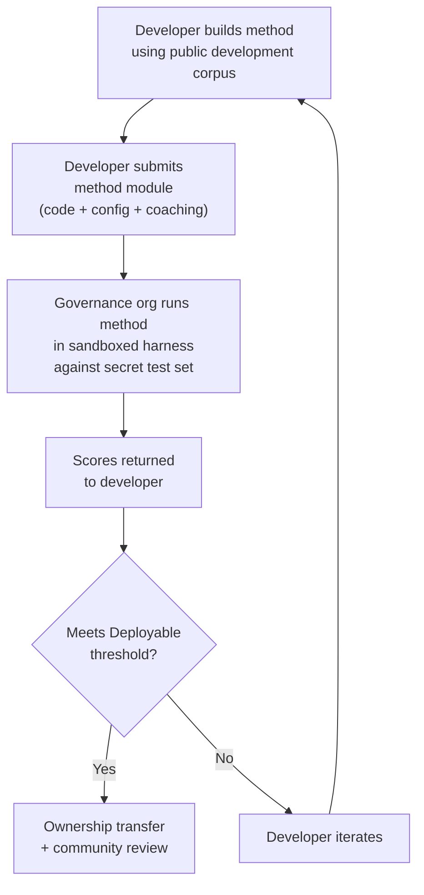

# 벤치마크 명세

> **핵심 요약.** 이 문서는 Champollion MT 평가 생태계의 평가 프로토콜을 정의해요. 코퍼스 형식(§2), 실행 카드 스키마(§3), 벤치마크 프로토콜(§6), 사람 검증 요건(§7), 주권 메커니즘(§8), 리더보드 및 제출 모델(§9), 비용 프레임워크(§10), 그리고 신규 언어로의 확장성(§11)을 다뤄요. 메트릭 정의, 복합 점수 가중치, 품질 등급 임계값, 비용/속도 메트릭 공식에 대해서는 `SCORING_SPEC.md`를 참고하세요 — 모든 점수 산정 로직의 단일 진실 공급원이에요. 이 문서는 해당 세부 사항을 중복 기재하는 대신 SCORING_SPEC을 참조해요.
>
> 최종 업데이트: 2026-06-07

---

## 1. 원칙

### 1.1 자동화된 메트릭은 대리 지표예요

이 문서에서 정의하는 모든 메트릭은 기계로 계산돼요. chrF++, FST 수용, 형태론적 정확도, 의미 유사성 — 이 모두는 번역 품질에 대한 자동화된 대리 지표예요. 빠른 반복, 체계적인 비교, 회귀 탐지에 유용해요. 하지만 이들은 **사람의 판단을 대체할 수 없어요**.

평가 계층 구조:

```
Automated metrics (run cards, benchmarks)
    ↓ proxy for
Human review (bilingual speakers validate output)
    ↓ proxy for
Actual utility (does this help a language community?)
```

아무리 높은 점수라도, 유창한 화자가 출력물을 읽고 그것이 정확하고 자연스러우며 문화적으로 적절하다는 것을 확인하는 일을 자동화된 점수가 대신할 수는 없어요. §5에서 정의하는 품질 등급은 자동화된 복합 점수에 대한 휴리스틱 레이블이에요 — 진행 상황을 추적하는 데 유용하지만, 그것만으로는 결코 충분하지 않아요.

### 1.2 모델이 아니라 방법이에요

우리는 **방법**을 벤치마킹해요, 모델이 아니라요. 모델은 하나의 구성 요소예요. 방법은 전체 레시피예요. 모델 선택, 프롬프트 설계, 도구 사용, 전/후처리, 코칭 데이터, 재시도 전략, 그 모든 것이요. 같은 모델을 다른 방법으로 사용하는 두 팀은 서로 다른 점수를 얻게 돼요. 그게 핵심이에요.

### 1.3 재현 가능성

모든 벤치마크 결과는 재현 가능해야 해요. 실행 카드(§3)는 실험의 전체 구성을 담아요. 핑거프린트(§3.5)는 실험 설정을 식별해요. 실행 카드 해시(§3.6)는 결과의 무결성을 검증해요. 동일한 방법, 코퍼스, 구성을 가진 사람이라면 누구나 ±2% 이내의 점수를 달성해야 해요(온도 > 0에서 LLM 샘플링의 비결정성을 고려해요).

### 1.4 합성 평가 데이터 금지

**이 프로젝트는 합성 평가 데이터를 생성하거나 사용하거나 지지하지 않아요.** 모든 코퍼스는 진정한 사람이 작성한 텍스트에서 가져와야 해요 — 출판된 번역물, 교과서, 이중 언어 문서, 또는 유창한 화자로부터 유도한 번역물이요.

LLM은 다음을 보조할 수 있어요:
- 문장 정렬(기존 이중 언어 텍스트에서 병렬 구절 찾기)
- 형식 변환(출판된 자료를 코퍼스 스키마로 변환)
- 메타데이터 강화(난이도 등급, 레지스터 레이블 제안)
- 사람 번역을 위한 원문 문장 제안(§11.3 — 번역 단계는 항상 사람이 해요)

LLM은 참조 번역물이나 평가 쌍을 **절대** 생성해서는 안 돼요.

**우리는 학습 데이터에 대해 개발 중립적이에요.** 방법 개발자가 자신의 방법에 합성 학습 데이터, 역번역, 또는 데이터 증강을 사용한다면, 그것은 그들의 선택이에요 — 우리는 학습 과정이 아니라 출력물을 평가해요. Meta의 OMT-1600은 역번역을 통해 생성된 약 2억 7천만 개의 합성 병렬 문장을 사용해요. 우리는 이런 방식으로 학습된 방법에 이의가 없어요. 우리는 사람의 큐레이션에 대해서만 테스트해요.

> **평가에 성경 텍스트를 쓰지 않는 이유는?** OMT-1600은 1,600개 언어 중 1,560개를 성경 도메인 텍스트로 평가해요. 성경 번역은 고풍스러운 레지스터, 전례적 어휘, 정형화된 문장 구조를 가지고 있어요. 우리의 평가 코퍼스는 커뮤니티가 큐레이션한, 도메인이 다양한 텍스트에서 가져와요 — 보건, 법률, 교육, 정부, 대화, 기술 도메인이요(§2.7 참조). 이것은 의도적인 설계 선택이에요. 커뮤니티는 단일한 종교적 레지스터가 아니라, 실제로 살아가고 일하는 도메인을 위한 번역이 필요해요. 창세기 1장 1절에서 좋은 점수를 받는 방법은 부족 의회 의제나 진료소 접수 양식에서의 성능에 대해 거의 아무것도 알려주지 못해요.

---

## 2. 코퍼스 스키마

코퍼스는 구조화된 메타데이터와 함께 큐레이션된 병렬 텍스트 쌍의 집합이에요. 이것은 모든 방법을 측정하는 기준이 되는 정답이에요.

### 2.1 데이터셋 엔벨로프

코퍼스 파일의 최상위 구조:

```json
{
  "dataset": {
    "id": "edtekla-dev-v1",
    "version": "1.0",
    "language_pair": "EN→CRK",
    "source_language": "en",
    "target_language": "crk",
    "created": "2026-05-01",
    "license": "CC-BY-NC-SA-4.0",
    "provenance": ["gold_standard", "textbook"]
  },
  "entries": [ ... ]
}
```

| 필드 | 유형 | 필수 | 설명 |
|-------|------|----------|-------------|
| `id` | string | ✅ | 고유 데이터셋 식별자, 실행 카드 및 리더보드에서 사용 |
| `version` | string | ✅ | 시맨틱 버전. 증가하면 이전 실행 카드 비교가 무효화됨 |
| `language_pair` | string | ✅ | 표시 레이블 (예: `EN→CRK`) |
| `source_language` | string | ✅ | BCP 47 원본 언어 코드 |
| `target_language` | string | ✅ | BCP 47 대상 언어 코드 |
| `created` | string | ✅ | ISO 8601 생성 날짜 |
| `license` | string | ✅ | SPDX 라이선스 식별자 |
| `provenance` | string[] | ✅ | 항목 전반에서 사용되는 출처 태그 목록 |

### 2.2 항목 스키마

코퍼스의 각 항목은 하나의 번역 과제를 나타내요:

```json
{
  "id": 42,
  "source": "I see the dog",
  "reference": "niwâpamâw atim",
  "segment": "gold_standard",
  "difficulty": 2,
  "provenance": "gold_standard",
  "register": "conversational",
  "context": "declaration",
  "morphological_analysis": "ni-wâpam-âw atim | 1sg-see.TA-3sg.DIR dog.AN",
  "notes": "Animate noun (atim); direct form because speaker is proximate",
  "variant_class": "simple-ta-direct"
}
```

| 필드 | 유형 | 필수 | 설명 |
|-------|------|----------|-------------|
| `id` | integer | ✅ | 코퍼스 내 고유 식별자 |
| `source` | string | ✅ | 원본 언어의 원문 텍스트 |
| `reference` | string | ✅ | 대상 언어의 골드 스탠다드 참조 번역 |
| `segment` | string | 📎 | 코퍼스 파티션: `gold_standard`, `held_out`, `development`, 또는 `diagnostic` |
| `difficulty` | integer | 📎 | 난이도 등급 1–5 (§2.4 참조) |
| `provenance` | string | 📎 | 이 항목의 출처 (§2.5 참조) |
| `register` | string | 📎 | 레지스터/격식 수준 (§2.6 참조) |
| `context` | string | 📎 | 의사소통 기능 (§2.6 참조) |
| `domain` | string | 📎 | 16개 코드 분류 체계의 사용 사례 도메인 (§2.7 참조). 다음 중 하나여야 함: `conv`, `ecommerce`, `edu`, `financial`, `gov`, `legal`, `literary`, `marketing`, `medical`, `news`, `religious`, `scientific`, `subtitles`, `support`, `tech`, `ui`. 구성 시점에 검증됨. |

> **📎 = 권장.** 하니스는 기본값을 통해 누락된 선택적 필드를 우아하게 처리해요. 서드파티 코퍼스는 항목당 `id`, `source`, `reference`만 제공하면 돼요.
| `morphological_analysis` | string | ❌ | 골드 스탠다드 형태론적 분석 |
| `notes` | string | ❌ | 번역가 노트, 방언 변형, 모호성 플래그 |
| `variant_class` | string | ❌ | 허용 가능한 번역 변형을 그룹화하는 클래스 레이블 |


### 2.3 코퍼스 세그먼트

코퍼스는 서로 다른 접근 수준을 가진 세그먼트로 나뉘어요:

| 세그먼트 | 목적 | 접근 | 최소 크기 |
|---------|---------|--------|-------------|
| `development` | 방법 개발 및 반복. 개발자가 자유롭게 사용. | **공개** | 30개 항목 |
| `diagnostic` | 특정 언어 현상에 대한 표적 테스트. | **공개** | 10개 항목 |
| `gold_standard` | 공식 벤치마크 평가. 리더보드 점수가 여기에서 나옴. | **비공개** — 거버넌스 조직이 보유 | 50개 항목 |
| `held_out` | 향후 평가를 위해 예약됨. 활성화 전까지 절대 사용하지 않음. | **비공개** — 거버넌스 조직이 보유 | 10개 항목 |

> **현재 상태:** 출시된 데이터셋에는 `development` 세그먼트만 존재해요. `diagnostic`, `gold_standard`, `held_out` 세그먼트는 코퍼스가 성장함에 따라 향후 사용을 위해 정의되어 있어요.

`gold_standard`와 `held_out` 세그먼트는 완전히 비공개예요. 원문 문장과 참조 번역 모두 거버넌스가 통제하는 인프라에 보관돼요. 방법 개발자는 문제도 답도 결코 볼 수 없어요. 주권 메커니즘은 §8을 참조하세요.

### 2.4 난이도 등급

| 등급 | 설명 | 예시 |
|------|-------------|----------|
| 1 — 기본 어휘 | 단일 단어, 일반적인 인사, 숫자 | "hello" → "tânisi", "dog" → "atim" |
| 2 — 단순 문장 | 주어-동사 또는 SVO, 현재 시제 | "I see the dog" → "niwâpamâw atim" |
| 3 — 중간 복잡도 | 과거/미래 시제, 소유격, 유생성 | "I saw his dog yesterday" |
| 4 — 복잡한 형태론 | 회피(obviation), 수동태, 접속 어순, 관계절 | "the woman whose son went to the store" |
| 5 — 고급 | 다중 절, 격식 레지스터, 의례적, 관용적 | 레지스터에 적합한 어조를 갖춘 전체 단락 |

잘 구성된 코퍼스는 5개의 난이도 등급 전체에 걸쳐 항목을 포함해야 하며, 대부분의 실제 번역 과제가 속하는 2–4 등급에 가중치를 두어야 해요.

### 2.5 출처 태그

모든 항목은 그 출처를 표시해야 해요:

| 태그 | 의미 |
|-----|---------|
| `gold_standard` | 유창한 화자가 검증함 |
| `textbook` | 출판된 교육 자료에서 |
| `elicited` | 구조화된 유도 세션을 통해 생성됨 |
| `corpus` | 병렬 코퍼스에서 추출됨 |

> **참고:** 실제로 출처 값은 자유 형식 문자열이에요. 위의 태그는 관례이지 검증된 enum이 아니에요 — 데이터셋은 다른 서술적 출처 문자열을 사용할 수 있어요.

### 2.6 레지스터와 컨텍스트

**레지스터**는 격식과 사회적 맥락을 설명해요:

| 레지스터 | 설명 |
|----------|-------------|
| `conversational` | 동등한 사람들 간의 일상적인 말 |
| `formal` | 공식적이거나 제도적인 언어 |
| `technical` | 도메인별 특수 어휘 |
| `ceremonial` | 전통적이거나 신성한 언어 사용 |
| `educational` | 언어 교육 자료 |

**컨텍스트**는 의사소통 기능을 설명해요:

> 🔲 **계획됨.** `context` 필드는 스키마에 정의되어 있지만 현재 데이터셋에는 아직 채워져 있지 않아요. 향후 코퍼스 강화를 위해 예약되어 있어요.

| 컨텍스트 | 설명 |
|---------|-------------|
| `greeting` | 사회적 인사 또는 작별 |
| `declaration` | 사실 진술 |
| `question` | 의문문 |
| `instruction` | 명령 또는 지시 |
| `narrative` | 이야기 또는 묘사 |
| `label` | UI 레이블, 버튼 텍스트, 또는 제목 |
| `error` | 오류 메시지 또는 경고 |

### 2.7 도메인 {#27-domain}

**도메인**은 실제 사용 사례 — 번역 대상이 되는 콘텐츠의 유형을 설명해요. 이것은 레지스터 및 컨텍스트와 직교해요:

- **레지스터**는 답해요: *이것은 얼마나 격식 있는가?*
- **컨텍스트**는 답해요: *이 문장은 무엇을 하고 있는가?*
- **도메인**은 답해요: *이것은 어떤 산업/사용 사례를 위한 것인가?*

법률 계약(도메인: `legal`)은 격식 있고(레지스터: `formal`) 선언(컨텍스트: `declaration`)을 포함할 수 있어요. 법률 챗봇 기록(도메인: `legal`)은 대화적이고(레지스터: `conversational`) 질문(컨텍스트: `question`)을 포함할 수 있어요. 같은 도메인이지만 다른 레지스터와 컨텍스트예요.

| 도메인 코드 | 설명 | 일반적인 사용자 |
|-------------|-------------|-------------------|
| `ui` | 소프트웨어 인터페이스 문자열 | 앱 개발자, 현지화 팀 |
| `legal` | 계약서, 법령, 법원 제출 서류, 이민 문서 | 법률 사무소, 법원, 컴플라이언스 팀, IP 변호사 |
| `medical` | 임상 노트, 약물 라벨, 환자 커뮤니케이션, 임상시험 프로토콜 | 병원, 제약사, 임상시험, 환자 포털 |
| `financial` | 은행, 보험, 규제 제출 서류, 감사 보고서 | 은행, 보험사, 규제 기관, 감사인 |
| `edu` | 교과서, 커리큘럼, 수업 계획, 학술 자료 | 학교, 대학, 교과서 출판사 |
| `ecommerce` | 제품 설명, 리뷰, 마켓플레이스 목록 | 온라인 소매업체, 마켓플레이스 판매자 |
| `marketing` | 광고 카피, 브랜드 메시지, 캠페인, 슬로건 | 광고 대행사, 브랜드 팀 |
| `gov` | 정책 문서, 규정, 공지, 입법 | 정부 기관, 컴플라이언스 팀 |
| `scientific` | 연구 논문, 초록, 방법론, 연구비 제안서 | 연구자, 저널, 연구비 지원 기관 |
| `religious` | 경전, 전례 텍스트, 신학적 주석 | 신앙 공동체, 전례 출판사 |
| `support` | FAQ, 오류 메시지, 문제 해결 가이드, 챗봇 스크립트 | SaaS 기업, 헬프데스크 |
| `subtitles` | 영화, TV, 스트리밍, 게임 대사 | 스트리밍 플랫폼, 스튜디오, 게임 기업 |
| `news` | 저널리즘, 통신 보도, 사설, 보도자료 | 미디어 조직, 통신사 |
| `literary` | 소설, 시, 서사, 문화 텍스트 | 출판사, 문화 보존 조직 |
| `conv` | 비격식 대화, 소셜 미디어, 메시징 | 소비자 앱, 소셜 플랫폼 |
| `tech` | API 문서, 매뉴얼, 엔지니어링 명세, 기술 가이드 | 문서화 팀, 엔지니어링 조직 |

> **도메인별 벤치마크.** 일반 벤치마크는 모든 도메인에 걸쳐 방법을 평가해요. 하지만 Arena는 **도메인 필터링 벤치마크**도 지원해요 — 점수가 특정 도메인으로 태그된 항목에 대해서만 계산되는 거예요. 이를 통해 사용자는 "프랑스어로 법률 문서를 번역하는 데 어떤 방법이 가장 좋은가?" vs. "전체 프랑스어 점수가 가장 좋은 방법은 무엇인가?"라는 질문에 답할 수 있어요.
>
> 도메인 필터링 리더보드 순위는 핵심 제품 기능이에요. 서로 다른 방법은 도메인에 따라 다르게 수행돼요 — 법률 용어로 파인튜닝된 방법은 법률 벤치마크를 압도할 수 있지만 대화형 텍스트에서는 부진할 수 있어요. Arena는 사용자가 자신의 특정 사용 사례에 가장 잘 맞는 솔루션을 찾도록 도와줘요.

> **향후: Arena 챗봇.** Arena 웹사이트에는 사용자가 자신의 MT 사용 사례(도메인, 언어 쌍, 품질 요건)를 설명하도록 돕고 리더보드에서 커뮤니티가 검증한 최선의 방법을 추천하는 대화형 어시스턴트가 포함될 거예요. 예를 들어: "임상시험 프로토콜을 영어에서 일본어로 번역해야 하는데 — 의료 도메인 EN→JA 벤치마크에서 가장 높은 점수를 받는 방법은 무엇인가요?" 이것은 충분한 도메인 태그 평가 데이터와 방법 다양성이 갖춰져 있는지에 달려 있어요.

---

## 3. 실행 카드 스키마 {#3-run-card-schema}

실행 카드는 평가의 원자적 단위예요. 단일 평가 실행의 전체 구성과 결과를 기록하는 자체 완결적인 JSON 문서예요. 하나의 방법, 하나의 모델, 하나의 구성, 하나의 데이터셋이요.

모든 실행 카드는 세 가지 차원을 담아요:
- **품질** — 번역이 얼마나 좋은가?
- **비용** — 번역을 생성하는 데 비용이 얼마나 들었나?
- **속도** — 얼마나 오래 걸렸나?

### 3.1 최상위 필드

| 필드 | 유형 | 설명 |
|-------|------|-------------|
| `run_id` | string | 실행 시작 시 생성된 UUID v4 |
| `harness_version` | string | 하니스의 시맨틱 버전 (예: `2.0`) |
| `timestamp` | string | 실행이 시작된 ISO 8601 UTC 타임스탬프 |
| `elapsed_seconds` | number | 전체 실행의 실제 경과 시간 |

### 3.2 방법 구성

이 필드들은 실험 설정을 정의해요 — 무엇이 어떻게 테스트되었는지요.

| 필드 | 유형 | 필수 | 설명 |
|-------|------|----------|-------------|
| `model_slug` | string | ✅ | 모델 식별자 (예: `google/gemini-2.5-flash`) |
| `model_id` | string | ❌ | API가 반환한 해석된 모델 식별자 |
| `condition` | string | ✅ | 실험 레이블 (예: `baseline`, `coached-v3`, `few-shot`) |
| `temperature` | number | ✅ | 샘플링 온도 |
| `system_prompt_sha256` | string | ✅ | 전체 시스템 프롬프트의 SHA-256 해시 |
| `system_prompt_used` | string | ✅ | 전체 시스템 프롬프트 텍스트 |
| `coaching_data_sha256` | string | ❌ | 사용된 경우, 코칭 데이터 파일의 SHA-256 해시 |
| `fst_version` | string | ❌ | 사용된 경우, FST 분석기의 버전 |
| `tools_enabled` | string[] | ❌ | 방법에서 사용 가능한 도구 목록 |
| `batch_size` | number | ❌ | 동시 API 배치당 항목 수 |
| `max_retries` | number | ❌ | 해당되는 경우, FST 거부에 대한 최대 재시도 횟수 |

:::info 게시된 실행 카드는 method_config를 포함해요
실행 카드가 (`mt-eval publish`를 통해) 리더보드에 게시되면, 정규 8개 필드 MethodConfig(`model`, `temperature`, `batchSize`, `register`, `coachingFile`, `coachingPrompt`, `promptContext`, `qualityTier` — 모두 camelCase)를 담는 `method_config` 블록도 포함해요. 이를 통해 무재구성 가져오기가 가능해요: `champollion leaderboard --install`가 `method_config`을 직접 읽어서 플러그인 매니페스트로 작성해요. 위의 텔레메트리 필드(§3.2)는 하니스가 관찰한 것을 기록하고, `method_config`는 개발자가 의도한 것을 기록해요.
:::

### 3.3 데이터셋 참조

| 필드 | 유형 | 설명 |
|-------|------|-------------|
| `dataset.id` | string | 데이터셋 식별자 |
| `dataset.version` | string | 데이터셋 버전 |
| `dataset.language_pair` | string | 표시 레이블 |
| `dataset.sha256` | string | 데이터셋 파일 내용의 SHA-256 해시 |
| `dataset.entry_count` | number | 평가된 항목 수 |

데이터셋 SHA-256은 결과를 데이터의 특정 버전에 고정해요. 데이터셋이 변경되면 이전 실행 카드는 비교할 수 없어요.

### 3.4 점수 (품질)

전체 실행에 대한 집계 메트릭이에요. 모든 품질 메트릭은 **자동화**돼요 — §1.1 참조.

| 필드 | 유형 | 설명 |
|-------|------|-------------|
| `scores.total` | number | 평가된 총 항목 수 |
| `scores.exact_matches` | number | 출력이 참조와 정확히 일치한 항목 |
| `scores.exact_match_rate` | number | 0.0–1.0 |
| `scores.equivalent_matches` | number | 허용 가능한 변형과 일치한 항목 |
| `scores.equivalent_match_rate` | number | 0.0–1.0 |
| `scores.fst_accepted` | number | FST 분석기가 수용한 항목 |
| `scores.fst_acceptance_rate` | number | 0.0–1.0, FST가 구성되지 않은 경우 `null` |
| `scores.morphological_accuracy` | number | 0.0–1.0, 골드 스탠다드 분석이 없는 경우 `null` |
| `scores.chrf_plus_plus` | number | 코퍼스 수준 chrF++ 점수 (0–100) |
| `scores.semantic_score` | number | 임베딩 기반 의미 유사성 (0.0–1.0) |
| `scores.ter` | number | 번역 편집률(Translation Edit Rate) (0–∞, 낮을수록 좋음) |
| `scores.length_ratio` | number | avg(len(predicted)/len(reference)), 이상값 = 1.0 |
| `scores.code_switching_rate` | number | 0.0–1.0, 원본 언어 누출이 있는 항목의 비율 |
| `scores.hallucination_rate` | number | 0.0–1.0, 환각 콘텐츠가 있는 항목의 비율 |
| `scores.terminology_adherence` | number | 0.0–1.0, 용어집 용어 준수도 (용어집이 없으면 `null`) |
| `scores.tokens_per_second` | number | total_tokens / elapsed_seconds |
| `scores.entries_per_minute` | number | 분당 번역된 항목 수 |
| `scores.composite` | number | 가중 복합 점수 (0.0–1.0). SCORING_SPEC §4 참조 |
| `scores.errors` | number | 실패한 항목 (API 오류, 타임아웃 등) |
| `scores.by_difficulty` | object | 난이도 등급별로 세분화된 점수 |
| `scores.by_provenance` | object | 출처 태그별로 세분화된 점수 |
| `scores.by_domain` | object | ✅ 구현됨 — 도메인별로 세분화된 점수(§2.7). 도메인 필터링 리더보드 순위를 가능하게 함. tester.py가 계산하고 publish.py를 통해 전달함. |

### 3.5 합계 (비용)

| 필드 | 유형 | 설명 |
|-------|------|-------------|
| `totals.prompt_tokens` | number | 모든 API 호출에 걸친 총 입력 토큰 |
| `totals.completion_tokens` | number | 총 출력 토큰 |
| `totals.reasoning_tokens` | number | 사고 연쇄(chain-of-thought)에 사용된 토큰 (대부분의 모델에서 0) |
| `totals.cached_tokens` | number | 제공자의 프롬프트 캐시에서 제공된 토큰 |
| `totals.total_cost_usd` | number | USD 단위 총비용 |
| `totals.cost_per_entry_usd` | number | `total_cost_usd / entry_count` |
| `totals.cost_per_source_char` | number | 원본 문자당 USD — 언어 간 비교 가능 |

### 3.6 타이밍 (속도)

| 필드 | 유형 | 설명 |
|-------|------|-------------|
| `elapsed_seconds` | number | 전체 실행의 실제 경과 시간 (최상위) |
| `scores.avg_latency_seconds` | number | 항목당 평균 응답 시간 |
| `scores.median_latency_seconds` | number | 항목당 중앙값 응답 시간 |
| `scores.p95_latency_seconds` | number | 항목당 95번째 백분위수 응답 시간 |

### 3.7 항목별 결과

`results[]` 배열의 각 항목은 하나의 번역을 기록해요. 항목별 데이터는 비정규화된 LYSS 판정(마이그레이션 006)과 함께 `run_card_entries` 테이블(마이그레이션 005)에 영속화돼요.

| 필드 | 유형 | 설명 |
|-------|------|-------------|
| `entry_id` | string | 코퍼스의 `entries[].id`와 일치 |
| `source` | string | 번역된 원문 텍스트 |
| `expected` | string | 골드 스탠다드 참조 번역 |
| `raw_predicted` | string \| null | 후처리 전 원시 모델 출력 |
| `predicted` | string | 방법의 실제 출력 (후처리됨) |
| `segment` | string | 세그먼트 식별자 (예: 문장 인덱스) |
| `difficulty` | string \| null | 코퍼스의 난이도 등급 |
| `domain` | string | 코퍼스의 도메인 태그 (§2.7) |
| `exact_match` | boolean | 출력이 참조와 정확히 일치했는지 여부 |
| `chrf_score` | number \| null | 문장 수준 chrF++ (0–100) |
| `bleu_score` | number \| null | 문장 수준 BLEU (0–100) |
| `latency_s` | number \| null | 초 단위 응답 시간 |
| `cost_usd` | number \| null | 이 항목의 USD 단위 비용 |
| `tool_call_count` | integer | 사용된 도구 호출 수 (없으면 0) |
| `error` | string \| null | 이 항목이 실패한 경우의 오류 메시지 |
| `plugin_metrics` | object | 전체 항목별 플러그인 출력 (JSONB) |
| `fst_valid` | boolean \| null | GiellaLT FST가 예측을 수용함 (비정규화된 LYSS-fst) |
| `equivalent_match` | boolean \| null | CRK 린터가 구조적 동등성을 확인함 (비정규화된 LYSS-eq) |
| `semantic_verdict` | string \| null | LYSS-sem 판정: `VALID`, `MISMATCH`, `UNKNOWN`, `ERROR` |
| `code_switching_detected` | boolean \| null | 출력에서 원본 언어 토큰이 탐지됨 |
| `hallucination_detected` | boolean \| null | 출력에서 조작된 콘텐츠가 탐지됨 |


### 3.8 핑거프린트

재현 가능성 식별자예요. 동일한 핑거프린트를 가진 두 실행은 같은 실험 설정을 사용했어요.

핑거프린트는 다음을 정렬하여 연결한 것의 SHA-256 해시예요:
- `dataset.sha256`
- `model_slug`
- `condition`
- `system_prompt_sha256`
- `temperature`
- `harness_version`
- `batch_size`
- `tools_enabled`

> **왜 8개 구성 요소인가요?** 배치 크기와 도구 호출은 출력 품질에 실질적으로 영향을 미치므로 식별자에 포함되어야 해요. 다른 모든 매개변수가 일치하더라도, 배치 크기가 다르거나 활성화된 도구가 다른 두 실행은 서로 다른 실험 설정이에요.

동일한 핑거프린트를 가진 두 실행은 비교 가능한 결과를 산출해야 해요. 차이는 API 비결정성(온도 > 0) 또는 제공자 측 모델 업데이트로 인한 거예요.

### 3.9 실행 카드 해시

전체 실행 카드 JSON의 SHA-256 해시예요(해싱 중에는 `run_card_hash` 필드 자체를 `""`로 설정함). 이것은 변조 탐지 봉인이에요. 어떤 필드라도 변경되면 해시가 깨져요.

---

## 4. 자동화된 메트릭

이 섹션의 모든 메트릭은 기계로 계산돼요. §1.1 참조.

### 4.1 메트릭 정의

| 메트릭 | 상태 | 측정 대상 | 범위 |
|--------|--------|-----------------|-------|
| **chrF++** | ✅ 구현됨 | 문자 n-그램 F-점수. 문자 수준에서 작동하여, 단어가 길고 고도로 굴절되는 형태론적으로 풍부한 언어에서 단어 수준 메트릭(BLEU)보다 더 견고해요. sacrebleu가 계산해요. | 0–100 (네이티브 스케일). 복합 점수에 사용될 때는 100으로 나눔. |
| **FST 수용률** | ✅ 구현됨 | 형태론적 분석기(GiellaLT HFST)가 대상 언어의 유효한 형태로 수용한 예측 단어의 비율. FST가 수용하는 단어는 실재하고 구조적으로 유효한 단어예요 — 환각이 아니에요. | 0.0–1.0 |
| **정확 일치** | ✅ 구현됨 | 유니코드 정규화 후 참조와 정확히 일치하는 예측의 비율. 엄격하지만 명확해요 — 상한 점검에 유용해요. | 0.0–1.0 |
| **형태론적 정확도** | 🔲 계획됨 | 골드 스탠다드 형태론적 분석이 있는 항목에 대해: 올바르게 생성된 형태소의 비율. FST 수용보다 더 세분화됨 — 단어가 FST상 유효하더라도 잘못된 형태소 구조(올바른 어근, 잘못된 시제)를 가질 수 있어요. | 0.0–1.0 |
| **동등 일치** | ⚡ 부분적 | 참조의 허용 가능한 변형과 일치하는 비율 — 어순, 방언 차이, 정서법 관례를 고려함. 현재 CRK eval 표준의 `CrkLinterMetric`(`eval_standards/crk/`에 있음)를 통해 CRK에 대해 구현됨; CRK 언어 카드의 `evalMetrics` 선언을 통해 자동으로 로드됨. 일반 구현은 코퍼스 내 항목별 `variants[]`가 필요함. | 0.0–1.0 |
| **의미 점수** | ⚡ 부분적 | 표면 형식과 무관한 의미 보존. 현재 CRK eval 표준의 `CrkSemanticMetric`(`eval_standards/crk/`에 있음, 판정 가중 대리 지표)를 통해 CRK에 대해 구현됨. 범용 임베딩 기반 코사인 유사성은 계획됨 — SCORING_SPEC §2.3 참조. | 0.0–1.0 |

### 4.2 복합 점수

복합 점수는 모든 *사용 가능한* 메트릭의 가중 평균이에요:

```
composite = Σ (weight_i × metric_i)   for all available metrics
             ─────────────────────
             Σ weight_i              (renormalized to sum to 1.0)
```

메트릭을 사용할 수 없는 경우(FST가 구성되지 않음, 변형 클래스가 정의되지 않음, 임베딩 모델이 없음), 그 가중치는 나머지 메트릭에 비례적으로 재분배돼요. 이는 복합 점수가 언어 내에서 항상 비교 가능함을 의미해요 — 해당 언어에 사용 가능한 메트릭이 무엇이든 사용하고 그에 따라 정규화하니까요.

**가중치 표, 입력 정규화 규칙, 전체 메트릭 인벤토리는 `SCORING_SPEC.md` §4에 정의되어 있어요.** 그 문서는 다음에 대한 SSOT예요:
- 프로필 A 가중치 (FST 커버리지가 있는 언어 — 9개 메트릭, 구조적 메트릭이 40% 차지)
- 프로필 B 가중치 (FST 커버리지가 없는 언어 — 8개 메트릭)
- 정규화 규칙 (chrF++ ÷ 100, 코드 전환 및 환각률 반전)
- 복합 점수에서 제외된 메트릭 (BLEU, COMET, TER, 길이 비율, 일관성) 및 그 이유

하니스 코드는 `mt_eval_harness/scoring.py`에서 이 표들을 반영해요. SCORING_SPEC이 변경되면 `scoring.py`가 일치하도록 업데이트되고 `test_scoring_ssot.py`가 정합성을 검증해요.

> **왜 BLEU가 아닌가요?** BLEU는 단어 수준에서 작동하며 형태론적 변형에 페널티를 줘요. 다종합 언어에서는 단일 단어가 전체 절이 될 수 있어요 — BLEU는 사소한 굴절 차이를 완전한 실패로 취급할 거예요. chrF++는 문자 수준에서 작동하여 이를 더 잘 처리해요. BLEU는 두 가중치 표 모두에서 제외돼요. 전체 근거는 SCORING_SPEC 부록 A를 참조하세요.


### 4.3 비용 조정 점수

유료 API를 사용하는 방법에 대해서는 보조 순위도 보고해요. 비용 조정 공식은 `SCORING_SPEC.md` §6.3에 정의되어 있어요.

---

## 5. 품질 등급 {#5-quality-tiers}

품질 등급은 자동화된 복합 점수에 대한 휴리스틱 레이블이에요. 각 수준의 출력에 대한 사람 검토를 바탕으로, 점수가 실제로 무엇을 의미하는 경향이 있는지를 설명해요. **이것들은 검증된 품질 판단이 아니에요** — 오직 사람 검토(§6)만이 실제 사용 가능성을 확인할 수 있어요.

**등급 임계값과 설명은 `SCORING_SPEC.md` §5에 정의되어 있어요.** 등급은 다음과 같아요: Baseline (0.00–0.30), Emerging (0.30–0.50), Functional (0.50–0.70), Deployable (0.70–0.85), Fluent (0.85–1.00).

> [!IMPORTANT]
> **자동화된 등급은 잠정적이에요.** 이 레이블들은 검토를 위한 후보이지 품질 선언이 아니에요. 자동화된 메트릭에서 "Deployable"에 도달한 방법은 커뮤니티 평가의 후보예요 — 출시할 제품이 아니에요. 오직 사람 검토(§7)만이 실제 사용 가능성을 확인할 수 있어요. 등급 경계는 언어마다 다를 수 있어요.

이 등급들은 잠정적이에요. 사람 검증 데이터가 축적되고 각 언어에 대해 실제 "화자가 이것이 유용하다고 느끼는" 임계값이 어디에 떨어지는지 알게 되면서 재보정될 거예요. 등급 경계는 언어마다 다를 수 있어요.

어떤 방법도 이중 언어 화자가 출력이 사용 가능하다는 데 동의한다는 것을 커뮤니티 검토가 확인하지 않으면 **Deployable** 이상을 주장할 수 없어요.

---

## 6. 벤치마크 프로토콜

**벤치마크**는 주어진 데이터셋에서 선언된 매개변수 공간에 걸쳐 실행 카드를 체계적으로 생성하는 거예요. 단일 실행이 아니에요 — 서로 다른 구성이 어떻게 수행되는지에 대한 구조화된 탐색이에요.

### 6.1 벤치마크가 생성하는 것

벤치마크는 **실행 카드의 매트릭스**를 생성해요 — 매개변수 값의 각 조합마다 하나씩요. 이 매트릭스는 다음에 걸친 다면적 비교를 가능하게 해요:

- **품질** — 복합 점수, 개별 메트릭 세분화
- **비용** — 각 구성의 총비용 및 항목당 비용
- **속도** — 실제 경과 시간 및 항목당 지연 시간

단일한 "벤치마크 점수"는 없어요. 벤치마크는 전체 매트릭스예요. 서로 다른 이해관계자는 서로 다른 측면을 중요하게 여길 거예요: 연구자는 복합 점수를 최적화하고, 배포 엔지니어는 항목당 비용을 최적화하며, 커뮤니티는 품질을 검토해요.

### 6.2 매개변수 공간

벤치마크는 어떤 매개변수가 순열되는지 선언해요:

| 축 | 일반적인 값 | 목적 |
|------|---------------|---------|
| `model` | 4–12개 모델 (프런티어 + 중급 + 저가) | 모델 역량이 얼마나 중요한가? |
| `temperature` | 0.0, 0.3, 0.7 | 샘플링 무작위성이 도움이 되는가 해가 되는가? |
| `prompt_version` | 2–3개 프롬프트 전략 | 방법이 프롬프트 설계에 얼마나 민감한가? |
| `coaching_config` | 코칭 데이터 유/무 | 언어 지식 주입이 출력을 개선하는가? |
| `tool_config` | FST 유/무, 사전 유/무 | 언어 도구가 출력을 개선하는가? |

전체 순열 공간:
```
runs = |models| × |temperatures| × |prompts| × |coaching| × |tools|
```

일반적인 초기 벤치마크: 12개 모델 × 3개 온도 × 2개 프롬프트 × 2개 코칭 = 144회 실행.

### 6.3 베이스라인 vs. 방법 평가

벤치마크는 두 가지 별개의 목적에 기여해요:

**베이스라이닝** — 순진한 접근으로 지형을 매핑하는 거예요. "기존 모델이 언어별 엔지니어링 없이 이 언어에 대해 무엇을 할 수 있는가?" 이것이 기준선을 세워요. 베이스라인 매트릭스는 다음을 알려줘요: 어떤 모델이 환각을 가장 적게 하는지, 어떤 온도가 가장 일관된 출력을 생성하는지, 코칭 데이터가 도움이 되긴 하는지, 모든 모델이 균일하게 실패하는 지점은 어디인지(어려운 언어 문제를 드러냄).

**방법 평가** — 특정 엔지니어링된 방법을 테스트하는 거예요. "내 FST 게이트 코칭 파이프라인이 베이스라인을 이기는가?" 방법의 실행 카드는 베이스라인 매트릭스와 비교돼요. 방법은 최고의 베이스라인을 능가할 때 흥미로워요 — 엔지니어링이 순진한 모델 호출 대비 가치를 더할 때요.

두 활동 모두 같은 스키마의 실행 카드를 생성해요. 차이는 의도와 매개변수 공간에 있어요: 베이스라인은 모델과 구성에 걸쳐 순열하고, 방법 평가는 최선의 구성에 대해 하나의 방법을 테스트해요.

### 6.4 Dev vs. 골드 스탠다드 평가

방법 개발자는 `development`와 `diagnostic` 코퍼스 세그먼트에 대해 자유롭게 반복해요. 이것은 비공식적이에요 — 제한도, 제출도, 거버넌스 개입도 없어요. 개발자는 무엇이 효과가 있는지 배우는 중이에요.

공식 리더보드 점수는 `gold_standard` 평가에서만 나와요. 이것은 공식적이에요:
1. 개발자가 완전하고 실행 가능한 방법(코드 + 구성 + 코칭 데이터)을 제출함
2. 거버넌스 조직이 샌드박스 하니스에서 비공개 테스트 세트에 대해 실행함
3. 점수만 반환됨

전체 주권 메커니즘은 §8을 참조하세요.

---

## 7. 사람 검증 {#7-human-validation}

자동화된 메트릭은 대리 지표예요. 사람 검증이 정답이에요.

### 7.1 사람 검토가 메트릭이 놓치는 것을 잡아내는 방식

- **형태론적으로 유효하지만 의미적으로 잘못됨** — FST가 단어를 수용하고 chrF++가 높지만, 번역이 다른 것을 의미함
- **문화적으로 부적절함** — 번역이 기술적으로 정확하지만 커뮤니티가 거부할 레지스터나 프레이밍을 사용함
- **그럴듯한 환각** — 출력이 비화자에게는 대상 언어처럼 보이지만 유창한 화자에게는 횡설수설임
- **허용 가능하지만 표시되지 않은 변형** — 출력이 정확하지만, 참조에 없는 방언 변형을 사용해서 자동화된 메트릭이 잘못된 것으로 표시함

### 7.2 검증 게이트

어떤 방법도 이중 언어 화자가 출력이 사용 가능하다는 데 동의한다는 것을 사람 검증이 확인하지 않으면 **Functional**에서 **Deployable** 등급으로 진급할 수 없어요. 이것은 형식적 절차가 아니에요 — 이것이 핵심이에요. 자동화된 메트릭은 사람 검토가 필요한 출력의 양을 줄이기 위해 존재해요. 그것을 대체할 수는 없어요.

### 7.3 커뮤니티 검토 프로토콜

> 🔲 **계획됨**: 커뮤니티 검토 인터페이스는 아직 가동되지 않았어요. 이 섹션은 의도된 프로세스를 설명해요.

1. 방법이 자동화된 메트릭에서 Deployable 임계값에 도달함
2. (난이도 등급별로 층화된) 출력 샘플이 이중 언어 화자에게 제시됨
3. 화자가 각 번역을 다음 척도로 평가함: **거부**, **요지**(의미는 명확하지만 표현이 잘못됨), **허용 가능**(사소한 문제가 있으나 정확함), **우수**(사람 번역과 구별 불가)
4. 거버넌스 조직이 집계된 평가를 검토함
5. 커뮤니티가 방법을 수용하면, 소유권 이전 및 배포로 진행됨

---

## 8. 주권

평가 데이터셋은 언어 커뮤니티에 속하는 큐레이션된 언어 지식을 담고 있어요. 이 섹션은 그 데이터를 보호하기 위한 기술적·법적 프레임워크를 정의해요.

### 8.1 문제

기존 벤치마크는 테스트 세트를 공개적으로 게시해요. 일단 게시되면 데이터는 게시 취소할 수 없어요. 토착 및 소수 언어 커뮤니티에게 이것은 착취적 역학을 만들어내요 — 언어 데이터가 지속적인 동의 없이 사용되니까요. 생체 데이터 주권에 대한 Dhein의 실용주의적 관점을 따라, 우리는 언어 데이터를 동적이고 관계적인 거버넌스가 필요한 "알 수 없는 잠재력을 가진 변화무쌍한 자원"으로 취급해요.

### 8.2 샌드박스 실행

주된 시행 메커니즘: 개발자가 자신의 방법 모듈을 넘겨주면, 거버넌스 조직이 자체 인프라에서 완전히 비공개인 테스트 세트에 대해 그것을 실행하고, 점수만 반환돼요. 개발자는 원문 문장이나 참조 번역을 결코 볼 수 없어요.



흐름:
1. **개발 코퍼스는 공개예요.** `development`와 `diagnostic` 세그먼트에는 제한이 없어요.
2. **골드 스탠다드 테스트 세트는 완전히 비공개예요.** 원문 문장과 참조 번역 모두 거버넌스가 통제하는 인프라에 있어요.
3. **공식 점수를 얻으려면 방법을 넘겨줘야 해요.** 거버넌스 조직이 샌드박스에서 실행해요. 점수만 반환돼요.
4. **거버넌스 조직은 이미 방법을 가지고 있어요.** 제출물이 곧 방법 코드예요. Deployable 임계값에 도달하면 소유권 이전이 이미 진행 중이에요.
5. **제출에는 약관 동의가 필요해요.** 소유권 이전 조항(§8.3)을 포함해서요.
6. **거버넌스 조직이 접근을 전적으로 통제해요.** 그들은 언제든 평가를 거부하거나 철회할 수 있어요. 동적 동의예요.
7. **저장 시 암호화는 심층 방어예요.** 주된 시행은 아키텍처적이에요.

### 8.3 소유권 이전

골드 스탠다드 평가에 대해 Deployable 임계값(0.70) 이상의 복합 점수를 달성하고, **그리고** 사람 검증(§7)을 통과한 방법은 소유권 이전 대상이에요.

**개발자가 보유하는 것:**
- 귀속 및 크레딧 (이름이 리더보드에 유지됨)
- 방법에 대해 발표할 권리
- 다른 언어 쌍에 대해 방법을 사용할 권리

**거버넌스 조직이 얻는 것:**
- 자신의 언어를 위해 방법을 사용, 수정, 배포, 수익화할 권리
- 재라이선스 권리
- 방법 코드의 물리적 점유 (평가 제출 시점부터 이미 보유)

### 8.4 거버넌스 조직 요건

언어 벤치마크의 키 관리자(key custodian)로 봉사하려면:

1. **언어 커뮤니티를 대표할 것** — 화자 및 문화 권위자와의 입증 가능한 관계
2. **키 관리 역량** — 암호화 키를 관리할 기술적 능력
3. **평가 가용성 약속** — 벤치마크가 평가 가능한 상태로 유지되어야 함
4. **참여 약관 게시** — 개발자가 동의하는 내용에 대한 명확한 문서
5. **인정된 주권 원칙 하에 운영** — OCAP®, CARE, 또는 동등한 원칙

### 8.5 OCAP® 및 CARE 정합성

| 원칙 | 구현 |
|-----------|---------------|
| **소유권**(OCAP) | 언어 데이터는 커뮤니티에 속해요. 거버넌스 조직이 평가 인프라를 통제해요. |
| **통제**(OCAP) | 거버넌스 조직이 샌드박스 실행을 통해 평가를 통제해요. 그들이 누가 어떤 조건으로 제출하는지 결정해요. |
| **접근**(OCAP) | 커뮤니티는 자신의 데이터, 결과, 그리고 그에 대해 개발된 방법에 무제한 접근할 수 있어요. |
| **점유**(OCAP) | 테스트 세트는 거버넌스 인프라를 결코 떠나지 않아요. 백업으로 저장 시 암호화. |
| **집단적 이익**(CARE) | 소유권 이전은 방법이 커뮤니티에 이익이 되도록 보장해요. 수익 모델(10% 스루빌 마진; 커뮤니티가 ~90% 보유)이 이를 지속시켜요. |
| **통제 권한**(CARE) | 샌드박스 실행이 기술적 구현이에요. |
| **책임**(CARE) | 개발자는 참여 약관을 통해 책임을 수용해요. |
| **윤리**(CARE) | 연구자의 편의보다 커뮤니티의 권리가 우선이에요. |

### 8.6 의존성 클래스와 샌드박스 네트워크 정책

샌드박스 실행(§8.2)과 소유권 이전(§8.3)은 둘 다 방법이 런타임에 정확히 무엇을 필요로 하는지 아는 것에 달려 있어요. [Method Interface 명세](/docs/specifications/methods#method-validity-and-dependency-classes)는 다섯 가지 **의존성 클래스** — S (자체 완결), O (개방형 외부), A1 (대체 가능한 LLM 추론), A2 (대체 불가능한 외부 API), X (폐쇄) — 와 모든 방법이 선언해야 하는 의존성 매니페스트를 정의해요. 이 하위 섹션은 샌드박스 네트워크 정책이 이를 어떻게 시행하는지 기록해요.

**기본 거부 송신.** 샌드박스 명세는 방법 컨테이너가 기본적으로 네트워크 접근 권한을 갖지 않도록 요구해요. 이것은 방화벽 규칙이 아니에요 — 명세는 실행 환경에서 네트워크를 제거하므로, 선언되지 않은 네트워크 의존성은 정책 계층이 아니라 아키텍처 계층에서 실패해요. 클래스 S와 O 방법은 전적으로 제출물에 벤더링된 아티팩트에서 실행돼요(클래스 O 아티팩트는 제출 시점에 고정되고 미러링됨).

**LLM 게이트웨이 (🔲 계획됨).** 대부분의 방법은 LLM을 호출하므로, 샌드박스 명세는 정확히 하나의 송신 예외를 정의해요: 평가 인프라가 운영하는 **LLM 게이트웨이**예요. 게이트웨이는:

- 추론 요청을 **고정된 모델의 명시적 허용 목록**으로 프록시해요 — 방법의 매니페스트와 실행 카드에 기록된 모델 식별자요;
- 봉인된 감사 로그에 **모든 요청과 응답을 기록**하여, 점수가 공개되기 전에 게이트웨이 트래픽을 데이터 유출 시도에 대해 검토할 수 있어요;
- *유일한* 네트워크 경로예요 — 일반 송신, DNS, 다른 엔드포인트가 없어요.

이것이 클래스 A1 방법을 §8.2의 검증 가능성 보장을 포기하지 않고도 평가 가능하게 만드는 거예요 — 하지만 이것은 실질적인 트레이드오프이고, 명세는 그것을 분명히 명시해요: 비공개 원문 문장을 외부 모델을 통해 번역하는 것은 **그 원문 문장을 모델 제공자에게 공개하는 거예요**. 참조 번역은 결코 떠나지 않으며(컨테이너 외부, 하니스가 보유; §8.2 참조), 방법 자체는 여전히 기록되고 허용 목록에 등재된 추론 호출이 담는 것 이상으로 아무것도 유출할 수 없어요. 그 제한된 공개가 주어진 코퍼스에 대해 수용 가능한지는 관리자(steward)의 결정이에요: 클래스 A1 평가를 승인하는 것은 데이터의 다른 모든 사용과 마찬가지로, 실행별로 그것을 알고서 승인하는 것을 의미해요.

**상태.** 샌드박스와 그 게이트웨이는 명세화되었지만 아직 구축되지 않았어요. 게이트웨이가 가동되기 전까지는 클래스 S와 O 방법만 골드 스탠다드 점수를 생성할 수 있어요; 클래스 A1 방법은 원칙적으로 상금 자격이 유지되지만([Prize Specification §1.6](/docs/specifications/prizes) 참조) 아직 비공개 세그먼트에 대해 평가될 수 없어요. 클래스 A2 의존성은 권리 보유자가 허가를 부여하기 전까지는 샌드박스에 전혀 진입할 수 없어요 — 어떤 네트워크 문제가 발생하기 전에 먼저 아티팩트가 샌드박스에 *존재*하도록 허용되어야 해요.

---

## 9. 리더보드 & 제출

### 9.1 제출 요건

유효한 리더보드 제출은 다음을 포함해야 해요:

1. 모든 필수 필드를 갖춘 완전한 실행 카드(§3)
2. 방법 코드 — 설치 지침과 함께 완전히 실행 가능함
3. 모든 의존성 — 코칭 데이터, 사전, FST 바이너리, 프롬프트
4. 비용 보고서
5. 방법의 접근법과 한계를 설명하는 README

### 9.2 정당성 기준

1. **평가 데이터에 대한 학습 금지.** 방법은 `gold_standard` 또는 `held_out` 항목에 노출되지 않았어야 해요. (아키텍처적으로 시행됨 — 본 적 없는 데이터로는 학습할 수 없어요.)
2. **개발 데이터 사용 선언.** `development` 항목을 퓨샷 프롬프팅에 사용하는 것은 허용되지만 선언되어야 해요.
3. **재현 가능성.** 거버넌스 조직이 재실행하여 ±2% 이내의 점수를 달성할 수 있어야 해요.
4. **일반화.** 방법은 암기된 예시뿐 아니라 보지 못한 항목에서도 작동해야 해요.

### 9.3 안티 게이밍

1. **변형 클래스 린팅** — 알려진 변형이 있는 항목에서의 의심스러울 정도로 완벽한 성능이 플래그됨
2. **코퍼스 순환** — 거버넌스 조직이 예고 없이 세그먼트 간에 항목을 순환시킬 수 있음
3. **커뮤니티 검토** — 사람 검증 게이트(§7)가 메트릭을 게이밍하지만 나쁜 출력을 생성하는 방법을 잡아냄

### 9.4 검증 등급

검증 등급은 **누가 결과를 검증했는지**를 설명해요 — 자동화된 점수가 무엇을 의미하는지 설명하는 품질 등급(§5)과 직교해요.

| 등급 | 의미 | 달성 방법 |
|------|---------|--------------|
| **자체 벤치마킹** | 개발자가 하니스를 실행하고 실행 카드를 제출함 | `development` 세그먼트에 대한 PR 또는 `--submit` 플래그 |
| **GDS 검증** | 유지보수자가 독립적으로 결과를 재현함 | 방법을 설치 가능한 플러그인으로 제출; 유지보수자가 재실행 |
| **커뮤니티 검증** | 거버넌스 조직이 `gold_standard`에 대해 실행 + 커뮤니티 검토 | 거버넌스 조직에 방법 코드 제출(§8.2); 사람 검증 통과(§7) |

방법은 Functional 품질 등급에서 자체 벤치마킹될 수 있어요. 품질 등급과 검증 등급은 리더보드에서 독립적인 축이에요.

### 9.5 계층화된 제출 모델

제출 메커니즘은 어떤 코퍼스 세그먼트에 대해 평가하는지에 달려 있어요:

| 세그먼트 | 제출 경로 | 검증 | 방법 코드 필요? |
|---------|----------------|-------------|----------------------|
| `development` | 셀프 서비스: 하니스 실행, PR 또는 API로 실행 카드 제출 | 자체 벤치마킹 | 아니요 — 코드를 보유함 |
| `development` | 유지보수자 재실행: 방법을 플러그인으로 제출 | GDS 검증 | 예 — 방법이 설치 가능해야 함 |
| `gold_standard` | 거버넌스 조직에 방법 제출; 그들이 샌드박스에서 실행 | 커뮤니티 검증 | 예 — 방법이 제출되고 보유됨 |

셀프 서비스 경로(개발 세그먼트)에는 제한이 없어요. 주권 경로(골드 스탠다드 세그먼트)는 (a) 개발자가 테스트 세트를 결코 보지 못하고, (b) Deployable에 도달하는 방법이 소유권 이전 대상(§8.3)이기 때문에 전체 방법 제출이 필요해요.

### 9.6 방법 클래스

방법은 유형별로 분류돼요. 정규 enum은 하니스 코드베이스에 정의되어 있어요(`config.py`의 `VALID_METHOD_CLASSES`):

| 클래스 | 설명 |
|-------|-------------|
| `raw-llm` | 언어별 엔지니어링이 없는 직접 LLM 호출 |
| `coached-llm` | 코칭 데이터(예시, 문법 노트, 사전 항목)를 갖춘 LLM |
| `pipeline` | 다단계 파이프라인 (예: 번역 → FST 검증 → 재시도) |
| `custom-plugin` | 커스텀 `TranslationMethod` 플러그인 |
| `api` | 외부 번역 API (Google Translate, DeepL 등) |
| `human` | 사람 번역가 베이스라인 |

### 9.7 리더보드 필드

| 필드 | 설명 |
|-------|-------------|
| 순위 | 복합 점수 기준 위치 |
| 방법 이름 | 개발자가 선택한 식별자 |
| 복합 점수 | 사용 가능한 메트릭의 가중 평균(§4.2) |
| chrF++ | 문자 n-그램 점수 (0–100) |
| FST 수용 | 형태론적 유효성 비율 (0.0–1.0) |
| 정확 일치 | 엄격한 일치 비율 (0.0–1.0) |
| 의미 점수 | 의미 보존 (0.0–1.0) — 🔲 사용 가능 시 |
| 항목당 비용 | 코퍼스 항목당 USD |
| 속도 | 항목당 평균 지연 시간 (초) |
| 비용 조정 점수 | 보조 순위(§4.3) |
| 방법 클래스 | §9.6 enum에서 |
| 모델 | 사용된 LLM/엔진 |
| 품질 등급 | 자동화된 복합 점수 범위(§5) |
| 검증 등급 | 누가 검증했는지(§9.4) |
| 날짜 | 평가 시점 |

> [!NOTE]
> **리더보드에 표시되는 모든 점수는 자동화된 대리 측정값이에요.** 이들은 통제된 조건 하에서의 상대적 방법 성능을 나타내지만 품질 보증을 구성하지는 않아요. 커뮤니티 검증된 방법은 검증 등급 열을 통해 별도로 표시돼요. 방법론 세부 사항은 [SCORING_SPEC.md](/docs/specifications/scoring)를 참조하세요.

---

## 10. 비용 프레임워크 {#10-cost-framework}

### 10.1 실행당 비용

```
run_cost = entries × api_calls_per_entry × cost_per_api_call
```

150개 항목 코퍼스에 대한 일반적인 실행당 비용:

| 방법 | 모델 | 추정 비용 |
|--------|-------|---------------|
| 순진한 LLM | Gemini 2.5 Flash | $0.15–0.30 |
| 코칭 LLM | Gemini 2.5 Flash | $0.30–0.60 |
| FST 게이트 (3회 재시도) | Gemini 2.5 Flash | $0.45–1.20 |
| 순진한 LLM | Claude Sonnet 4 | $0.45–0.90 |
| 코칭 LLM | GPT-4.1 | $0.60–1.50 |

### 10.2 벤치마크 (스윕) 비용

```
sweep_cost = Σ run_cost(i)   for each parameter combination i
```

일반적인 스윕: 12개 모델 × 3개 온도 × 2개 프롬프트 × 2개 코칭 = 144회 실행, 평균 ~$0.50 = **스윕당 ~$72**.

### 10.3 언어별 구축

| 구성 요소 | 비용 범위 | 비고 |
|-----------|-----------|-------|
| 화자 보상 (코퍼스) | $2,500–6,000 | 50–150개 항목, 시간당 $50–65 |
| 화자 보상 (검토) | $500–1,500 | 방법 출력 검토 |
| 컴퓨팅 (벤치마크 스윕) | $100–500 | 개발 중 다수의 스윕 |
| 컴퓨팅 (지속적인 리더보드) | 연 $50–200 | 제출된 방법 실행 |
| 인프라 (샌드박스) | 연 $200–500 | 거버넌스 조직의 평가 인프라 |
| **총 구축** | **$3,350–8,500** | |

### 10.4 프로그램 규모

| 규모 | 연간 비용 | 비고 |
|-------|------------|-------|
| 1개 언어 (유지보수) | $1,000–3,000 | 구축 후 |
| 5개 언어 (구축 + 유지보수) | $25,000–65,000 | 첫해 |
| 10개 언어 (안정 상태) | $15,000–40,000 | 구축 후 연간 |

---

## 11. 새로운 언어로 확장하기 {#11-extending-to-new-languages}

### 11.1 최소 요건

1. `gold_standard` 세그먼트에 **50개 이상 항목**
2. `development` 세그먼트에 **30개 이상 항목**
3. 특정 언어 현상을 표적으로 하는 `diagnostic` 세그먼트에 **10개 이상 항목**
4. 모든 항목에 대한 **출처**
5. **난이도 분포** — 5개 등급 중 최소 3개
6. **레지스터 분포** — 최소 2개 레지스터
7. **커뮤니티 동의** — 언어 커뮤니티로부터의 문서화된 합의

### 11.2 선택 사항이지만 가치 있는 것

- **FST 형태론적 분석기** — 다종합 언어에 가장 강력한 메트릭을 가능하게 함
- **이중 언어 사전** — 사전 기반 방법을 가능하게 하고, 환각을 줄임
- **골드 스탠다드 형태론적 분석** — 형태론적 정확도 메트릭을 가능하게 함
- **변형 클래스** — 동등 일치 메트릭과 안티 게이밍 린팅을 가능하게 함
- **거버넌스 조직** — 암호화 주권과 소유권 이전을 가능하게 함

### 11.3 에이전트 보조 경로

> 🔲 **계획됨**: 에이전트 보조 코퍼스 생성은 향후 기능이에요.

광범위한 기존 자원이 없는 언어의 경우:

1. 에이전트가 난이도 등급과 레지스터에 걸쳐 후보 원문 문장을 생성함
2. 이중 언어 화자가 그것들을 번역함 (이 단계는 항상 사람이 함)
3. 에이전트가 형태론적 분석을 제안함 (가능하면 FST가 검증하고, 그렇지 않으면 화자가 검증함)
4. 에이전트가 모든 것을 코퍼스 스키마로 형식화함
5. 언어학자나 화자가 최종 코퍼스를 검토함

이를 통해 화자의 시간이 언어당 ~80시간에서 ~30–40시간으로 줄어들어요.

---

*이 명세는 살아있는 문서예요. 더 많은 언어에 대한 벤치마크를 구축하면서, 우리는 무엇이 효과가 있는지 배우고 그에 따라 다듬어 나갈 거예요. 목표는 신뢰할 수 있을 만큼 엄격하고, 유용할 만큼 유연하며, 누구나 — 커뮤니티의 조건에 따라 — 참여할 수 있을 만큼 개방적인 거예요.*