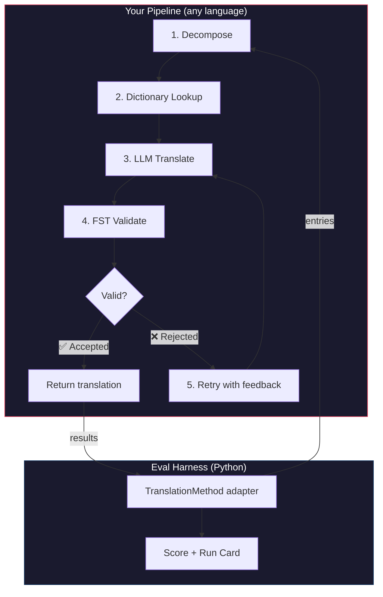
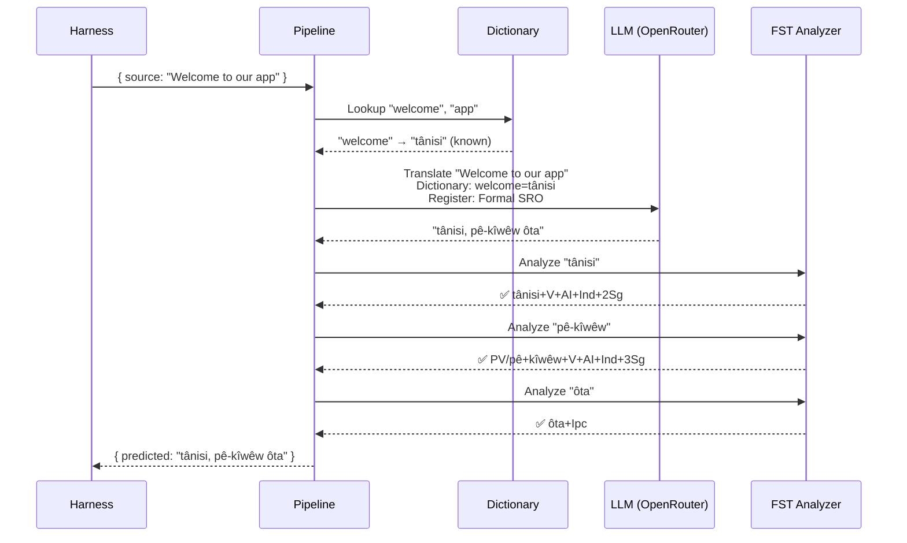
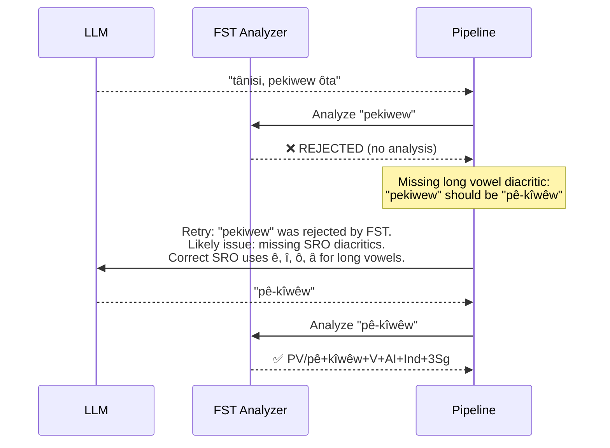

# Cookbook: FST 게이팅 번역 파이프라인

소스 텍스트를 분해하고, LLM으로 번역하고, 유한 상태 변환기(FST)로 출력을 검증하며, FST가 유효하지 않은 단어 형태를 거부할 때 재시도하는 다단계 번역 파이프라인을 구축해 보세요. 그런 다음 이를 eval harness에 연결하여 어떤 점수를 받는지 확인해 보세요.

**구축할 내용:** 형태론적으로 유효하지 않은 번역이 점수에 반영되기 *전에* 이를 잡아내는 Plains Cree용 번역 파이프라인이에요.

:::info Prerequisites
- 실행 중인 FST 바이너리 (예: [ALTLab의 Plains Cree analyzer](https://github.com/UAlbertaALTLab/lang-crk))
- Node.js 20+ (파이프라인용) 및 Python 3.10+ (harness용)
- LLM 단계를 위한 OpenRouter API 키
:::

---

## 아키텍처

파이프라인은 여러 단계의 체인이에요. 각 단계는 특정한 역할을 담당해요. 이는 어떤 언어로도 구축할 수 있어요 — 이 예제는 JavaScript를 사용하지만, harness는 내부 구현이 무엇인지 신경 쓰지 않아요. harness는 경계에 있는 얇은 Python 어댑터만 보거든요.



### 이 단계들을 사용하는 이유

| Stage | What It Does | Why It Matters |
|-------|-------------|---------------|
| **Decompose** | 복합 UI 문자열을 번역 가능한 세그먼트로 분해해요 | 다종합어(polysynthetic language)는 전체 문장을 단일 단어로 인코딩해요 — LLM에는 더 작은 단위가 필요해요 |
| **Dictionary Lookup** | 알려진 번역을 이중 언어 사전에서 확인해요 | LLM의 추측에 의존하는 대신 알려진 용어에 대해 올바른 용어를 강제해요 |
| **LLM Translate** | 레지스터 및 문법 컨텍스트와 함께 세그먼트를 LLM에 전송해요 | 새로운 구문을 처리하고 유창한 출력을 생성해요 |
| **FST Validate** | 출력을 형태소 분석기에 통과시켜요 | 유효하지 않은 단어 형태를 잡아내요 — FST가 단어를 거부하면, 그것은 해당 언어에서 유효한 단어 형태가 아니에요 |
| **Retry** | 거부된 단어를 FST의 오류 피드백과 함께 다시 전송해요 | 단어가 *왜* 틀렸는지에 대한 구체적인 정보를 LLM에 제공해요 |

---

## 데이터 흐름

단일 항목이 파이프라인을 통과하면서 어떤 일이 일어나는지 살펴볼게요:



### FST가 거부할 때



---

## 구현

원하는 것은 무엇이든 구축해 보세요. 이 예제는 JavaScript를 사용하지만, Python, Rust 또는 그 밖의 무엇이든 사용할 수 있어요. harness는 신경 쓰지 않아요 — harness는 얇은 Python 어댑터(다음 섹션에서 설명)와만 통신하거든요.

### 파이프라인

각 단계는 함수예요. 파이프라인은 이들을 함께 체인으로 연결해요.

```javascript title="pipeline.js"
import { lookupDictionary } from './dictionary.js';
import { callLLM } from './llm.js';
import { analyzeWithFST } from './fst.js';

const MAX_RETRIES = 3;

/**
 * Translate a batch of keys through the full pipeline.
 *
 * @param {object} keys - Map of key → source string
 * @param {object} options - { sourceLang, targetLang }
 * @returns {{ translations: object, stats: object }}
 */
export async function translateBatch(keys, options) {
  const translations = {};
  const stats = { total: 0, fstAccepted: 0, retries: 0, dictionaryHits: 0 };

  for (const [key, sourceText] of Object.entries(keys)) {
    stats.total++;
    translations[key] = await translateSingle(sourceText, options, stats);
  }

  return { translations, stats };
}

/**
 * Translate a single string through all pipeline stages.
 */
async function translateSingle(sourceText, options, stats) {

  // ── Stage 1: Decompose ──────────────────────────────────
  // Split compound strings into segments the LLM can handle.
  // For UI strings this is often a no-op, but for longer content
  // it prevents the LLM from losing context in long prompts.
  const segments = decompose(sourceText);

  // ── Stage 2: Dictionary Lookup ──────────────────────────
  // Check each segment against the bilingual dictionary.
  // Known terms are forced — the LLM won't override them.
  const knownTerms = {};
  for (const segment of segments) {
    const entry = lookupDictionary(segment.toLowerCase());
    if (entry) {
      knownTerms[segment] = entry;
      stats.dictionaryHits++;
    }
  }

  // ── Stage 3: LLM Translate ──────────────────────────────
  let translation = await callLLM(sourceText, {
    ...options,
    knownTerms,
    register: 'nêhiyawêwin (Plains Cree). Use SRO orthography. '
            + 'Professional register for educational contexts.',
  });

  // ── Stage 4: FST Validate ──────────────────────────────
  // Split the translation into words and check each one.
  let { accepted, rejected } = await validateWords(translation);

  // ── Stage 5: Retry Loop ─────────────────────────────────
  // If any words were rejected, retry with FST feedback.
  let attempt = 0;
  while (rejected.length > 0 && attempt < MAX_RETRIES) {
    attempt++;
    stats.retries++;

    const feedback = rejected
      .map(w => `"${w}" was rejected by the morphological analyzer`)
      .join('; ');

    translation = await callLLM(sourceText, {
      ...options,
      knownTerms,
      register: 'nêhiyawêwin (Plains Cree). Use SRO orthography.',
      feedback: `Previous attempt had invalid words. ${feedback}. `
              + 'Use correct SRO diacritics (ê, î, ô, â for long vowels). '
              + 'Ensure verb forms match expected conjugation patterns.',
    });

    ({ accepted, rejected } = await validateWords(translation));
  }

  if (rejected.length === 0) stats.fstAccepted++;

  return translation;
}

/**
 * Decompose source text into translatable segments.
 *
 * For simple key-value UI strings, this usually returns the
 * original string as a single segment. For longer content,
 * it splits on sentence boundaries.
 */
function decompose(text) {
  // Simple sentence-boundary split. Replace with your own
  // morphological decomposition for more complex needs.
  return text
    .split(/(?<=[.!?])\s+/)
    .filter(s => s.trim().length > 0);
}

/**
 * Validate each word in a translation against the FST.
 *
 * @returns {{ accepted: string[], rejected: string[] }}
 */
async function validateWords(translation) {
  // Split on whitespace and punctuation, keeping only words
  const words = translation
    .split(/[\s,;:.!?'"()\[\]{}]+/)
    .filter(w => w.length > 0);

  const accepted = [];
  const rejected = [];

  for (const word of words) {
    const analyses = await analyzeWithFST(word);
    if (analyses.length > 0) {
      accepted.push(word);
    } else {
      rejected.push(word);
    }
  }

  return { accepted, rejected };
}
```

### FST 래퍼

FST 바이너리를 비동기 함수로 래핑하세요. 이 예제는 ALTLab의 HFST 기반 Plains Cree analyzer를 사용해요.

```javascript title="fst.js"
import { execFile } from 'node:child_process';
import { promisify } from 'node:util';

const execFileAsync = promisify(execFile);

// Path to your FST analyzer binary
const FST_PATH = process.env.FST_ANALYZER_PATH || './bin/crk-analyzer';

/**
 * Run a word through the FST morphological analyzer.
 *
 * Returns an array of analyses. Empty array = rejected.
 *
 * Example:
 *   analyzeWithFST("tânisi")
 *   → ["tânisi+V+AI+Ind+2Sg", "tânisi+V+AI+Cnj+2Sg"]
 *
 *   analyzeWithFST("pekiwew")
 *   → []  // rejected — missing diacritics
 *
 * @param {string} word - A single word in SRO orthography
 * @returns {string[]} Array of FST analyses (empty = rejected)
 */
export async function analyzeWithFST(word) {
  try {
    // HFST lookup: pipe the word to stdin, read analyses from stdout
    const { stdout } = await execFileAsync(
      FST_PATH,
      ['--quiet'],
      { input: word + '\n', timeout: 5000 }
    );

    // Parse HFST output: each line is "input\tanalysis\tweight"
    // Lines with "+?" indicate unrecognized forms
    return stdout
      .split('\n')
      .filter(line => line.includes('\t') && !line.includes('+?'))
      .map(line => line.split('\t')[1]);

  } catch (err) {
    // If the FST binary isn't available, log and reject
    console.error(`[WARN] FST analysis failed for "${word}": ${err.message}`);
    return [];
  }
}
```

### 사전 및 LLM 모듈

```javascript title="dictionary.js"
/**
 * Simple bilingual dictionary backed by a JSON file.
 *
 * In production, you'd load from the coaching data directory
 * or query itwêwina (https://itwewina.altlab.app/) via API.
 */
const DICTIONARY = {
  'hello': 'tânisi',
  'welcome': 'tânisi',
  'thank you': 'kinanâskomitin',
  'home': 'kīwēwin',
  'search': 'nānātawāpahtam',
  'settings': 'isi-nākatohkēwin',
  'help': 'nīsōhkamākēwin',
  'back': 'kīwē',
};

/**
 * @param {string} term - Lowercase English term
 * @returns {string|null} Cree translation or null
 */
export function lookupDictionary(term) {
  return DICTIONARY[term] || null;
}
```

```javascript title="llm.js"
/**
 * Call an LLM via OpenRouter for translation.
 */
const OPENROUTER_API = 'https://openrouter.ai/api/v1/chat/completions';

export async function callLLM(sourceText, options) {
  const { knownTerms = {}, register, feedback } = options;

  // Build the system prompt with register and known terms
  let systemPrompt = `You are translating English to Plains Cree.\n\n`;
  systemPrompt += `Register: ${register}\n\n`;

  if (Object.keys(knownTerms).length > 0) {
    systemPrompt += `Required terminology (use these exact translations):\n`;
    for (const [en, crk] of Object.entries(knownTerms)) {
      systemPrompt += `  "${en}" → "${crk}"\n`;
    }
    systemPrompt += '\n';
  }

  if (feedback) {
    systemPrompt += `IMPORTANT correction from previous attempt:\n${feedback}\n\n`;
  }

  systemPrompt += `Rules:\n`;
  systemPrompt += `- Use Standard Roman Orthography (SRO)\n`;
  systemPrompt += `- Use macron/circumflex for long vowels: ê, î, ô, â\n`;
  systemPrompt += `- Return ONLY the Cree translation, nothing else\n`;

  const response = await fetch(OPENROUTER_API, {
    method: 'POST',
    headers: {
      'Authorization': `Bearer ${process.env.OPENROUTER_API_KEY}`,
      'Content-Type': 'application/json',
    },
    body: JSON.stringify({
      model: 'google/gemini-2.5-pro',
      messages: [
        { role: 'system', content: systemPrompt },
        { role: 'user', content: sourceText },
      ],
      temperature: 0.2,
    }),
  });

  const json = await response.json();
  return json.choices[0].message.content.trim();
}
```

---

## Harness에 연결하기

파이프라인이 구축되었어요. 이제 이를 eval harness에 연결하여 리더보드에서 벤치마킹할 수 있어요.

harness는 하나의 인터페이스만 사용해요: `TranslationMethod`. 이는 단일 메서드를 가진 Python 프로토콜이에요. 원하는 것을 원하는 언어로 무엇이든 구축한 다음 — 이 얇은 래퍼를 제공하면 연결돼요.

```python title="fst_gated_process.py"
"""
TranslationMethod adapter for the FST-gated pipeline.

This thin wrapper connects your pipeline (running as a local
subprocess or HTTP server) to the eval harness. The harness
calls translate() with corpus entries. You call your pipeline.
You return results. That's it.
"""

import time
import subprocess
import json
from mt_eval_harness.config import RunConfig


class FSTGatedProcess:
    """Adapter between the eval harness and your FST-gated pipeline.

    The pipeline runs as a Node.js subprocess. This wrapper:
    1. Receives entries from the harness
    2. Sends them to the pipeline
    3. Returns structured results the harness can score
    """

    def __init__(self, pipeline_url: str = "http://localhost:3001"):
        self.pipeline_url = pipeline_url

    async def translate(
        self,
        entries: list[dict],
        config: RunConfig,
    ) -> list[dict]:
        """Translate a batch of entries through the FST-gated pipeline.

        Args:
            entries: List of corpus entries with 'id' and source text.
            config: Harness run configuration (for context).

        Returns:
            List of result dicts, one per entry.
        """
        import httpx

        results = []

        for entry in entries:
            source_text = entry.get(config.source_field, entry.get("source", ""))
            start = time.monotonic()

            try:
                # Call your pipeline — however it's running
                async with httpx.AsyncClient() as client:
                    response = await client.post(
                        f"{self.pipeline_url}/translate",
                        json={"keys": {str(entry["id"]): source_text}},
                        timeout=30.0,
                    )
                    data = response.json()
                    predicted = data["translations"][str(entry["id"])]

                elapsed = time.monotonic() - start

                results.append({
                    "id": entry["id"],
                    "predicted": predicted,
                    "latency_s": elapsed,
                    "usage": {},  # pipeline doesn't expose token counts
                    "error": None,
                    "tool_calls": [],
                    "tool_call_count": 0,
                    "metadata": data.get("meta", {}),
                })

            except Exception as err:
                results.append({
                    "id": entry["id"],
                    "predicted": "",
                    "latency_s": time.monotonic() - start,
                    "usage": {},
                    "error": str(err),
                    "tool_calls": [],
                    "tool_call_count": 0,
                    "metadata": {},
                })

        return results
```

:::tip You don't need HTTP
위 예제는 파이프라인이 JavaScript로 작성되어 있기 때문에 HTTP를 통해 파이프라인을 호출해요. 파이프라인이 Python으로 작성되어 있다면 직접 호출할 수 있어요 — 서버가 필요 없어요. `TranslationMethod` 래퍼는 단지 함수 경계일 뿐이에요. 내부에서 무슨 일이 일어나는지는 여러분에게 달려 있어요.
:::

### 벤치마크 실행하기

파이프라인을 시작한 다음 harness를 실행하세요:

```bash
# Terminal 1: Start the pipeline
node server.js

# Terminal 2: Run the harness with your process
export OPENROUTER_API_KEY="sk-or-v1-..."

python -c "
import asyncio
from mt_eval_harness.config import RunConfig
from mt_eval_harness.runner import execute_run
from fst_gated_process import FSTGatedProcess

async def main():
    config = RunConfig(
        corpus_path='data/edtekla-dev-v1.json',
        source_lang='English',
        target_lang='Plains Cree (nêhiyawêwin, SRO)',
        process_name='fst-gated-v1',
    )
    process = FSTGatedProcess('http://localhost:3001')
    run_log = await execute_run(config, process=process)
    print(f'Results: {run_log.output_path}')

asyncio.run(main())
"
```

또는 CLI에서 `baseline_experiment.py`를 사용하여 내장 baseline과 비교해 보세요:

```bash
python eval/baseline_experiment.py \
  --dataset data/edtekla-dev-v1.json \
  --model google/gemini-2.5-pro \
  --fst-analyzer ./bin/crk-analyzer \
  --condition fst-gated-v1 \
  --submit
```

---

## 결과 이해하기

harness는 **run card**를 생성해요 — 점수가 담긴 JSON 파일이에요. 다음과 같은 내용을 볼 수 있어요:

```
═══════════════════════════════════════════════════
  FST-Gated Pipeline v1 — EDTeKLA Dev v1
═══════════════════════════════════════════════════

  chrF++              48.7 / 100
  Exact match         12.1%
  FST acceptance      94.4%
  Composite score     0.52  →  Functional ✓

  404 entries (master_corpus.json) · 47 retries · $0.18 total cost
═══════════════════════════════════════════════════
```

**한눈에 알 수 있는 정보:**
- 여러분의 방법은 **Functional** 등급(0.50–0.70)이에요 — 출력은 화자가 알아볼 수 있고, 주요 문법은 대체로 정확하지만, 형태론적 오류가 여전히 자주 남아 있어요.
- FST가 단어의 94%를 유효한 것으로 잡아내고 있어요 — 재시도 루프가 작동하고 있어요.
- 번역의 12%가 정확히 맞아요 — 개선의 여지가 많아요.

:::info Quality Tiers
| Tier | Composite | What It Means |
|------|-----------|---------------|
| Baseline | 0.00–0.30 | 원시 LLM 출력, 대부분 환각된 형태론 |
| Emerging | 0.30–0.50 | 일부 올바른 패턴, 신뢰할 수 없음 |
| **Functional** | **0.50–0.70** | **화자가 알아볼 수 있음. 주요 범주가 대체로 정확함.** |
| Deployable | 0.70–0.85 | 인간 검토를 거친 초안 번역에 적합 |
| Fluent | 0.85–1.00 | 유능한 인간 번역에 근접 |

전체 등급 정의는 [SCORING_SPEC §5](/docs/specifications/scoring#5-quality-tiers)를 참조하세요.
:::

<details>
<summary><strong>더 깊이: run card에는 무엇이 담겨 있나요?</strong></summary>

run card JSON은 이 평가 실행에 대한 모든 것을 담아요. 주요 섹션은 다음과 같아요:

**Scores** — harness가 계산한 모든 메트릭:
```json
{
  "scores": {
    "exact_match_rate": 0.121,
    "chrf_plus_plus": 48.7,
    "fst_acceptance_rate": 0.944,
    "composite_score": 0.52,
    "quality_tier": "functional"
  }
}
```

**Provenance** — 이 결과를 생성한 것:
```json
{
  "method": {
    "process_name": "fst-gated-v1",
    "model": "google/gemini-2.5-pro",
    "temperature": 0.0
  },
  "corpus": {
    "id": "edtekla-dev-v1",
    "sha256": "a1b2c3..."
  }
}
```

**Per-entry results** — 개별 점수가 포함된 모든 번역으로, 여러분의 방법이 어디에서 어려움을 겪는지 찾을 수 있어요:
```json
{
  "id": 42,
  "source": "The student completed the assignment",
  "reference": "ôskiniw kî-kîsîhtâw ôhi atoskêwina",
  "predicted": "ôskiniw kî-kîsîhtâw ôhi atoskêwin",
  "chrf": 89.2,
  "exact_match": false,
  "fst_accepted": true
}
```

composite score는 사용 가능한 메트릭의 가중 평균이며, 가중치는 [SCORING_SPEC §4](/docs/specifications/scoring#4-composite-score)에 정의되어 있어요. 메트릭을 사용할 수 없을 때는 그 가중치가 나머지에 비례하여 재분배돼요.

</details>

---

## 프로덕션에 배포하기

여러분의 방법은 이제 리더보드에 점수가 올라가 있어요. 이제 실제로 사용해 보고 싶을 거예요. 이 섹션은 [champollion](https://champollion.dev)이 호출할 수 있는 프로덕션 엔드포인트로 파이프라인을 서비스하는 것에 관한 내용이에요.

:::note This section is optional
위의 모든 내용은 방법을 구축하고 벤치마킹하는 것에 관한 내용이에요. 이 섹션은 배포에 관한 것으로 — 별개의 관심사예요. 아무것도 배포하지 않고도 리더보드에 제출할 수 있어요.
:::

### HTTP 서버

[API method contract](https://champollion.dev/docs/guides/serving-a-method)를 구현하는 Express 서버로 파이프라인을 래핑하세요:

```javascript title="server.js"
import express from 'express';
import { translateBatch } from './pipeline.js';

const app = express();
app.use(express.json());

/**
 * API method contract:
 *
 * Request:  { source_locale, target_locale, method, keys: { "key": "source" } }
 * Response: { translations: { "key": "translated" }, meta: { ... } }
 */
app.post('/translate', async (req, res) => {
  const { source_locale, target_locale, method, keys } = req.body;

  // Validate request
  if (!keys || typeof keys !== 'object') {
    return res.status(400).json({ error: { message: 'Missing keys object' } });
  }

  try {
    const startTime = Date.now();
    const { translations, stats } = await translateBatch(keys, {
      sourceLang: source_locale,
      targetLang: target_locale,
    });

    res.json({
      translations,
      meta: {
        model: 'custom-pipeline/fst-gated-v1',
        method: 'decompose-lookup-translate-validate',
        elapsed_ms: Date.now() - startTime,
        fst_acceptance_rate: stats.fstAccepted / stats.total,
        retries: stats.retries,
      },
    });
  } catch (err) {
    console.error('[ERR] Pipeline failed:', err.message);
    res.status(500).json({ error: { message: err.message } });
  }
});

// Health check for connectivity verification
app.get('/health', (req, res) => res.json({ status: 'ok' }));

app.listen(3001, () => {
  console.log('FST-gated pipeline running on http://localhost:3001');
});
```

### champollion 구성하기

언어 쌍을 실행 중인 서비스로 연결하세요:

```json title="champollion.config.json"
{
  "version": 3,
  "inputLocale": "en",
  "pairs": {
    "en:crk": {
      "method": "api",
      "endpoint": "http://localhost:3001/translate"
    }
  },
  "languages": {
    "crk": {
      "name": "Plains Cree",
      "register": "SRO syllabics with grammatical precision."
    }
  }
}
```

```bash
# Run it
export OPENROUTER_API_KEY="sk-or-v1-..."
node server.js &
npx champollion sync
```

### 플러그인으로 패키징하기

여러분의 방법에 점수가 매겨지면, 다른 사람들이 사용할 수 있도록 패키징하세요:

```json title="crk-fst-gated-v1/method.json"
{
  "name": "crk-fst-gated-v1",
  "type": "api",
  "version": "1.0.0",
  "description": "FST-gated Plains Cree translation with morphological validation",
  "author": "Your Name",

  "config": {
    "endpoint": "https://your-server.example.com/translate"
  },

  "locales": ["crk"],

  "benchmarks": {
    "crk": {
      "date": "2026-06-01T00:00:00Z",
      "corpus_size": 404,
      "exact_match_rate": 0.12,
      "corpus_chrf": 48.7,
      "model": "google/gemini-2.5-pro",
      "harness_version": "2.0"
    }
  },

  "provenance": {
    "resources": [
      { "name": "ALTLab CRK Analyzer", "license": "LGPL-3.0", "type": "fst" },
      { "name": "Wolvengrey Dictionary", "license": "CC-BY-NC-SA-4.0", "type": "dictionary" }
    ],
    "commercialReady": false,
    "flags": ["nc-resource"]
  }
}
```

---

## 이 패턴 확장하기

이 cookbook은 하나의 파이프라인 아키텍처를 보여줘요. 이를 어떤 언어나 방법에도 맞게 조정할 수 있어요:

| Variation | What Changes |
|-----------|-------------|
| **Different FST** | 바이너리 경로를 교체하세요. [GiellaLT GitHub](https://github.com/giellalt) 또는 [Apertium GitHub](https://github.com/apertium)에서 100개 이상의 언어에 대해 사전 컴파일된 FST(`.hfstol` 또는 `lttoolbox` 바이너리 등)를 다운로드할 수 있어요. |
| **No FST available** | FST 실행 단계를 제거하고 Hugging Face의 [UniMorph flat paradigm files](https://huggingface.co/datasets/unimorph/universal_morphologies)를 사용하여 굴절 형태에 대한 정적 데이터베이스 조회 검증을 수행하세요. |
| **Multiple LLMs** | 모델을 체인으로 연결하세요: 초안용 빠른 모델과 수정용 추론 모델. |
| **Human-in-the-loop** | 반환하기 전에 전문가 검토를 위해 불확실한 번역을 보류하는 큐 단계를 추가하세요. |
| **Fine-tuned model** | OpenRouter 호출을 로컬 모델(Ollama, vLLM 등)로 대체하세요. |
| **Different language** | 사전, FST 및 레지스터를 변경하세요. 아키텍처는 동일하게 유지돼요. |

파이프라인은 하나의 패턴이에요. 단계들은 서로 교체 가능해요. 여러분의 언어에 맞는 것을 구축하고, [leaderboard](https://champollion.dev/leaderboard)에서 입증한 다음, 배포해 보세요.

---

## 참고 자료

- **[Eval Harness](/docs/specifications/harness)** — harness 실행 방법 및 출력 해석
- **[Method Interface](/docs/specifications/methods)** — `TranslationMethod` 프로토콜 명세
- **[Leaderboard Rules](/docs/leaderboard/rules)** — 제출 기준 및 부정 방지 정책
- **[Support a Low-Resource Language](/docs/community/low-resource-languages)** — 더 넓은 맥락과 OCAP 원칙
- **[ALTLab](https://altlab.artsrn.ualberta.ca/)** — Alberta Language Technology Lab (Plains Cree FST)
- **[Method Leaderboard](https://champollion.dev/leaderboard)** — 점수 제출