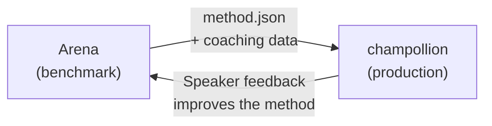

# Implementeren in Productie

U heeft bewezen dat het werkt in de Arena. Implementeer het nu.

De Arena is bedoeld voor R&D — het bouwen, benchmarken en vergelijken van vertaalmethoden. **Productie-implementatie** verloopt via [champollion](https://champollion.dev), de ontwikkelaarsgericht vertaal-CLI. Ze zijn verbonden via een gedeeld plug-informaat.



---

## Het Implementatietraject

### 1. Exporteer Uw Methode als een Plugin

Maak een `method.json`-manifest aan dat uw benchmarkresultaten verpakt:

```json
{
  "name": "crk-coached-v3",
  "type": "llm-coached",
  "version": "3.0.0",
  "description": "Coached LLM translation for Plains Cree",
  "locales": ["crk"],
  "config": {
    "model": "google/gemini-2.5-flash",
    "temperature": 0.3
  },
  "benchmarks": {
    "crk": {
      "composite_score": 0.67,
      "fst_acceptance": 0.82,
      "corpus_size": 150
    }
  }
}
```

Voeg eventuele coachingdata (grammaticaregels, woordenboeken) toe naast het manifest.

### 2. Installeren in Champollion

```bash
champollion plugin install ./my-method-plugin/
```

### 3. Configureer Uw Taalpaar

```json title="champollion.config.json"
{
  "pairs": {
    "en-crk": { "method": "plugin", "plugin": "crk-coached-v3" }
  }
}
```

### 4. Vertaal Echte Inhoud

```bash
npx champollion sync
```

Uw gebenchmarkte methode produceert nu echte vertalingen in productie.

---

## Voor Inheemse Talen

Methoden die inheemse taalgemeenschappen bedienen, vereisen **toestemming van de gemeenschap** vóór productie-implementatie. De OCAP-principes (Ownership, Control, Access, Possession) bepalen hoe vertaalmethoden worden ontwikkeld, geëvalueerd en geïmplementeerd.

Een methode die de Deployable-tier bereikt (0,70+) wordt niet automatisch geïmplementeerd — deze wordt geïmplementeerd **als en wanneer** het bestuursorgaan van de taalgemeenschap toestemming geeft.

Zie [Gegevenssouvereiniteit](/docs/sovereignty/data-sovereignty) en [Eigendomsoverdracht](/docs/sovereignty/ownership-transfer) voor het volledige governancekader.

---

## Zie Ook

- [The Eval Harness Bridge](https://champollion.dev/docs/guides/bridge) — gedetailleerde doorloop van de Arena→champollion-pijplijn
- [Plugin Specification](https://champollion.dev/docs/reference/plugin-spec) — het method.json-manifestformaat
- [champollion Agent Guide](https://champollion.dev/docs/guides/agent-guide) — hoe champollion te gebruiken voor vertaling