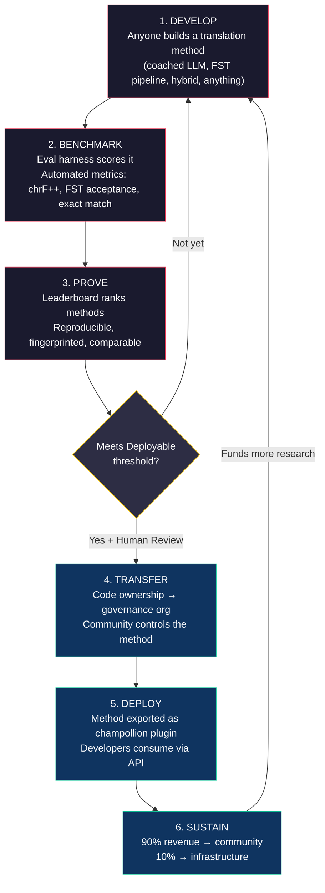
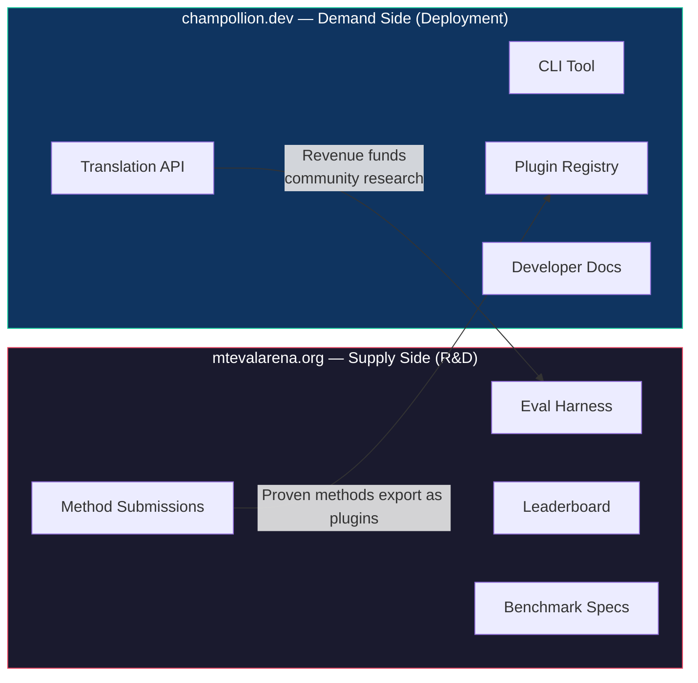
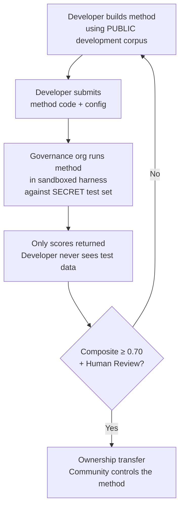

# Hoe het werkt: Competitief crowdsourcen voor machinevertaling

> **Samenvatting voor leidinggevenden.** Machinevertaling voor de meest ondervertegenwoordigde talen ter wereld — waaronder de ~1.300 talen die Meta's OMT-1600 claimt te ondersteunen, maar op kwaliteitsniveaus die onder elke bruikbare drempel liggen — is geen probleem van modeltraining, maar een *infrastructuur*probleem. Geen enkel model, lab of bedrijf zal dit oplossen. Dit document beschrijft een platformarchitectuur die de wereldwijde gemeenschap van ML-ingenieurs, taalkundigen en taalgebruikers omvormt tot een gedistribueerd onderzoekslab: iedereen bouwt een vertaalmethode, het platform bewijst of deze werkt aan de hand van soevereine evaluatiedata, en bewezen methoden worden in productie genomen waarbij inkomsten terugvloeien naar de gemeenschappen wier talen worden bediend. Het mechanisme is competitief crowdsourcen met cryptografische soevereiniteit — een combinatie die nog niet eerder is beproefd.

---

> [!IMPORTANT]
> **Reikwijdte.** Dit platform evalueert **vertaling van formele geschreven tekst** — documenten, educatief materiaal, officiële communicatie, UI-strings. Het is geen chatbot, realtime-tolk of conversatiesysteem zonder domeinbeperking. Het leaderboard rangschikt vertaalmethoden op basis van samengestelde parallelle corpora in specifieke tekstdomeinen (zie [Benchmark Specification §2.7](/docs/specifications/benchmark#27-domain) voor de domeintaxonomie). MT is infrastructuur voor taalbehoud, geen vervanging ervan. Kinderen leren taal van mensen, niet van machines.

### Huidige domeindekking

| Domein | Tier-dekking | Status | Opmerkingen |
|--------|--------------|--------|-------------|
| Officieel / overheid | Tiers 1–5 | Actief | EdTeKLA-corpus |
| Educatief / leerboek | Tiers 1–4 | Actief | EdTeKLA-corpus |
| Narratief / literair | Beperkt | Gepland | Enkele vermeldingen in de gouden standaard |
| Religieus / scripturaal | Alleen referentie | Niet geëvalueerd | FLORES+ (Bijbeldomein); niet gebruikt voor officiële scoring |
| Conversationeel | Buiten scope | By design | Dit systeem evalueert geschreven tekst, niet gesproken taal |
| Technisch / wetenschappelijk | Buiten scope | Toekomstig | Vereist domeinspecifieke terminologievalidatie |

## 1. Het probleem: machinevertaling ≠ machine learning

Machinevertaling voor talen met weinig middelen (low-resource languages, LRLs) wordt doorgaans geframed als een machine-learningprobleem: data verzamelen, een model trainen, uitrollen. Deze framing is onjuist, en de fout heeft consequenties — ze stuurt financiering, talent en infrastructuur naar een aanpak die structureel niet kan werken voor de meerderheid van de talen ter wereld.

### 1.1 Waarom de ML-framing tekortschiet

De standaard ML-pijplijn voor MT vereist drie dingen: grote parallelle corpora, gevalideerde evaluatiebenchmarks en een uitrolpad. Voor de ~130 talen die Google Translate bedient en de ~200 die NLLB-200 dekt, bestaan alle drie. Voor de ~1.300 aanvullende talen die OMT-1600 claimt te dekken, bestaat er evaluatiedata, maar de kwaliteit ligt grotendeels onder bruikbare drempelwaarden, de modelgewichten zijn niet openbaar beschikbaar, en er is geen uitrolpijplijn. Voor de resterende ~5.400+ talen bestaat niets van dit alles.

| Vereiste | Talen met veel middelen | OMT-1600-dekking (~1.300 LRLs) | Resterende ~5.400 talen |
|----------|------------------------|-------------------------------|------------------------|
| **Parallelle corpora** | Miljoenen zinsparen (Europarl, UN Corpus, OpenSubtitles) | Bijbel-domein bitext, webscrapers, synthetische backtranslation. Geen door de gemeenschap samengestelde data. | Honderden tot enkele duizenden, indien aanwezig |
| **Evaluatiebenchmarks** | WMT, FLORES, NTREX — gestandaardiseerd, reproduceerbaar | BOUQuET (Bijbeldomein), met-BOUQuET. Geen morfologische validatie. Geen onafhankelijke evaluatie. | Geen standaardbenchmarks; ad-hocevaluatie |
| **Uitrolpad** | Google Translate, DeepL, Azure — commerciële API's | Modelgewichten niet vrijgegeven. Geen CLI, geen pluginsysteem, geen door de gemeenschap uitrolbare API. | Niets. Geen API, geen product, geen markt. |

De ML-aanpak werkt wanneer de data beschikbaar is om op te trainen en de markt bestaat om in uit te rollen. OMT-1600 heeft de eerste voorwaarde aanzienlijk uitgebreid — maar uitbreiding zonder onafhankelijke kwaliteitsverificatie, morfologische validatie of gemeenschapsbestuur is uitbreiding zonder vertrouwen. Het probleem is niet alleen "we hebben een beter model nodig" — het is "we hebben infrastructuur nodig die bewijst dat het model werkt, op voorwaarden die de gemeenschap beheert."

### 1.2 Wat MT voor LRLs werkelijk vereist

Vertaling voor ondervertegenwoordigde talen is primair geen trainingsprobleem. Het is een **methode-engineeringprobleem** — de uitdaging om beschikbare middelen (LLMs, morfologische tools, gemeenschapskennis, taalkundige regels) samen te voegen tot werkende vertaalpijplijnen, en vervolgens te bewijzen dat ze werken met rigoureuze evaluatie.

Het onderscheid is van belang:

| Dimensie | ML-aanpak | Methode-engineeringaanpak |
|----------|-----------|--------------------------|
| **Kernactiviteit** | Een model trainen op data | Tools, prompts en taalkundige kennis combineren tot een pijplijn |
| **Knelpunt** | Volume parallelle data | Technische creativiteit + evaluatie-infrastructuur |
| **Wie kan bijdragen** | Teams met GPU-clusters en datasets | Iedereen met een API-sleutel, een woordenboek en een idee |
| **Evaluatie** | BLEU/chrF op gehouden testsets | Morfologische validatie + menselijke beoordeling + geautomatiseerde metrics |
| **Uitrol** | Het model serveren | De methode verpakken als een plugin |

Moderne LLMs bevatten al latente kennis van veel talen met weinig middelen — genoeg om output te produceren die *plausibel lijkt*. Het probleem is dat deze output vaak morfologisch ongeldig is (het model hallucineert woordvormen die niet bestaan in de taal). De technische uitdaging is: hoe extraheer je wat de LLM weet, valideer je het tegen de taalkundige werkelijkheid, en verpak je het resultaat voor productiegebruik?

Daarom benchmarken we **methoden**, niet modellen. Een methode is het volledige recept: modelselectie + prompt engineering + toolgebruik + voor-/naverwerking + coachingdata + herhaalpogingsstrategieën. Twee teams die hetzelfde model gebruiken met verschillende methoden zullen verschillende scores behalen. Dat is het punt.

### 1.3 Waarom polysynthetische talen alles verstoren

Veel van de meest ondervertegenwoordigde talen ter wereld zijn **polysynthetisch** — ze coderen volledige zinnen in afzonderlijke woorden via productieve morfologische processen. Beschouw het Plains Cree-woord:

> **ê-kî-nitawi-kîskinwahamâkosiyân**
> *"when I had gone to school"*

Één woord. Het codeert tijd (verleden), richting (gaan naar), de stam (leren), stem (passief/reflexief) en persoon (eerste enkelvoud). Het Engels heeft zes woorden nodig voor wat het Cree in één woord uitdrukt.

Dit verstoort standaard MT op elk niveau:

- **Tokenisatie** — BPE en SentencePiece versnipperen polysynthetische woorden tot betekenisloze fragmenten, omdat ze zijn ontworpen voor concatenatieve morfologie.
- **Hallucinatie** — LLMs produceren plausibel ogende tekenreeksen die geen geldige woorden zijn. Een niet-spreker kan het verschil niet zien. Zonder morfologische validatie zijn hallucinaties onzichtbaar.
- **Evaluatie** — Woordniveau-metrics (BLEU) bestraffen de natuurlijke inflectionele variatie die fundamenteel is voor de werking van deze talen. Tekenniveau-metrics (chrF++) zijn beter, maar nog steeds onvoldoende zonder structurele validatie.

De oplossing is geen groter model of meer trainingsdata. Het is **infrastructuur die hallucinaties onderschept voordat ze gebruikers bereiken** — morfologische analysatoren (FSTs) die definitief kunnen vaststellen: "dit is geen woord in deze taal."

---

## 2. Waarom bestaande benaderingen niet werken

### 2.1 Commerciële MT

Commerciële vertaaldiensten hebben van oudsher geoptimaliseerd voor marktvolume. Meta's OMT-1600 (maart 2026) vertegenwoordigt een significante verschuiving — 1.600 talen in één systeem. Maar voor de ~1.300 talen op hun laagste resourcetiers ligt de kwaliteit onder bruikbare drempelwaarden, zijn de modelgewichten niet beschikbaar, en is er geen uitrolpijplijn. Het structurele stimuleringsprobleem heeft zich ontwikkeld: Big Tech kan nu modellen bouwen voor LRLs, maar zonder onafhankelijke evaluatie, morfologische validatie of gemeenschapsbestuur lost dekking alleen het probleem niet op.

### 2.2 Academisch onderzoek

Academisch MT-onderzoek richt zich overwegend op taalparen met veel middelen, omdat daar de trainingsdata, gedeelde taken en publicatiekanalen zijn. Onderzoekers die werken aan taalparen met weinig middelen hebben moeite met publiceren, met het financieren van rekenkracht, en met uitrollen — omdat uitrolinfrastructuur voor LRLs niet bestaat.

### 2.3 Eenmalige competities

Men zou een Kaggle-competitie kunnen organiseren: "Engels→Plains Cree, beste chrF++ wint $10.000." Dit is wat er dan gebeurt:

1. Iemand wint, dient een notebook in, int de prijs en gaat naar huis.
2. De notebook raakt in verval in Kaggle's archief. Niemand rolt hem uit. Niemand onderhoudt hem.
3. De testset wordt uiteindelijk gepubliceerd — voor altijd gecontamineerd.
4. De bestuursorganisatie heeft hun taalkundige data geüpload naar Google's infrastructuur onder Google's gebruiksvoorwaarden, zonder echte controle over de levenscyclus.
5. Geen uitrolbrug. Een winnende notebook is geen werkende API.

Een eenmalige premie trekt premiejagers aan. Een doorlopend leaderboard met gemeenschapsbestuur creëert duurzame betrokkenheid.

### 2.4 Fine-tuning

Het fine-tunen van een open model op parallelle tekst is de voor de hand liggende ML-aanpak. Maar voor de meeste LRLs is het parallelle corpus dat nodig is voor fine-tuning precies de data die niet bestaat — en het aanmaken ervan vereist dezelfde tweetalige sprekers en gemeenschapsbetrokkenheid die de fine-tuning geacht wordt te vervangen. Men kan zich niet uit een dataschaarsteprobleem bootstrappen met een techniek die data vereist.

---

## 3. De oplossing: competitief crowdsourcen met soevereine evaluatie

Het platform keert de traditionele aanpak om: in plaats van één team dat één model bouwt, **concurreert de wereldwijde gemeenschap om de beste vertaalmethode te bouwen**, bewijst het platform of deze werkt, en worden bewezen methoden in productie genomen waarbij de taalgemeenschap eigenaarschap en controle behoudt.

### 3.1 De volledige cyclus

Elke fase heeft een specifieke functie:

| Fase | Wat er gebeurt | Wie er baat bij heeft |
|------|---------------|----------------------|
| **Ontwikkelen** | Een onderzoeker, student of hobbyist bouwt een vertaalmethode met welke tools dan ook — LLM-prompting, FST-pijplijnen, woordenboeken, fine-tuned modellen, regelgebaseerde systemen of hybriden | De bijdrager leert, experimenteert, publiceert |
| **Benchmarken** | De evaluatieharnas scoort de methode op een gestandaardiseerd corpus met reproduceerbare metrics. Elke run produceert een [run card](/docs/specifications/benchmark#3-run-card-schema) — een volledig overzicht van wat is getest en hoe het heeft gepresteerd | Onderzoekers krijgen reproduceerbare, vergelijkbare resultaten |
| **Bewijzen** | Resultaten verschijnen op het publieke leaderboard. Methoden worden gerangschikt, vergeleken en onderzocht. De gemeenschap ziet wat werkt en wat niet | Iedereen krijgt inzicht in de stand van de techniek |
| **Overdragen** | Voor inheemse talen wordt het code-eigenaarschap van methoden die de Deployable-drempel bereiken (composite ≥ 0.70) ÉN menselijke validatie doorstaan, overgedragen aan de bestuursorganisatie van de taalgemeenschap | De gemeenschap verwerft een inkomstengenererende asset |
| **Uitrollen** | De methode wordt geëxporteerd als een [champollion](https://github.com/gamedaysuits/champollion)-plugin en via API aangeboden. Ontwikkelaars gebruiken vertalingen zonder de onderliggende methode te hoeven begrijpen | Ontwikkelaars krijgen vertaling voor talen die commerciële API's niet bedienen |
| **Verduurzamen** | API-inkomsten worden verdeeld: 90% naar de gemeenschap, 10% naar infrastructuur. Inkomsten financieren meer taalkundig onderzoek, corpusontwikkeling en gemeenschapsprogramma's | Het vliegwiel houdt zichzelf in stand na de initiële oprichting |

### 3.2 Waarom competitieve dynamiek werkt

Competitie is niet bijkomstig — het is het mechanisme. Dit is waarom:

**Diversiteit van benaderingen.** De beste methode voor Engels→Plains Cree kan een FST-gated coached LLM zijn. De beste voor Engels→Quechua kan een woordenboekverrijkte pijplijn zijn. De beste voor Engels→Inuktitut kan een fine-tuned model zijn dat is gebootstrapt vanuit het Nunavut Hansard-corpus. Geen enkel team of aanpak zal domineren over alle talen. Het leaderboard onthult welke *soorten* benaderingen werken voor welke *soorten* talen — een meta-resultaat dat op zichzelf een onderzoeksbijdrage is.

**Duurzame betrokkenheid.** Een leaderboard is nooit af. Iemand wil altijd de topscore verbeteren. Elke inzending schenkt rekenkracht en intellectuele inspanning aan het probleem. In tegenstelling tot een eenmalige subsidie genereert de competitieve dynamiek voortdurende onderzoeksinvestering vanuit de wereldwijde gemeenschap.

**Lage drempel voor deelname.** U hebt een API-sleutel, een woordenboek en een idee nodig. De evaluatieharnas is open source. Het corpusformaat is eenvoudige JSON. Een taalkunde-student kan concurreren met een goed uitgerust lab — en soms winnen, omdat domeinkennis (begrip van de taal) rekenkrachtmiddelen kan overtreffen.

**Uitrolbrug.** Dezelfde methode die goed scoort in de harnas wordt met één configuratiewijziging in productie genomen. "Bewijs het hier, rol het daar uit." Dit is de kloof die Kaggle, WMT shared tasks en academische publicaties niet overbruggen.

### 3.3 De platformarchitectuur

Het ecosysteem is fysiek opgesplitst in twee sites die twee doelgroepen bedienen:

**[mtevalarena.org](https://mtevalarena.org)** is de R&D-proeftuin. De doelgroep bestaat uit ML-ingenieurs, taalkundigen en onderzoekers. Alles hier draait om het bouwen, testen en bewijzen van vertaalmethoden.

**[champollion.dev](https://champollion.dev)** is het uitrolplatform. De doelgroep bestaat uit ontwikkelaars die vertaling nodig hebben voor hun applicaties. Zij hoeven niet te begrijpen hoe de methoden werken — ze roepen gewoon de API aan.

De brug tussen beide is de **methode-plugin**: een bewezen methode, verpakt voor uitrol, eigendom van de gemeenschap.

---

## 4. Soevereine evaluatie: waarom de infrastructuur ertoe doet

De evaluatie-infrastructuur is geen technisch detail — het is de kern van het soevereiniteitsmodel. Standaardevaluatie (uw testset uploaden naar een gedeeld platform) werkt niet voor inheemse talen, omdat het de controle over de taalkundige data prijsgeeft.

### 4.1 Het soevereiniteitsmechanisme

De ontwikkelaar ziet de gouden-standaard evaluatiedata nooit. Hij of zij ontwikkelt op basis van een publiek ontwikkelcorpus en dient vervolgens de methodecode in bij de bestuursorganisatie, die deze in een sandbox uitvoert op de geheime testset. Alleen scores komen terug. Dit is niet alleen beveiliging — het is een directe implementatie van de **OCAP®-principes** (Ownership, Control, Access, Possession) die inheems databeheer vereist.

### 4.2 Waarom dit niet op andermans platform kan draaien

Op Kaggle uploadt de bestuursorganisatie hun taalkundige data naar Google's infrastructuur onder Google's gebruiksvoorwaarden. Ze kunnen de toegang niet op eigen tijdlijn intrekken. Ze kunnen geen aangepaste juridische voorwaarden (zoals eigendomsoverdracht) koppelen aan inzendingen. Ze hebben geen cryptografische garantie dat de data niet voor andere doeleinden wordt gebruikt. Datasoevereiniteit betekent dat de gemeenschap het evaluatie-eindpunt beheert, de sleutels bezit en het kan afsluiten.

---

## 5. Evaluatiefilosofie: Microeval en LYSS

Standaard MT-metrics (BLEU, chrF++, COMET) zijn ontworpen om te generaliseren over talen. Die algemeenheid is hun kracht — en hun blinde vlek. Voor polysynthetische talen scoort een morfologisch ongeldig woord dat karakter-n-grammen deelt met de referentie goed op chrF++, maar zou door elke spreker als onzin worden herkend.

**Microeval-ontwikkeling** betekent het bouwen van evaluatiemetrics die zijn afgestemd op specifieke talen met behulp van de beste beschikbare taalkundige tools. Het raamwerk heet **LYSS** (Linguistically-informed Yield & Structural Scoring):

| Component | Wat het meet | Tool | Status |
|-----------|-------------|------|--------|
| **LYSS-fst** | Morfologische geldigheid | Eindige-toestandstransducer | ✅ Geïmplementeerd (Plains Cree) |
| **LYSS-eq** | Taalkundige equivalentie | Door taalkundigen samengestelde variantregels | ✅ Geïmplementeerd (Plains Cree) |
| **LYSS-sem** | Semantisch behoud | Taalspecifieke semantische modellen | ✅ Geïmplementeerd (Plains Cree) |

De universele metrics (chrF++, BLEU) dienen als basislijnen en als primaire signalen voor talen zonder LYSS-tooling. Waar taalspecifieke tools beschikbaar zijn, dragen LYSS-componenten het scoringsgewicht — omdat de zaken die het meest van belang zijn voor elke taal, precies de zaken zijn die alleen taalspecifieke tools kunnen meten.

Voor de volledige LYSS-specificatie en de logica van de samengestelde scoring, zie [SCORING_SPEC.md §4](/docs/specifications/scoring#4-composite-score).

> [!WARNING]
> **Vergelijkbaarheid tussen runs.** Bij het vergelijken van runs met verschillende beschikbaarheid van metrics (bijv. één run heeft FST-scores, een andere niet), zijn de samengestelde scores niet direct vergelijkbaar. De composite normaliseert naar beschikbare metrics, maar een run die op 5 metrics is geëvalueerd bevat meer informatie dan een run die op 2 is geëvalueerd. Het leaderboard geeft de metricdekking voor elke vermelding aan.

---

## 6. Wie dit bedient

### Voor ML-ingenieurs en onderzoekers

Een open leaderboard met gestandaardiseerde benchmarks voor taalparen die geen enkele shared task dekt. Reproduceer elk resultaat met de evaluatieharnas. Publiceer uw methode. Verbeter de topscore. Elke inzending is gekoppeld aan een specifieke configuratie en datasetversie — geen onduidelijkheid over wat er is getest.

### Voor taalgemeenschappen

Eigenaarschap en controle over vertaaltechnologie die voor uw taal is gebouwd. De competitieve dynamiek betekent dat meerdere teams tegelijkertijd aan uw taal werken — u profiteert van alle inspanningen en bezit het resultaat. Inkomsten uit API-gebruik financieren gemeenschapsprogramma's op uw voorwaarden.

### Voor financiers en subsidiebeoordelaars

Transparante, reproduceerbare metrics om vertaalonderzoeksvoorstellen te evalueren. Meetbare resultaten die verder gaan dan publicaties: API-gebruik, gegenereerde inkomsten, kwaliteitsmetrics in de tijd, taaldekking. Eén succesvolle methode creëert een zichzelf in stand houdende inkomstenstroom — de impact van de subsidie groeit voort in plaats van te eindigen wanneer de financiering stopt.

### Voor ontwikkelaars

Vertaling voor talen die geen commerciële API bedient. Eén CLI-opdracht (`npx champollion sync`) vertaalt uw localisatiebestanden met door de gemeenschap bewezen methoden. Gebruik Google Translate voor Frans, een coached LLM voor Plains Cree, en een gemeenschaps-API voor Quechua — allemaal in hetzelfde project, allemaal met dezelfde interface.

### Voor studenten

Een open uitdaging met reële impact. Bouw een vertaalmethode voor een ondervertegenwoordigde taal, benchmark deze en publiceer uw resultaten. De infrastructuur is gratis, de datasets zijn open, en het leaderboard maakt niet uit of u aan een top-10-universiteit studeert of vanuit een bibliotheekterminal werkt.

---

## 7. Sociale en technische context

### 6.1 Taalbehoud versnelt

Inspanningen voor taalbehoud nemen wereldwijd toe. Onderdompelingsscholen, gemeenschapstaalgroepen en digitale archiveringsprojecten breiden zich uit in inheemse gemeenschappen in Canada, de Verenigde Staten, Australië, Nieuw-Zeeland en Noord-Europa. Deze inspanningen hebben technologie nodig — specifiek vertaaltechnologie die de gemeenschapssoevereiniteit over taalkundige data respecteert.

### 6.2 LLMs hebben de basislijn veranderd

Vóór 2023 vereiste het opbouwen van enige MT-capaciteit voor een polysynthetische taal aanzienlijke NLP-expertise, aangepaste modeltraining en grote rekenbudgetten. Moderne LLMs hebben de basislijn veranderd: een goed opgestelde prompt met coachingdata en morfologische validatie kan bruikbare vertalingen produceren voor sommige taalparen — zonder training. Dit verlaagt de drempel voor methode-ontwikkeling drastisch. Het probleem is verschoven van "hoe bouwen we een model?" naar "hoe bouwen we een pijplijn die valideert en corrigeert wat het model produceert?"

### 6.3 De open-source benchmarkingcultuur

AI-benchmarking is een eigen cultuur geworden. Leaderboards stimuleren innovatie. Competities trekken talent aan. De Chatbot Arena, LMSYS, Hugging Face Open LLM Leaderboard — deze platforms tonen aan dat competitieve evaluatie snelle vooruitgang stimuleert. Wij richten die energie op vertaling voor de duizenden talen waarvoor commerciële MT ofwel niet bestaat, ofwel niet onafhankelijk is bewezen te werken.

### 6.4 Inheemse datasoevereiniteit is niet onderhandelbaar

De OCAP®-principes (Ownership, Control, Access, Possession), de CARE-principes (Collective Benefit, Authority to Control, Responsibility, Ethics) en raamwerken zoals Te Mana Raraunga (Māori Data Sovereignty) zijn geen optionele toevoegingen — het zijn structurele vereisten voor elke technologie die inheemse taalkundige middelen raakt. Onze evaluatie-infrastructuur implementeert deze principes architecturaal, niet alleen als beleidsverklaringen.

---

## 8. Spanningen en beperkingen {#8-tensions-and-limitations}

Dit project gebruikt een westers mechanisme — competitief benchmarken — om kennissystemen te dienen die vaak communaal, relationeel en door Ouderen geleid zijn. Die spanning is reëel en moet worden benoemd, niet worden opgelost door bewering.

**Benchmarken versus communale kennis.** Leaderboards rangschikken individuen en optimaliseren numerieke scores. Inheemse kennistradities benadrukken relationeel gezag, communale correctie en op relaties gebaseerde legitimiteit. We kunnen niet beweren deze kennissystemen te dienen terwijl we een platform bouwen waarvan het kernmechanisme individuele competitieve optimalisatie is. De soevereiniteitsarchitectuur (§4) — waarbij gemeenschappen methoden bezitten, evaluatie beheersen en beslissen wat er wordt uitgerold — is onze structurele reactie, maar lost de spanning niet op. Een leaderboard blijft een leaderboard.

**Wat we eraan doen.** Het platform ondersteunt team- en gemeenschapsinzendingen naast individuele inzendingen. Het leaderboard presenteert resultaten als "huidige stand van de techniek" in plaats van "wie er wint". De bestuursorganisatie — niet de leaderboardscore — bepaalt wat er wordt uitgerold. Geen geautomatiseerde score geeft een ontwikkelaar recht op iets; de gemeenschap beslist. En we onderhouden een doorlopende adviserende feedbacklus met partnergemeenschappen over de vraag of de framing en stimuleringsstructuur van het platform hen dient. Als dat niet het geval is, passen we het aan.

**MT is geen taalbehoud.** Vertaling converteert tekst tussen talen. Taalbehoud creëert nieuwe sprekers. Een perfect MT-systeem lost het transmissieprobleem, het prestigeprobleem of het pedagogische probleem niet op. Het kan zelfs de illusie wekken dat "de computer de taal spreekt", waardoor de urgentie voor menselijke overdracht wordt ondermijnd. Wij bouwen MT als infrastructuur — conceptvertaling voor nabewerking, morfologische tools voor taalleer-apps, politieke hefboomwerking voor gemeenschappen die diensten in hun taal eisen — niet als vervanging voor intergenerationele overdracht. De gemeenschap bepaalt of, wanneer en hoe de technologie wordt ingezet.

Dit gedeelte bestaat omdat deze spanningen zijn geïdentificeerd in een uitgenodigde kritiek (mei 2026) en wij ons hebben verplicht ze publiekelijk te benoemen in plaats van ze te begraven in interne documenten.

> [!NOTE]
> **Leaderboardscores zijn geautomatiseerde proxies.** Alle scores die op het leaderboard worden weergegeven, zijn geautomatiseerde metingen die door de evaluatieharnas worden berekend onder gecontroleerde omstandigheden. Ze geven de relatieve methodeprestaties aan, maar vormen geen kwaliteitsgaranties. Door de gemeenschap gevalideerde methoden worden afzonderlijk gemarkeerd. Geen geautomatiseerde score geeft een ontwikkelaar recht op uitrol — de bestuursorganisatie neemt die beslissing.

---

## 9. Huidige stand van zaken

### Wat er vandaag bestaat

- **champollion** — Productieklare CLI-tool. 10 vertaalmethoden, per-paarconfiguratie, kwaliteitspoorten, 5 bestandsformaten. [Gepubliceerd op npm](https://www.npmjs.com/package/champollion).
- **MT Eval Harness** — Werkend evaluatieraamwerk. chrF++, FST-acceptatie en exacte-overeenkomstmetrics geïmplementeerd. Run card-schema afgerond. Fingerprinting en integriteitsverificatie werkend.
- **EDTeKLA Dev v1** — Plains Cree-evaluatiecorpus (CC BY-NC-SA 4.0), afkomstig van de EdTeKLA-onderzoeksgroep van de Universiteit van Alberta. Het leerboekencorpus bevat 486 vermeldingen (436 dev + 50 gehouden), plus 62 afzonderlijke gouden-standaard paren van itwêwina (548 totaal). Het canonieke dev-corpus is `textbook_dev.json` met 436 vermeldingen — de volledige leerboek-dev-splitsing.
- **FLORES+ Devtest** — 1.012 zinnen × 39 talen (CC BY-SA 4.0).
- **Arena-website** — Op Docusaurus gebaseerde documentatiesite met leaderboard, specificaties, tutorials en soevereiniteitskader.
- **Benchmark Specification** — [Canonieke specificatie](/docs/specifications/benchmark) die het corpusschema, het run card-formaat en het evaluatieprotocol definieert. Voor metricdefinities, samengestelde gewichten en kwaliteitstiers, zie [SCORING_SPEC.md](/docs/specifications/scoring).

### Wat er volgt

| Fase | Wat | Status |
|------|-----|--------|
| Basislijn-sweep | 12 modellen × 3 temperaturen × 2 coachingconfiguraties op EDTeKLA | 🔲 Gepland |
| Samengestelde score | Gewogen metriekimplementatie in harnas | ✅ Gereed |
| Semantische score | Verdict-gewogen score van CrkSemanticMetric (evaluatiestandaard) | ✅ Gereed |
| Morfologische nauwkeurigheid | Per-morfeem scoring op basis van gouden-standaard analyse | 🔲 Gepland |
| Equivalente overeenkomst | Variantklasse-matching via CrkLinterMetric (evaluatiestandaard) | ✅ Gereed |
| Champollion API | Gemeten API voor door de gemeenschap beheerde methoden | 🔲 Gepland |
| Tweede taal | Uitbreiding naar een tweede taalpaar (Inuktitut, Quechua of Sámi) | 🔲 Gepland |

---

## 10. Aan de slag

**Bouw een methode:** Kloon de [evaluatieharnas](https://github.com/gamedaysuits/arena), voer een basislijnexperiment uit en zie waar u terechtkomt op het leaderboard.

**Draag een corpus bij:** Als u een ondervertegenwoordigde taal spreekt, zijn zelfs 50 samengestelde vertaalparen voldoende om een nieuw leaderboard-track te openen. Zie [Voor taalgemeenschappen](https://mtevalarena.org/docs/community/for-language-communities).

**Rol vertalingen uit:** Installeer [champollion](https://github.com/gamedaysuits/champollion) en vertaal uw applicatie met `npx champollion sync`.

**Financier de inspanning:** Zie [Het economische model](https://mtevalarena.org/docs/sovereignty/economic-model) voor kostenraamwerken en duurzaamheidsprognoses.

---

## Zie ook

- **[Benchmark Specification](/docs/specifications/benchmark)** — corpusformaat, run card-schema, evaluatieprotocol, soevereiniteit
- **[Scoring Specification](/docs/specifications/scoring)** — metrics, samengestelde gewichten, kwaliteitstiers, kosten-/snelheidsformules
- **[MT Eval Arena](https://mtevalarena.org)** — de R&D-proeftuin
- **[champollion](https://github.com/gamedaysuits/champollion)** — het uitrolplatform
- **[Ondersteuning van een taal met weinig middelen](https://mtevalarena.org/docs/community/low-resource-languages)** — diepgaande verkenning van polysynthetische MT-uitdagingen en -benaderingen

---

*Dit document is het startpunt voor iedereen die het project voor het eerst tegenkomt. Voor de volledige technische specificatie, zie [BENCHMARK_SPEC.md](/docs/specifications/benchmark) (protocol) en [SCORING_SPEC.md](/docs/specifications/scoring) (metrics).*