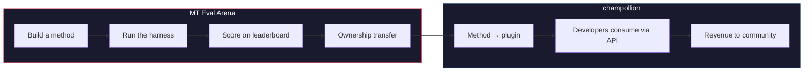

# De MT Eval Arena

> **Samenvatting.** De MT Eval Arena is een open benchmarkplatform voor machinevertaalmethoden, met een focus op talen waarvoor commerciële MT ofwel niet bestaat ofwel niet onafhankelijk is geverifieerd. Het biedt gestandaardiseerde evaluatie, een openbaar scorebord en een deploymentbrug naar productie via champollion. Voor inheemse talen draagt een bewezen methode het eigenaarschap over aan de gemeenschap.

Een open testomgeving voor machinevertaalmethoden — in het bijzonder voor talen waarvoor commerciële MT ofwel niet bestaat ofwel niet onafhankelijk is geverifieerd.

Ontwikkel een methode. Benchmark deze. Bewijs dat ze werkt. Als ze wint, wordt ze gedeployed.

---

## Het Probleem

Google Translate ondersteunt ~130 talen. Meta's NLLB-200 dekt ~200, en OMT-1600 (maart 2026) claimt 1.600. Er worden meer dan 7.000 talen gesproken op aarde. Voor de ~1.300 talen in de laagste resourceniveaus van OMT-1600 zijn de modelgewichten niet beschikbaar, ligt de kwaliteit onder bruikbare drempelwaarden, en werd de evaluatie uitgevoerd op teksten uit het Bijbeldomein met standaard machinemetrieken — zonder morfologische validatie, zonder onafhankelijk testen, zonder gemeenschapsbestuur. Voor de overige ~5.400 talen produceert geen enkel voorgetraind model enige uitvoer.

Big Tech investeert nu in dekking van laagresourcetalen — maar dekking zonder onafhankelijke kwaliteitsverificatie, morfologische validatie of gemeenschapsbestuur is dekking zonder vertrouwen. De sprekers die vertaaltools het hardst nodig hebben, zijn dezelfde gemeenschappen die het minst waarschijnlijk zijn om ze te zien ontwikkelen.

**De Arena bestaat om dat te veranderen.** Het biedt de infrastructuur om vertaalmethoden voor elke taal te ontwikkelen, evalueren en deployen — met reproduceerbare scores, open inzendingen en gemeenschapsbestuur over wie de resultaten beheert.

---

## Hoe Het Werkt

1. **U ontwikkelt een vertaalmethode** — een gecoachte LLM, een fijngestemd model, een FST-gestuurde pipeline, of iets anders dat vertalingen produceert.
2. **De harness benchmarkt deze** — gestandaardiseerde metrieken (chrF++, exact match, FST acceptance), gekoppeld aan een specifieke Git-commit via een vingerafdruk.
3. **Resultaten verschijnen op het scorebord** — elke inzending is reproduceerbaar en vergelijkbaar.
4. **Als ze wint, wordt het eigenaarschap overgedragen** — voor inheemse talen wordt de code van de winnende methode overgedragen aan de gemeenschapsbestuursorganisatie.
5. **De methode wordt gedeployed naar productie** — via [champollion](https://champollion.dev), de ontwikkelaargerichte API. Inkomsten vloeien terug naar de gemeenschap.

**Bewijs het hier. Deploy het daar.**

---

## Voor Wie Dit Bedoeld Is

| U bent... | De Arena biedt u... |
|---|---|
| **ML-ingenieur / onderzoeker** | Gestandaardiseerde benchmarks, reproduceerbare scores, een scorebord om op te concurreren |
| **Taalkundige** | Een raamwerk om grammaticaregels en woordenboeken om te zetten in testbare methoden |
| **Lid van een taalgemeenschap** | Bestuur over hoe de methoden voor uw taal worden ontwikkeld en gedeployed |
| **Financier / subsidiebeoordelaar** | Transparante, reproduceerbare metrieken om vertaalonderzoeksvoorstellen te evalueren |
| **Student** | Een open uitdaging met echte impact — ontwikkel een methode, dien uw scores in |

---

## Huidige Benchmarks

### EDTeKLA Development Set v1
- **Taalpaar:** Engels → Plains Cree (SRO)
- **Vermeldingen:** 548 samengestelde paren (486 leerboek + 62 goudstandaard)
- **Licentie:** CC BY-NC-SA 4.0
- **Bron:** [EdTeKLA-onderzoeksgroep](https://spaces.facsci.ualberta.ca/edtekla/), Universiteit van Alberta

### FLORES+ Devtest
- **Taalparen:** Engels → 39 talen
- **Vermeldingen:** 1.012 zinnen per taal
- **Licentie:** CC BY-SA 4.0
- **Bron:** [OLDI](https://huggingface.co/datasets/openlanguagedata/flores_plus)

---

## De Ene Regel

:::danger Train niet op evaluatiedata
Methoden die zijn blootgesteld aan de benchmarkdataset — als trainingsdata, few-shot-voorbeelden, woordenboekitems of promptmateriaal — worden **gediskwalificeerd**. Fijnstemen op wat u wilt. Alleen niet op de testset.
:::

---

## Volgende Stappen

- **[Een methode indienen](/docs/getting-started/submit-a-method)** — hoe u uw eerste benchmarkrun indient
- **[Benchmarkspecificatie](/docs/specifications/benchmark)** — het volledige experimentprotocol
- **[Scorebordregels](/docs/leaderboard/rules)** — inzendingscriteria en beleid tegen misbruik
- **[Datasouvereiniteit](/docs/sovereignty/data-sovereignty)** — OCAP, CARE, en waarom eigendomsoverdracht belangrijk is
- **[Het economisch model](/docs/sovereignty/economic-model)** — hoe Arena-scores gemeenschapsinkomsten worden

**[→ Bekijk het scorebord](https://champollion.dev/leaderboard)**