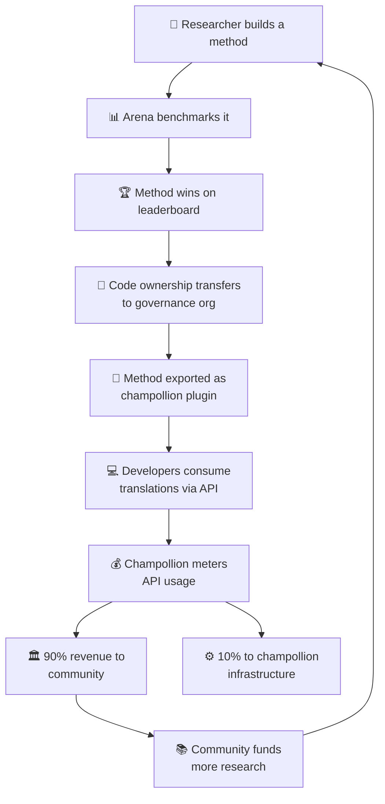

# Het Economisch Model

> **Samenvatting.** Deze pagina beschrijft de economische kringloop die de Arena en champollion met elkaar verbindt: onderzoek produceert methoden, methoden worden ingezet als plugins, API-gebruik genereert inkomsten, en 90% van de inkomsten vloeit terug naar de taalgemeenschap. Behandelt het vliegwielmechanisme, de inkomstenverdeling, de gemakslaag en de duurzaamheidsargumenten voor financiers.

De Arena en champollion vormen een gesloten economische kringloop. Onderzoek op de Arena produceert methoden. Methoden worden ingezet via champollion. Inkomsten uit champollion vloeien terug naar de gemeenschappen wier talen door de methoden worden bediend.

---

## Het Vliegwiel

Elke omwenteling van het vliegwiel versterkt het ecosysteem:
- **Meer onderzoek** produceert betere methoden
- **Betere methoden** trekken meer ontwikkelaars aan
- **Meer ontwikkelaars** genereren meer API-inkomsten
- **Meer inkomsten** financieren meer gemeenschapsgestuurd onderzoek

---

## Hoe Inkomsten Vloeien

Wanneer een ontwikkelaar een methode in gemeenschapseigendom gebruikt via de champollion API:

| Stap | Wat er Gebeurt |
|---|---|
| Ontwikkelaar roept `champollion sync` of de REST API aan | Vertalingen worden geproduceerd door de methode in gemeenschapseigendom |
| Champollion meet het API-verzoek | Gebruik wordt bijgehouden per verzoek, per taalpaar |
| Inkomsten worden verdeeld | **90%** gaat naar de bestuursorganisatie die eigenaar is van de methode. **10%** dekt de infrastructuurkosten van champollion. |
| Gemeenschap beslist over besteding | Inkomsten financieren taalprogramma's, verder onderzoek, gemeenschapsmiddelen — wat de bestuursorganisatie ook besluit |

### De Gemakslaag

Champollion biedt ook geoptimaliseerde configuraties voor gangbare methoden. Als een onderzoeker aantoont dat Gemini 2.5 Pro met specifieke coachingdata en temperatuurinstellingen de beste resultaten oplevert voor een taalpaar, is die configuratie beschikbaar als een vooraf samengestelde preset via de champollion API. Ontwikkelaars hoeven het onderzoek niet te repliceren — zij roepen eenvoudigweg de API aan.

De Arena stelt de basislijnen vast. Champollion maakt ze toegankelijk. Gemeenschappen profiteren van beide.

---

## Voor Standaardtalen

Het vliegwiel heeft de grootste impact voor inheemse talen en talen met beperkte middelen, waar het eigendomsoverdrachtsmodel en het gemeenschapsinkomstenmodel van toepassing zijn.

Voor standaardtalen (Frans, Japans, Spaans, enz.) biedt champollion dezelfde API-gemakken zonder de bestuurslaag — ontwikkelaars betalen voor gemeten toegang tot vooraf geconfigureerde vertaalmethoden, en champollion neemt een infrastructuurvergoeding.

---

## Voor Financiers

Het economisch model geeft antwoord op een veelvoorkomende zorg bij de financiering van taaltechnologie: **duurzaamheid na afloop van de subsidie.**

| Traditioneel Model | Arena-model |
|---|---|
| Subsidie financiert onderzoek | Subsidie financiert onderzoek |
| Artikel gepubliceerd | Methode in productie ingezet |
| Subsidie eindigt, tool verlaten | API-inkomsten ondersteunen de bedrijfsvoering |
| Gemeenschap ontvangt niets | Gemeenschap bezit het activum en verdient inkomsten |

Één succesvolle methode creëert een zelfvoorzienende inkomstenstroom. Financiers kunnen impact meten niet alleen in publicaties, maar ook in:
- API-gebruik (hoeveel ontwikkelaars de methode gebruiken)
- Gegenereerde inkomsten (hoeveel geld naar de gemeenschap vloeit)
- Kwaliteitsmetrieken (leaderboard-scores over tijd)
- Taaldekking (hoeveel taalparen worden bediend)

Zie de [Benchmarkspecificatie](/docs/specifications/benchmark), §10 voor gedetailleerde kostenmodellen.

---

## Zie Ook

- [Eigendomsoverdracht](/docs/sovereignty/ownership-transfer) — het juridische en technische overdrachtsproces
- [Datasouvereiniteit](/docs/sovereignty/data-sovereignty) — OCAP-, CARE- en Te Mana Raraunga-principes
- [Leaderboard-regels](/docs/leaderboard/rules) — hoe methoden in aanmerking komen voor inzet