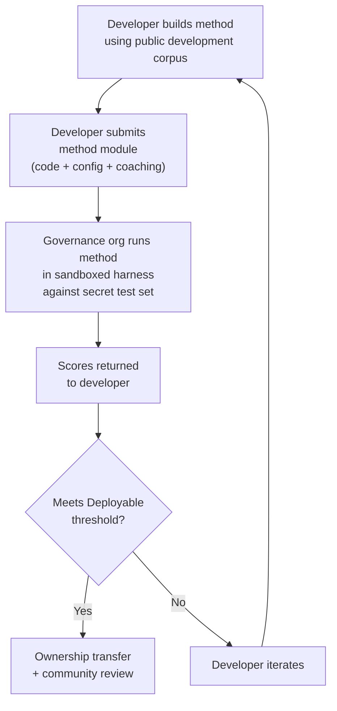

# Benchmarkspecificatie

> **Samenvatting voor leidinggevenden.** Dit document definieert het evaluatieprotocol voor het Champollion MT-evaluatie-ecosysteem: corpusformaat (§2), run card-schema (§3), benchmarkprotocol (§6), vereisten voor menselijke validatie (§7), soevereiniteitsmechanismen (§8), leaderboard- en inzendingsmodel (§9), kostenraamwerk (§10) en uitbreidbaarheid naar nieuwe talen (§11). Voor metriekdefinities, gewichten voor samengestelde scores, drempelwaarden voor kwaliteitsniveaus en formules voor kosten- en snelheidsmetrieken, zie `SCORING_SPEC.md` — de enige bron van waarheid voor alle scoringslogica. Dit document verwijst naar SCORING_SPEC voor die details in plaats van ze te dupliceren.
>
> Laatst bijgewerkt: 2026-06-07

---

## 1. Principes

### 1.1 Geautomatiseerde Metrieken Zijn Benaderingen

Elke metriek die in dit document is gedefinieerd, wordt door een machine berekend. chrF++, FST-acceptatie, morfologische nauwkeurigheid, semantische gelijkenis — het zijn allemaal geautomatiseerde benaderingen van vertaalkwaliteit. Ze zijn nuttig voor snelle iteratie, systematische vergelijking en het detecteren van regressies. Ze zijn **geen vervanging voor menselijk oordeel**.

De evaluatiehiërarchie:

```
Automated metrics (run cards, benchmarks)
    ↓ proxy for
Human review (bilingual speakers validate output)
    ↓ proxy for
Actual utility (does this help a language community?)
```

Geen enkele geautomatiseerde score, hoe hoog ook, kan een vloeiende spreker vervangen die de uitvoer leest en bevestigt dat deze correct, natuurlijk en cultureel passend is. De kwaliteitsniveaus die in §5 zijn gedefinieerd, zijn heuristische labels op geautomatiseerde samengestelde scores — nuttig voor het bijhouden van voortgang, maar nooit op zichzelf voldoende.

### 1.2 Methoden, Niet Modellen

Wij benchmarken **methoden**, niet modellen. Een model is één component. Een methode is het volledige recept: modelselectie, promptontwerp, gebruik van hulpmiddelen, voor- en naverwerking, coachingdata, herhaalpogingsstrategieën, alles. Twee teams die hetzelfde model gebruiken met verschillende methoden zullen verschillende scores behalen. Dat is het punt.

### 1.3 Reproduceerbaarheid

Elk benchmarkresultaat moet reproduceerbaar zijn. De run card (§3) legt de volledige configuratie van een experiment vast. De vingerafdruk (§3.5) identificeert de experimentele opzet. De run card-hash (§3.6) verifieert de integriteit van het resultaat. Iedereen met dezelfde methode, hetzelfde corpus en dezelfde configuratie zou scores moeten behalen binnen ±2% (rekening houdend met niet-determinisme bij LLM-sampling bij temperatuur > 0).

### 1.4 Geen Synthetische Evaluatiedata

**Dit project genereert, gebruikt of onderschrijft geen synthetische evaluatiedata.** Alle corpora moeten afkomstig zijn van authentieke, door mensen geschreven tekst — gepubliceerde vertalingen, leerboeken, tweetalige documenten of vertalingen ontlokt aan vloeiende sprekers.

LLM's mogen helpen bij:
- Zinuitlijning (het vinden van parallelle passages in bestaande tweetalige teksten)
- Formaatconversie (het omzetten van gepubliceerd materiaal naar het corpusschema)
- Metadataverrijking (het voorstellen van moeilijkheidsniveaus, registeraanduidingen)
- Het voorstellen van bronzinnen voor menselijke vertaling (§11.3 — de vertaalstap is altijd menselijk)

LLM's mogen **nooit** referentievertalingen of evaluatieparen genereren.

**Wij zijn ontwikkelingsneutraal ten aanzien van trainingsdata.** Als een methode-ontwikkelaar synthetische trainingsdata, terugvertaling of data-augmentatie in zijn methode gebruikt, is dat zijn keuze — wij evalueren de uitvoer, niet het trainingsproces. Meta's OMT-1600 gebruikt ongeveer 270 miljoen synthetische parallelle zinnen gegenereerd via terugvertaling. Wij hebben geen bezwaar tegen methoden die op deze manier zijn getraind. Wij testen uitsluitend op menselijk gecureerde data.

> **Waarom geen bijbeltekst voor evaluatie?** OMT-1600 evalueert 1.560 van de 1.600 talen op bijbeldomein-tekst. Bijbelvertalingen hebben een archaïsch register, liturgisch vocabulaire en formulaïsche zinsstructuur. Onze evaluatiecorpora zijn afkomstig van gemeenschapsgecureerde, domeindiverse tekst — gezondheid, juridisch, onderwijs, overheid, conversationeel en technische domeinen (zie §2.7). Dit is een bewuste ontwerpkeuze. Gemeenschappen hebben vertaling nodig voor de domeinen waarin zij daadwerkelijk leven en werken, niet voor één enkel religieus register. Een methode die goed scoort op Genesis 1:1 zegt u vrijwel niets over de prestaties op een agenda van een bandraad of een intakeformulier van een kliniek.

---

## 2. Corpusschema

Een corpus is een gecureerde verzameling parallelle tekstparen met gestructureerde metadata. Het is de grondwaarheid waaraan alle methoden worden gemeten.

### 2.1 Dataset-envelop

De structuur op het hoogste niveau van een corpusbestand:

```json
{
  "dataset": {
    "id": "edtekla-dev-v1",
    "version": "1.0",
    "language_pair": "EN→CRK",
    "source_language": "en",
    "target_language": "crk",
    "created": "2026-05-01",
    "license": "CC-BY-NC-SA-4.0",
    "provenance": ["gold_standard", "textbook"]
  },
  "entries": [ ... ]
}
```

| Veld | Type | Vereist | Beschrijving |
|------|------|---------|--------------|
| `id` | string | ✅ | Unieke dataset-identifier, gebruikt in run cards en leaderboard |
| `version` | string | ✅ | Semantische versie. Verhogen maakt eerdere run card-vergelijkingen ongeldig |
| `language_pair` | string | ✅ | Weergavelabel (bijv. `EN→CRK`) |
| `source_language` | string | ✅ | BCP 47-brontalcode |
| `target_language` | string | ✅ | BCP 47-doeltalcode |
| `created` | string | ✅ | ISO 8601-aanmaakdatum |
| `license` | string | ✅ | SPDX-licentie-identifier |
| `provenance` | string[] | ✅ | Lijst van herkomstlabels die in vermeldingen worden gebruikt |

### 2.2 Vermeldingsschema

Elke vermelding in het corpus vertegenwoordigt één vertaaluitdaging:

```json
{
  "id": 42,
  "source": "I see the dog",
  "reference": "niwâpamâw atim",
  "segment": "gold_standard",
  "difficulty": 2,
  "provenance": "gold_standard",
  "register": "conversational",
  "context": "declaration",
  "morphological_analysis": "ni-wâpam-âw atim | 1sg-see.TA-3sg.DIR dog.AN",
  "notes": "Animate noun (atim); direct form because speaker is proximate",
  "variant_class": "simple-ta-direct"
}
```

| Veld | Type | Vereist | Beschrijving |
|------|------|---------|--------------|
| `id` | integer | ✅ | Unieke identifier binnen het corpus |
| `source` | string | ✅ | Brontekst in de brontaal |
| `reference` | string | ✅ | Goudstandaard referentievertaling in de doeltaal |
| `segment` | string | 📎 | Corpuspartitie: `gold_standard`, `held_out`, `development`, of `diagnostic` |
| `difficulty` | integer | 📎 | Moeilijkheidsbeoordeling 1–5 (zie §2.4) |
| `provenance` | string | 📎 | Oorsprong van deze vermelding (zie §2.5) |
| `register` | string | 📎 | Register/formaliteitsniveau (zie §2.6) |
| `context` | string | 📎 | Communicatieve functie (zie §2.6) |
| `domain` | string | 📎 | Gebruiksscenariodomein uit de 16-code-taxonomie (zie §2.7). Moet een van de volgende zijn: `conv`, `ecommerce`, `edu`, `financial`, `gov`, `legal`, `literary`, `marketing`, `medical`, `news`, `religious`, `scientific`, `subtitles`, `support`, `tech`, `ui`. Gevalideerd bij aanmaak. |

> **📎 = AANBEVOLEN.** De harness verwerkt ontbrekende optionele velden op een correcte manier via standaardwaarden. Externe corpora hoeven per vermelding alleen `id`, `source` en `reference` op te geven.
| `morphological_analysis` | string | ❌ | Goudstandaard morfologische uitsplitsing |
| `notes` | string | ❌ | Vertaalaantekeningen, dialectale varianten, dubbelzinnigheidsvlaggen |
| `variant_class` | string | ❌ | Klasselabel dat acceptabele vertaalvarianten groepeert |


### 2.3 Corpussegmenten

Het corpus is verdeeld in segmenten met verschillende toegangsniveaus:

| Segment | Doel | Toegang | Minimale omvang |
|---------|------|---------|----------------|
| `development` | Methode-ontwikkeling en iteratie. Ontwikkelaars gebruiken deze vrij. | **Openbaar** | 30 vermeldingen |
| `diagnostic` | Gerichte tests voor specifieke taalkundige verschijnselen. | **Openbaar** | 10 vermeldingen |
| `gold_standard` | Officiële benchmarkevaluatie. Leaderboard-scores komen hieruit. | **Geheim** — beheerd door de governance-organisatie | 50 vermeldingen |
| `held_out` | Gereserveerd voor toekomstige evaluatie. Nooit gebruikt totdat geactiveerd. | **Geheim** — beheerd door de governance-organisatie | 10 vermeldingen |

> **Huidige staat:** Alleen het `development`-segment bestaat in meegeleverde datasets. De segmenten `diagnostic`, `gold_standard` en `held_out` zijn gedefinieerd voor toekomstig gebruik naarmate corpora groeien.

De segmenten `gold_standard` en `held_out` zijn volledig geheim. Zowel de bronzinnen als de referentievertalingen worden bewaard op door de governance-organisatie beheerde infrastructuur. Methode-ontwikkelaars zien nooit de vragen of de antwoorden. Zie §8 voor het soevereiniteitsmechanisme.

### 2.4 Moeilijkheidsniveaus

| Niveau | Beschrijving | Voorbeelden |
|--------|-------------|-------------|
| 1 — Basiswoordenschat | Losse woorden, veelgebruikte begroetingen, getallen | "hello" → "tânisi", "dog" → "atim" |
| 2 — Eenvoudige zinnen | Onderwerp-werkwoord of SVO, tegenwoordige tijd | "I see the dog" → "niwâpamâw atim" |
| 3 — Matige complexiteit | Verleden/toekomstige tijd, bezittelijke vormen, animaatheid | "I saw his dog yesterday" |
| 4 — Complexe morfologie | Obviatie, passieve stem, conjunctvolgorde, betrekkelijke bijzinnen | "the woman whose son went to the store" |
| 5 — Gevorderd | Meerdere bijzinnen, formeel register, ceremonieel, idiomatisch | Volledig alinea met registerpassende toon |

Een goed samengesteld corpus moet vermeldingen bevatten over alle vijf moeilijkheidsniveaus, met een nadruk op niveaus 2–4 waar de meeste vertaaluitdagingen in de praktijk vallen.

### 2.5 Herkomstlabels

Elke vermelding moet de oorsprong aangeven:

| Label | Betekenis |
|-------|----------|
| `gold_standard` | Geverifieerd door vloeiende sprekers |
| `textbook` | Afkomstig uit gepubliceerd educatief materiaal |
| `elicited` | Geproduceerd via gestructureerde ontlokingssessies |
| `corpus` | Geëxtraheerd uit een parallel corpus |

> **Opmerking:** In de praktijk zijn herkomstwaarden vrije tekstreeksen. De bovenstaande labels zijn conventies, geen gevalideerde enum — datasets mogen andere beschrijvende herkomstreeksen gebruiken.

### 2.6 Register en Context

**Register** beschrijft de formaliteit en sociale context:

| Register | Beschrijving |
|----------|-------------|
| `conversational` | Alledaags taalgebruik tussen gelijken |
| `formal` | Officieel of institutioneel taalgebruik |
| `technical` | Domeinspecifiek vocabulaire |
| `ceremonial` | Traditioneel of sacraal taalgebruik |
| `educational` | Materiaal voor taalonderwijs |

**Context** beschrijft de communicatieve functie:

> 🔲 **Gepland.** Het veld `context` is gedefinieerd in het schema maar nog niet ingevuld in huidige datasets. Het is gereserveerd voor toekomstige corpusverrijking.

| Context | Beschrijving |
|---------|-------------|
| `greeting` | Sociale begroeting of afscheid |
| `declaration` | Feitelijke bewering |
| `question` | Vraagzin |
| `instruction` | Opdracht of aanwijzing |
| `narrative` | Verhalen vertellen of beschrijven |
| `label` | UI-label, knoptekst of koptekst |
| `error` | Foutmelding of waarschuwing |

### 2.7 Domein {#27-domain}

**Domein** beschrijft het praktische gebruiksscenario — het type inhoud dat wordt vertaald. Dit staat los van register en context:

- **Register** beantwoordt: *Hoe formeel is dit?*
- **Context** beantwoordt: *Wat doet deze zin?*
- **Domein** beantwoordt: *Voor welke sector/welk gebruiksscenario is dit?*

Een juridisch contract (domein: `legal`) kan formeel zijn (register: `formal`) en een verklaring bevatten (context: `declaration`). Een transcript van een juridische chatbot (domein: `legal`) kan conversationeel zijn (register: `conversational`) en vragen bevatten (context: `question`). Hetzelfde domein, maar een ander register en een andere context.

| Domeincode | Beschrijving | Typische gebruikers |
|------------|-------------|---------------------|
| `ui` | Tekstreeksen voor software-interfaces | App-ontwikkelaars, lokalisatieteams |
| `legal` | Contracten, statuten, gerechtelijke stukken, immigratiedocumenten | Advocatenkantoren, rechtbanken, complianceteams, IE-advocaten |
| `medical` | Klinische aantekeningen, geneesmiddelenlabels, patiëntcommunicatie, onderzoeksprotocollen | Ziekenhuizen, farmacie, klinische onderzoeken, patiëntportalen |
| `financial` | Bankieren, verzekeringen, regelgevende aangiften, auditverslagen | Banken, verzekeraars, toezichthouders, auditors |
| `edu` | Leerboeken, curricula, lesplannen, academisch materiaal | Scholen, universiteiten, leerboekuitgevers |
| `ecommerce` | Productbeschrijvingen, recensies, marktplaatsaanbiedingen | Online retailers, marktplaatsverkopers |
| `marketing` | Advertentieteksten, merkboodschappen, campagnes, slogans | Reclamebureaus, merkteams |
| `gov` | Beleidsdocumenten, regelgeving, openbare kennisgevingen, wetgeving | Overheidsinstanties, complianceteams |
| `scientific` | Onderzoeksartikelen, samenvattingen, methodologie, subsidieaanvragen | Onderzoekers, tijdschriften, subsidieverstrekkers |
| `religious` | Heilige teksten, liturgische teksten, theologisch commentaar | Geloofsgemeenschappen, liturgische uitgevers |
| `support` | Veelgestelde vragen, foutmeldingen, probleemoplossingsgidsen, chatbotscripts | SaaS-bedrijven, helpdesks |
| `subtitles` | Film-, tv-, streaming- en gamingdialogen | Streamingplatforms, studio's, gamingbedrijven |
| `news` | Journalistiek, persbureauberichten, redactionele inhoud, persberichten | Mediaorganisaties, persbureaus |
| `literary` | Fictie, poëzie, narratief, culturele teksten | Uitgevers, organisaties voor cultureel behoud |
| `conv` | Informele conversatie, sociale media, berichten | Consumenten-apps, sociale platforms |
| `tech` | API-documentatie, handleidingen, technische specificaties, technische gidsen | Documentatieteams, technische organisaties |

> **Domeinspecifieke benchmarks.** De algemene benchmark evalueert een methode over alle domeinen. Maar de Arena ondersteunt ook **domeingefiltreerde benchmarks** — waarbij scores alleen worden berekend op vermeldingen die zijn getagd met een specifiek domein. Hiermee kunnen gebruikers de vraag beantwoorden: "Welke methode is het beste voor het vertalen van juridische documenten naar het Frans?" versus "Welke methode heeft de beste algemene Franse score?"
>
> Domeingefiltreerde leaderboard-rangschikkingen zijn een belangrijk productonderdeel. Verschillende methoden zullen verschillend presteren over domeinen heen — een methode die is verfijnd op juridische terminologie kan juridische benchmarks domineren maar ondermaats presteren op conversationele tekst. De Arena helpt gebruikers de oplossing te vinden die het beste werkt voor hun specifieke gebruiksscenario.

> **Toekomst: Arena Chatbot.** De Arena-website zal een conversationele assistent bevatten die gebruikers helpt hun MT-gebruiksscenario te beschrijven (domein, taalpaar, kwaliteitsvereisten) en de beste door de gemeenschap gevalideerde methode uit het leaderboard aanbeveelt. Bijvoorbeeld: "Ik moet klinische onderzoeksprotocollen vertalen van het Engels naar het Japans — welke methode scoort het hoogst op medische-domein EN→JA-benchmarks?" Dit vereist voldoende domeingelabelde evaluatiedata en methodediversiteit.

---

## 3. Run Card-schema {#3-run-card-schema}

De run card is de atomaire eenheid van evaluatie. Het is een op zichzelf staand JSON-document dat de volledige configuratie en resultaten van één evaluatierun vastlegt: één methode, één model, één configuratie, één dataset.

Elke run card legt drie dimensies vast:
- **Kwaliteit** — hoe goed zijn de vertalingen?
- **Kosten** — hoeveel heeft het gekost om ze te produceren?
- **Snelheid** — hoe lang heeft het geduurd?

### 3.1 Velden op het Hoogste Niveau

| Veld | Type | Beschrijving |
|------|------|-------------|
| `run_id` | string | UUID v4 gegenereerd bij de start van de run |
| `harness_version` | string | Semantische versie van de harness (bijv. `2.0`) |
| `timestamp` | string | ISO 8601 UTC-tijdstempel van het begin van de run |
| `elapsed_seconds` | number | Wandkloktijd van de volledige run |

### 3.2 Methodeconfiguratie

Deze velden definiëren de experimentele opzet — wat er is getest en hoe.

| Veld | Type | Vereist | Beschrijving |
|------|------|---------|-------------|
| `model_slug` | string | ✅ | Model-identifier (bijv. `google/gemini-2.5-flash`) |
| `model_id` | string | ❌ | Opgeloste model-identifier teruggegeven door de API |
| `condition` | string | ✅ | Experimentlabel (bijv. `baseline`, `coached-v3`, `few-shot`) |
| `temperature` | number | ✅ | Samplingtemperatuur |
| `system_prompt_sha256` | string | ✅ | SHA-256-hash van de volledige systeemprompt |
| `system_prompt_used` | string | ✅ | De volledige systeemprompttekst |
| `coaching_data_sha256` | string | ❌ | SHA-256-hash van het coachingdatabestand, indien gebruikt |
| `fst_version` | string | ❌ | Versie van de FST-analysator, indien gebruikt |
| `tools_enabled` | string[] | ❌ | Lijst van hulpmiddelen beschikbaar voor de methode |
| `batch_size` | number | ❌ | Vermeldingen per gelijktijdige API-batch |
| `max_retries` | number | ❌ | Maximale herhaalpogingen bij FST-afwijzing, indien van toepassing |

:::info Gepubliceerde Run Cards bevatten method_config
Wanneer een run card wordt gepubliceerd naar het leaderboard (via `mt-eval publish`), bevat het ook een `method_config`-blok met de canonieke 8-veld MethodConfig (`model`, `temperature`, `batchSize`, `register`, `coachingFile`, `coachingPrompt`, `promptContext`, `qualityTier` — allemaal camelCase). Dit maakt zero-reconstructie-import mogelijk: `champollion leaderboard --install` leest `method_config` direct en schrijft het als een plugin-manifest. De telemetrievelden hierboven (§3.2) registreren wat de harness heeft waargenomen; `method_config` registreert wat de ontwikkelaar bedoelde.
:::

### 3.3 Datasetreferentie

| Veld | Type | Beschrijving |
|------|------|-------------|
| `dataset.id` | string | Dataset-identifier |
| `dataset.version` | string | Datasetversie |
| `dataset.language_pair` | string | Weergavelabel |
| `dataset.sha256` | string | SHA-256-hash van de inhoud van het datasetbestand |
| `dataset.entry_count` | number | Aantal geëvalueerde vermeldingen |

De SHA-256 van de dataset koppelt het resultaat aan een specifieke versie van de data. Als de dataset verandert, zijn oude run cards niet meer vergelijkbaar.

### 3.4 Scores (Kwaliteit)

Geaggregeerde metrieken voor de volledige run. Alle kwaliteitsmetrieken zijn **geautomatiseerd** — zie §1.1.

| Veld | Type | Beschrijving |
|------|------|-------------|
| `scores.total` | number | Totaal aantal geëvalueerde vermeldingen |
| `scores.exact_matches` | number | Vermeldingen waarbij de uitvoer exact overeenkwam met de referentie |
| `scores.exact_match_rate` | number | 0,0–1,0 |
| `scores.equivalent_matches` | number | Vermeldingen die overeenkomen met een acceptabele variant |
| `scores.equivalent_match_rate` | number | 0,0–1,0 |
| `scores.fst_accepted` | number | Vermeldingen geaccepteerd door de FST-analysator |
| `scores.fst_acceptance_rate` | number | 0,0–1,0, `null` als er geen FST is geconfigureerd |
| `scores.morphological_accuracy` | number | 0,0–1,0, `null` als er geen goudstandaard-analyse is |
| `scores.chrf_plus_plus` | number | chrF++-score op corpusniveau (0–100) |
| `scores.semantic_score` | number | Op inbedding gebaseerde semantische gelijkenis (0,0–1,0) |
| `scores.ter` | number | Translation Edit Rate (0–∞, lager is beter) |
| `scores.length_ratio` | number | gem(len(voorspeld)/len(referentie)), ideaal = 1,0 |
| `scores.code_switching_rate` | number | 0,0–1,0, fractie van vermeldingen met brontallekkage |
| `scores.hallucination_rate` | number | 0,0–1,0, fractie van vermeldingen met gehallusineerde inhoud |
| `scores.terminology_adherence` | number | 0,0–1,0, naleving van glossariumtermen (`null` als er geen glossarium is) |
| `scores.tokens_per_second` | number | total_tokens / elapsed_seconds |
| `scores.entries_per_minute` | number | vertaalde vermeldingen per minuut |
| `scores.composite` | number | Gewogen samengestelde score (0,0–1,0). Zie SCORING_SPEC §4 |
| `scores.errors` | number | Vermeldingen die zijn mislukt (API-fout, time-out, enz.) |
| `scores.by_difficulty` | object | Scores uitgesplitst naar moeilijkheidsniveau |
| `scores.by_provenance` | object | Scores uitgesplitst naar herkomstlabel |
| `scores.by_domain` | object | ✅ Geïmplementeerd — Scores uitgesplitst naar domein (§2.7). Maakt domeingefiltreerde leaderboard-rangschikking mogelijk. Berekend door tester.py en doorgegeven via publish.py. |

### 3.5 Totalen (Kosten)

| Veld | Type | Beschrijving |
|------|------|-------------|
| `totals.prompt_tokens` | number | Totaal aantal invoertokens over alle API-aanroepen |
| `totals.completion_tokens` | number | Totaal aantal uitvoertokens |
| `totals.reasoning_tokens` | number | Tokens gebruikt voor chain-of-thought (0 voor de meeste modellen) |
| `totals.cached_tokens` | number | Tokens geserveerd vanuit de promptcache van de provider |
| `totals.total_cost_usd` | number | Totale kosten in USD |
| `totals.cost_per_entry_usd` | number | `total_cost_usd / entry_count` |
| `totals.cost_per_source_char` | number | USD per bronkarakter — vergelijkbaar over talen heen |

### 3.6 Timing (Snelheid)

| Veld | Type | Beschrijving |
|------|------|-------------|
| `elapsed_seconds` | number | Wandkloktijd van de volledige run (hoogste niveau) |
| `scores.avg_latency_seconds` | number | Gemiddelde responstijd per vermelding |
| `scores.median_latency_seconds` | number | Mediane responstijd per vermelding |
| `scores.p95_latency_seconds` | number | 95e percentiel responstijd per vermelding |

### 3.7 Resultaten per Vermelding

Elke vermelding in de `results[]`-array registreert één vertaling. Gegevens per vermelding worden opgeslagen in de `run_card_entries`-tabel (migratie 005) met gedenormaliseerde LYSS-uitspraken (migratie 006).

| Veld | Type | Beschrijving |
|------|------|-------------|
| `entry_id` | string | Komt overeen met `entries[].id` in het corpus |
| `source` | string | Brontekst die is vertaald |
| `expected` | string | Goudstandaard referentievertaling |
| `raw_predicted` | string \| null | Ruwe modeluitvoer vóór naverwerking |
| `predicted` | string | Werkelijke uitvoer van de methode (naverwerkt) |
| `segment` | string | Segment-identifier (bijv. zinsindex) |
| `difficulty` | string \| null | Moeilijkheidsniveau uit het corpus |
| `domain` | string | Domeinlabel uit het corpus (§2.7) |
| `exact_match` | boolean | Of de uitvoer exact overeenkwam met de referentie |
| `chrf_score` | number \| null | chrF++ op zinsniveau (0–100) |
| `bleu_score` | number \| null | BLEU op zinsniveau (0–100) |
| `latency_s` | number \| null | Responstijd in seconden |
| `cost_usd` | number \| null | Kosten in USD voor deze vermelding |
| `tool_call_count` | integer | Aantal gebruikte hulpmiddelaanroepen (0 als geen) |
| `error` | string \| null | Foutmelding als deze vermelding is mislukt |
| `plugin_metrics` | object | Volledige plugin-uitvoer per vermelding (JSONB) |
| `fst_valid` | boolean \| null | GiellaLT FST heeft de voorspelling geaccepteerd (gedenormaliseerde LYSS-fst) |
| `equivalent_match` | boolean \| null | CRK-linter heeft structurele equivalentie bevestigd (gedenormaliseerde LYSS-eq) |
| `semantic_verdict` | string \| null | LYSS-sem-uitspraak: `VALID`, `MISMATCH`, `UNKNOWN`, `ERROR` |
| `code_switching_detected` | boolean \| null | Brontalige tokens gedetecteerd in uitvoer |
| `hallucination_detected` | boolean \| null | Gefabriceerde inhoud gedetecteerd in uitvoer |


### 3.8 Vingerafdruk

Een reproduceerbaarheidsidentificator. Twee runs met identieke vingerafdrukken hebben dezelfde experimentele opzet gebruikt.

De vingerafdruk is de SHA-256-hash van de gesorteerde aaneenschakeling van:
- `dataset.sha256`
- `model_slug`
- `condition`
- `system_prompt_sha256`
- `temperature`
- `harness_version`
- `batch_size`
- `tools_enabled`

> **Waarom 8 componenten?** Batchgrootte en het aanroepen van hulpmiddelen beïnvloeden de uitvoerkwaliteit wezenlijk en moeten worden opgenomen in de identiteit. Twee runs met verschillende batchgroottes of verschillende ingeschakelde hulpmiddelen zijn verschillende experimentele opzetten, zelfs als alle andere parameters overeenkomen.

Twee runs met identieke vingerafdrukken zouden vergelijkbare resultaten moeten opleveren. Verschillen zijn te wijten aan API-niet-determinisme (temperatuur > 0) of modelupdates aan de providerzijde.

### 3.9 Run Card-hash

De SHA-256-hash van de volledige run card JSON (waarbij het veld `run_card_hash` zelf is ingesteld op `""` tijdens het hashen). Dit is het manipulatiedetectiemerk. Als een veld verandert, wordt de hash ongeldig.

---

## 4. Geautomatiseerde Metrieken

Alle metrieken in dit gedeelte worden door een machine berekend. Zie §1.1.

### 4.1 Metriekdefinities

| Metriek | Status | Wat het meet | Bereik |
|---------|--------|-------------|--------|
| **chrF++** | ✅ Geïmplementeerd | Karakter-n-gram F-score. Werkt op karakterniveau, waardoor het robuuster is dan metrieken op woordniveau (BLEU) voor morfologisch rijke talen waar woorden lang en sterk verbogen zijn. Berekend door sacrebleu. | 0–100 (native schaal). Gedeeld door 100 bij gebruik in samengestelde score. |
| **FST-acceptatiegraad** | ✅ Geïmplementeerd | Fractie van voorspelde woorden die door de morfologische analysator (GiellaLT HFST) worden geaccepteerd als geldige vormen in de doeltaal. Een woord dat de FST accepteert is een echt, structureel geldig woord — geen hallucinatie. | 0,0–1,0 |
| **Exacte overeenkomst** | ✅ Geïmplementeerd | Fractie van voorspellingen die na Unicode-normalisatie exact overeenkomen met de referentie. Strikt maar ondubbelzinnig — nuttig als plafondcontrole. | 0,0–1,0 |
| **Morfologische nauwkeurigheid** | 🔲 Gepland | Voor vermeldingen met goudstandaard morfologische analyse: fractie van correct gegenereerde morfemen. Gedetailleerder dan FST-acceptatie — een woord kan FST-geldig zijn maar de verkeerde morfemstructuur hebben (juiste stam, verkeerde tijd). | 0,0–1,0 |
| **Equivalente overeenkomst** | ⚡ Gedeeltelijk | Fractie die overeenkomt met een acceptabele variant van de referentie — rekening houdend met woordvolgorde, dialectale verschillen en orthografische conventies. Momenteel geïmplementeerd voor CRK via de CRK-evalstandaard `CrkLinterMetric` (in `eval_standards/crk/`); automatisch geladen via de `evalMetrics`-declaratie van de CRK-taalkaart. Generieke implementatie vereist `variants[]` per vermelding in het corpus. | 0,0–1,0 |
| **Semantische score** | ⚡ Gedeeltelijk | Betekenisbehoud ongeacht oppervlaktevorm. Momenteel geïmplementeerd voor CRK via de CRK-evalstandaard `CrkSemanticMetric` (in `eval_standards/crk/`, uitspraakgewogen proxy). Universele op inbedding gebaseerde cosinusgelijkenis is gepland — zie SCORING_SPEC §2.3. | 0,0–1,0 |

### 4.2 Samengestelde Score

De samengestelde score is een gewogen gemiddelde van alle *beschikbare* metrieken:

```
composite = Σ (weight_i × metric_i)   for all available metrics
             ─────────────────────
             Σ weight_i              (renormalized to sum to 1.0)
```

Wanneer een metriek niet beschikbaar is (geen FST geconfigureerd, geen variantklassen gedefinieerd, geen inbeddingsmodel), wordt het gewicht proportioneel herverdeeld over de resterende metrieken. Dit betekent dat de samengestelde score altijd vergelijkbaar is binnen een taal — het gebruikt welke metrieken dan ook beschikbaar zijn voor die taal en normaliseert dienovereenkomstig.

**Gewichtstabellen, invoernormalisatieregels en de volledige metriekinventaris zijn gedefinieerd in `SCORING_SPEC.md` §4.** Dat document is de SSOT voor:
- Profiel A-gewichten (talen met FST-dekking — 9 metrieken, structurele metrieken dragen 40%)
- Profiel B-gewichten (talen zonder FST-dekking — 8 metrieken)
- Normalisatieregels (chrF++ ÷ 100, inversie van codewisselings- en hallucinatiegraad)
- Metrieken uitgesloten van de samengestelde score (BLEU, COMET, TER, lengteratio, consistentie) en waarom

De harness-code weerspiegelt deze tabellen in `mt_eval_harness/scoring.py`. Wanneer SCORING_SPEC verandert, wordt `scoring.py` bijgewerkt om overeen te komen en valideert `test_scoring_ssot.py` de afstemming.

> **Waarom niet BLEU?** BLEU werkt op woordniveau en bestraft morfologische variatie. Voor polysynthetische talen kan één enkel woord een volledige bijzin zijn — BLEU zou kleine verbuigingsverschillen behandelen als volledige missers. chrF++ verwerkt dit beter door op karakterniveau te werken. BLEU is uitgesloten van beide gewichtstabellen. Zie SCORING_SPEC Bijlage A voor de volledige redenering.


### 4.3 Kostengecorrigeerde Score

Voor methoden die gebruikmaken van betaalde API's rapporteren wij ook een secundaire rangschikking. De kostengecorrigeerde formule is gedefinieerd in `SCORING_SPEC.md` §6.3.

---

## 5. Kwaliteitsniveaus {#5-quality-tiers}

Kwaliteitsniveaus zijn heuristische labels op geautomatiseerde samengestelde scores. Ze beschrijven wat de scores in de praktijk doorgaans betekenen, op basis van menselijke beoordeling van uitvoer op elk niveau. **Het zijn geen gevalideerde kwaliteitsoordelen** — alleen menselijke beoordeling (§6) kan werkelijke bruikbaarheid bevestigen.

**De niveaudrempelwaarden en beschrijvingen zijn gedefinieerd in `SCORING_SPEC.md` §5.** De niveaus zijn: Baseline (0,00–0,30), Emerging (0,30–0,50), Functional (0,50–0,70), Deployable (0,70–0,85) en Fluent (0,85–1,00).

> [!IMPORTANT]
> **Geautomatiseerde niveaus zijn voorlopig.** Deze labels zijn nominaties voor beoordeling, geen kwaliteitsverklaringen. Een methode die "Deployable" bereikt op geautomatiseerde metrieken is een kandidaat voor gemeenschapsevaluatie — niet een product om te verzenden. Alleen menselijke beoordeling (§7) kan werkelijke bruikbaarheid bevestigen. Niveaugrenzen kunnen per taal verschillen.

Deze niveaus zijn voorlopig. Ze zullen worden geijkt naarmate er meer menselijke validatiedata beschikbaar komt en we leren waar de werkelijke drempel "een spreker vindt dit nuttig" ligt voor elke taal. De niveaugrenzen kunnen per taal verschillen.

Geen enkele methode kan aanspraak maken op **Deployable** of hoger zonder gemeenschapsbeoordeling die bevestigt dat tweetalige sprekers het oordeel zijn toegedaan dat de uitvoer bruikbaar is.

---

## 6. Benchmarkprotocol

Een **benchmark** is de systematische productie van run cards over een gedeclareerde parameterruimte op een gegeven dataset. Het is geen enkele run — het is een gestructureerde verkenning van hoe verschillende configuraties presteren.

### 6.1 Wat een Benchmark Oplevert

Een benchmark produceert een **matrix van run cards** — één voor elke combinatie van parameterwaarden. De matrix maakt veelzijdige vergelijking mogelijk over:

- **Kwaliteit** — samengestelde score, uitsplitsingen van individuele metrieken
- **Kosten** — totale en per-vermelding-kosten voor elke configuratie
- **Snelheid** — wandkloktijd en latentie per vermelding

Er is geen enkele "benchmarkscore." De benchmark is de volledige matrix. Verschillende belanghebbenden zullen zich bekommeren om verschillende facetten: een onderzoeker optimaliseert voor samengestelde score, een deployment-engineer optimaliseert voor kosten per vermelding, een gemeenschap beoordeelt kwaliteit.

### 6.2 Parameterruimte

Een benchmark declareert welke parameters worden gepermuteerd:

| As | Typische waarden | Doel |
|----|-----------------|------|
| `model` | 4–12 modellen (frontier + middenniveau + budget) | Hoe belangrijk is modelcapaciteit? |
| `temperature` | 0,0, 0,3, 0,7 | Helpt of schaadt samplingrandomheid? |
| `prompt_version` | 2–3 promptstrategieën | Hoe gevoelig is de methode voor promptontwerp? |
| `coaching_config` | met/zonder coachingdata | Verbetert het injecteren van taalkundige kennis de uitvoer? |
| `tool_config` | met/zonder FST, met/zonder woordenboek | Verbeteren taalkundige hulpmiddelen de uitvoer? |

De volledige permutatiruimte:
```
runs = |models| × |temperatures| × |prompts| × |coaching| × |tools|
```

Een typische initiële benchmark: 12 modellen × 3 temperaturen × 2 prompts × 2 coaching = 144 runs.

### 6.3 Baseline versus Methode-evaluatie

Een benchmark dient twee afzonderlijke doelen:

**Baselining** — het in kaart brengen van het landschap met naïeve benaderingen. "Wat kunnen bestaande modellen voor deze taal zonder taalspecifieke engineering?" Dit stelt de lat. De baselinematrix vertelt u: welke modellen het minst hallucineren, welke temperaturen de meest consistente uitvoer produceren, of coachingdata überhaupt helpt, waar alle modellen uniform falen (wat harde taalkundige problemen onthult).

**Methode-evaluatie** — het testen van een specifieke ontworpen methode. "Verslaat mijn FST-gated coached pipeline de baselines?" De run card van de methode wordt vergeleken met de baselinematrix. Een methode is interessant wanneer ze de beste baseline overtreft — wanneer engineering waarde toevoegt boven naïeve modelaanroepen.

Beide activiteiten produceren run cards met hetzelfde schema. Het onderscheid zit in de intentie en de parameterruimte: baselines permuteerden over modellen en configuraties; methode-evaluatie test één methode tegen de beste configuraties.

### 6.4 Ontwikkeling versus Goudstandaard-evaluatie

Methode-ontwikkelaars itereren vrij tegen de corpussegmenten `development` en `diagnostic`. Dit is informeel — geen limieten, geen inzendingen, geen betrokkenheid van de governance-organisatie. De ontwikkelaar leert wat werkt.

Officiële leaderboard-scores komen uitsluitend van `gold_standard`-evaluatie. Dit is formeel:
1. Ontwikkelaar dient zijn volledige, uitvoerbare methode in (code + configuratie + coachingdata)
2. Governance-organisatie voert het uit in een sandbox-harness tegen de geheime testset
3. Alleen scores worden teruggegeven

Zie §8 voor het volledige soevereiniteitsmechanisme.

---

## 7. Menselijke Validatie {#7-human-validation}

Geautomatiseerde metrieken zijn benaderingen. Menselijke validatie is de grondwaarheid.

### 7.1 Wat Menselijke Beoordeling Opvangt Dat Metrieken Missen

- **Morfologisch geldig maar semantisch onjuist** — de FST accepteert het woord, chrF++ is hoog, maar de vertaling betekent iets anders
- **Cultureel ongepast** — de vertaling is technisch correct maar gebruikt register of framing die een gemeenschap zou afwijzen
- **Gehallusineerde plausibiliteit** — de uitvoer lijkt op de doeltaal voor een niet-spreker maar is onzin voor een vloeiende spreker
- **Acceptabele maar niet-gemarkeerde variatie** — de uitvoer is correct maar de geautomatiseerde metrieken markeren het als onjuist omdat het een dialectale variant gebruikt die niet in de referentie staat

### 7.2 De Validatiepoort

Geen enkele methode kan van het niveau **Functional** naar **Deployable** vorderen zonder menselijke validatie die bevestigt dat tweetalige sprekers het oordeel zijn toegedaan dat de uitvoer bruikbaar is. Dit is geen formaliteit — dit is het punt. De geautomatiseerde metrieken bestaan om het volume uitvoer te verminderen dat menselijke beoordeling vereist. Ze kunnen het niet vervangen.

### 7.3 Gemeenschapsbeoordelingsprotocol

> 🔲 **Gepland**: De gemeenschapsbeoordelingsinterface is nog niet live. Dit gedeelte beschrijft het beoogde proces.

1. Een methode bereikt de Deployable-drempel op geautomatiseerde metrieken
2. Een steekproef van uitvoer (gestratificeerd naar moeilijkheidsniveau) wordt gepresenteerd aan tweetalige sprekers
3. Sprekers beoordelen elke vertaling op een schaal: **afwijzen**, **gist** (betekenis is duidelijk maar formulering is onjuist), **acceptabel** (correct met kleine problemen), **uitstekend** (niet te onderscheiden van menselijke vertaling)
4. De governance-organisatie beoordeelt de geaggregeerde beoordelingen
5. Als de gemeenschap de methode accepteert, gaat deze over naar eigendomsoverdracht en inzet

---

## 8. Soevereiniteit

Evaluatiedatasets bevatten gecureerde taalkundige kennis die toebehoort aan de taalgemeenschap. Dit gedeelte definieert het technische en juridische kader voor de bescherming van die data.

### 8.1 Het Probleem

Conventionele benchmarks publiceren testsets openlijk. Eenmaal gepubliceerd kan de data niet worden teruggetrokken. Voor inheemse en minderheidstaalgemeenschappen creëert dit een extractieve dynamiek — taalkundige data wordt gebruikt zonder voortdurende toestemming. In navolging van Dheins pragmatische visie op biodatasoevereiniteit behandelen wij taalkundige data als een "kwikzilverachtige hulpbron met onkenbaar potentieel" die dynamisch, relationeel bestuur vereist.

### 8.2 Sandbox-uitvoering

Het primaire handhavingsmechanisme: de ontwikkelaar draagt zijn methodemodule over, de governance-organisatie voert het uit tegen de volledig geheime testset op hun eigen infrastructuur, en alleen scores worden teruggegeven. De ontwikkelaar ziet nooit de bronzinnen of de referentievertalingen.



De stroom:
1. **Ontwikkelingscorpus is openbaar.** Geen beperkingen op de segmenten `development` en `diagnostic`.
2. **Goudstandaard-testset is volledig geheim.** Zowel bronzinnen als referentievertalingen bevinden zich op door de governance-organisatie beheerde infrastructuur.
3. **Om een officiële score te krijgen, draagt u uw methode over.** De governance-organisatie voert het uit in een sandbox. Alleen scores worden teruggegeven.
4. **De governance-organisatie heeft de methode al.** De inzending IS de methodecode. Als het de Deployable-drempel bereikt, is eigendomsoverdracht al in gang.
5. **Inzending vereist instemming met de voorwaarden.** Inclusief de eigendomsoverdrachtclausule (§8.3).
6. **De governance-organisatie beheert de toegang volledig.** Ze kunnen evaluatie op elk moment weigeren of intrekken. Dynamische toestemming.
7. **Versleuteling in rust is verdediging in de diepte.** Primaire handhaving is architecturaal.

### 8.3 Eigendomsoverdracht

Methoden die een samengestelde score behalen op of boven de Deployable-drempel (0,70) bij goudstandaard-evaluatie, **en** die menselijke validatie doorstaan (§7), zijn onderworpen aan eigendomsoverdracht.

**De ontwikkelaar behoudt:**
- Naamsvermelding en erkenning (naam blijft op het leaderboard)
- Recht om over de methode te publiceren
- Recht om de methode te gebruiken voor andere taalparen

**De governance-organisatie verkrijgt:**
- Recht om de methode te gebruiken, te wijzigen, te distribueren en te monetariseren voor hun taal
- Recht om in sublicentie te geven
- Fysiek bezit van de methodecode (al in bezit van de evaluatie-inzending)

### 8.4 Vereisten voor de Governance-organisatie

Om als sleutelbeheerder voor een taalbenchmark te dienen:

1. **De taalgemeenschap vertegenwoordigen** — aantoonbare relatie met sprekers en culturele autoriteiten
2. **Capaciteit voor sleutelbeheer** — technisch vermogen om cryptografische sleutels te beheren
3. **Toezegging tot beschikbaarheid van evaluatie** — de benchmark moet evalueerbaar blijven
4. **Deelnamevoorwaarden publiceren** — duidelijke documentatie van waarmee ontwikkelaars instemmen
5. **Opereren onder erkende soevereiniteitsprincipes** — OCAP®, CARE of equivalent

### 8.5 Afstemming op OCAP® en CARE

| Principe | Implementatie |
|----------|--------------|
| **Eigendom** (OCAP) | Taalkundige data behoort toe aan de gemeenschap. Governance-organisatie beheert de evaluatie-infrastructuur. |
| **Controle** (OCAP) | Governance-organisatie beheert evaluatie via sandbox-uitvoering. Zij beslissen wie inzendt en onder welke voorwaarden. |
| **Toegang** (OCAP) | Gemeenschap heeft onbeperkte toegang tot hun eigen data, resultaten en methoden die daartegen zijn ontwikkeld. |
| **Bezit** (OCAP) | Testset verlaat de governance-infrastructuur nooit. Versleuteling in rust als back-up. |
| **Collectief voordeel** (CARE) | Eigendomsoverdracht zorgt ervoor dat methoden de gemeenschap ten goede komen. Inkomstenmodel (10% doorberekeningmarge; gemeenschap behoudt ~90%) ondersteunt dit. |
| **Bevoegdheid tot controle** (CARE) | Sandbox-uitvoering is de technische implementatie. |
| **Verantwoordelijkheid** (CARE) | Ontwikkelaars aanvaarden verantwoordelijkheid via deelnamevoorwaarden. |
| **Ethiek** (CARE) | Gemeenschapsrechten boven het gemak van onderzoekers. |

### 8.6 Afhankelijkheidsklassen en het Sandbox-netwerkbeleid

Sandbox-uitvoering (§8.2) en eigendomsoverdracht (§8.3) zijn beide afhankelijk van het precies weten wat een methode nodig heeft tijdens uitvoering. De [Methode-interfacespecificatie](/docs/specifications/methods#method-validity-and-dependency-classes) definieert vijf **afhankelijkheidsklassen** — S (op zichzelf staand), O (open extern), A1 (vervangbare LLM-inferentie), A2 (niet-vervangbare externe API), X (gesloten) — en het afhankelijkheidsmanifest dat elke methode moet declareren. Dit gedeelte legt vast hoe het sandbox-netwerkbeleid deze afdwingt.

**Standaard-weigering van uitgaand verkeer.** De sandboxspecificatie vereist dat methodecontainers standaard geen netwerktoegang hebben. Dit is geen firewallregel — de specificatie verwijdert het netwerk uit de uitvoeringsomgeving, zodat een niet-gedeclareerde netwerkafhankelijkheid faalt op de architectuurlaag, niet de beleidslaag. Klasse S- en O-methoden draaien volledig vanuit artefacten die in de inzending zijn opgenomen (klasse O-artefacten worden vastgezet en gespiegeld bij inzending).

**De LLM-gateway (🔲 gepland).** De meeste methoden roepen LLM's aan, dus de sandboxspecificatie definieert precies één uitzondering voor uitgaand verkeer: een **LLM-gateway** beheerd door de evaluatie-infrastructuur. De gateway:

- proxyt inferentieverzoeken naar een **expliciete allowlist van vastgezette modellen** — de model-identifiers vastgelegd in het manifest en de run card van de methode;
- **logt elk verzoek en elke respons** in het verzegelde auditlogboek, zodat gatewayverkeer kan worden beoordeeld op pogingen tot data-exfiltratie voordat scores worden vrijgegeven;
- is het *enige* netwerkpad — er is geen algemeen uitgaand verkeer, geen DNS, geen andere eindpunten.

Dit is wat klasse A1-methoden evalueerbaar maakt zonder de verifieerbaarheidsgaranties van §8.2 op te geven — maar het is een echte afweging, en de specificatie benoemt dit duidelijk: het vertalen van een geheime bronzin via een extern model **onthult die bronzin aan de modelprovider**. Referentievertalingen verlaten het systeem nooit (ze worden bewaard door de harness, buiten de container; zie §8.2), en de methode zelf kan niets exfiltreren buiten wat de gelogde, op de allowlist staande inferentieaanroepen bevatten. Of die begrensde openbaarmaking acceptabel is voor een gegeven corpus is een beslissing van de beheerder: het autoriseren van een klasse A1-evaluatie betekent het bewust autoriseren ervan, per run, zoals elk ander gebruik van de data.

**Status.** De sandbox en zijn gateway zijn gespecificeerd maar nog niet gebouwd. Totdat de gateway operationeel is, kunnen alleen klasse S- en O-methoden goudstandaard-scores produceren; klasse A1-methoden blijven in principe in aanmerking komen voor prijzen (zie [Prijsspecificatie §1.6](/docs/specifications/prizes)) maar kunnen nog niet worden geëvalueerd tegen geheime segmenten. Klasse A2-afhankelijkheden kunnen de sandbox helemaal niet betreden totdat de rechthebbende toestemming verleent — het artefact moet mogen *bestaan* in de sandbox voordat er een netwerkvraag aan de orde is.

---

## 9. Leaderboard & Inzending

### 9.1 Inzendingsvereisten

Een geldige leaderboard-inzending moet bevatten:

1. Een volledige run card (§3) met alle vereiste velden
2. De methodecode — volledig uitvoerbaar, met installatie-instructies
3. Alle afhankelijkheden — coachingdata, woordenboeken, FST-binaries, prompts
4. Een kostenrapport
5. Een README die de aanpak en beperkingen van de methode beschrijft

### 9.2 Legitimiteitscriteria

1. **Geen training op evaluatiedata.** Methoden mogen niet zijn blootgesteld aan `gold_standard`- of `held_out`-vermeldingen. (Architecturaal afgedwongen — u kunt niet trainen op data die u nooit heeft gezien.)
2. **Gebruik van ontwikkelingsdata declareren.** Het gebruik van `development`-vermeldingen voor few-shot-prompting is toegestaan maar moet worden gedeclareerd.
3. **Reproduceerbaarheid.** Governance-organisatie moet opnieuw kunnen uitvoeren en scores binnen ±2% behalen.
4. **Generalisatie.** Methoden moeten werken op ongeziene vermeldingen, niet alleen op gememoriseerde voorbeelden.

### 9.3 Anti-gaming

1. **Variantklasse-linting** — verdacht perfecte prestaties op vermeldingen met bekende varianten worden gemarkeerd
2. **Corpusrotatie** — governance-organisatie kan vermeldingen zonder kennisgeving tussen segmenten roteren
3. **Gemeenschapsbeoordeling** — de menselijke validatiepoort (§7) vangt methoden op die metrieken manipuleren maar slechte uitvoer produceren

### 9.4 Verificatieniveaus

Verificatieniveaus beschrijven **wie het resultaat heeft gevalideerd** — orthogonaal aan kwaliteitsniveaus (§5), die beschrijven wat de geautomatiseerde score betekent.

| Niveau | Betekenis | Hoe bereikt |
|--------|----------|------------|
| **Zelf-gebenchmarkt** | Ontwikkelaar heeft de harness uitgevoerd en de run card ingediend | PR of `--submit`-vlag tegen het `development`-segment |
| **GDS Geverifieerd** | Beheerders hebben het resultaat onafhankelijk gereproduceerd | Methode indienen als installeerbare plugin; beheerders voeren opnieuw uit |
| **Gemeenschap Gevalideerd** | Governance-organisatie heeft uitgevoerd tegen `gold_standard` + gemeenschapsbeoordeling | Methodecode indienen bij governance-organisatie (§8.2); menselijke validatie doorstaan (§7) |

Een methode kan Zelf-gebenchmarkt zijn op een Functional kwaliteitsniveau. Kwaliteitsniveau en verificatieniveau zijn onafhankelijke assen op het leaderboard.

### 9.5 Gelaagd Inzendingsmodel

Het inzendingsmechanisme is afhankelijk van het corpussegment waartegen u evalueert:

| Segment | Inzendingspad | Verificatie | Methodecode vereist? |
|---------|--------------|------------|---------------------|
| `development` | Zelfbediening: harness uitvoeren, run card indienen via PR of API | Zelf-gebenchmarkt | Nee — u behoudt uw code |
| `development` | Beheerder voert opnieuw uit: methode indienen als plugin | GDS Geverifieerd | Ja — methode moet installeerbaar zijn |
| `gold_standard` | Methode indienen bij governance-organisatie; zij voeren uit in sandbox | Gemeenschap Gevalideerd | Ja — methode wordt ingediend en bewaard |

Het zelfbedieningspad (ontwikkelingssegment) heeft geen beperkingen. Het soevereine pad (goudstandaard-segment) vereist volledige methode-inzending omdat (a) de ontwikkelaar de testset nooit ziet, en (b) methoden die Deployable bereiken onderworpen zijn aan eigendomsoverdracht (§8.3).

### 9.6 Methodeklassen

Methoden worden geclassificeerd naar type. De canonieke enum is gedefinieerd in de harness-codebase (`VALID_METHOD_CLASSES` in `config.py`):

| Klasse | Beschrijving |
|--------|-------------|
| `raw-llm` | Directe LLM-aanroep zonder taalspecifieke engineering |
| `coached-llm` | LLM met coachingdata (voorbeelden, grammaticanotities, woordenboekitems) |
| `pipeline` | Meerstaps-pipeline (bijv. vertalen → FST valideren → opnieuw proberen) |
| `custom-plugin` | Aangepaste `TranslationMethod`-plugin |
| `api` | Externe vertaal-API (Google Translate, DeepL, enz.) |
| `human` | Menselijke vertaler als baseline |

### 9.7 Leaderboard-velden

| Veld | Beschrijving |
|------|-------------|
| Rang | Positie op basis van samengestelde score |
| Methodenaam | Door de ontwikkelaar gekozen identifier |
| Samengestelde score | Gewogen gemiddelde van beschikbare metrieken (§4.2) |
| chrF++ | Karakter-n-gram-score (0–100) |
| FST-acceptatie | Morfologische geldigheidsgraad (0,0–1,0) |
| Exacte overeenkomst | Strikte overeenkomstgraad (0,0–1,0) |
| Semantische score | Betekenisbehoud (0,0–1,0) — 🔲 indien beschikbaar |
| Kosten per vermelding | USD per corpusvermelding |
| Snelheid | Gemiddelde latentie per vermelding (seconden) |
| Kostengecorrigeerde score | Secundaire rangschikking (§4.3) |
| Methodeklasse | Uit de enum in §9.6 |
| Model | Gebruikte LLM/engine |
| Kwaliteitsniveau | Geautomatiseerd samengesteld bereik (§5) |
| Verificatieniveau | Wie heeft gevalideerd (§9.4) |
| Datum | Wanneer geëvalueerd |

> [!NOTE]
> **Alle scores weergegeven op het leaderboard zijn geautomatiseerde proxymeetwaarden.** Ze geven de relatieve methodeprestaties aan onder gecontroleerde omstandigheden maar vormen geen kwaliteitsgaranties. Door de gemeenschap gevalideerde methoden worden afzonderlijk gemarkeerd via de kolom Verificatieniveau. Voor methodologische details, zie [SCORING_SPEC.md](/docs/specifications/scoring).

---

## 10. Kostenraamwerk {#10-cost-framework}

### 10.1 Kosten per Run

```
run_cost = entries × api_calls_per_entry × cost_per_api_call
```

Typische kosten per run voor een corpus van 150 vermeldingen:

| Methode | Model | Geschatte kosten |
|---------|-------|----------------|
| Naïeve LLM | Gemini 2.5 Flash | $0,15–0,30 |
| Coached LLM | Gemini 2.5 Flash | $0,30–0,60 |
| FST-gated (3 herhaalpogingen) | Gemini 2.5 Flash | $0,45–1,20 |
| Naïeve LLM | Claude Sonnet 4 | $0,45–0,90 |
| Coached LLM | GPT-4.1 | $0,60–1,50 |

### 10.2 Benchmarkkosten (Sweep)

```
sweep_cost = Σ run_cost(i)   for each parameter combination i
```

Typische sweep: 12 modellen × 3 temperaturen × 2 prompts × 2 coaching = 144 runs bij gemiddeld ~$0,50 = **~$72 per sweep**.

### 10.3 Oprichting per Taal

| Component | Kostenbereik | Opmerkingen |
|-----------|-------------|-------------|
| Sprekervergoeding (corpus) | $2.500–6.000 | 50–150 vermeldingen à $50–65/uur |
| Sprekervergoeding (beoordeling) | $500–1.500 | Beoordeling van methode-uitvoer |
| Rekenkracht (benchmarksweeps) | $100–500 | Meerdere sweeps tijdens ontwikkeling |
| Rekenkracht (doorlopend leaderboard) | $50–200/jaar | Uitvoeren van ingediende methoden |
| Infrastructuur (sandbox) | $200–500/jaar | Evaluatie-infrastructuur van governance-organisatie |
| **Totale oprichting** | **$3.350–8.500** | |

### 10.4 Programmaschaal

| Schaal | Jaarlijkse kosten | Opmerkingen |
|--------|-----------------|-------------|
| 1 taal (onderhoud) | $1.000–3.000 | Na oprichting |
| 5 talen (oprichting + onderhoud) | $25.000–65.000 | Eerste jaar |
| 10 talen (stabiele toestand) | $15.000–40.000 | Per jaar na oprichting |

---

## 11. Uitbreiden naar Nieuwe Talen {#11-extending-to-new-languages}

### 11.1 Minimumvereisten

1. **50+ vermeldingen** in het `gold_standard`-segment
2. **30+ vermeldingen** in het `development`-segment
3. **10+ vermeldingen** in het `diagnostic`-segment gericht op specifieke taalkundige verschijnselen
4. **Herkomst** voor elke vermelding
5. **Moeilijkheidsverdeling** — ten minste 3 van de 5 niveaus
6. **Registerverdeling** — ten minste 2 registers
7. **Gemeenschapstoestemming** — gedocumenteerde instemming van de taalgemeenschap

### 11.2 Optioneel maar Waardevol

- **FST-morfologische analysator** — maakt de krachtigste metriek mogelijk voor polysynthetische talen
- **Tweetalig woordenboek** — maakt op woordenboek gebaseerde methoden mogelijk, vermindert hallucinatie
- **Goudstandaard morfologische analyse** — maakt de metriek voor morfologische nauwkeurigheid mogelijk
- **Variantklassen** — maakt de metriek voor equivalente overeenkomst en anti-gaming-linting mogelijk
- **Governance-organisatie** — maakt cryptografische soevereiniteit en eigendomsoverdracht mogelijk

### 11.3 Het Agent-ondersteunde Pad

> 🔲 **Gepland**: Agent-ondersteunde corpuscreatie is een toekomstige mogelijkheid.

Voor talen zonder uitgebreide bestaande bronnen:

1. Een agent genereert kandidaat-bronzinnen over moeilijkheidsniveaus en registers heen
2. Een tweetalige spreker vertaalt ze (deze stap is altijd menselijk)
3. De agent stelt morfologische analyse voor (gevalideerd door FST indien beschikbaar, anders door de spreker)
4. De agent formatteert alles in het corpusschema
5. Een taalkundige of spreker beoordeelt het definitieve corpus

Dit vermindert de spreektijd van ~80 uur tot ~30–40 uur per taal.

---

*Deze specificatie is een levend document. Naarmate wij benchmarks voor meer talen opzetten, zullen wij leren wat werkt en dienovereenkomstig verfijnen. Het doel is rigoureus genoeg om geloofwaardig te zijn, flexibel genoeg om nuttig te zijn, en open genoeg zodat iedereen kan deelnemen — op de voorwaarden van de gemeenschap.*