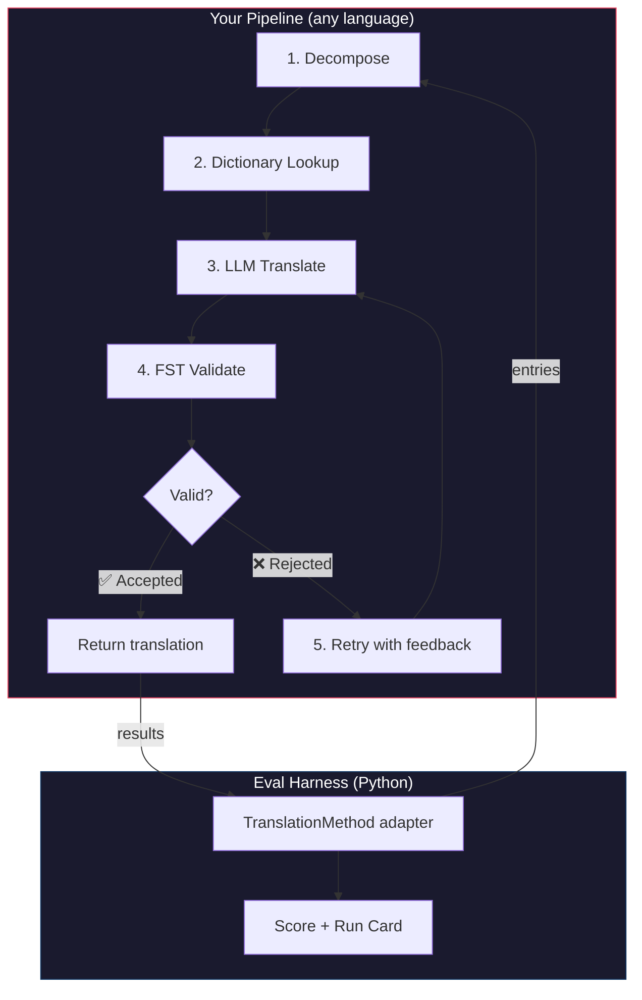
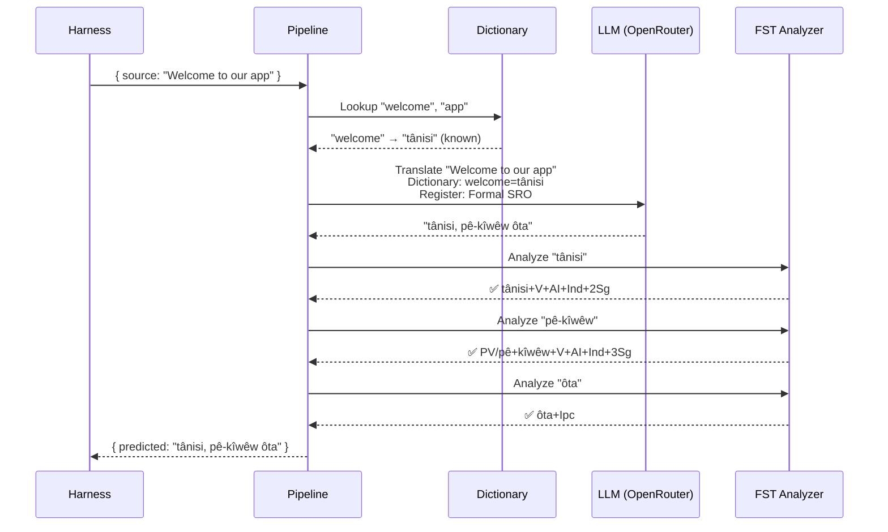
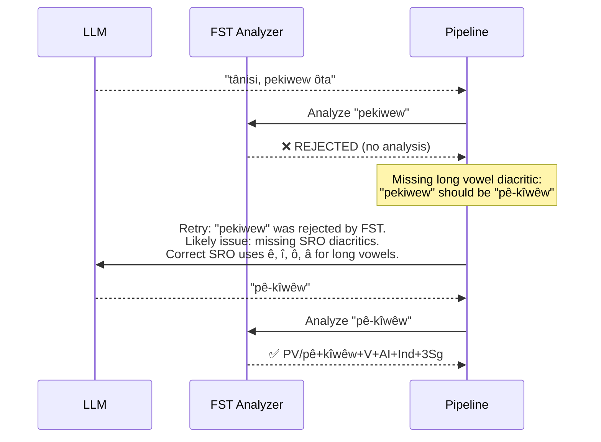

# Kookboek: FST-Gated Vertaalpijplijn

Bouw een meerfasige vertaalpijplijn die brontekst decomponeeert, vertaalt via een LLM, uitvoer valideert met een eindige-toestandstransducer (FST), en opnieuw probeert wanneer de FST ongeldige woordvormen afwijst. Koppel deze vervolgens aan het evaluatieharnas en bekijk hoe het scoort.

**Wat u bouwt:** Een vertaalpijplijn voor Plains Cree die morfologisch ongeldige vertalingen onderschept *voordat* ze ten koste gaan van uw score.

:::info Vereisten
- Een actief FST-binair bestand (bijv. van [ALTLab's Plains Cree-analysator](https://github.com/UAlbertaALTLab/lang-crk))
- Node.js 20+ (voor de pijplijn) en Python 3.10+ (voor het harnas)
- Een OpenRouter API-sleutel voor de LLM-stap
:::

---

## Architectuur

De pijplijn is een keten van fasen. Elke fase heeft een specifieke taak. U kunt dit in elke programmeertaal bouwen — dit voorbeeld gebruikt JavaScript, maar het harnas maakt niet uit wat er binnenin zit. Het ziet alleen de dunne Python-adapter aan de grens.



### Waarom Deze Fasen

| Fase | Wat Het Doet | Waarom Het Belangrijk Is |
|------|-------------|--------------------------|
| **Decomponeer** | Samengestelde UI-tekenreeksen opsplitsen in vertaalbare segmenten | Polysynthetische talen coderen hele zinnen in afzonderlijke woorden — het LLM heeft kleinere eenheden nodig |
| **Woordenboekopzoeking** | Een tweetalig woordenboek raadplegen voor bekende vertalingen | Dwingt correcte terminologie af voor bekende termen in plaats van te vertrouwen op LLM-giswerk |
| **LLM Vertalen** | Het segment naar een LLM sturen met register- en grammaticacontext | Verwerkt nieuwe zinsdelen en genereert vloeiende uitvoer |
| **FST Valideren** | De uitvoer door een morfologische analysator leiden | Vangt ongeldige woordvormen op — als de FST een woord afwijst, is het geen geldige woordvorm in de taal |
| **Opnieuw proberen** | Afgewezen woorden opnieuw verzenden met de foutfeedback van de FST | Geeft het LLM specifieke informatie over *waarom* het woord fout was |

---

## De Gegevensstroom

Dit is wat er met één invoer gebeurt terwijl deze door de pijplijn stroomt:



### Wanneer de FST Afwijst



---

## Implementatie

Bouw wat u wilt. Dit voorbeeld gebruikt JavaScript, maar u kunt ook Python, Rust of iets anders gebruiken. Het harnas maakt dat niet uit — het communiceert alleen met de dunne Python-adapter (weergegeven in de volgende sectie).

### De Pijplijn

Elke fase is een functie. De pijplijn koppelt ze aan elkaar.

```javascript title="pipeline.js"
import { lookupDictionary } from './dictionary.js';
import { callLLM } from './llm.js';
import { analyzeWithFST } from './fst.js';

const MAX_RETRIES = 3;

/**
 * Translate a batch of keys through the full pipeline.
 *
 * @param {object} keys - Map of key → source string
 * @param {object} options - { sourceLang, targetLang }
 * @returns {{ translations: object, stats: object }}
 */
export async function translateBatch(keys, options) {
  const translations = {};
  const stats = { total: 0, fstAccepted: 0, retries: 0, dictionaryHits: 0 };

  for (const [key, sourceText] of Object.entries(keys)) {
    stats.total++;
    translations[key] = await translateSingle(sourceText, options, stats);
  }

  return { translations, stats };
}

/**
 * Translate a single string through all pipeline stages.
 */
async function translateSingle(sourceText, options, stats) {

  // ── Stage 1: Decompose ──────────────────────────────────
  // Split compound strings into segments the LLM can handle.
  // For UI strings this is often a no-op, but for longer content
  // it prevents the LLM from losing context in long prompts.
  const segments = decompose(sourceText);

  // ── Stage 2: Dictionary Lookup ──────────────────────────
  // Check each segment against the bilingual dictionary.
  // Known terms are forced — the LLM won't override them.
  const knownTerms = {};
  for (const segment of segments) {
    const entry = lookupDictionary(segment.toLowerCase());
    if (entry) {
      knownTerms[segment] = entry;
      stats.dictionaryHits++;
    }
  }

  // ── Stage 3: LLM Translate ──────────────────────────────
  let translation = await callLLM(sourceText, {
    ...options,
    knownTerms,
    register: 'nêhiyawêwin (Plains Cree). Use SRO orthography. '
            + 'Professional register for educational contexts.',
  });

  // ── Stage 4: FST Validate ──────────────────────────────
  // Split the translation into words and check each one.
  let { accepted, rejected } = await validateWords(translation);

  // ── Stage 5: Retry Loop ─────────────────────────────────
  // If any words were rejected, retry with FST feedback.
  let attempt = 0;
  while (rejected.length > 0 && attempt < MAX_RETRIES) {
    attempt++;
    stats.retries++;

    const feedback = rejected
      .map(w => `"${w}" was rejected by the morphological analyzer`)
      .join('; ');

    translation = await callLLM(sourceText, {
      ...options,
      knownTerms,
      register: 'nêhiyawêwin (Plains Cree). Use SRO orthography.',
      feedback: `Previous attempt had invalid words. ${feedback}. `
              + 'Use correct SRO diacritics (ê, î, ô, â for long vowels). '
              + 'Ensure verb forms match expected conjugation patterns.',
    });

    ({ accepted, rejected } = await validateWords(translation));
  }

  if (rejected.length === 0) stats.fstAccepted++;

  return translation;
}

/**
 * Decompose source text into translatable segments.
 *
 * For simple key-value UI strings, this usually returns the
 * original string as a single segment. For longer content,
 * it splits on sentence boundaries.
 */
function decompose(text) {
  // Simple sentence-boundary split. Replace with your own
  // morphological decomposition for more complex needs.
  return text
    .split(/(?<=[.!?])\s+/)
    .filter(s => s.trim().length > 0);
}

/**
 * Validate each word in a translation against the FST.
 *
 * @returns {{ accepted: string[], rejected: string[] }}
 */
async function validateWords(translation) {
  // Split on whitespace and punctuation, keeping only words
  const words = translation
    .split(/[\s,;:.!?'"()\[\]{}]+/)
    .filter(w => w.length > 0);

  const accepted = [];
  const rejected = [];

  for (const word of words) {
    const analyses = await analyzeWithFST(word);
    if (analyses.length > 0) {
      accepted.push(word);
    } else {
      rejected.push(word);
    }
  }

  return { accepted, rejected };
}
```

### De FST-Wrapper

Wikkel uw FST-binair bestand als een asynchrone functie. Dit voorbeeld gebruikt ALTLab's HFST-gebaseerde Plains Cree-analysator.

```javascript title="fst.js"
import { execFile } from 'node:child_process';
import { promisify } from 'node:util';

const execFileAsync = promisify(execFile);

// Path to your FST analyzer binary
const FST_PATH = process.env.FST_ANALYZER_PATH || './bin/crk-analyzer';

/**
 * Run a word through the FST morphological analyzer.
 *
 * Returns an array of analyses. Empty array = rejected.
 *
 * Example:
 *   analyzeWithFST("tânisi")
 *   → ["tânisi+V+AI+Ind+2Sg", "tânisi+V+AI+Cnj+2Sg"]
 *
 *   analyzeWithFST("pekiwew")
 *   → []  // rejected — missing diacritics
 *
 * @param {string} word - A single word in SRO orthography
 * @returns {string[]} Array of FST analyses (empty = rejected)
 */
export async function analyzeWithFST(word) {
  try {
    // HFST lookup: pipe the word to stdin, read analyses from stdout
    const { stdout } = await execFileAsync(
      FST_PATH,
      ['--quiet'],
      { input: word + '\n', timeout: 5000 }
    );

    // Parse HFST output: each line is "input\tanalysis\tweight"
    // Lines with "+?" indicate unrecognized forms
    return stdout
      .split('\n')
      .filter(line => line.includes('\t') && !line.includes('+?'))
      .map(line => line.split('\t')[1]);

  } catch (err) {
    // If the FST binary isn't available, log and reject
    console.error(`[WARN] FST analysis failed for "${word}": ${err.message}`);
    return [];
  }
}
```

### Woordenboek- en LLM-modules

```javascript title="dictionary.js"
/**
 * Simple bilingual dictionary backed by a JSON file.
 *
 * In production, you'd load from the coaching data directory
 * or query itwêwina (https://itwewina.altlab.app/) via API.
 */
const DICTIONARY = {
  'hello': 'tânisi',
  'welcome': 'tânisi',
  'thank you': 'kinanâskomitin',
  'home': 'kīwēwin',
  'search': 'nānātawāpahtam',
  'settings': 'isi-nākatohkēwin',
  'help': 'nīsōhkamākēwin',
  'back': 'kīwē',
};

/**
 * @param {string} term - Lowercase English term
 * @returns {string|null} Cree translation or null
 */
export function lookupDictionary(term) {
  return DICTIONARY[term] || null;
}
```

```javascript title="llm.js"
/**
 * Call an LLM via OpenRouter for translation.
 */
const OPENROUTER_API = 'https://openrouter.ai/api/v1/chat/completions';

export async function callLLM(sourceText, options) {
  const { knownTerms = {}, register, feedback } = options;

  // Build the system prompt with register and known terms
  let systemPrompt = `You are translating English to Plains Cree.\n\n`;
  systemPrompt += `Register: ${register}\n\n`;

  if (Object.keys(knownTerms).length > 0) {
    systemPrompt += `Required terminology (use these exact translations):\n`;
    for (const [en, crk] of Object.entries(knownTerms)) {
      systemPrompt += `  "${en}" → "${crk}"\n`;
    }
    systemPrompt += '\n';
  }

  if (feedback) {
    systemPrompt += `IMPORTANT correction from previous attempt:\n${feedback}\n\n`;
  }

  systemPrompt += `Rules:\n`;
  systemPrompt += `- Use Standard Roman Orthography (SRO)\n`;
  systemPrompt += `- Use macron/circumflex for long vowels: ê, î, ô, â\n`;
  systemPrompt += `- Return ONLY the Cree translation, nothing else\n`;

  const response = await fetch(OPENROUTER_API, {
    method: 'POST',
    headers: {
      'Authorization': `Bearer ${process.env.OPENROUTER_API_KEY}`,
      'Content-Type': 'application/json',
    },
    body: JSON.stringify({
      model: 'google/gemini-2.5-pro',
      messages: [
        { role: 'system', content: systemPrompt },
        { role: 'user', content: sourceText },
      ],
      temperature: 0.2,
    }),
  });

  const json = await response.json();
  return json.choices[0].message.content.trim();
}
```

---

## Koppelen aan het Harnas

Uw pijplijn is gebouwd. Nu moet u deze verbinden met het evaluatieharnas zodat u het op het leaderboard kunt benchmarken.

Het harnas spreekt één interface: `TranslationMethod`. Het is een Python-protocol met één methode. Bouw wat u wilt in welke taal dan ook — geef het vervolgens deze dunne wrapper en het sluit aan.

```python title="fst_gated_process.py"
"""
TranslationMethod adapter for the FST-gated pipeline.

This thin wrapper connects your pipeline (running as a local
subprocess or HTTP server) to the eval harness. The harness
calls translate() with corpus entries. You call your pipeline.
You return results. That's it.
"""

import time
import subprocess
import json
from mt_eval_harness.config import RunConfig


class FSTGatedProcess:
    """Adapter between the eval harness and your FST-gated pipeline.

    The pipeline runs as a Node.js subprocess. This wrapper:
    1. Receives entries from the harness
    2. Sends them to the pipeline
    3. Returns structured results the harness can score
    """

    def __init__(self, pipeline_url: str = "http://localhost:3001"):
        self.pipeline_url = pipeline_url

    async def translate(
        self,
        entries: list[dict],
        config: RunConfig,
    ) -> list[dict]:
        """Translate a batch of entries through the FST-gated pipeline.

        Args:
            entries: List of corpus entries with 'id' and source text.
            config: Harness run configuration (for context).

        Returns:
            List of result dicts, one per entry.
        """
        import httpx

        results = []

        for entry in entries:
            source_text = entry.get(config.source_field, entry.get("source", ""))
            start = time.monotonic()

            try:
                # Call your pipeline — however it's running
                async with httpx.AsyncClient() as client:
                    response = await client.post(
                        f"{self.pipeline_url}/translate",
                        json={"keys": {str(entry["id"]): source_text}},
                        timeout=30.0,
                    )
                    data = response.json()
                    predicted = data["translations"][str(entry["id"])]

                elapsed = time.monotonic() - start

                results.append({
                    "id": entry["id"],
                    "predicted": predicted,
                    "latency_s": elapsed,
                    "usage": {},  # pipeline doesn't expose token counts
                    "error": None,
                    "tool_calls": [],
                    "tool_call_count": 0,
                    "metadata": data.get("meta", {}),
                })

            except Exception as err:
                results.append({
                    "id": entry["id"],
                    "predicted": "",
                    "latency_s": time.monotonic() - start,
                    "usage": {},
                    "error": str(err),
                    "tool_calls": [],
                    "tool_call_count": 0,
                    "metadata": {},
                })

        return results
```

:::tip U hebt geen HTTP nodig
Het bovenstaande voorbeeld roept de pijplijn aan via HTTP omdat de pijplijn in JavaScript is geschreven. Als uw pijplijn in Python is, kunt u deze rechtstreeks aanroepen — geen server nodig. De `TranslationMethod`-wrapper is slechts een functiegrens. Wat er binnenin gebeurt, is aan u.
:::

### De Benchmark Uitvoeren

Start uw pijplijn en voer vervolgens het harnas uit:

```bash
# Terminal 1: Start the pipeline
node server.js

# Terminal 2: Run the harness with your process
export OPENROUTER_API_KEY="sk-or-v1-..."

python -c "
import asyncio
from mt_eval_harness.config import RunConfig
from mt_eval_harness.runner import execute_run
from fst_gated_process import FSTGatedProcess

async def main():
    config = RunConfig(
        corpus_path='data/edtekla-dev-v1.json',
        source_lang='English',
        target_lang='Plains Cree (nêhiyawêwin, SRO)',
        process_name='fst-gated-v1',
    )
    process = FSTGatedProcess('http://localhost:3001')
    run_log = await execute_run(config, process=process)
    print(f'Results: {run_log.output_path}')

asyncio.run(main())
"
```

Of gebruik de CLI met `baseline_experiment.py` om te vergelijken met de ingebouwde basislijn:

```bash
python eval/baseline_experiment.py \
  --dataset data/edtekla-dev-v1.json \
  --model google/gemini-2.5-pro \
  --fst-analyzer ./bin/crk-analyzer \
  --condition fst-gated-v1 \
  --submit
```

---

## Uw Resultaten Begrijpen

Het harnas produceert een **run card** — een JSON-bestand met uw scores. Dit is wat u zult zien:

```
═══════════════════════════════════════════════════
  FST-Gated Pipeline v1 — EDTeKLA Dev v1
═══════════════════════════════════════════════════

  chrF++              48.7 / 100
  Exact match         12.1%
  FST acceptance      94.4%
  Composite score     0.52  →  Functional ✓

  404 entries (master_corpus.json) · 47 retries · $0.18 total cost
═══════════════════════════════════════════════════
```

**Wat dit u in één oogopslag vertelt:**
- Uw methode bevindt zich in de **Functioneel**-laag (0,50–0,70) — uitvoer is herkenbaar voor een spreker, grote grammatica meestal correct, frequente morfologische fouten blijven bestaan.
- De FST herkent 94% van de woorden als geldig — uw herprobleemlus werkt.
- 12% van de vertalingen is exact correct — er is veel ruimte voor verbetering.

:::info Kwaliteitslagen
| Laag | Composiet | Wat Het Betekent |
|------|-----------|------------------|
| Basislijn | 0,00–0,30 | Ruwe LLM-uitvoer, grotendeels gehallusineerde morfologie |
| Opkomend | 0,30–0,50 | Enkele correcte patronen, niet betrouwbaar |
| **Functioneel** | **0,50–0,70** | **Herkenbaar voor een spreker. Grote categorieën meestal correct.** |
| Inzetbaar | 0,70–0,85 | Geschikt voor conceptvertaling met menselijke beoordeling |
| Vloeiend | 0,85–1,00 | Benadert competente menselijke vertaling |

Zie [SCORING_SPEC §5](/docs/specifications/scoring#5-quality-tiers) voor de volledige laagdefinities.
:::

<details>
<summary><strong>Dieper: Wat staat er in de run card?</strong></summary>

De run card JSON legt alles vast over deze evaluatierun. Belangrijke secties:

**Scores** — elke metriek die het harnas heeft berekend:
```json
{
  "scores": {
    "exact_match_rate": 0.121,
    "chrf_plus_plus": 48.7,
    "fst_acceptance_rate": 0.944,
    "composite_score": 0.52,
    "quality_tier": "functional"
  }
}
```

**Herkomst** — wat deze resultaten heeft geproduceerd:
```json
{
  "method": {
    "process_name": "fst-gated-v1",
    "model": "google/gemini-2.5-pro",
    "temperature": 0.0
  },
  "corpus": {
    "id": "edtekla-dev-v1",
    "sha256": "a1b2c3..."
  }
}
```

**Resultaten per invoer** — elke vertaling met individuele scores, zodat u kunt vinden waar uw methode tekortschiet:
```json
{
  "id": 42,
  "source": "The student completed the assignment",
  "reference": "ôskiniw kî-kîsîhtâw ôhi atoskêwina",
  "predicted": "ôskiniw kî-kîsîhtâw ôhi atoskêwin",
  "chrf": 89.2,
  "exact_match": false,
  "fst_accepted": true
}
```

De composietscore is een gewogen gemiddelde van beschikbare metrieken, met gewichten gedefinieerd in [SCORING_SPEC §4](/docs/specifications/scoring#4-composite-score). Wanneer een metriek niet beschikbaar is, wordt het gewicht ervan proportioneel herverdeeld over de rest.

</details>

---

## Implementeren in Productie

Uw methode heeft scores op het leaderboard. Nu wilt u deze daadwerkelijk gebruiken. Deze sectie gaat over het aanbieden van uw pijplijn als een productie-eindpunt dat [champollion](https://champollion.dev) kan aanroepen.

:::note Deze sectie is optioneel
Alles hierboven gaat over het bouwen en benchmarken van uw methode. Deze sectie gaat over implementatie — een afzonderlijk aandachtspunt. U kunt indienen bij het leaderboard zonder iets te implementeren.
:::

### De HTTP-server

Wikkel uw pijplijn als een Express-server die het [API-methodecontract](https://champollion.dev/docs/guides/serving-a-method) implementeert:

```javascript title="server.js"
import express from 'express';
import { translateBatch } from './pipeline.js';

const app = express();
app.use(express.json());

/**
 * API method contract:
 *
 * Request:  { source_locale, target_locale, method, keys: { "key": "source" } }
 * Response: { translations: { "key": "translated" }, meta: { ... } }
 */
app.post('/translate', async (req, res) => {
  const { source_locale, target_locale, method, keys } = req.body;

  // Validate request
  if (!keys || typeof keys !== 'object') {
    return res.status(400).json({ error: { message: 'Missing keys object' } });
  }

  try {
    const startTime = Date.now();
    const { translations, stats } = await translateBatch(keys, {
      sourceLang: source_locale,
      targetLang: target_locale,
    });

    res.json({
      translations,
      meta: {
        model: 'custom-pipeline/fst-gated-v1',
        method: 'decompose-lookup-translate-validate',
        elapsed_ms: Date.now() - startTime,
        fst_acceptance_rate: stats.fstAccepted / stats.total,
        retries: stats.retries,
      },
    });
  } catch (err) {
    console.error('[ERR] Pipeline failed:', err.message);
    res.status(500).json({ error: { message: err.message } });
  }
});

// Health check for connectivity verification
app.get('/health', (req, res) => res.json({ status: 'ok' }));

app.listen(3001, () => {
  console.log('FST-gated pipeline running on http://localhost:3001');
});
```

### champollion Configureren

Wijs uw taalpaar naar de actieve service:

```json title="champollion.config.json"
{
  "version": 3,
  "inputLocale": "en",
  "pairs": {
    "en:crk": {
      "method": "api",
      "endpoint": "http://localhost:3001/translate"
    }
  },
  "languages": {
    "crk": {
      "name": "Plains Cree",
      "register": "SRO syllabics with grammatical precision."
    }
  }
}
```

```bash
# Run it
export OPENROUTER_API_KEY="sk-or-v1-..."
node server.js &
npx champollion sync
```

### Verpakken als een Plugin

Zodra uw methode scores heeft, verpakt u deze zodat anderen het kunnen gebruiken:

```json title="crk-fst-gated-v1/method.json"
{
  "name": "crk-fst-gated-v1",
  "type": "api",
  "version": "1.0.0",
  "description": "FST-gated Plains Cree translation with morphological validation",
  "author": "Your Name",

  "config": {
    "endpoint": "https://your-server.example.com/translate"
  },

  "locales": ["crk"],

  "benchmarks": {
    "crk": {
      "date": "2026-06-01T00:00:00Z",
      "corpus_size": 404,
      "exact_match_rate": 0.12,
      "corpus_chrf": 48.7,
      "model": "google/gemini-2.5-pro",
      "harness_version": "2.0"
    }
  },

  "provenance": {
    "resources": [
      { "name": "ALTLab CRK Analyzer", "license": "LGPL-3.0", "type": "fst" },
      { "name": "Wolvengrey Dictionary", "license": "CC-BY-NC-SA-4.0", "type": "dictionary" }
    ],
    "commercialReady": false,
    "flags": ["nc-resource"]
  }
}
```

---

## Dit Patroon Uitbreiden

Dit kookboek demonstreert één pijplijnarchitectuur. U kunt het aanpassen voor elke taal of methode:

| Variatie | Wat Verandert |
|----------|--------------|
| **Andere FST** | Verwissel het binaire pad. U kunt voorgecompileerde FST's (zoals `.hfstol`- of `lttoolbox`-binaire bestanden) downloaden voor meer dan 100 talen van de [GiellaLT GitHub](https://github.com/giellalt) of [Apertium GitHub](https://github.com/apertium). |
| **Geen FST beschikbaar** | Verwijder de FST-uitvoeringsfase en gebruik [UniMorph platte paradigmabestanden](https://huggingface.co/datasets/unimorph/universal_morphologies) van Hugging Face om statische databaseopzoekvalidatie van verbogen vormen uit te voeren. |
| **Meerdere LLM's** | Keten modellen: een snel model voor het initiële concept, een redeneermodel voor correcties. |
| **Mens in de lus** | Voeg een wachtrijfase toe die onzekere vertalingen vasthoudt voor deskundige beoordeling voordat ze worden geretourneerd. |
| **Fijnafgestemd model** | Vervang de OpenRouter-aanroep door een lokaal model (Ollama, vLLM, enz.). |
| **Andere taal** | Wijzig het woordenboek, de FST en het register. De architectuur blijft identiek. |

De pijplijn is een patroon. De fasen zijn uitwisselbaar. Bouw wat werkt voor uw taal, bewijs het op het [leaderboard](https://champollion.dev/leaderboard), en implementeer het.

---

## Zie Ook

- **[Evaluatieharnas](/docs/specifications/harness)** — hoe u het harnas uitvoert en uitvoer interpreteert
- **[Methode-interface](/docs/specifications/methods)** — de `TranslationMethod`-protocolspecificatie
- **[Leaderboard-regels](/docs/leaderboard/rules)** — indieningscriteria en anti-gamingbeleid
- **[Ondersteuning van een taal met weinig middelen](/docs/community/low-resource-languages)** — de bredere context en OCAP-principes
- **[ALTLab](https://altlab.artsrn.ualberta.ca/)** — het Alberta Language Technology Lab (Plains Cree FST)
- **[Methode-leaderboard](https://champollion.dev/leaderboard)** — dien uw scores in