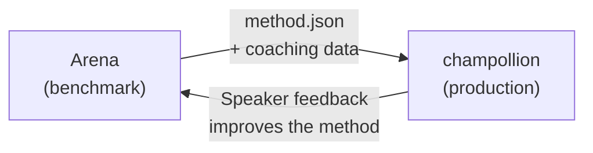

# Implantar em Produção

Você provou que funciona na Arena. Agora implante.

A Arena é para P&D — construir, fazer benchmark e comparar métodos de tradução. **A implantação em produção** acontece através do [champollion](https://champollion.dev), a CLI de tradução voltada para desenvolvedores. Eles se conectam através de um formato de plugin compartilhado.



---

## O Caminho da Implantação

### 1. Exporte Seu Método como um Plugin

Crie um manifesto `method.json` que empacote seus resultados de benchmark:

```json
{
  "name": "crk-coached-v3",
  "type": "llm-coached",
  "version": "3.0.0",
  "description": "Coached LLM translation for Plains Cree",
  "locales": ["crk"],
  "config": {
    "model": "google/gemini-2.5-flash",
    "temperature": 0.3
  },
  "benchmarks": {
    "crk": {
      "composite_score": 0.67,
      "fst_acceptance": 0.82,
      "corpus_size": 150
    }
  }
}
```

Inclua qualquer dado de coaching (regras gramaticais, dicionários) junto com o manifesto.

### 2. Instale no Champollion

```bash
champollion plugin install ./my-method-plugin/
```

### 3. Configure Seu Par

```json title="champollion.config.json"
{
  "pairs": {
    "en-crk": { "method": "plugin", "plugin": "crk-coached-v3" }
  }
}
```

### 4. Traduza Conteúdo Real

```bash
npx champollion sync
```

Seu método com benchmark agora está produzindo traduções reais em produção.

---

## Para Línguas Indígenas

Métodos que servem comunidades de línguas indígenas exigem **consentimento da comunidade** antes da implantação em produção. Os princípios OCAP (Ownership, Control, Access, Possession) governam como os métodos de tradução são desenvolvidos, avaliados e implantados.

Um método que atinge o nível Deployable (0.70+) não é implantado automaticamente — é implantado **se e quando** o órgão de governança da comunidade linguística der consentimento.

Consulte [Data Sovereignty](/docs/sovereignty/data-sovereignty) e [Ownership Transfer](/docs/sovereignty/ownership-transfer) para o framework de governança completo.

---

## Veja Também

- [The Eval Harness Bridge](https://champollion.dev/docs/guides/bridge) — passo a passo detalhado do pipeline Arena→champollion
- [Plugin Specification](https://champollion.dev/docs/reference/plugin-spec) — o formato do manifesto method.json
- [champollion Agent Guide](https://champollion.dev/docs/guides/agent-guide) — como usar champollion para tradução