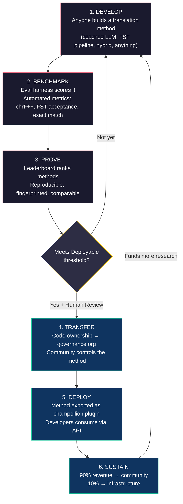
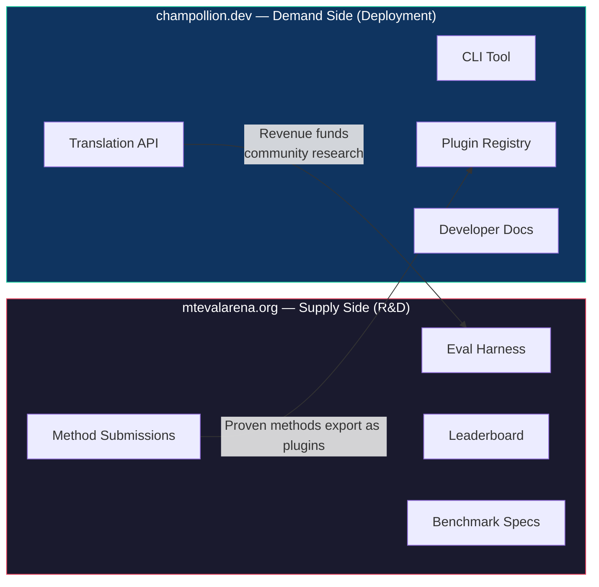
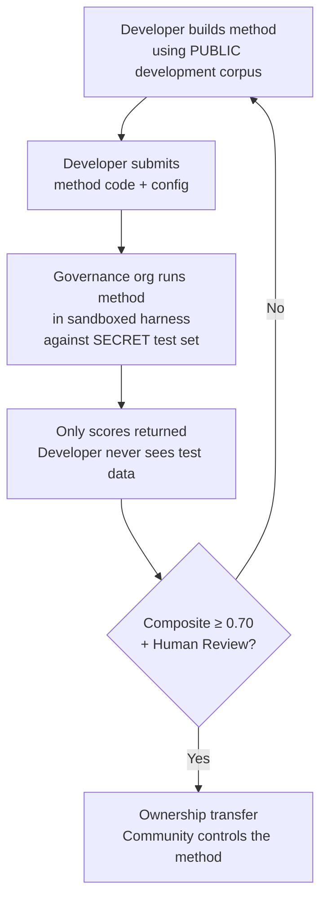

# Como Funciona: Crowdsourcing Competitivo para Tradução Automática

> **Resumo Executivo.** Tradução automática para os idiomas pouco atendidos do mundo — incluindo os ~1.300 que o OMT-1600 do Meta afirma cobrir, mas em níveis de qualidade abaixo de qualquer limiar utilizável — não é um problema de treinamento de modelos — é um problema de *infraestrutura*. Nenhum modelo, laboratório ou empresa isolada resolverá isso. Este documento descreve uma arquitetura de plataforma que transforma a comunidade global de engenheiros de ML, linguistas e falantes de idiomas em um laboratório de pesquisa distribuído: qualquer pessoa constrói um método de tradução, a plataforma prova se funciona contra dados de avaliação soberana, e métodos comprovados são implantados em produção com receita fluindo para as comunidades cujos idiomas servem. O mecanismo é crowdsourcing competitivo com soberania criptográfica — uma combinação que nunca foi tentada antes.

---

> [!IMPORTANT]
> **Escopo.** Esta plataforma avalia **tradução de texto escrito formal** — documentos, materiais educacionais, comunicações oficiais, strings de UI. Não é um chatbot, intérprete em tempo real ou sistema conversacional de domínio irrestrito. O leaderboard classifica métodos de tradução contra corpora paralelos curados em domínios de texto específicos (veja [Especificação de Benchmark §2.7](/docs/specifications/benchmark#27-domain) para a taxonomia de domínios). MT é infraestrutura para revitalização de idiomas, não um substituto para ela. Crianças aprendem idioma com pessoas, não com máquinas.

### Cobertura de Domínio Atual

| Domínio | Cobertura de Tiers | Status | Notas |
|---------|-------------------|--------|-------|
| Oficial / governo | Tiers 1–5 | Ativo | Corpus EdTeKLA |
| Educacional / livro didático | Tiers 1–4 | Ativo | Corpus EdTeKLA |
| Narrativo / literário | Limitado | Planejado | Algumas entradas no padrão ouro |
| Religioso / escritural | Apenas referência | Não avaliado | FLORES+ (domínio Bíblia); não usado para pontuação oficial |
| Conversacional | Fora do escopo | Por design | Este sistema avalia texto escrito, não fala |
| Técnico / científico | Fora do escopo | Futuro | Requer validação de terminologia específica do domínio |

## 1. O Problema: Tradução Automática ≠ Aprendizado de Máquina

Tradução automática para idiomas de baixo recurso (LRLs) é comumente enquadrada como um problema de aprendizado de máquina: coletar dados, treinar um modelo, implantar. Este enquadramento está errado, e o erro é consequente — direciona financiamento, talento e infraestrutura para uma abordagem que estruturalmente não pode funcionar para a maioria dos idiomas do mundo.

### 1.1 Por Que o Enquadramento de ML Falha

O pipeline de ML padrão para MT requer três coisas: grandes corpora paralelos, benchmarks de avaliação validados e um caminho de implantação. Para os ~130 idiomas servidos pelo Google Translate e os ~200 cobertos pelo NLLB-200, todos os três existem. Para os ~1.300 idiomas adicionais que o OMT-1600 afirma cobrir, dados de avaliação existem, mas a qualidade está principalmente abaixo de limiares utilizáveis, os pesos do modelo não estão disponíveis publicamente e não há pipeline de implantação. Para os ~5.400+ restantes, nenhum existe.

| Requisito | Idiomas de Alto Recurso | Cobertura OMT-1600 (~1.300 LRLs) | ~5.400 Idiomas Restantes |
|-----------|------------------------|-------------------------------|---------------------------|
| **Corpora paralelos** | Milhões de pares de sentenças (Europarl, UN Corpus, OpenSubtitles) | Bitext de domínio Bíblia, raspagens web, retrotradução sintética. Sem dados curados pela comunidade. | Centenas a milhares baixos, se houver |
| **Benchmarks de avaliação** | WMT, FLORES, NTREX — padronizados, reproduzíveis | BOUQuET (domínio Bíblia), met-BOUQuET. Sem validação morfológica. Sem avaliação independente. | Sem benchmarks padrão; avaliação ad hoc |
| **Caminho de implantação** | Google Translate, DeepL, Azure — APIs comerciais | Pesos do modelo não lançados. Sem CLI, sem sistema de plugin, sem API implantável pela comunidade. | Nada. Sem API, sem produto, sem mercado. |

A abordagem de ML funciona quando os dados existem para treinar e o mercado existe para implantar. O OMT-1600 expandiu significativamente a primeira condição — mas expansão sem verificação de qualidade independente, validação morfológica ou governança comunitária é expansão sem confiança. O problema não é apenas "precisamos de um modelo melhor" — é "precisamos de infraestrutura que prove que o modelo funciona, em termos que a comunidade controla."

### 1.2 O Que MT para LRLs Realmente Requer

Tradução para idiomas pouco atendidos não é principalmente um problema de treinamento. É um problema de **engenharia de métodos** — o desafio de montar recursos disponíveis (LLMs, ferramentas morfológicas, conhecimento comunitário, regras linguísticas) em pipelines de tradução funcionais, depois provar que funcionam com avaliação rigorosa.

A distinção importa:

| Dimensão | Abordagem de ML | Abordagem de Engenharia de Métodos |
|----------|-----------------|-----------------------------------|
| **Atividade central** | Treinar um modelo em dados | Combinar ferramentas, prompts e conhecimento linguístico em um pipeline |
| **Gargalo** | Volume de dados paralelos | Criatividade em engenharia + infraestrutura de avaliação |
| **Quem pode contribuir** | Equipes com clusters GPU e datasets | Qualquer pessoa com uma chave de API, um dicionário e uma ideia |
| **Avaliação** | BLEU/chrF em conjuntos de teste retidos | Validação morfológica + revisão humana + métricas automatizadas |
| **Implantação** | Servir o modelo | Empacotar o método como um plugin |

LLMs modernos já contêm conhecimento latente de muitos idiomas de baixo recurso — o suficiente para produzir saída que *parece* plausível. O problema é que essa saída é frequentemente morfologicamente inválida (o modelo alucina formas de palavras que não existem no idioma). O desafio de engenharia é: como você extrai o que o LLM sabe, valida contra a realidade linguística e empacota o resultado para uso em produção?

É por isso que avaliamos **métodos**, não modelos. Um método é a receita completa: seleção de modelo + engenharia de prompt + uso de ferramentas + pré/pós-processamento + dados de coaching + estratégias de retry. Dois times usando o mesmo modelo com métodos diferentes obterão pontuações diferentes. Esse é o ponto.

### 1.3 Por Que Idiomas Polissintéticos Quebram Tudo

Muitos dos idiomas mais pouco atendidos do mundo são **polissintéticos** — eles codificam sentenças inteiras em palavras únicas através de processos morfológicos produtivos. Considere a palavra Cree das Planícies:

> **ê-kî-nitawi-kîskinwahamâkosiyân**
> *"quando eu tinha ido para a escola"*

Uma palavra. Ela codifica tempo (passado), direção (indo para), a raiz (aprender), voz (passiva/reflexiva) e pessoa (primeira singular). O inglês precisa de seis palavras para o que o Cree expressa em uma.

Isso quebra MT padrão em todos os níveis:

- **Tokenização** — BPE e SentencePiece destroem palavras polissintéticas em fragmentos sem sentido, porque foram projetados para morfologia concatenativa.
- **Alucinação** — LLMs produzem strings plausíveis que não são palavras válidas. Um não-falante não consegue diferenciar. Sem validação morfológica, alucinações são invisíveis.
- **Avaliação** — Métricas em nível de palavra (BLEU) penalizam a variação inflexional natural que é fundamental para como esses idiomas funcionam. Métricas em nível de caractere (chrF++) são melhores, mas ainda insuficientes sem validação estrutural.

A solução não é um modelo maior ou mais dados de treinamento. É **infraestrutura que detecta alucinações antes de chegarem aos usuários** — analisadores morfológicos (FSTs) que podem definitivamente dizer "isso não é uma palavra neste idioma."

---

## 2. Por Que as Abordagens Existentes Não Funcionam

### 2.1 MT Comercial

Serviços de tradução comerciais historicamente otimizaram para volume de mercado. O OMT-1600 do Meta (março de 2026) representa uma mudança significativa — 1.600 idiomas em um sistema. Mas para os ~1.300 em seus tiers de recurso mais baixo, a qualidade está abaixo de limiares utilizáveis, os pesos do modelo não estão disponíveis e não há pipeline de implantação. O problema de incentivo estrutural evoluiu: Big Tech agora pode construir modelos para LRLs, mas sem avaliação independente, validação morfológica ou governança comunitária, cobertura sozinha não resolve o problema.

### 2.2 Pesquisa Acadêmica

Pesquisa acadêmica de MT se concentra esmagadoramente em pares de idiomas de alto recurso porque é onde estão os dados de treinamento, tarefas compartilhadas e veículos de publicação. Pesquisadores que trabalham em pares de baixo recurso lutam para publicar, lutam para financiar computação e lutam para implantar — porque infraestrutura de implantação para LRLs não existe.

### 2.3 Competições Pontuais

Você poderia executar uma competição Kaggle: "English→Plains Cree, melhor chrF++ ganha $10.000." Aqui está o que acontece:

1. Alguém vence, envia um notebook, coleta o prêmio, vai embora.
2. O notebook apodrece no arquivo do Kaggle. Ninguém o implanta. Ninguém o mantém.
3. O conjunto de teste é eventualmente publicado — contaminado para sempre.
4. A organização de governança fez upload de seus dados linguísticos para a infraestrutura do Google sob os termos de serviço do Google, sem controle real sobre o ciclo de vida.
5. Sem ponte de implantação. Um notebook vencedor não é uma API funcionando.

Um bounty único atrai caçadores de bounty. Um leaderboard contínuo com governança comunitária cria engajamento sustentado.

### 2.4 Fine-Tuning

Fine-tuning de um modelo aberto em texto paralelo é a abordagem óbvia de ML. Mas para a maioria dos LRLs, o corpus paralelo necessário para fine-tuning é exatamente os dados que não existem — e criá-lo requer os mesmos falantes bilíngues e engajamento comunitário que o fine-tuning pretende substituir. Você não pode se safar de um problema de escassez de dados com uma técnica que requer dados.

---

## 3. A Solução: Crowdsourcing Competitivo com Avaliação Soberana

A plataforma inverte a abordagem tradicional: em vez de um time construir um modelo, **a comunidade global compete para construir o melhor método de tradução**, a plataforma prova se funciona, e métodos comprovados são implantados em produção com a comunidade de idiomas retendo propriedade e controle.

### 3.1 O Loop Completo

Cada estágio tem uma função específica:

| Estágio | O Que Acontece | Quem Se Beneficia |
|---------|----------------|------------------|
| **Desenvolver** | Um pesquisador, estudante ou hobbyista constrói um método de tradução usando as ferramentas que quiser — prompting de LLM, pipelines FST, dicionários, modelos fine-tuned, sistemas baseados em regras ou híbridos | O contribuidor aprende, experimenta, publica |
| **Avaliar** | O harness de avaliação pontua o método contra um corpus padronizado com métricas reproduzíveis. Cada execução produz um [run card](/docs/specifications/benchmark#3-run-card-schema) — um registro completo do que foi testado e como se saiu | Pesquisadores obtêm resultados reproduzíveis e comparáveis |
| **Provar** | Resultados aparecem no leaderboard público. Métodos são classificados, comparados e escrutinados. A comunidade vê o que funciona e o que não funciona | Todos ganham visibilidade do estado da arte |
| **Transferir** | Para idiomas indígenas, métodos que atingem o limiar Implantável (composite ≥ 0,70) E passam na validação humana têm sua propriedade de código transferida para a organização de governança da comunidade de idiomas | A comunidade ganha um ativo gerador de receita |
| **Implantar** | O método é exportado como um plugin [champollion](https://github.com/gamedaysuits/champollion) e servido via API. Desenvolvedores consomem traduções sem precisar entender o método subjacente | Desenvolvedores obtêm tradução para idiomas que APIs comerciais não servem |
| **Sustentar** | Receita de API é dividida: 90% para a comunidade, 10% para infraestrutura. Receita financia mais pesquisa linguística, desenvolvimento de corpus e programas comunitários | O flywheel se sustenta após estabelecimento inicial |

### 3.2 Por Que Dinâmicas Competitivas Funcionam

Competição não é incidental — é o mecanismo. Aqui está por quê:

**Diversidade de abordagens.** O melhor método para English→Plains Cree pode ser um LLM treinado com portão FST. O melhor para English→Quechua pode ser um pipeline aumentado por dicionário. O melhor para English→Inuktitut pode ser um modelo fine-tuned inicializado a partir do corpus Hansard de Nunavut. Nenhum time ou abordagem única dominará em todos os idiomas. O leaderboard revela quais *tipos* de abordagens funcionam para quais *tipos* de idiomas — um meta-resultado que é em si uma contribuição de pesquisa.

**Engajamento sustentado.** Um leaderboard nunca termina. Alguém sempre quer bater a pontuação máxima. Cada envio doa computação e esforço intelectual para o problema. Diferentemente de uma bolsa única, a dinâmica competitiva gera investimento de pesquisa contínuo da comunidade global.

**Baixa barreira de entrada.** Você precisa de uma chave de API, um dicionário e uma ideia. O harness de avaliação é código aberto. O formato de corpus é JSON simples. Um estudante de linguística pode competir com um laboratório bem financiado — e às vezes vencer, porque conhecimento de domínio (entender o idioma) pode superar recursos de computação.

**Ponte de implantação.** O mesmo método que pontua bem no harness é implantado em produção com uma mudança de config. "Prove aqui, implante lá." Esta é a lacuna que Kaggle, tarefas compartilhadas WMT e publicações acadêmicas não preenchem.

### 3.3 A Arquitetura da Plataforma

O ecossistema é fisicamente dividido em dois sites servindo dois públicos:

**[mtevalarena.org](https://mtevalarena.org)** é o campo de prova de P&D. Seu público é engenheiros de ML, linguistas e pesquisadores. Tudo aqui é sobre construir, testar e provar métodos de tradução.

**[champollion.dev](https://champollion.dev)** é a plataforma de implantação. Seu público é desenvolvedores que precisam de tradução para seus apps. Eles não precisam entender como os métodos funcionam — apenas chamam a API.

A ponte entre eles é o **plugin de método**: um método comprovado, empacotado para implantação, de propriedade da comunidade.

---

## 4. Avaliação Soberana: Por Que a Infraestrutura Importa

A infraestrutura de avaliação não é um detalhe técnico — é o núcleo do modelo de soberania. Avaliação padrão (fazer upload de seu conjunto de teste para uma plataforma compartilhada) não funciona para idiomas indígenas porque renuncia ao controle sobre os dados linguísticos.

### 4.1 O Mecanismo de Soberania

O desenvolvedor nunca vê os dados de avaliação do padrão ouro. Ele desenvolve contra um corpus de desenvolvimento público, depois envia seu código de método para a organização de governança, que o executa em uma sandbox contra o conjunto de teste secreto. Apenas pontuações retornam. Isso não é apenas segurança — é uma implementação direta dos **princípios OCAP®** (Ownership, Control, Access, Possession) que a governança de dados indígena requer.

### 4.2 Por Que Isso Não Pode Rodar em Plataforma de Outro

No Kaggle, a organização de governança faz upload de seus dados linguísticos para a infraestrutura do Google sob os termos de serviço do Google. Eles não podem revogar acesso em sua própria linha do tempo. Eles não podem anexar termos legais personalizados (como transferência de propriedade) aos envios. Eles não têm garantia criptográfica de que os dados não serão usados para outros fins. Soberania de dados significa que a comunidade controla o endpoint de avaliação, detém as chaves e pode desligá-lo.

---

## 5. Filosofia de Avaliação: Microeval e LYSS

Métricas de MT padrão (BLEU, chrF++, COMET) são projetadas para generalizar entre idiomas. Essa generalidade é sua força — e seu ponto cego. Para idiomas polissintéticos, uma palavra morfologicamente inválida que compartilha n-gramas de caracteres com a referência pontua bem em chrF++ mas seria reconhecida como gibberish por qualquer falante.

**Desenvolvimento de microeval** significa construir métricas de avaliação adaptadas a idiomas específicos usando as melhores ferramentas linguísticas disponíveis. O framework é chamado **LYSS** (Linguistically-informed Yield & Structural Scoring):

| Componente | O Que Mede | Ferramenta | Status |
|-----------|-----------|-----------|--------|
| **LYSS-fst** | Validade morfológica | Transdutor de estado finito | ✅ Implementado (Plains Cree) |
| **LYSS-eq** | Equivalência linguística | Regras de variante curadas por linguista | ✅ Implementado (Plains Cree) |
| **LYSS-sem** | Preservação semântica | Modelos semânticos específicos do idioma | ✅ Implementado (Plains Cree) |

As métricas universais (chrF++, BLEU) servem como baselines e como sinais primários para idiomas sem ferramentas LYSS. Onde ferramentas específicas do idioma existem, componentes LYSS carregam o peso de pontuação — porque as coisas que mais importam para cada idioma são as coisas que apenas ferramentas específicas do idioma podem medir.

Para a especificação LYSS completa e lógica de pontuação composta, veja [SCORING_SPEC.md §4](/docs/specifications/scoring#4-composite-score).

> [!WARNING]
> **Comparabilidade entre execuções.** Ao comparar execuções com disponibilidade de métrica diferente (ex., uma execução tem pontuações FST, outra não), as pontuações compostas não são diretamente comparáveis. O composto normaliza para métricas disponíveis, mas uma execução avaliada em 5 métricas carrega mais informação que uma avaliada em 2. O leaderboard indica cobertura de métrica para cada entrada.

---

## 6. Quem Isso Serve

### Para Engenheiros de ML e Pesquisadores

Um leaderboard aberto com benchmarks padronizados para pares de idiomas que nenhuma tarefa compartilhada cobre. Reproduza qualquer resultado com o harness de avaliação. Publique seu método. Bata a pontuação máxima. Cada envio é fingerprinted para uma configuração específica e versão de dataset — sem ambiguidade sobre o que foi testado.

### Para Comunidades de Idiomas

Propriedade e controle sobre tecnologia de tradução construída para seu idioma. A dinâmica competitiva significa que múltiplos times estão trabalhando em seu idioma simultaneamente — você se beneficia de todos eles e possui o resultado. Receita do uso de API financia programas comunitários em seus termos.

### Para Financiadores e Revisores de Bolsas

Métricas transparentes e reproduzíveis para avaliar propostas de pesquisa de tradução. Resultados mensuráveis além de publicações: uso de API, receita gerada, métricas de qualidade ao longo do tempo, cobertura de idiomas. Um único método bem-sucedido cria um fluxo de receita autossustentável — o impacto da bolsa se compõe em vez de terminar quando o financiamento termina.

### Para Desenvolvedores

Tradução para idiomas que nenhuma API comercial serve. Um comando CLI (`npx champollion sync`) traduz seus arquivos de locale usando métodos comprovados pela comunidade. Use Google Translate para francês, um LLM treinado para Plains Cree e uma API comunitária para Quechua — tudo no mesmo projeto, tudo com a mesma interface.

### Para Estudantes

Um desafio aberto com impacto no mundo real. Construa um método de tradução para um idioma pouco atendido, avalie-o e publique seus resultados. A infraestrutura é gratuita, os datasets são abertos e o leaderboard não se importa se você está em uma universidade top-10 ou trabalhando de um terminal de biblioteca.

---

## 7. Contexto Social e Técnico

### 6.1 Revitalização de Idiomas Está Acelerando

Esforços de revitalização de idiomas estão crescendo mundialmente. Escolas de imersão, ninhos de idiomas comunitários e projetos de arquivamento digital estão se expandindo em comunidades indígenas no Canadá, Estados Unidos, Austrália, Nova Zelândia e Europa do Norte. Esses esforços precisam de tecnologia — especificamente, tecnologia de tradução que respeita a soberania comunitária sobre dados linguísticos.

### 6.2 LLMs Mudaram a Baseline

Antes de 2023, construir qualquer capacidade de MT para um idioma polissintético requeria expertise significativa em NLP, treinamento de modelo personalizado e orçamentos de computação grandes. LLMs modernos mudaram a baseline: um prompt bem elaborado com dados de coaching e validação morfológica pode produzir traduções utilizáveis para alguns pares de idiomas — sem treinamento necessário. Isso reduz dramaticamente a barreira de entrada para desenvolvimento de métodos. O problema mudou de "como construímos um modelo?" para "como construímos um pipeline que valida e corrige o que o modelo produz?"

### 6.3 A Cultura de Benchmarking de Código Aberto

Benchmarking de IA se tornou sua própria cultura. Leaderboards impulsionam inovação. Competições atraem talento. Chatbot Arena, LMSYS, Hugging Face Open LLM Leaderboard — essas plataformas demonstram que avaliação competitiva impulsiona progresso rápido. Tomamos essa energia e a apontamos para tradução para os milhares de idiomas onde MT comercial ou não existe ou não foi independentemente provado funcionar.

### 6.4 Soberania de Dados Indígena É Inegociável

Os princípios OCAP® (Ownership, Control, Access, Possession), os princípios CARE (Collective Benefit, Authority to Control, Responsibility, Ethics) e frameworks como Te Mana Raraunga (Māori Data Sovereignty) não são add-ons opcionais — são requisitos estruturais para qualquer tecnologia que toque recursos linguísticos indígenas. Nossa infraestrutura de avaliação implementa esses princípios arquiteturalmente, não apenas como declarações de política.

---

## 8. Tensões e Limitações {#8-tensions-and-limitations}

Este projeto usa um mecanismo ocidental — benchmarking competitivo — para servir sistemas de conhecimento que são frequentemente comunitários, relacionais e guiados por Anciãos. Essa tensão é real e deve ser nomeada, não resolvida por afirmação.

**Benchmarking vs. conhecimento comunitário.** Leaderboards classificam indivíduos e otimizam pontuações numéricas. Tradições de conhecimento indígena enfatizam autoridade relacional, correção comunitária e legitimidade baseada em relacionamento. Não podemos afirmar servir esses sistemas de conhecimento enquanto construímos uma plataforma cujo mecanismo central é otimização competitiva individual. A arquitetura de soberania (§4) — onde comunidades possuem métodos, controlam avaliação e decidem o que é implantado — é nossa resposta estrutural, mas não dissolve a tensão. Um leaderboard ainda é um leaderboard.

**O que estamos fazendo sobre isso.** A plataforma suporta envios de time e comunidade junto com os individuais. O leaderboard enquadra resultados como "estado atual da arte" em vez de "quem está vencendo." A organização de governança — não a pontuação do leaderboard — determina o que é implantado. Nenhuma pontuação automatizada entitula um desenvolvedor a nada; a comunidade decide. E mantemos um loop de feedback de consultoria contínuo com comunidades parceiras sobre se o enquadramento e estrutura de incentivo da plataforma as servem. Se não servem, mudamos.

**MT não é revitalização.** Tradução converte texto entre idiomas. Revitalização cria novos falantes. Um sistema de MT perfeito não resolve o problema de transmissão, o problema de prestígio ou o problema pedagógico. Pode até criar a ilusão de que "o computador pode falar o idioma," minando urgência para transmissão humana. Construímos MT como infraestrutura — tradução de rascunho para pós-edição, ferramentas morfológicas para apps de aprendizado de idioma, alavanca política para comunidades exigindo serviços em seu idioma — não como substituto para transmissão intergeracional. A comunidade controla se, quando e como a tecnologia é implantada.

Esta seção existe porque essas tensões foram identificadas em uma crítica convidada (maio de 2026) e nos comprometemos a nomeá-las publicamente em vez de enterrá-las em documentos internos.

> [!NOTE]
> **Pontuações de leaderboard são proxies automatizados.** Todas as pontuações exibidas no leaderboard são medições automatizadas computadas pelo harness de avaliação sob condições controladas. Elas indicam desempenho relativo de método, mas não constituem garantias de qualidade. Métodos validados pela comunidade são marcados separadamente. Nenhuma pontuação automatizada entitula um desenvolvedor a implantação — a organização de governança toma essa decisão.

---

## 9. Estado Atual

### O Que Existe Hoje

- **champollion** — Ferramenta CLI pronta para produção. 10 métodos de tradução, configuração por par, portões de qualidade, 5 formatos de arquivo. [Publicado no npm](https://www.npmjs.com/package/champollion).
- **MT Eval Harness** — Framework de avaliação funcionando. Métricas chrF++, aceitação FST e correspondência exata implementadas. Schema de run card finalizado. Fingerprinting e verificação de integridade funcionando.
- **EDTeKLA Dev v1** — Corpus de avaliação Plains Cree (CC BY-NC-SA 4.0), originário do grupo de pesquisa EdTeKLA da Universidade de Alberta. O corpus de livro didático tem 486 entradas (436 dev + 50 retidos), mais 62 pares de padrão ouro separados de itwêwina (548 total). O corpus dev canônico é `textbook_dev.json` com 436 entradas — o split dev de livro didático completo.
- **FLORES+ Devtest** — 1.012 sentenças × 39 idiomas (CC BY-SA 4.0).
- **Website Arena** — Site de documentação baseado em Docusaurus com leaderboard, especificações, tutoriais e framework de soberania.
- **Especificação de Benchmark** — [Spec canônica](/docs/specifications/benchmark) definindo schema de corpus, formato de run card e protocolo de avaliação. Para definições de métrica, pesos compostos e tiers de qualidade, veja [SCORING_SPEC.md](/docs/specifications/scoring).

### Próximos Passos

| Fase | O Que | Status |
|------|-------|--------|
| Varredura de baseline | 12 modelos × 3 temperaturas × 2 configs de coaching em EDTeKLA | 🔲 Planejado |
| Pontuação composta | Implementação de métrica ponderada no harness | ✅ Feito |
| Pontuação semântica | Pontuação ponderada por veredicto de CrkSemanticMetric (padrão de avaliação) | ✅ Feito |
| Acurácia morfológica | Pontuação por morfema contra análise de padrão ouro | 🔲 Planejado |
| Correspondência equivalente | Correspondência de classe variante via CrkLinterMetric (padrão de avaliação) | ✅ Feito |
| API Champollion | API medida para métodos de propriedade comunitária | 🔲 Planejado |
| Segundo idioma | Expandir para um segundo par de idiomas (Inuktitut, Quechua ou Sámi) | 🔲 Planejado |

---

## 10. Começando

**Construa um método:** Clone o [harness de avaliação](https://github.com/gamedaysuits/arena), execute um experimento de baseline e veja onde você fica no leaderboard.

**Contribua um corpus:** Se você fala um idioma pouco atendido, até 50 pares de tradução curados são suficientes para abrir uma nova faixa de leaderboard. Veja [Para Comunidades de Idiomas](https://mtevalarena.org/docs/community/for-language-communities).

**Implante traduções:** Instale [champollion](https://github.com/gamedaysuits/champollion) e traduza seu app com `npx champollion sync`.

**Financie o esforço:** Veja [O Modelo Econômico](https://mtevalarena.org/docs/sovereignty/economic-model) para frameworks de custo e projeções de sustentabilidade.

---

## Veja Também

- **[Especificação de Benchmark](/docs/specifications/benchmark)** — formato de corpus, schema de run card, protocolo de avaliação, soberania
- **[Especificação de Pontuação](/docs/specifications/scoring)** — métricas, pesos compostos, tiers de qualidade, fórmulas de custo/velocidade
- **[MT Eval Arena](https://mtevalarena.org)** — o campo de prova de P&D
- **[champollion](https://github.com/gamedaysuits/champollion)** — a plataforma de implantação
- **[Suporte a um Idioma de Baixo Recurso](https://mtevalarena.org/docs/community/low-resource-languages)** — mergulho profundo em desafios e abordagens de MT polissintético

---

*Este documento é o ponto de entrada para qualquer pessoa encontrando o projeto pela primeira vez. Para a especificação técnica completa, veja [BENCHMARK_SPEC.md](/docs/specifications/benchmark) (protocolo) e [SCORING_SPEC.md](/docs/specifications/scoring) (métricas).*