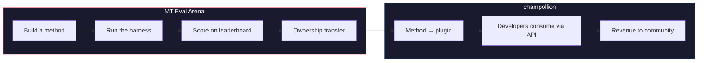

# The MT Eval Arena

> **Resumo Executivo.** O MT Eval Arena é uma plataforma aberta de benchmarking para métodos de tradução automática, com foco em idiomas onde a TA comercial não existe ou não foi verificada independentemente. Ele fornece avaliação padronizada, um leaderboard público e uma ponte de implantação para produção via champollion. Para idiomas indígenas, os métodos comprovados transferem a propriedade para a comunidade.

Um espaço aberto de testes para métodos de tradução automática — especialmente para idiomas onde a TA comercial não existe ou não foi verificada independentemente.

Construa um método. Faça benchmark. Prove que funciona. Se vencer, será implantado.

---

## O Problema

Google Translate suporta ~130 idiomas. NLLB-200 da Meta cobre ~200, e OMT-1600 (março de 2026) afirma cobrir 1.600. Existem mais de 7.000 falados na Terra. Para os ~1.300 idiomas nos níveis de recursos mais baixos do OMT-1600, os pesos do modelo não estão disponíveis, a qualidade está abaixo de limites utilizáveis, e a avaliação usou texto do domínio bíblico com métricas padrão de máquina — sem validação morfológica, sem testes independentes, sem governança comunitária. Para os ~5.400 idiomas restantes, nenhum modelo pré-treinado produz qualquer saída.

Big Tech agora está investindo em cobertura de idiomas de baixo recurso — mas cobertura sem verificação independente de qualidade, validação morfológica ou governança comunitária é cobertura sem confiança. Os falantes que mais precisam de ferramentas de tradução são as mesmas comunidades menos propensas a tê-las construídas.

**O Arena existe para mudar isso.** Ele fornece a infraestrutura para desenvolver, avaliar e implantar métodos de tradução para qualquer idioma — com pontuação reproduzível, submissão aberta e governança comunitária sobre quem controla os resultados.

---

## Como Funciona

1. **Você constrói um método de tradução** — LLM treinado, modelo fine-tuned, pipeline com FST-gating, ou qualquer outra coisa que produza traduções.
2. **O harness faz benchmark** — métricas padronizadas (chrF++, exact match, aceitação FST), com fingerprint para um commit Git específico.
3. **Os resultados aparecem no leaderboard** — cada submissão é reproduzível e comparável.
4. **Se vencer, a propriedade é transferida** — para idiomas indígenas, o código do método vencedor é transferido para a organização de governança comunitária.
5. **O método é implantado em produção** — via [champollion](https://champollion.dev), a API voltada para desenvolvedores. A receita retorna para a comunidade.

**Prove aqui. Implante lá.**

---

## Para Quem É Isso

| Você é... | O Arena oferece... |
|---|---|
| **Engenheiro de ML / pesquisador** | Benchmarks padronizados, pontuação reproduzível, um leaderboard para competir |
| **Linguista** | Um framework para transformar regras gramaticais e dicionários em métodos testáveis |
| **Membro da comunidade de idioma** | Governança sobre como os métodos do seu idioma são desenvolvidos e implantados |
| **Financiador / revisor de bolsas** | Métricas transparentes e reproduzíveis para avaliar propostas de pesquisa em tradução |
| **Estudante** | Um desafio aberto com impacto real — construa um método, envie suas pontuações |

---

## Benchmarks Atuais

### EDTeKLA Development Set v1
- **Par de idiomas:** English → Plains Cree (SRO)
- **Entradas:** 548 pares curados (486 livro didático + 62 padrão ouro)
- **Licença:** CC BY-NC-SA 4.0
- **Fonte:** [Grupo de pesquisa EdTeKLA](https://spaces.facsci.ualberta.ca/edtekla/), Universidade de Alberta

### FLORES+ Devtest
- **Pares de idiomas:** English → 39 idiomas
- **Entradas:** 1.012 sentenças por idioma
- **Licença:** CC BY-SA 4.0
- **Fonte:** [OLDI](https://huggingface.co/datasets/openlanguagedata/flores_plus)

---

## A Única Regra

:::danger Não treine com dados de avaliação
Métodos expostos ao conjunto de dados de benchmark — como dados de treinamento, exemplos few-shot, entradas de dicionário ou material de prompt — serão **desqualificados**. Fine-tune com o que quiser. Apenas não com o conjunto de teste.
:::

---

## Próximos Passos

- **[Envie um Método](/docs/getting-started/submit-a-method)** — como enviar sua primeira execução de benchmark
- **[Especificação de Benchmark](/docs/specifications/benchmark)** — o protocolo completo do experimento
- **[Regras do Leaderboard](/docs/leaderboard/rules)** — critérios de submissão e políticas anti-gaming
- **[Soberania de Dados](/docs/sovereignty/data-sovereignty)** — OCAP, CARE e por que a transferência de propriedade importa
- **[O Modelo Econômico](/docs/sovereignty/economic-model)** — como as pontuações do Arena se tornam receita comunitária

**[→ Ver o Leaderboard](https://champollion.dev/leaderboard)**