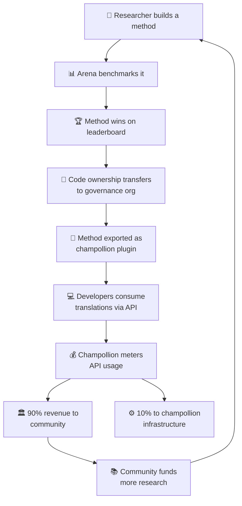

# O Modelo Econômico

> **Resumo Executivo.** Esta página descreve o ciclo econômico que conecta a Arena e champollion: pesquisa produz métodos, métodos são implantados como plugins, o uso da API gera receita, e 90% da receita flui para a comunidade linguística. Aborda o mecanismo de ciclo virtuoso, divisão de receita, camada de conveniência e o caso de sustentabilidade para financiadores.

A Arena e champollion formam um ciclo econômico fechado. Pesquisa na Arena produz métodos. Métodos são implantados através de champollion. Receita de champollion flui de volta para as comunidades cujas línguas os métodos servem.

---

## O Ciclo Virtuoso

Cada volta do ciclo fortalece o ecossistema:
- **Mais pesquisa** produz métodos melhores
- **Métodos melhores** atraem mais desenvolvedores
- **Mais desenvolvedores** geram mais receita de API
- **Mais receita** financia mais pesquisa liderada pela comunidade

---

## Como a Receita Flui

Quando um desenvolvedor usa um método de propriedade comunitária através da API champollion:

| Etapa | O que Acontece |
|---|---|
| Desenvolvedor chama `champollion sync` ou a API REST | Traduções são produzidas pelo método de propriedade comunitária |
| Champollion mede a chamada da API | O uso é rastreado por requisição, por par de idiomas |
| Receita é dividida | **90%** vai para a organização de governança que possui o método. **10%** cobre custos de infraestrutura de champollion. |
| Comunidade decide a alocação | Receita financia programas de idioma, pesquisa adicional, recursos comunitários — o que a organização de governança decidir |

### A Camada de Conveniência

Champollion também oferece configurações otimizadas para métodos comuns. Se um pesquisador prova que Gemini 2.5 Pro com dados de coaching específicos e configurações de temperatura produz os melhores resultados para um par de idiomas, essa configuração está disponível como uma predefinição pré-construída através da API champollion. Desenvolvedores não precisam replicar a pesquisa — eles apenas chamam a API.

A Arena estabelece as linhas de base. Champollion as torna acessíveis. Comunidades se beneficiam de ambas.

---

## Para Idiomas Padrão

O ciclo virtuoso é mais impactante para idiomas indígenas e de baixo recurso, onde a transferência de propriedade e o modelo de receita comunitária se aplicam.

Para idiomas padrão (francês, japonês, espanhol, etc.), champollion oferece a mesma conveniência de API sem a camada de governança — desenvolvedores pagam por acesso medido a métodos de tradução pré-configurados, e champollion recebe uma parte de infraestrutura.

---

## Para Financiadores

O modelo econômico aborda uma preocupação comum no financiamento de tecnologia de idiomas: **sustentabilidade após o término da bolsa.**

| Modelo Tradicional | Modelo da Arena |
|---|---|
| Bolsa financia pesquisa | Bolsa financia pesquisa |
| Artigo publicado | Método implantado em produção |
| Bolsa termina, ferramenta abandonada | Receita de API sustenta operações |
| Comunidade não recebe nada | Comunidade possui o ativo e ganha receita |

Um único método bem-sucedido cria um fluxo de receita autossustentável. Financiadores podem medir impacto não apenas em publicações, mas em:
- Uso de API (quantos desenvolvedores estão usando o método)
- Receita gerada (quanto dinheiro flui para a comunidade)
- Métricas de qualidade (pontuações do leaderboard ao longo do tempo)
- Cobertura de idiomas (quantos pares de idiomas são servidos)

Veja a [Especificação de Benchmark](/docs/specifications/benchmark), §10 para modelos de custo detalhados.

---

## Veja Também

- [Transferência de Propriedade](/docs/sovereignty/ownership-transfer) — o processo de transferência legal e técnica
- [Soberania de Dados](/docs/sovereignty/data-sovereignty) — princípios OCAP, CARE e Te Mana Raraunga
- [Regras do Leaderboard](/docs/leaderboard/rules) — como métodos se qualificam para implantação