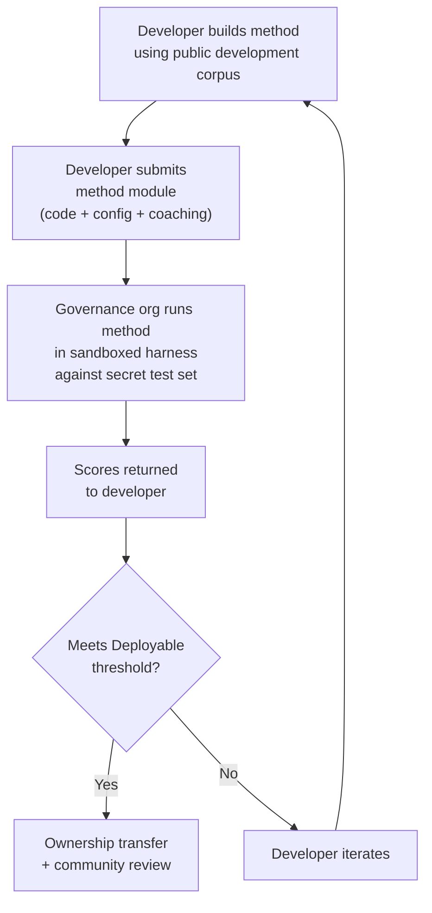

# Especificação de Benchmark

> **Resumo Executivo.** Este documento define o protocolo de avaliação do ecossistema de avaliação de MT Champollion: formato de corpus (§2), esquema de run card (§3), protocolo de benchmark (§6), requisitos de validação humana (§7), mecanismos de soberania (§8), modelo de leaderboard e submissão (§9), framework de custos (§10) e extensibilidade para novos idiomas (§11). Para definições de métricas, pesos de pontuação composta, limites de tier de qualidade e fórmulas de métricas de custo/velocidade, consulte `SCORING_SPEC.md` — a fonte única de verdade para toda a lógica de pontuação. Este documento referencia SCORING_SPEC para esses detalhes em vez de duplicá-los.
>
> Última atualização: 2026-06-07

---

## 1. Princípios

### 1.1 Métricas Automatizadas São Proxies

Toda métrica definida neste documento é computada por máquina. chrF++, aceitação FST, acurácia morfológica, similaridade semântica — todas elas são proxies automatizados para qualidade de tradução. Elas são úteis para iteração rápida, comparação sistemática e detecção de regressões. Elas **não são substitutos para julgamento humano**.

A hierarquia de avaliação:

```
Automated metrics (run cards, benchmarks)
    ↓ proxy for
Human review (bilingual speakers validate output)
    ↓ proxy for
Actual utility (does this help a language community?)
```

Nenhuma pontuação automatizada, por mais alta que seja, pode substituir um falante fluente lendo o resultado e confirmando que está correto, natural e culturalmente apropriado. Os tiers de qualidade definidos em §5 são rótulos heurísticos em pontuações compostas automatizadas — úteis para rastrear progresso, mas nunca suficientes por si só.

### 1.2 Métodos, Não Modelos

Nós avaliamos **métodos**, não modelos. Um modelo é um componente. Um método é a receita completa: seleção de modelo, design de prompt, uso de ferramentas, pré/pós-processamento, dados de coaching, estratégias de retry, tudo. Dois times usando o mesmo modelo com métodos diferentes obterão pontuações diferentes. Esse é o ponto.

### 1.3 Reprodutibilidade

Todo resultado de benchmark deve ser reprodutível. O run card (§3) captura a configuração completa de um experimento. A fingerprint (§3.5) identifica a configuração experimental. O hash do run card (§3.6) verifica a integridade do resultado. Qualquer pessoa com o mesmo método, corpus e configuração deve alcançar pontuações dentro de ±2% (considerando não-determinismo de amostragem de LLM em temperatura > 0).

### 1.4 Sem Dados de Avaliação Sintéticos

**Este projeto não gera, usa ou endossa dados de avaliação sintéticos.** Todos os corpora devem ser originários de texto genuinamente autoral — traduções publicadas, livros didáticos, documentos bilíngues ou traduções elicitadas de falantes fluentes.

LLMs podem auxiliar com:
- Alinhamento de sentenças (encontrando passagens paralelas em textos bilíngues existentes)
- Conversão de formato (convertendo materiais publicados para o esquema de corpus)
- Enriquecimento de metadados (sugerindo tiers de dificuldade, rótulos de registro)
- Propondo sentenças-fonte para tradução humana (§11.3 — o passo de tradução é sempre humano)

LLMs **nunca** devem gerar traduções de referência ou pares de avaliação.

**Somos neutros em desenvolvimento em relação aos dados de treinamento.** Se um desenvolvedor de método usa dados de treinamento sintéticos, retrotradução ou aumento de dados em seu método, essa é sua escolha — nós avaliamos o resultado, não o processo de treinamento. O OMT-1600 da Meta usa aproximadamente 270 milhões de sentenças paralelas sintéticas geradas via retrotradução. Não temos objeção a métodos treinados dessa forma. Testamos apenas em curação humana.

> **Por que não texto da Bíblia para avaliação?** OMT-1600 avalia 1.560 de 1.600 idiomas em texto do domínio Bíblia. Traduções bíblicas têm registro arcaico, vocabulário litúrgico e estrutura de sentença formulaica. Nossos corpora de avaliação são originários de texto curado pela comunidade, diverso em domínios — saúde, legal, educacional, governamental, conversacional e técnico (ver §2.7). Esta é uma escolha de design deliberada. As comunidades precisam de tradução para os domínios onde realmente vivem e trabalham, não um único registro religioso. Um método que pontua bem em Gênesis 1:1 diz quase nada sobre seu desempenho em uma agenda de conselho de banda ou um formulário de admissão de clínica.

---

## 2. Esquema de Corpus

Um corpus é um conjunto curado de pares de texto paralelo com metadados estruturados. É a verdade fundamental contra a qual todos os métodos são medidos.

### 2.1 Envelope do Dataset

A estrutura de nível superior de um arquivo de corpus:

```json
{
  "dataset": {
    "id": "edtekla-dev-v1",
    "version": "1.0",
    "language_pair": "EN→CRK",
    "source_language": "en",
    "target_language": "crk",
    "created": "2026-05-01",
    "license": "CC-BY-NC-SA-4.0",
    "provenance": ["gold_standard", "textbook"]
  },
  "entries": [ ... ]
}
```

| Campo | Tipo | Obrigatório | Descrição |
|-------|------|-----------|-----------|
| `id` | string | ✅ | Identificador único do dataset, usado em run cards e leaderboard |
| `version` | string | ✅ | Versão semântica. Incrementar invalida comparações anteriores de run card |
| `language_pair` | string | ✅ | Rótulo de exibição (ex: `EN→CRK`) |
| `source_language` | string | ✅ | Código de idioma de origem BCP 47 |
| `target_language` | string | ✅ | Código de idioma de destino BCP 47 |
| `created` | string | ✅ | Data de criação ISO 8601 |
| `license` | string | ✅ | Identificador de licença SPDX |
| `provenance` | string[] | ✅ | Lista de tags de proveniência usadas em todas as entradas |

### 2.2 Esquema de Entrada

Cada entrada no corpus representa um desafio de tradução:

```json
{
  "id": 42,
  "source": "I see the dog",
  "reference": "niwâpamâw atim",
  "segment": "gold_standard",
  "difficulty": 2,
  "provenance": "gold_standard",
  "register": "conversational",
  "context": "declaration",
  "morphological_analysis": "ni-wâpam-âw atim | 1sg-see.TA-3sg.DIR dog.AN",
  "notes": "Animate noun (atim); direct form because speaker is proximate",
  "variant_class": "simple-ta-direct"
}
```

| Campo | Tipo | Obrigatório | Descrição |
|-------|------|-----------|-----------|
| `id` | integer | ✅ | Identificador único dentro do corpus |
| `source` | string | ✅ | Texto de origem no idioma de origem |
| `reference` | string | ✅ | Tradução de referência padrão-ouro no idioma de destino |
| `segment` | string | 📎 | Partição de corpus: `gold_standard`, `held_out`, `development` ou `diagnostic` |
| `difficulty` | integer | 📎 | Classificação de dificuldade 1–5 (ver §2.4) |
| `provenance` | string | 📎 | Origem desta entrada (ver §2.5) |
| `register` | string | 📎 | Nível de registro/formalidade (ver §2.6) |
| `context` | string | 📎 | Função comunicativa (ver §2.6) |
| `domain` | string | 📎 | Domínio de caso de uso da taxonomia de 16 códigos (ver §2.7). Deve ser um de: `conv`, `ecommerce`, `edu`, `financial`, `gov`, `legal`, `literary`, `marketing`, `medical`, `news`, `religious`, `scientific`, `subtitles`, `support`, `tech`, `ui`. Validado no tempo de construção. |

> **📎 = RECOMENDADO.** O harness lida com campos opcionais ausentes graciosamente via padrões. Corpora de terceiros precisam apenas fornecer `id`, `source` e `reference` por entrada.
| `morphological_analysis` | string | ❌ | Análise morfológica padrão-ouro |
| `notes` | string | ❌ | Notas do tradutor, variantes dialetais, sinalizadores de ambiguidade |
| `variant_class` | string | ❌ | Rótulo de classe agrupando variantes de tradução aceitáveis |


### 2.3 Segmentos de Corpus

O corpus é dividido em segmentos com diferentes níveis de acesso:

| Segmento | Propósito | Acesso | Tamanho Mínimo |
|----------|-----------|--------|----------------|
| `development` | Desenvolvimento e iteração de método. Desenvolvedores usam livremente. | **Público** | 30 entradas |
| `diagnostic` | Testes direcionados para fenômenos linguísticos específicos. | **Público** | 10 entradas |
| `gold_standard` | Avaliação oficial de benchmark. Pontuações de leaderboard vêm daqui. | **Secreto** — mantido por org de governança | 50 entradas |
| `held_out` | Reservado para avaliação futura. Nunca usado até ser ativado. | **Secreto** — mantido por org de governança | 10 entradas |

> **Estado atual:** Apenas o segmento `development` existe em datasets enviados. Os segmentos `diagnostic`, `gold_standard` e `held_out` são definidos para uso futuro conforme os corpora crescem.

Os segmentos `gold_standard` e `held_out` são totalmente secretos. Tanto as sentenças de origem quanto as traduções de referência são mantidas em infraestrutura controlada por governança. Desenvolvedores de método nunca veem as perguntas ou as respostas. Ver §8 para o mecanismo de soberania.

### 2.4 Tiers de Dificuldade

| Tier | Descrição | Exemplos |
|------|-----------|----------|
| 1 — Vocabulário básico | Palavras únicas, saudações comuns, números | "hello" → "tânisi", "dog" → "atim" |
| 2 — Sentenças simples | Sujeito-verbo ou SVO, tempo presente | "I see the dog" → "niwâpamâw atim" |
| 3 — Complexidade moderada | Tempo passado/futuro, possessivos, animacidade | "I saw his dog yesterday" |
| 4 — Morfologia complexa | Obviation, voz passiva, ordem conjunta, orações relativas | "the woman whose son went to the store" |
| 5 — Avançado | Multi-cláusula, registro formal, cerimonial, idiomático | Parágrafo completo com tom apropriado ao registro |

Um corpus bem construído deve incluir entradas em todos os cinco tiers de dificuldade, ponderado em direção aos tiers 2–4 onde caem a maioria dos desafios de tradução do mundo real.

### 2.5 Tags de Proveniência

Toda entrada deve indicar sua origem:

| Tag | Significado |
|-----|-------------|
| `gold_standard` | Verificado por falantes fluentes |
| `textbook` | De materiais educacionais publicados |
| `elicited` | Produzido através de sessões de elicitação estruturada |
| `corpus` | Extraído de um corpus paralelo |

> **Nota:** Na prática, valores de proveniência são strings de forma livre. As tags acima são convenções, não um enum validado — datasets podem usar outras strings de proveniência descritivas.

### 2.6 Registro e Contexto

**Registro** descreve a formalidade e contexto social:

| Registro | Descrição |
|----------|-----------|
| `conversational` | Fala cotidiana entre iguais |
| `formal` | Linguagem oficial ou institucional |
| `technical` | Vocabulário específico do domínio |
| `ceremonial` | Uso de linguagem tradicional ou sagrada |
| `educational` | Materiais de ensino de idioma |

**Contexto** descreve a função comunicativa:

> 🔲 **Planejado.** O campo `context` é definido no esquema mas ainda não preenchido em datasets atuais. É reservado para enriquecimento futuro de corpus.

| Contexto | Descrição |
|----------|-----------|
| `greeting` | Saudação social ou despedida |
| `declaration` | Declaração de fato |
| `question` | Interrogativa |
| `instruction` | Comando ou diretiva |
| `narrative` | Narrativa ou descrição |
| `label` | Rótulo de UI, texto de botão ou título |
| `error` | Mensagem de erro ou aviso |

### 2.7 Domínio {#27-domain}

**Domínio** descreve o caso de uso do mundo real — o tipo de conteúdo sendo traduzido. Isto é ortogonal a registro e contexto:

- **Registro** responde: *Quão formal é isto?*
- **Contexto** responde: *O que esta sentença está fazendo?*
- **Domínio** responde: *Para qual indústria/caso de uso isto é?*

Um contrato legal (domínio: `legal`) pode ser formal (registro: `formal`) e conter uma declaração (contexto: `declaration`). Uma transcrição de chatbot legal (domínio: `legal`) pode ser conversacional (registro: `conversational`) e conter perguntas (contexto: `question`). Mesmo domínio, registro e contexto diferentes.

| Código de Domínio | Descrição | Consumidores Típicos |
|-------------------|-----------|---------------------|
| `ui` | Strings de interface de software | Desenvolvedores de app, times de localização |
| `legal` | Contratos, estatutos, petições judiciais, documentos de imigração | Escritórios de advocacia, tribunais, times de conformidade, advogados de PI |
| `medical` | Notas clínicas, rótulos de drogas, comunicações de paciente, protocolos de ensaio | Hospitais, pharma, ensaios clínicos, portais de paciente |
| `financial` | Bancário, seguros, arquivos regulatórios, relatórios de auditoria | Bancos, seguradoras, reguladores, auditores |
| `edu` | Livros didáticos, currículos, planos de aula, materiais acadêmicos | Escolas, universidades, editoras de livros didáticos |
| `ecommerce` | Descrições de produto, avaliações, listagens de marketplace | Varejistas online, vendedores de marketplace |
| `marketing` | Copy de anúncio, mensagens de marca, campanhas, slogans | Agências de publicidade, times de marca |
| `gov` | Documentos de política, regulações, avisos públicos, legislação | Agências governamentais, times de conformidade |
| `scientific` | Artigos de pesquisa, abstracts, metodologia, propostas de bolsa | Pesquisadores, periódicos, agências de bolsa |
| `religious` | Escritura, textos litúrgicos, comentário teológico | Comunidades de fé, editoras litúrgicas |
| `support` | FAQs, mensagens de erro, guias de solução de problemas, scripts de chatbot | Empresas SaaS, help desks |
| `subtitles` | Filme, TV, streaming e diálogo de jogos | Plataformas de streaming, estúdios, empresas de jogos |
| `news` | Jornalismo, relatórios de agência, editorial, comunicados de imprensa | Organizações de mídia, agências de notícias |
| `literary` | Ficção, poesia, narrativa, textos culturais | Editoras, orgs de preservação cultural |
| `conv` | Conversa informal, mídia social, mensagens | Apps de consumidor, plataformas sociais |
| `tech` | Docs de API, manuais, especificações de engenharia, guias técnicos | Times de documentação, orgs de engenharia |

> **Benchmarks específicos de domínio.** O benchmark geral avalia um método em todos os domínios. Mas a Arena também suporta **benchmarks filtrados por domínio** — onde pontuações são computadas apenas em entradas marcadas com um domínio específico. Isto permite aos usuários responder: "Qual método é melhor para traduzir documentos legais para francês?" vs. "Qual método tem a melhor pontuação geral de francês?"
>
> Rankings de leaderboard filtrados por domínio são uma característica-chave do produto. Diferentes métodos terão desempenho diferente em domínios — um método fine-tuned em terminologia legal pode dominar benchmarks legais mas ter desempenho inferior em texto conversacional. A Arena ajuda usuários a encontrar a solução que funciona melhor para seu caso de uso específico.

> **Futuro: Chatbot da Arena.** O website da Arena incluirá um assistente conversacional que ajuda usuários a descrever seu caso de uso de MT (domínio, par de idiomas, requisitos de qualidade) e recomenda o melhor método validado pela comunidade do leaderboard. Por exemplo: "Preciso traduzir protocolos de ensaios clínicos de inglês para japonês — qual método pontua mais alto em benchmarks de domínio médico EN→JA?" Isto depende de ter dados de avaliação suficientes marcados por domínio e diversidade de método.

---

## 3. Esquema de Run Card {#3-run-card-schema}

O run card é a unidade atômica de avaliação. É um documento JSON auto-contido que registra a configuração completa e resultados de uma única execução de avaliação: um método, um modelo, uma configuração, um dataset.

Todo run card captura três dimensões:
- **Qualidade** — quão boas são as traduções?
- **Custo** — quanto custou produzi-las?
- **Velocidade** — quanto tempo levou?

### 3.1 Campos de Nível Superior

| Campo | Tipo | Descrição |
|-------|------|-----------|
| `run_id` | string | UUID v4 gerado no início da execução |
| `harness_version` | string | Versão semântica do harness (ex: `2.0`) |
| `timestamp` | string | Timestamp UTC ISO 8601 quando a execução começou |
| `elapsed_seconds` | number | Duração de wall-clock de toda a execução |

### 3.2 Configuração de Método

Estes campos definem a configuração experimental — o que foi testado e como.

| Campo | Tipo | Obrigatório | Descrição |
|-------|------|-----------|-----------|
| `model_slug` | string | ✅ | Identificador de modelo (ex: `google/gemini-2.5-flash`) |
| `model_id` | string | ❌ | Identificador de modelo resolvido retornado pela API |
| `condition` | string | ✅ | Rótulo de experimento (ex: `baseline`, `coached-v3`, `few-shot`) |
| `temperature` | number | ✅ | Temperatura de amostragem |
| `system_prompt_sha256` | string | ✅ | Hash SHA-256 do prompt de sistema completo |
| `system_prompt_used` | string | ✅ | Texto do prompt de sistema completo |
| `coaching_data_sha256` | string | ❌ | Hash SHA-256 do arquivo de dados de coaching, se usado |
| `fst_version` | string | ❌ | Versão do analisador FST, se usado |
| `tools_enabled` | string[] | ❌ | Lista de ferramentas disponíveis para o método |
| `batch_size` | number | ❌ | Entradas por lote de API concorrente |
| `max_retries` | number | ❌ | Máximo de retries para rejeição FST, se aplicável |

:::info Run Cards Publicados Incluem method_config
Quando um run card é publicado no leaderboard (via `mt-eval publish`), ele também inclui um bloco `method_config` contendo o MethodConfig canônico de 8 campos (`model`, `temperature`, `batchSize`, `register`, `coachingFile`, `coachingPrompt`, `promptContext`, `qualityTier` — todos camelCase). Isto permite importação zero-reconstrução: `champollion leaderboard --install` lê `method_config` diretamente e escreve como um manifesto de plugin. Os campos de telemetria acima (§3.2) registram o que o harness observou; `method_config` registra o que o desenvolvedor pretendia.
:::

### 3.3 Referência de Dataset

| Campo | Tipo | Descrição |
|-------|------|-----------|
| `dataset.id` | string | Identificador de dataset |
| `dataset.version` | string | Versão de dataset |
| `dataset.language_pair` | string | Rótulo de exibição |
| `dataset.sha256` | string | Hash SHA-256 do conteúdo do arquivo de dataset |
| `dataset.entry_count` | number | Número de entradas avaliadas |

O SHA-256 do dataset fixa o resultado a uma versão específica dos dados. Se o dataset mudar, run cards antigos não são comparáveis.

### 3.4 Pontuações (Qualidade)

Métricas agregadas para toda a execução. Todas as métricas de qualidade são **automatizadas** — ver §1.1.

| Campo | Tipo | Descrição |
|-------|------|-----------|
| `scores.total` | number | Total de entradas avaliadas |
| `scores.exact_matches` | number | Entradas onde a saída correspondeu exatamente à referência |
| `scores.exact_match_rate` | number | 0.0–1.0 |
| `scores.equivalent_matches` | number | Entradas correspondendo a uma variante aceitável |
| `scores.equivalent_match_rate` | number | 0.0–1.0 |
| `scores.fst_accepted` | number | Entradas aceitas pelo analisador FST |
| `scores.fst_acceptance_rate` | number | 0.0–1.0, `null` se nenhum FST configurado |
| `scores.morphological_accuracy` | number | 0.0–1.0, `null` se nenhuma análise padrão-ouro |
| `scores.chrf_plus_plus` | number | Pontuação chrF++ de nível de corpus (0–100) |
| `scores.semantic_score` | number | Similaridade semântica baseada em embedding (0.0–1.0) |
| `scores.ter` | number | Translation Edit Rate (0–∞, menor é melhor) |
| `scores.length_ratio` | number | avg(len(predicted)/len(reference)), ideal = 1.0 |
| `scores.code_switching_rate` | number | 0.0–1.0, fração de entradas com vazamento de linguagem de origem |
| `scores.hallucination_rate` | number | 0.0–1.0, fração de entradas com conteúdo alucinado |
| `scores.terminology_adherence` | number | 0.0–1.0, aderência a termos de glossário (`null` se nenhum glossário) |
| `scores.tokens_per_second` | number | total_tokens / elapsed_seconds |
| `scores.entries_per_minute` | number | entradas traduzidas por minuto |
| `scores.composite` | number | Pontuação composta ponderada (0.0–1.0). Ver SCORING_SPEC §4 |
| `scores.errors` | number | Entradas que falharam (erro de API, timeout, etc.) |
| `scores.by_difficulty` | object | Pontuações divididas por tier de dificuldade |
| `scores.by_provenance` | object | Pontuações divididas por tag de proveniência |
| `scores.by_domain` | object | ✅ Implementado — Pontuações divididas por domínio (§2.7). Permite ranking de leaderboard filtrado por domínio. Computado por tester.py e passado através de publish.py. |

### 3.5 Totais (Custo)

| Campo | Tipo | Descrição |
|-------|------|-----------|
| `totals.prompt_tokens` | number | Total de tokens de entrada em todas as chamadas de API |
| `totals.completion_tokens` | number | Total de tokens de saída |
| `totals.reasoning_tokens` | number | Tokens usados para chain-of-thought (0 para a maioria dos modelos) |
| `totals.cached_tokens` | number | Tokens servidos do cache de prompt do provedor |
| `totals.total_cost_usd` | number | Custo total em USD |
| `totals.cost_per_entry_usd` | number | `total_cost_usd / entry_count` |
| `totals.cost_per_source_char` | number | USD por caractere de origem — comparável entre idiomas |

### 3.6 Timing (Velocidade)

| Campo | Tipo | Descrição |
|-------|------|-----------|
| `elapsed_seconds` | number | Duração de wall-clock de toda a execução (nível superior) |
| `scores.avg_latency_seconds` | number | Tempo de resposta médio por entrada |
| `scores.median_latency_seconds` | number | Tempo de resposta mediano por entrada |
| `scores.p95_latency_seconds` | number | Tempo de resposta do 95º percentil por entrada |

### 3.7 Resultados Por Entrada

Cada entrada no array `results[]` registra uma tradução. Dados por entrada são persistidos na tabela `run_card_entries` (migração 005) com verdicts LYSS denormalizados (migração 006).

| Campo | Tipo | Descrição |
|-------|------|-----------|
| `entry_id` | string | Corresponde a `entries[].id` no corpus |
| `source` | string | Texto de origem que foi traduzido |
| `expected` | string | Tradução de referência padrão-ouro |
| `raw_predicted` | string \| null | Saída bruta do modelo antes do pós-processamento |
| `predicted` | string | Saída real do método (pós-processada) |
| `segment` | string | Identificador de segmento (ex: índice de sentença) |
| `difficulty` | string \| null | Tier de dificuldade do corpus |
| `domain` | string | Tag de domínio do corpus (§2.7) |
| `exact_match` | boolean | Se a saída correspondeu exatamente à referência |
| `chrf_score` | number \| null | chrF++ de nível de sentença (0–100) |
| `bleu_score` | number \| null | BLEU de nível de sentença (0–100) |
| `latency_s` | number \| null | Tempo de resposta em segundos |
| `cost_usd` | number \| null | Custo em USD para esta entrada |
| `tool_call_count` | integer | Número de chamadas de ferramenta usadas (0 se nenhuma) |
| `error` | string \| null | Mensagem de erro se esta entrada falhou |
| `plugin_metrics` | object | Saída completa de plugin por entrada (JSONB) |
| `fst_valid` | boolean \| null | FST GiellaLT aceitou a predição (LYSS-fst denormalizado) |
| `equivalent_match` | boolean \| null | Linter CRK confirmou equivalência estrutural (LYSS-eq denormalizado) |
| `semantic_verdict` | string \| null | Verdict LYSS-sem: `VALID`, `MISMATCH`, `UNKNOWN`, `ERROR` |
| `code_switching_detected` | boolean \| null | Tokens de linguagem de origem detectados na saída |
| `hallucination_detected` | boolean \| null | Conteúdo fabricado detectado na saída |


### 3.8 Fingerprint

Um identificador de reprodutibilidade. Duas execuções com fingerprints idênticas usaram a mesma configuração experimental.

A fingerprint é o hash SHA-256 da concatenação ordenada de:
- `dataset.sha256`
- `model_slug`
- `condition`
- `system_prompt_sha256`
- `temperature`
- `harness_version`
- `batch_size`
- `tools_enabled`

> **Por que 8 componentes?** Tamanho de lote e tool-calling afetam materialmente a qualidade de saída e devem ser incluídos na identidade. Duas execuções com tamanhos de lote diferentes ou ferramentas diferentes habilitadas são configurações experimentais diferentes, mesmo que todos os outros parâmetros correspondam.

Duas execuções com fingerprints idênticas devem produzir resultados comparáveis. Diferenças são devidas a não-determinismo de API (temperatura > 0) ou atualizações de modelo do lado do provedor.

### 3.9 Hash do Run Card

O hash SHA-256 de todo o JSON do run card (com o campo `run_card_hash` em si definido como `""` durante o hashing). Este é o selo de detecção de adulteração. Se qualquer campo mudar, o hash quebra.

---

## 4. Métricas Automatizadas

Todas as métricas nesta seção são computadas por máquina. Ver §1.1.

### 4.1 Definições de Métrica

| Métrica | Status | O Que Mede | Intervalo |
|---------|--------|-----------|-----------|
| **chrF++** | ✅ Implementado | F-score de n-grama de caractere. Opera no nível de caractere, tornando-o mais robusto que métricas de nível de palavra (BLEU) para idiomas morfologicamente ricos onde palavras são longas e altamente flexionadas. Computado por sacrebleu. | 0–100 (escala nativa). Dividido por 100 quando usado em composto. |
| **Taxa de aceitação FST** | ✅ Implementado | Fração de palavras preditas aceitas pelo analisador morfológico (GiellaLT HFST) como formas válidas no idioma de destino. Uma palavra que o FST aceita é uma palavra real, estruturalmente válida — não uma alucinação. | 0.0–1.0 |
| **Correspondência exata** | ✅ Implementado | Fração de predições que correspondem exatamente à referência após normalização Unicode. Rigoroso mas inequívoco — útil como verificação de teto. | 0.0–1.0 |
| **Acurácia morfológica** | 🔲 Planejado | Para entradas com análise morfológica padrão-ouro: fração de morfemas gerados corretamente. Mais granular que aceitação FST — uma palavra pode ser FST-válida mas ter a estrutura de morfema errada (raiz correta, tempo errado). | 0.0–1.0 |
| **Correspondência equivalente** | ⚡ Parcial | Fração correspondendo a uma variante aceitável da referência — contabilizando ordem de palavras, diferenças dialetais e convenções ortográficas. Atualmente implementado para CRK via o padrão de avaliação CRK's `CrkLinterMetric` (em `eval_standards/crk/`); carregado automaticamente via declaração `evalMetrics` do language card CRK. Implementação genérica requer `variants[]` por entrada no corpus. | 0.0–1.0 |
| **Pontuação semântica** | ⚡ Parcial | Preservação de significado independentemente da forma de superfície. Atualmente implementado para CRK via o padrão de avaliação CRK's `CrkSemanticMetric` (em `eval_standards/crk/`, proxy ponderado por verdict). Similaridade de coseno baseada em embedding universal é planejada — ver SCORING_SPEC §2.3. | 0.0–1.0 |

### 4.2 Pontuação Composta

A pontuação composta é uma média ponderada de todas as métricas *disponíveis*:

```
composite = Σ (weight_i × metric_i)   for all available metrics
             ─────────────────────
             Σ weight_i              (renormalized to sum to 1.0)
```

Quando uma métrica não está disponível (nenhum FST configurado, nenhuma classe de variante definida, nenhum modelo de embedding), seu peso é redistribuído proporcionalmente entre as métricas restantes. Isto significa que a composta é sempre comparável dentro de um idioma — ela usa qualquer métrica disponível para esse idioma e normaliza de acordo.

**Tabelas de peso, regras de normalização de entrada e o inventário completo de métrica são definidos em `SCORING_SPEC.md` §4.** Esse documento é o SSOT para:
- Pesos do Perfil A (idiomas com cobertura FST — 9 métricas, métricas estruturais carregam 40%)
- Pesos do Perfil B (idiomas sem cobertura FST — 8 métricas)
- Regras de normalização (chrF++ ÷ 100, inversão de taxa de code-switching e alucinação)
- Métricas excluídas da composta (BLEU, COMET, TER, razão de comprimento, consistência) e por quê

O código do harness espelha essas tabelas em `mt_eval_harness/scoring.py`. Quando SCORING_SPEC muda, `scoring.py` é atualizado para corresponder e `test_scoring_ssot.py` valida alinhamento.

> **Por que não BLEU?** BLEU opera no nível de palavra e penaliza variação morfológica. Para idiomas polissintéticos, uma única palavra pode ser uma cláusula inteira — BLEU trataria diferenças flexionais menores como falhas completas. chrF++ lida com isto melhor operando no nível de caractere. BLEU é excluído de ambas as tabelas de peso. Ver SCORING_SPEC Apêndice A para a rationale completa.


### 4.3 Pontuação Ajustada por Custo

Para métodos usando APIs pagas, também relatamos um ranking secundário. A fórmula ajustada por custo é definida em `SCORING_SPEC.md` §6.3.

---

## 5. Tiers de Qualidade {#5-quality-tiers}

Tiers de qualidade são rótulos heurísticos em pontuações compostas automatizadas. Eles descrevem o que as pontuações tendem a significar na prática, baseado em revisão humana de saídas em cada nível. **Eles não são julgamentos de qualidade validados** — apenas revisão humana (§6) pode confirmar usabilidade real.

**Os limites de tier e descrições são definidos em `SCORING_SPEC.md` §5.** Os tiers são: Baseline (0.00–0.30), Emerging (0.30–0.50), Functional (0.50–0.70), Deployable (0.70–0.85) e Fluent (0.85–1.00).

> [!IMPORTANT]
> **Tiers automatizados são provisórios.** Esses rótulos são indicações para revisão, não declarações de qualidade. Um método atingindo "Deployable" em métricas automatizadas é um candidato para avaliação comunitária — não um produto para enviar. Apenas revisão humana (§7) pode confirmar usabilidade real. Limites de tier podem diferir entre idiomas.

Esses tiers são provisórios. Eles serão recalibrados conforme dados de validação humana se acumulam e aprendemos onde o limiar real de "um falante acha isto útil" cai para cada idioma. Os limites de tier podem diferir entre idiomas.

Nenhum método pode reivindicar **Deployable** ou acima sem revisão comunitária confirmando que falantes bilíngues concordam que a saída é utilizável.

---

## 6. Protocolo de Benchmark

Um **benchmark** é a produção sistemática de run cards em um espaço de parâmetro declarado em um dataset dado. Não é uma única execução — é uma exploração estruturada de como diferentes configurações se desempenham.

### 6.1 O Que um Benchmark Produz

Um benchmark produz uma **matriz de run cards** — um para cada combinação de valores de parâmetro. A matriz permite comparação multifacetada em:

- **Qualidade** — pontuação composta, breakdowns de métrica individual
- **Custo** — custo total e por entrada para cada configuração
- **Velocidade** — tempo de wall-clock e latência por entrada

Não há uma única "pontuação de benchmark". O benchmark é a matriz completa. Diferentes stakeholders se importarão com diferentes facetas: um pesquisador otimiza para pontuação composta, um engenheiro de deployment otimiza para custo-por-entrada, uma comunidade revisa qualidade.

### 6.2 Espaço de Parâmetro

Um benchmark declara quais parâmetros são permutados:

| Eixo | Valores Típicos | Propósito |
|------|-----------------|----------|
| `model` | 4–12 modelos (frontier + mid-tier + budget) | Quanto a capacidade do modelo importa? |
| `temperature` | 0.0, 0.3, 0.7 | A aleatoriedade de amostragem ajuda ou prejudica? |
| `prompt_version` | 2–3 estratégias de prompt | Quão sensível é o método ao design de prompt? |
| `coaching_config` | com/sem dados de coaching | Injetar conhecimento linguístico melhora a saída? |
| `tool_config` | com/sem FST, com/sem dicionário | Ferramentas linguísticas melhoram a saída? |

O espaço de permutação completo:
```
runs = |models| × |temperatures| × |prompts| × |coaching| × |tools|
```

Um benchmark inicial típico: 12 modelos × 3 temperaturas × 2 prompts × 2 coaching = 144 execuções.

### 6.3 Avaliação de Baseline vs. Método

Um benchmark serve dois propósitos distintos:

**Baselining** — mapeando a paisagem com abordagens ingênuas. "O que os modelos existentes podem fazer para este idioma sem nenhuma engenharia específica de idioma?" Isto estabelece a barra. A matriz de baseline diz: quais modelos alucinam menos, quais temperaturas produzem a saída mais consistente, se dados de coaching ajudam em tudo, onde todos os modelos falham uniformemente (que revela problemas linguísticos difíceis).

**Avaliação de método** — testando um método específico engenheirado. "Meu pipeline coached gated-FST bate os baselines?" O run card do método é comparado contra a matriz de baseline. Um método é interessante quando supera o melhor baseline — quando engenharia adiciona valor sobre chamadas de modelo ingênuas.

Ambas as atividades produzem run cards com o mesmo esquema. A distinção está na intenção e no espaço de parâmetro: baselines permutam entre modelos e configs; avaliação de método testa um método contra as melhores configurações.

### 6.4 Avaliação Dev vs. Padrão-Ouro

Desenvolvedores de método iteram livremente contra segmentos de corpus `development` e `diagnostic`. Isto é informal — sem limites, sem submissões, sem envolvimento de governança. O desenvolvedor está aprendendo o que funciona.

Pontuações oficiais de leaderboard vêm apenas de avaliação `gold_standard`. Isto é formal:
1. Desenvolvedor submete seu método completo e executável (código + config + dados de coaching)
2. Org de governança o executa em um harness sandboxed contra o conjunto de teste secreto
3. Apenas pontuações voltam

Ver §8 para o mecanismo completo de soberania.

---

## 7. Validação Humana {#7-human-validation}

Métricas automatizadas são proxies. Validação humana é a verdade fundamental.

### 7.1 O Que Revisão Humana Detecta Que Métricas Perdem

- **Morfologicamente válido mas semanticamente errado** — o FST aceita a palavra, chrF++ é alto, mas a tradução significa algo diferente
- **Culturalmente inapropriado** — a tradução é tecnicamente correta mas usa registro ou enquadramento que uma comunidade rejeitaria
- **Plausibilidade alucinada** — a saída parece o idioma de destino para um não-falante mas é gibberish para um falante fluente
- **Variação aceitável mas não marcada** — a saída está correta mas as métricas automatizadas a marcam errada porque usa uma variante dialetal não na referência

### 7.2 O Portão de Validação

Nenhum método pode avançar de tier **Functional** para **Deployable** sem validação humana confirmando que falantes bilíngues concordam que a saída é utilizável. Isto não é uma formalidade — é o ponto. As métricas automatizadas existem para reduzir o volume de saída que precisa de revisão humana. Elas não podem substituí-la.

### 7.3 Protocolo de Revisão Comunitária

> 🔲 **Planejado**: A interface de revisão comunitária ainda não está ativa. Esta seção descreve o processo pretendido.

1. Um método atinge o limiar Deployable em métricas automatizadas
2. Uma amostra de saídas (estratificada por tier de dificuldade) é apresentada a falantes bilíngues
3. Falantes classificam cada tradução em uma escala: **rejeitar**, **gist** (significado é claro mas fraseado está errado), **aceitável** (correto com problemas menores), **excelente** (indistinguível de tradução humana)
4. A org de governança revisa as classificações agregadas
5. Se a comunidade aceita o método, ele procede para transferência de propriedade e deployment

---

## 8. Soberania

Datasets de avaliação contêm conhecimento linguístico curado que pertence à comunidade de idioma. Esta seção define o framework técnico e legal para proteger esses dados.

### 8.1 O Problema

Benchmarks convencionais publicam conjuntos de teste abertamente. Uma vez publicados, os dados não podem ser des-publicados. Para comunidades de idiomas indígenas e minoritários, isto cria uma dinâmica extrativista — dados linguísticos são usados sem consentimento contínuo. Seguindo a visão pragmática de Dhein de soberania de biodata, tratamos dados linguísticos como um "recurso mercurial com potencial desconhecido" requerendo governança dinâmica e relacional.

### 8.2 Execução Sandboxed

O mecanismo de enforcement primário: o desenvolvedor entrega seu módulo de método, a org de governança o executa contra o conjunto de teste totalmente secreto em sua própria infraestrutura, e apenas pontuações são retornadas. O desenvolvedor nunca vê as sentenças de origem ou as traduções de referência.



O fluxo:
1. **Corpus de desenvolvimento é público.** Sem restrições em segmentos `development` e `diagnostic`.
2. **Conjunto de teste padrão-ouro é totalmente secreto.** Tanto sentenças de origem quanto traduções de referência vivem em infraestrutura controlada por governança.
3. **Para obter uma pontuação oficial, você entrega seu método.** A org de governança o executa em um sandbox. Apenas pontuações voltam.
4. **A org de governança já tem o método.** A submissão É o código do método. Se atinge o limiar Deployable, transferência de propriedade já está em progresso.
5. **Submissão requer acordo com termos.** Incluindo a cláusula de transferência de propriedade (§8.3).
6. **A org de governança controla acesso completamente.** Eles podem recusar ou revogar avaliação a qualquer momento. Consentimento dinâmico.
7. **Criptografia em repouso é defesa em profundidade.** Enforcement primário é arquitetural.

### 8.3 Transferência de Propriedade

Métodos que alcançam uma pontuação composta no ou acima do limiar Deployable (0.70) contra avaliação padrão-ouro, **e** que passam validação humana (§7), estão sujeitos a transferência de propriedade.

**O desenvolvedor retém:**
- Atribuição e crédito (nome permanece no leaderboard)
- Direito de publicar sobre o método
- Direito de usar o método para outros pares de idiomas

**A org de governança ganha:**
- Direito de usar, modificar, distribuir e monetizar o método para seu idioma
- Direito de sublicenciar
- Posse física do código do método (já mantida de submissão de avaliação)

### 8.4 Requisitos de Organização de Governança

Para servir como custódio-chave para um benchmark de idioma:

1. **Representar a comunidade de idioma** — relacionamento demonstrável com falantes e autoridades culturais
2. **Capacidade de gerenciamento de chave** — habilidade técnica de gerenciar chaves criptográficas
3. **Comprometer-se com disponibilidade de avaliação** — o benchmark deve permanecer avaliável
4. **Publicar termos de participação** — documentação clara do que desenvolvedores concordam
5. **Operar sob princípios de soberania reconhecidos** — OCAP®, CARE ou equivalente

### 8.5 Alinhamento OCAP® e CARE

| Princípio | Implementação |
|-----------|---------------|
| **Propriedade** (OCAP) | Dados linguísticos pertencem à comunidade. Org de governança controla infraestrutura de avaliação. |
| **Controle** (OCAP) | Org de governança controla avaliação via execução sandboxed. Eles decidem quem submete e em quais termos. |
| **Acesso** (OCAP) | Comunidade tem acesso irrestrito a seus próprios dados, resultados e métodos desenvolvidos contra ele. |
| **Posse** (OCAP) | Conjunto de teste nunca deixa infraestrutura de governança. Criptografia em repouso como backup. |
| **Benefício Coletivo** (CARE) | Transferência de propriedade garante métodos beneficiam a comunidade. Modelo de receita (margem de 10% em throughbill; comunidade retém ~90%) sustenta isto. |
| **Autoridade para Controlar** (CARE) | Execução sandboxed é a implementação técnica. |
| **Responsabilidade** (CARE) | Desenvolvedores aceitam responsabilidade através de termos de participação. |
| **Ética** (CARE) | Direitos comunitários sobre conveniência de pesquisador. |

### 8.6 Classes de Dependência e a Política de Rede do Sandbox

Execução sandboxed (§8.2) e transferência de propriedade (§8.3) ambas dependem de saber exatamente o que um método precisa em tempo de execução. A [especificação de Interface de Método](/docs/specifications/methods#method-validity-and-dependency-classes) define cinco **classes de dependência** — S (auto-contido), O (aberto externo), A1 (inferência de LLM substituível), A2 (API externa não-substituível), X (fechado) — e o manifesto de dependência que todo método deve declarar. Esta subseção registra como a política de rede do sandbox as implementa.

**Egress padrão-deny.** A especificação do sandbox requer que containers de método não tenham acesso de rede por padrão. Isto não é uma regra de firewall — a especificação remove a rede do ambiente de execução, então uma dependência de rede não declarada falha na camada de arquitetura, não na camada de política. Métodos de classe S e O executam inteiramente de artefatos vendored na submissão (artefatos de classe O são pinados e espelhados em tempo de submissão).

**O gateway de LLM (🔲 planejado).** A maioria dos métodos chama LLMs, então a especificação do sandbox define exatamente uma exceção de egress: um **gateway de LLM** operado pela infraestrutura de avaliação. O gateway:

- proxies requisições de inferência para uma **allowlist explícita de modelos pinados** — os identificadores de modelo registrados no manifesto do método e run card;
- **registra cada requisição e resposta** no log de auditoria selado, então tráfego de gateway pode ser revisado para tentativas de exfiltração de dados antes de pontuações serem liberadas;
- é o *único* caminho de rede — não há egress geral, sem DNS, sem outros endpoints.

Isto é o que torna métodos de classe A1 avaliáveis sem abandonar as garantias de verificabilidade de §8.2 — mas é um trade-off real, e a especificação o nomeia claramente: traduzir uma sentença de origem secreta através de um modelo externo **divulga essa sentença de origem ao provedor de modelo**. Traduções de referência nunca deixam (elas são mantidas pelo harness, fora do container; ver §8.2), e o método em si ainda não pode exfiltrar nada além do que as chamadas de inferência registradas e allowlisted contêm. Se essa divulgação limitada é aceitável para um corpus dado é uma decisão de steward: autorizar uma avaliação de classe A1 significa autorizá-la conscientemente, por execução, como todo outro uso dos dados.

**Status.** O sandbox e seu gateway são especificados mas ainda não construídos. Até o gateway estar operacional, apenas métodos de classe S e O podem produzir pontuações padrão-ouro; métodos de classe A1 permanecem elegíveis para prêmio em princípio (ver [Especificação de Prêmio §1.6](/docs/specifications/prizes)) mas ainda não podem ser avaliados contra segmentos secretos. Dependências de classe A2 não podem entrar no sandbox em tudo até o detentor de direitos conceder permissão — o artefato tem que ser permitido *existir* no sandbox antes de qualquer questão de rede surgir.

---

## 9. Leaderboard & Submissão

### 9.1 Requisitos de Submissão

Uma submissão válida de leaderboard deve incluir:

1. Um run card completo (§3) com todos os campos obrigatórios
2. O código do método — totalmente executável, com instruções de instalação
3. Todas as dependências — dados de coaching, dicionários, binários FST, prompts
4. Um relatório de custo
5. Um README descrevendo a abordagem do método e limitações

### 9.2 Critérios de Legitimidade

1. **Sem treinamento em dados de avaliação.** Métodos não devem ter sido expostos a entradas `gold_standard` ou `held_out`. (Arquiteturalmente enforçado — você não pode treinar em dados que nunca viu.)
2. **Declarar uso de dados de desenvolvimento.** Usar entradas `development` para prompting few-shot é permitido mas deve ser declarado.
3. **Reprodutibilidade.** Org de governança deve ser capaz de re-executar e alcançar pontuações dentro de ±2%.
4. **Generalização.** Métodos devem funcionar em entradas não vistas, não apenas exemplos memorizados.

### 9.3 Anti-Gaming

1. **Linting de classe de variante** — desempenho suspeitosamente perfeito em entradas com variantes conhecidas é sinalizado
2. **Rotação de corpus** — org de governança pode rotar entradas entre segmentos sem aviso
3. **Revisão comunitária** — o portão de validação humana (§7) detecta métodos que gamificam métricas mas produzem saída ruim

### 9.4 Tiers de Verificação

Tiers de verificação descrevem **quem validou o resultado** — ortogonal a tiers de qualidade (§5), que descrevem o que a pontuação automatizada significa.

| Tier | Significado | Como Alcançado |
|------|-----------|----------------|
| **Auto-benchmarked** | Desenvolvedor executou o harness e submeteu o run card | PR ou flag `--submit` contra segmento `development` |
| **GDS Verificado** | Mantenedores reproduziram o resultado independentemente | Submeter método como plugin instalável; mantenedores re-executam |
| **Validado pela Comunidade** | Org de governança executou contra `gold_standard` + revisão comunitária | Submeter código do método para org de governança (§8.2); passar validação humana (§7) |

Um método pode ser Auto-benchmarked em um tier de qualidade Functional. Tier de qualidade e tier de verificação são eixos independentes no leaderboard.

### 9.5 Modelo de Submissão em Camadas

O mecanismo de submissão depende de qual segmento de corpus você está avaliando:

| Segmento | Caminho de Submissão | Verificação | Código do Método Obrigatório? |
|----------|-------------------|-----------|------------------------------|
| `development` | Auto-serve: executar harness, submeter run card via PR ou API | Auto-benchmarked | Não — você mantém seu código |
| `development` | Re-execução de mantenedor: submeter método como plugin | GDS Verificado | Sim — método deve ser instalável |
| `gold_standard` | Submeter método para org de governança; eles executam em sandbox | Validado pela Comunidade | Sim — método é submetido e mantido |

O caminho auto-serve (segmento de desenvolvimento) não tem restrições. O caminho soberano (segmento padrão-ouro) requer submissão completa de método porque (a) o desenvolvedor nunca vê o conjunto de teste, e (b) métodos que atingem Deployable estão sujeitos a transferência de propriedade (§8.3).

### 9.6 Classes de Método

Métodos são classificados por tipo. O enum canônico é definido no código do harness (`VALID_METHOD_CLASSES` em `config.py`):

| Classe | Descrição |
|--------|-----------|
| `raw-llm` | Chamada direta de LLM sem engenharia específica de idioma |
| `coached-llm` | LLM com dados de coaching (exemplos, notas de gramática, entradas de dicionário) |
| `pipeline` | Pipeline multi-passo (ex: traduzir → validar FST → retry) |
| `custom-plugin` | Plugin `TranslationMethod` customizado |
| `api` | API de tradução externa (Google Translate, DeepL, etc.) |
| `human` | Baseline de tradutor humano |

### 9.7 Campos de Leaderboard

| Campo | Descrição |
|-------|-----------|
| Rank | Posição por pontuação composta |
| Nome do método | Identificador escolhido pelo desenvolvedor |
| Pontuação composta | Média ponderada de métricas disponíveis (§4.2) |
| chrF++ | Pontuação de n-grama de caractere (0–100) |
| Aceitação FST | Taxa de validade morfológica (0.0–1.0) |
| Correspondência exata | Taxa de correspondência rigorosa (0.0–1.0) |
| Pontuação semântica | Preservação de significado (0.0–1.0) — 🔲 quando disponível |
| Custo por entrada | USD por entrada de corpus |
| Velocidade | Latência média por entrada (segundos) |
| Pontuação ajustada por custo | Ranking secundário (§4.3) |
| Classe de método | Do enum §9.6 |
| Modelo | LLM/engine usado |
| Tier de qualidade | Intervalo de composta automatizada (§5) |
| Tier de verificação | Quem validou (§9.4) |
| Data | Quando avaliado |

> [!NOTE]
> **Todas as pontuações exibidas no leaderboard são medições de proxy automatizadas.** Elas indicam desempenho relativo de método sob condições controladas mas não constituem garantias de qualidade. Métodos validados pela comunidade são marcados separadamente via coluna de tier de Verificação. Para detalhes de metodologia, ver [SCORING_SPEC.md](/docs/specifications/scoring).

---

## 10. Framework de Custos {#10-cost-framework}

### 10.1 Custo Por Execução

```
run_cost = entries × api_calls_per_entry × cost_per_api_call
```

Custos típicos por execução para um corpus de 150 entradas:

| Método | Modelo | Custo Estimado |
|--------|--------|----------------|
| LLM Ingênuo | Gemini 2.5 Flash | $0.15–0.30 |
| LLM Coached | Gemini 2.5 Flash | $0.30–0.60 |
| FST-gated (3 retries) | Gemini 2.5 Flash | $0.45–1.20 |
| LLM Ingênuo | Claude Sonnet 4 | $0.45–0.90 |
| LLM Coached | GPT-4.1 | $0.60–1.50 |

### 10.2 Custo de Benchmark (Sweep)

```
sweep_cost = Σ run_cost(i)   for each parameter combination i
```

Sweep típico: 12 modelos × 3 temps × 2 prompts × 2 coaching = 144 execuções em ~$0.50 avg = **~$72 por sweep**.

### 10.3 Estabelecimento Por Idioma

| Componente | Intervalo de Custo | Notas |
|-----------|------------------|-------|
| Compensação de falante (corpus) | $2,500–6,000 | 50–150 entradas em $50–65/hr |
| Compensação de falante (revisão) | $500–1,500 | Revisando saída de método |
| Compute (benchmark sweeps) | $100–500 | Múltiplos sweeps durante desenvolvimento |
| Compute (leaderboard contínuo) | $50–200/ano | Executando métodos submetidos |
| Infraestrutura (sandbox) | $200–500/ano | Infraestrutura de avaliação da org de governança |
| **Total de estabelecimento** | **$3,350–8,500** | |

### 10.4 Escala de Programa

| Escala | Custo Anual | Notas |
|--------|-----------|-------|
| 1 idioma (manutenção) | $1,000–3,000 | Após estabelecimento |
| 5 idiomas (estabelecimento + manutenção) | $25,000–65,000 | Primeiro ano |
| 10 idiomas (estado estável) | $15,000–40,000 | Por ano após estabelecimento |

---

## 11. Estendendo para Novos Idiomas {#11-extending-to-new-languages}

### 11.1 Requisitos Mínimos

1. **50+ entradas** no segmento `gold_standard`
2. **30+ entradas** no segmento `development`
3. **10+ entradas** no segmento `diagnostic` direcionadas a fenômenos linguísticos específicos
4. **Proveniência** para cada entrada
5. **Distribuição de dificuldade** — pelo menos 3 de 5 tiers
6. **Distribuição de registro** — pelo menos 2 registros
7. **Consentimento comunitário** — acordo documentado da comunidade de idioma

### 11.2 Opcional mas Valioso

- **Analisador morfológico FST** — habilita a métrica mais poderosa para idiomas polissintéticos
- **Dicionário bilíngue** — habilita métodos baseados em dicionário, reduz alucinação
- **Análise morfológica padrão-ouro** — habilita métrica de acurácia morfológica
- **Classes de variante** — habilita métrica de correspondência equivalente e linting anti-gaming
- **Organização de governança** — habilita soberania criptográfica e transferência de propriedade

### 11.3 O Caminho Assistido por Agente

> 🔲 **Planejado**: Criação de corpus assistida por agente é uma capacidade futura.

Para idiomas sem recursos extensos existentes:

1. Um agente gera sentenças de origem candidatas em tiers de dificuldade e registros
2. Um falante bilíngue as traduz (este passo é sempre humano)
3. O agente propõe análise morfológica (validada por FST se disponível, caso contrário por falante)
4. O agente formata tudo no esquema de corpus
5. Um linguista ou falante revisa o corpus final

Isto reduz tempo de falante de ~80 horas para ~30–40 horas por idioma.

---

*Esta especificação é um documento vivo. Conforme estabelecemos benchmarks para mais idiomas, aprenderemos o que funciona e refinaremos de acordo. O objetivo é rigoroso o suficiente para ser credível, flexível o suficiente para ser útil e aberto o suficiente para que qualquer um possa participar — nos termos da comunidade.*