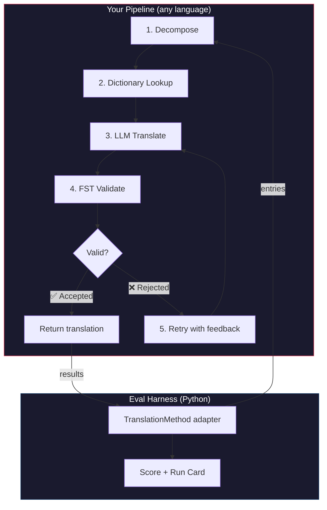
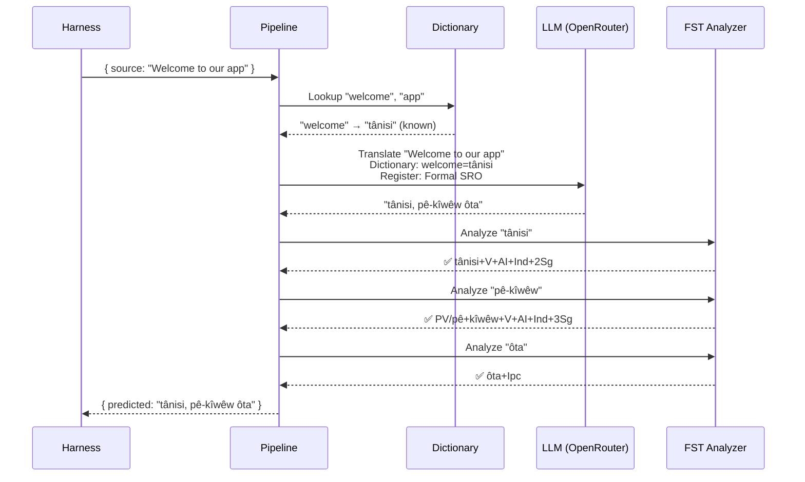
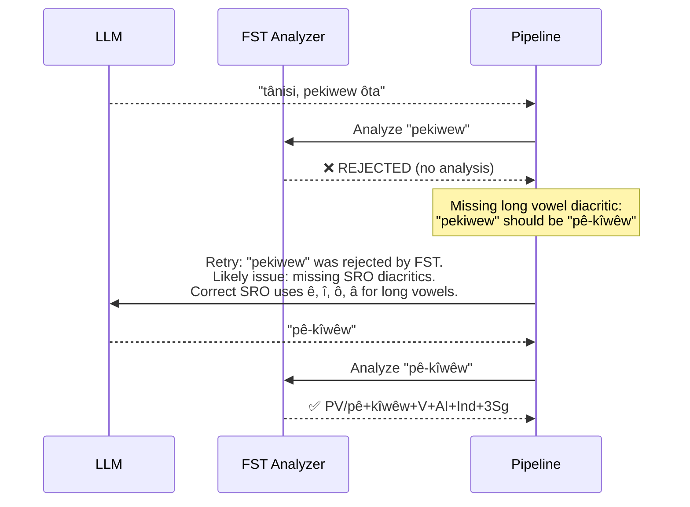

# Cookbook: FST-Gated Translation Pipeline

Construa um pipeline de tradução em múltiplos estágios que decompõe o texto de origem, traduz via LLM, valida saídas com um transdutor de estados finitos (FST) e tenta novamente quando o FST rejeita formas de palavras inválidas. Depois conecte-o ao harness de avaliação e veja como ele se classifica.

**O que você vai construir:** Um pipeline de tradução para Plains Cree que detecta traduções morfologicamente inválidas *antes* de elas contarem contra sua pontuação.

:::info Pré-requisitos
- Um binário FST em execução (por exemplo, do [analisador Plains Cree do ALTLab](https://github.com/UAlbertaALTLab/lang-crk))
- Node.js 20+ (para o pipeline) e Python 3.10+ (para o harness)
- Uma chave de API OpenRouter para a etapa de LLM
:::

---

## Arquitetura

O pipeline é uma cadeia de estágios. Cada estágio tem um trabalho específico. Você pode construir isso em qualquer linguagem — este exemplo usa JavaScript, mas o harness não se importa com o que está dentro. Ele só vê o adaptador Python fino na fronteira.



### Por Que Esses Estágios

| Estágio | O Que Faz | Por Que Importa |
|-------|-------------|---------------|
| **Decompose** | Quebra strings de UI compostas em segmentos traduzíveis | Linguagens polissintéticas codificam sentenças inteiras em palavras únicas — o LLM precisa de unidades menores |
| **Dictionary Lookup** | Verifica um dicionário bilíngue para traduções conhecidas | Força terminologia correta para termos conhecidos em vez de depender de adivinhação do LLM |
| **LLM Translate** | Envia o segmento para um LLM com contexto de registro e gramática | Lida com frases novas e gera saída fluente |
| **FST Validate** | Executa a saída através de um analisador morfológico | Detecta formas de palavras inválidas — se o FST rejeita uma palavra, ela não é uma forma de palavra válida na linguagem |
| **Retry** | Reenvia palavras rejeitadas com o feedback de erro do FST | Fornece ao LLM informações específicas sobre *por que* a palavra estava errada |

---

## O Fluxo de Dados

Aqui está o que acontece com uma única entrada conforme ela flui pelo pipeline:



### Quando o FST Rejeita



---

## Implementação

Construa o que você quiser. Este exemplo usa JavaScript, mas você poderia usar Python, Rust ou qualquer outra coisa. O harness não se importa — ele só fala com o adaptador Python fino (mostrado na próxima seção).

### O Pipeline

Cada estágio é uma função. O pipeline os encadeia juntos.

```javascript title="pipeline.js"
import { lookupDictionary } from './dictionary.js';
import { callLLM } from './llm.js';
import { analyzeWithFST } from './fst.js';

const MAX_RETRIES = 3;

/**
 * Translate a batch of keys through the full pipeline.
 *
 * @param {object} keys - Map of key → source string
 * @param {object} options - { sourceLang, targetLang }
 * @returns {{ translations: object, stats: object }}
 */
export async function translateBatch(keys, options) {
  const translations = {};
  const stats = { total: 0, fstAccepted: 0, retries: 0, dictionaryHits: 0 };

  for (const [key, sourceText] of Object.entries(keys)) {
    stats.total++;
    translations[key] = await translateSingle(sourceText, options, stats);
  }

  return { translations, stats };
}

/**
 * Translate a single string through all pipeline stages.
 */
async function translateSingle(sourceText, options, stats) {

  // ── Stage 1: Decompose ──────────────────────────────────
  // Split compound strings into segments the LLM can handle.
  // For UI strings this is often a no-op, but for longer content
  // it prevents the LLM from losing context in long prompts.
  const segments = decompose(sourceText);

  // ── Stage 2: Dictionary Lookup ──────────────────────────
  // Check each segment against the bilingual dictionary.
  // Known terms are forced — the LLM won't override them.
  const knownTerms = {};
  for (const segment of segments) {
    const entry = lookupDictionary(segment.toLowerCase());
    if (entry) {
      knownTerms[segment] = entry;
      stats.dictionaryHits++;
    }
  }

  // ── Stage 3: LLM Translate ──────────────────────────────
  let translation = await callLLM(sourceText, {
    ...options,
    knownTerms,
    register: 'nêhiyawêwin (Plains Cree). Use SRO orthography. '
            + 'Professional register for educational contexts.',
  });

  // ── Stage 4: FST Validate ──────────────────────────────
  // Split the translation into words and check each one.
  let { accepted, rejected } = await validateWords(translation);

  // ── Stage 5: Retry Loop ─────────────────────────────────
  // If any words were rejected, retry with FST feedback.
  let attempt = 0;
  while (rejected.length > 0 && attempt < MAX_RETRIES) {
    attempt++;
    stats.retries++;

    const feedback = rejected
      .map(w => `"${w}" was rejected by the morphological analyzer`)
      .join('; ');

    translation = await callLLM(sourceText, {
      ...options,
      knownTerms,
      register: 'nêhiyawêwin (Plains Cree). Use SRO orthography.',
      feedback: `Previous attempt had invalid words. ${feedback}. `
              + 'Use correct SRO diacritics (ê, î, ô, â for long vowels). '
              + 'Ensure verb forms match expected conjugation patterns.',
    });

    ({ accepted, rejected } = await validateWords(translation));
  }

  if (rejected.length === 0) stats.fstAccepted++;

  return translation;
}

/**
 * Decompose source text into translatable segments.
 *
 * For simple key-value UI strings, this usually returns the
 * original string as a single segment. For longer content,
 * it splits on sentence boundaries.
 */
function decompose(text) {
  // Simple sentence-boundary split. Replace with your own
  // morphological decomposition for more complex needs.
  return text
    .split(/(?<=[.!?])\s+/)
    .filter(s => s.trim().length > 0);
}

/**
 * Validate each word in a translation against the FST.
 *
 * @returns {{ accepted: string[], rejected: string[] }}
 */
async function validateWords(translation) {
  // Split on whitespace and punctuation, keeping only words
  const words = translation
    .split(/[\s,;:.!?'"()\[\]{}]+/)
    .filter(w => w.length > 0);

  const accepted = [];
  const rejected = [];

  for (const word of words) {
    const analyses = await analyzeWithFST(word);
    if (analyses.length > 0) {
      accepted.push(word);
    } else {
      rejected.push(word);
    }
  }

  return { accepted, rejected };
}
```

### O Wrapper FST

Envolva seu binário FST como uma função assíncrona. Este exemplo usa o analisador Plains Cree baseado em HFST do ALTLab.

```javascript title="fst.js"
import { execFile } from 'node:child_process';
import { promisify } from 'node:util';

const execFileAsync = promisify(execFile);

// Path to your FST analyzer binary
const FST_PATH = process.env.FST_ANALYZER_PATH || './bin/crk-analyzer';

/**
 * Run a word through the FST morphological analyzer.
 *
 * Returns an array of analyses. Empty array = rejected.
 *
 * Example:
 *   analyzeWithFST("tânisi")
 *   → ["tânisi+V+AI+Ind+2Sg", "tânisi+V+AI+Cnj+2Sg"]
 *
 *   analyzeWithFST("pekiwew")
 *   → []  // rejected — missing diacritics
 *
 * @param {string} word - A single word in SRO orthography
 * @returns {string[]} Array of FST analyses (empty = rejected)
 */
export async function analyzeWithFST(word) {
  try {
    // HFST lookup: pipe the word to stdin, read analyses from stdout
    const { stdout } = await execFileAsync(
      FST_PATH,
      ['--quiet'],
      { input: word + '\n', timeout: 5000 }
    );

    // Parse HFST output: each line is "input\tanalysis\tweight"
    // Lines with "+?" indicate unrecognized forms
    return stdout
      .split('\n')
      .filter(line => line.includes('\t') && !line.includes('+?'))
      .map(line => line.split('\t')[1]);

  } catch (err) {
    // If the FST binary isn't available, log and reject
    console.error(`[WARN] FST analysis failed for "${word}": ${err.message}`);
    return [];
  }
}
```

### Módulos de Dicionário e LLM

```javascript title="dictionary.js"
/**
 * Simple bilingual dictionary backed by a JSON file.
 *
 * In production, you'd load from the coaching data directory
 * or query itwêwina (https://itwewina.altlab.app/) via API.
 */
const DICTIONARY = {
  'hello': 'tânisi',
  'welcome': 'tânisi',
  'thank you': 'kinanâskomitin',
  'home': 'kīwēwin',
  'search': 'nānātawāpahtam',
  'settings': 'isi-nākatohkēwin',
  'help': 'nīsōhkamākēwin',
  'back': 'kīwē',
};

/**
 * @param {string} term - Lowercase English term
 * @returns {string|null} Cree translation or null
 */
export function lookupDictionary(term) {
  return DICTIONARY[term] || null;
}
```

```javascript title="llm.js"
/**
 * Call an LLM via OpenRouter for translation.
 */
const OPENROUTER_API = 'https://openrouter.ai/api/v1/chat/completions';

export async function callLLM(sourceText, options) {
  const { knownTerms = {}, register, feedback } = options;

  // Build the system prompt with register and known terms
  let systemPrompt = `You are translating English to Plains Cree.\n\n`;
  systemPrompt += `Register: ${register}\n\n`;

  if (Object.keys(knownTerms).length > 0) {
    systemPrompt += `Required terminology (use these exact translations):\n`;
    for (const [en, crk] of Object.entries(knownTerms)) {
      systemPrompt += `  "${en}" → "${crk}"\n`;
    }
    systemPrompt += '\n';
  }

  if (feedback) {
    systemPrompt += `IMPORTANT correction from previous attempt:\n${feedback}\n\n`;
  }

  systemPrompt += `Rules:\n`;
  systemPrompt += `- Use Standard Roman Orthography (SRO)\n`;
  systemPrompt += `- Use macron/circumflex for long vowels: ê, î, ô, â\n`;
  systemPrompt += `- Return ONLY the Cree translation, nothing else\n`;

  const response = await fetch(OPENROUTER_API, {
    method: 'POST',
    headers: {
      'Authorization': `Bearer ${process.env.OPENROUTER_API_KEY}`,
      'Content-Type': 'application/json',
    },
    body: JSON.stringify({
      model: 'google/gemini-2.5-pro',
      messages: [
        { role: 'system', content: systemPrompt },
        { role: 'user', content: sourceText },
      ],
      temperature: 0.2,
    }),
  });

  const json = await response.json();
  return json.choices[0].message.content.trim();
}
```

---

## Conectando ao Harness

Seu pipeline está construído. Agora você precisa conectá-lo ao harness de avaliação para que você possa fazer benchmark dele no leaderboard.

O harness fala uma interface: `TranslationMethod`. É um protocolo Python com um único método. Construa o que você quiser em qualquer linguagem — depois dê a ele este wrapper fino e ele se conecta.

```python title="fst_gated_process.py"
"""
TranslationMethod adapter for the FST-gated pipeline.

This thin wrapper connects your pipeline (running as a local
subprocess or HTTP server) to the eval harness. The harness
calls translate() with corpus entries. You call your pipeline.
You return results. That's it.
"""

import time
import subprocess
import json
from mt_eval_harness.config import RunConfig


class FSTGatedProcess:
    """Adapter between the eval harness and your FST-gated pipeline.

    The pipeline runs as a Node.js subprocess. This wrapper:
    1. Receives entries from the harness
    2. Sends them to the pipeline
    3. Returns structured results the harness can score
    """

    def __init__(self, pipeline_url: str = "http://localhost:3001"):
        self.pipeline_url = pipeline_url

    async def translate(
        self,
        entries: list[dict],
        config: RunConfig,
    ) -> list[dict]:
        """Translate a batch of entries through the FST-gated pipeline.

        Args:
            entries: List of corpus entries with 'id' and source text.
            config: Harness run configuration (for context).

        Returns:
            List of result dicts, one per entry.
        """
        import httpx

        results = []

        for entry in entries:
            source_text = entry.get(config.source_field, entry.get("source", ""))
            start = time.monotonic()

            try:
                # Call your pipeline — however it's running
                async with httpx.AsyncClient() as client:
                    response = await client.post(
                        f"{self.pipeline_url}/translate",
                        json={"keys": {str(entry["id"]): source_text}},
                        timeout=30.0,
                    )
                    data = response.json()
                    predicted = data["translations"][str(entry["id"])]

                elapsed = time.monotonic() - start

                results.append({
                    "id": entry["id"],
                    "predicted": predicted,
                    "latency_s": elapsed,
                    "usage": {},  # pipeline doesn't expose token counts
                    "error": None,
                    "tool_calls": [],
                    "tool_call_count": 0,
                    "metadata": data.get("meta", {}),
                })

            except Exception as err:
                results.append({
                    "id": entry["id"],
                    "predicted": "",
                    "latency_s": time.monotonic() - start,
                    "usage": {},
                    "error": str(err),
                    "tool_calls": [],
                    "tool_call_count": 0,
                    "metadata": {},
                })

        return results
```

:::tip Você não precisa de HTTP
O exemplo acima chama o pipeline via HTTP porque o pipeline está em JavaScript. Se seu pipeline estiver em Python, você pode chamá-lo diretamente — sem servidor necessário. O wrapper `TranslationMethod` é apenas um limite de função. O que acontece dentro depende de você.
:::

### Executando o Benchmark

Inicie seu pipeline e depois execute o harness:

```bash
# Terminal 1: Start the pipeline
node server.js

# Terminal 2: Run the harness with your process
export OPENROUTER_API_KEY="sk-or-v1-..."

python -c "
import asyncio
from mt_eval_harness.config import RunConfig
from mt_eval_harness.runner import execute_run
from fst_gated_process import FSTGatedProcess

async def main():
    config = RunConfig(
        corpus_path='data/edtekla-dev-v1.json',
        source_lang='English',
        target_lang='Plains Cree (nêhiyawêwin, SRO)',
        process_name='fst-gated-v1',
    )
    process = FSTGatedProcess('http://localhost:3001')
    run_log = await execute_run(config, process=process)
    print(f'Results: {run_log.output_path}')

asyncio.run(main())
"
```

Ou use a CLI com `baseline_experiment.py` para comparar com a baseline integrada:

```bash
python eval/baseline_experiment.py \
  --dataset data/edtekla-dev-v1.json \
  --model google/gemini-2.5-pro \
  --fst-analyzer ./bin/crk-analyzer \
  --condition fst-gated-v1 \
  --submit
```

---

## Entendendo Seus Resultados

O harness produz um **run card** — um arquivo JSON com suas pontuações. Aqui está o que você verá:

```
═══════════════════════════════════════════════════
  FST-Gated Pipeline v1 — EDTeKLA Dev v1
═══════════════════════════════════════════════════

  chrF++              48.7 / 100
  Exact match         12.1%
  FST acceptance      94.4%
  Composite score     0.52  →  Functional ✓

  404 entries (master_corpus.json) · 47 retries · $0.18 total cost
═══════════════════════════════════════════════════
```

**O que isso diz a você em um relance:**
- Seu método é de nível **Functional** (0.50–0.70) — a saída é reconhecível para um falante, a gramática principal geralmente está correta, erros morfológicos frequentes permanecem.
- O FST está detectando 94% das palavras como válidas — seu loop de retry está funcionando.
- 12% das traduções estão exatamente corretas — há muito espaço para melhorar.

:::info Níveis de Qualidade
| Nível | Composite | O Que Significa |
|------|-----------|---------------|
| Baseline | 0.00–0.30 | Saída bruta de LLM, morfologia principalmente alucinada |
| Emerging | 0.30–0.50 | Alguns padrões corretos, não confiável |
| **Functional** | **0.50–0.70** | **Reconhecível para um falante. Categorias principais geralmente corretas.** |
| Deployable | 0.70–0.85 | Adequado para tradução de rascunho com revisão humana |
| Fluent | 0.85–1.00 | Aproximando-se de tradução humana competente |

Veja [SCORING_SPEC §5](/docs/specifications/scoring#5-quality-tiers) para as definições completas de níveis.
:::

<details>
<summary><strong>Mais profundo: O que está no run card?</strong></summary>

O JSON do run card captura tudo sobre esta execução de avaliação. Seções principais:

**Scores** — cada métrica que o harness computou:
```json
{
  "scores": {
    "exact_match_rate": 0.121,
    "chrf_plus_plus": 48.7,
    "fst_acceptance_rate": 0.944,
    "composite_score": 0.52,
    "quality_tier": "functional"
  }
}
```

**Provenance** — o que produziu esses resultados:
```json
{
  "method": {
    "process_name": "fst-gated-v1",
    "model": "google/gemini-2.5-pro",
    "temperature": 0.0
  },
  "corpus": {
    "id": "edtekla-dev-v1",
    "sha256": "a1b2c3..."
  }
}
```

**Resultados por entrada** — cada tradução com pontuações individuais, para que você possa encontrar onde seu método tem dificuldades:
```json
{
  "id": 42,
  "source": "The student completed the assignment",
  "reference": "ôskiniw kî-kîsîhtâw ôhi atoskêwina",
  "predicted": "ôskiniw kî-kîsîhtâw ôhi atoskêwin",
  "chrf": 89.2,
  "exact_match": false,
  "fst_accepted": true
}
```

A pontuação composite é uma média ponderada das métricas disponíveis, com pesos definidos em [SCORING_SPEC §4](/docs/specifications/scoring#4-composite-score). Quando uma métrica não está disponível, seu peso é redistribuído proporcionalmente entre o resto.

</details>

---

## Implantando em Produção

Seu método tem pontuações no leaderboard. Agora você quer realmente usá-lo. Esta seção é sobre servir seu pipeline como um endpoint de produção que [champollion](https://champollion.dev) pode chamar.

:::note Esta seção é opcional
Tudo acima é sobre construir e fazer benchmark de seu método. Esta seção é sobre implantação — uma preocupação separada. Você pode enviar para o leaderboard sem implantar nada.
:::

### O Servidor HTTP

Envolva seu pipeline como um servidor Express que implementa o [contrato do método de API](https://champollion.dev/docs/guides/serving-a-method):

```javascript title="server.js"
import express from 'express';
import { translateBatch } from './pipeline.js';

const app = express();
app.use(express.json());

/**
 * API method contract:
 *
 * Request:  { source_locale, target_locale, method, keys: { "key": "source" } }
 * Response: { translations: { "key": "translated" }, meta: { ... } }
 */
app.post('/translate', async (req, res) => {
  const { source_locale, target_locale, method, keys } = req.body;

  // Validate request
  if (!keys || typeof keys !== 'object') {
    return res.status(400).json({ error: { message: 'Missing keys object' } });
  }

  try {
    const startTime = Date.now();
    const { translations, stats } = await translateBatch(keys, {
      sourceLang: source_locale,
      targetLang: target_locale,
    });

    res.json({
      translations,
      meta: {
        model: 'custom-pipeline/fst-gated-v1',
        method: 'decompose-lookup-translate-validate',
        elapsed_ms: Date.now() - startTime,
        fst_acceptance_rate: stats.fstAccepted / stats.total,
        retries: stats.retries,
      },
    });
  } catch (err) {
    console.error('[ERR] Pipeline failed:', err.message);
    res.status(500).json({ error: { message: err.message } });
  }
});

// Health check for connectivity verification
app.get('/health', (req, res) => res.json({ status: 'ok' }));

app.listen(3001, () => {
  console.log('FST-gated pipeline running on http://localhost:3001');
});
```

### Configure champollion

Aponte seu par de idiomas para o serviço em execução:

```json title="champollion.config.json"
{
  "version": 3,
  "inputLocale": "en",
  "pairs": {
    "en:crk": {
      "method": "api",
      "endpoint": "http://localhost:3001/translate"
    }
  },
  "languages": {
    "crk": {
      "name": "Plains Cree",
      "register": "SRO syllabics with grammatical precision."
    }
  }
}
```

```bash
# Run it
export OPENROUTER_API_KEY="sk-or-v1-..."
node server.js &
npx champollion sync
```

### Empacotando como um Plugin

Depois que seu método tiver pontuações, empacote-o para que outros possam usá-lo:

```json title="crk-fst-gated-v1/method.json"
{
  "name": "crk-fst-gated-v1",
  "type": "api",
  "version": "1.0.0",
  "description": "FST-gated Plains Cree translation with morphological validation",
  "author": "Your Name",

  "config": {
    "endpoint": "https://your-server.example.com/translate"
  },

  "locales": ["crk"],

  "benchmarks": {
    "crk": {
      "date": "2026-06-01T00:00:00Z",
      "corpus_size": 404,
      "exact_match_rate": 0.12,
      "corpus_chrf": 48.7,
      "model": "google/gemini-2.5-pro",
      "harness_version": "2.0"
    }
  },

  "provenance": {
    "resources": [
      { "name": "ALTLab CRK Analyzer", "license": "LGPL-3.0", "type": "fst" },
      { "name": "Wolvengrey Dictionary", "license": "CC-BY-NC-SA-4.0", "type": "dictionary" }
    ],
    "commercialReady": false,
    "flags": ["nc-resource"]
  }
}
```

---

## Estendendo Este Padrão

Este cookbook demonstra uma arquitetura de pipeline. Você pode adaptá-lo para qualquer linguagem ou método:

| Variação | O Que Muda |
|-----------|-------------|
| **FST Diferente** | Troque o caminho do binário. Você pode baixar FSTs pré-compilados (como binários `.hfstol` ou `lttoolbox`) para mais de 100 linguagens do [GitHub GiellaLT](https://github.com/giellalt) ou [GitHub Apertium](https://github.com/apertium). |
| **Nenhum FST disponível** | Remova o estágio de execução do FST e use [arquivos de paradigma plano UniMorph](https://huggingface.co/datasets/unimorph/universal_morphologies) do Hugging Face para realizar validação de lookup de banco de dados estático de formas inflexionadas. |
| **Múltiplos LLMs** | Encadeie modelos: um modelo rápido para rascunho inicial, um modelo de raciocínio para correções. |
| **Human-in-the-loop** | Adicione um estágio de fila que mantém traduções incertas para revisão de especialista antes de retornar. |
| **Modelo Fine-tuned** | Substitua a chamada OpenRouter por um modelo local (Ollama, vLLM, etc.). |
| **Linguagem Diferente** | Mude o dicionário, FST e registro. A arquitetura permanece idêntica. |

O pipeline é um padrão. Os estágios são intercambiáveis. Construa o que funciona para sua linguagem, prove-o no [leaderboard](https://champollion.dev/leaderboard) e implante-o.

---

## Veja Também

- **[Eval Harness](/docs/specifications/harness)** — como executar o harness e interpretar a saída
- **[Method Interface](/docs/specifications/methods)** — a especificação do protocolo `TranslationMethod`
- **[Leaderboard Rules](/docs/leaderboard/rules)** — critérios de envio e políticas anti-gaming
- **[Support a Low-Resource Language](/docs/community/low-resource-languages)** — o contexto mais amplo e princípios OCAP
- **[ALTLab](https://altlab.artsrn.ualberta.ca/)** — o Alberta Language Technology Lab (Plains Cree FST)
- **[Method Leaderboard](https://champollion.dev/leaderboard)** — envie suas pontuações