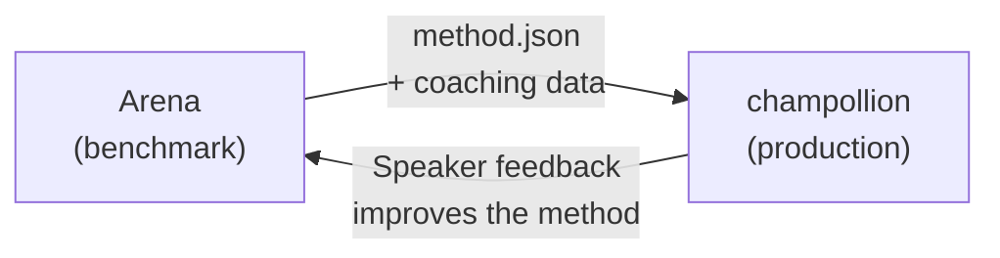

# นำไปใช้งานจริง (Deploy to Production)

คุณพิสูจน์แล้วว่ามันใช้งานได้ใน Arena ตอนนี้ถึงเวลา deploy

Arena มีไว้สำหรับงาน R&D — การสร้าง การทดสอบประสิทธิภาพ และการเปรียบเทียบวิธีการแปล **การ deploy สำหรับใช้งานจริง** เกิดขึ้นผ่าน [champollion](https://champollion.dev) ซึ่งเป็น CLI สำหรับการแปลที่มุ่งเน้นนักพัฒนา ทั้งสองเชื่อมต่อกันผ่านรูปแบบ plugin ที่ใช้ร่วมกัน



---

## เส้นทางการ Deploy

### 1. Export วิธีการของคุณในรูปแบบ Plugin

สร้าง manifest `method.json` ที่รวบรวมผลการทดสอบประสิทธิภาพของคุณ:

```json
{
  "name": "crk-coached-v3",
  "type": "llm-coached",
  "version": "3.0.0",
  "description": "Coached LLM translation for Plains Cree",
  "locales": ["crk"],
  "config": {
    "model": "google/gemini-2.5-flash",
    "temperature": 0.3
  },
  "benchmarks": {
    "crk": {
      "composite_score": 0.67,
      "fst_acceptance": 0.82,
      "corpus_size": 150
    }
  }
}
```

รวมข้อมูล coaching ใดๆ (กฎไวยากรณ์ พจนานุกรม) ไว้พร้อมกับ manifest

### 2. ติดตั้งใน Champollion

```bash
champollion plugin install ./my-method-plugin/
```

### 3. กำหนดค่าคู่ภาษาของคุณ

```json title="champollion.config.json"
{
  "pairs": {
    "en-crk": { "method": "plugin", "plugin": "crk-coached-v3" }
  }
}
```

### 4. แปลเนื้อหาจริง

```bash
npx champollion sync
```

ขณะนี้วิธีการที่ผ่านการทดสอบประสิทธิภาพของคุณกำลังสร้างการแปลจริงในสภาพแวดล้อมการใช้งานจริงแล้ว

---

## สำหรับภาษาของชนพื้นเมือง

วิธีการที่ให้บริการชุมชนภาษาของชนพื้นเมืองต้องได้รับ **ความยินยอมจากชุมชน** ก่อนการ deploy สำหรับใช้งานจริง หลักการ OCAP (Ownership, Control, Access, Possession) เป็นตัวกำกับดูแลวิธีการพัฒนา ประเมิน และ deploy วิธีการแปล

วิธีการที่บรรลุระดับ Deployable (0.70+) จะไม่ถูก deploy โดยอัตโนมัติ — แต่จะ deploy **เมื่อและหากเท่านั้น** ที่องค์กรกำกับดูแลของชุมชนภาษานั้นให้ความยินยอม

ดู [Data Sovereignty](/docs/sovereignty/data-sovereignty) และ [Ownership Transfer](/docs/sovereignty/ownership-transfer) สำหรับกรอบการกำกับดูแลฉบับสมบูรณ์

---

## ดูเพิ่มเติม

- [The Eval Harness Bridge](https://champollion.dev/docs/guides/bridge) — คำแนะนำโดยละเอียดเกี่ยวกับ pipeline Arena→champollion
- [Plugin Specification](https://champollion.dev/docs/reference/plugin-spec) — รูปแบบ manifest ของ method.json
- [champollion Agent Guide](https://champollion.dev/docs/guides/agent-guide) — วิธีใช้ champollion สำหรับการแปล