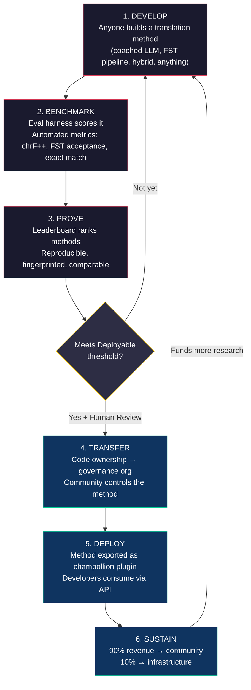
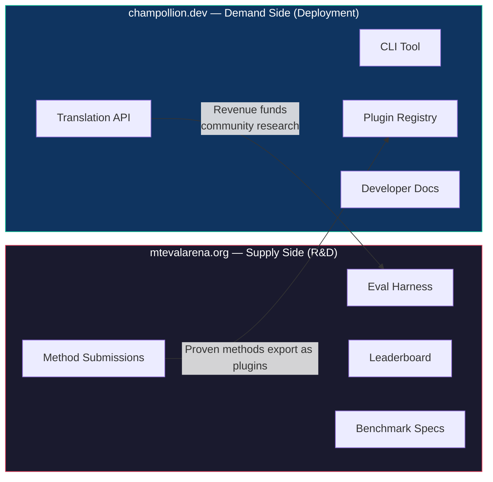
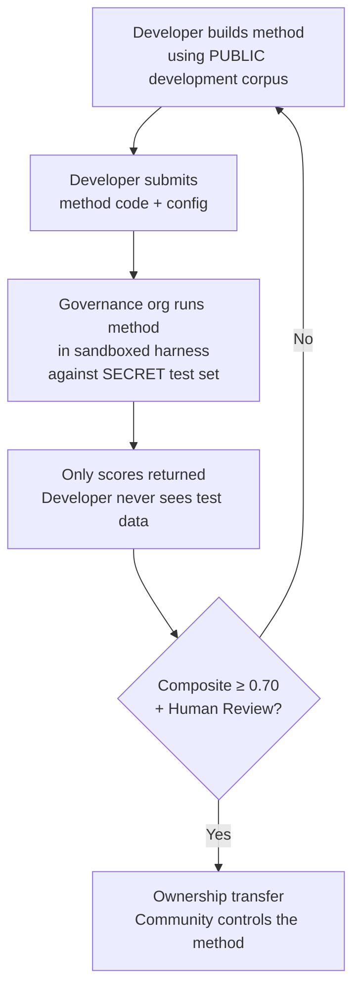

# วิธีการทำงาน: การระดมพลแบบแข่งขันสำหรับการแปลด้วยเครื่อง

> **สรุปสำหรับผู้บริหาร** การแปลด้วยเครื่องสำหรับภาษาที่ขาดแคลนทรัพยากรของโลก — รวมถึงภาษาราว 1,300 ภาษาที่ Meta อ้างว่า OMT-1600 ครอบคลุม แต่มีคุณภาพต่ำกว่าเกณฑ์ที่ใช้งานได้จริง — ไม่ใช่ปัญหาด้านการฝึกโมเดล แต่เป็นปัญหาด้าน *โครงสร้างพื้นฐาน* ไม่มีโมเดล ห้องปฏิบัติการ หรือบริษัทใดแก้ปัญหานี้ได้เพียงลำพัง เอกสารนี้อธิบายสถาปัตยกรรมแพลตฟอร์มที่เปลี่ยนชุมชนนักวิศวกร ML นักภาษาศาสตร์ และผู้พูดภาษาต่างๆ ทั่วโลกให้กลายเป็นห้องปฏิบัติการวิจัยแบบกระจาย: ใครก็ตามสามารถสร้างวิธีการแปล แพลตฟอร์มจะพิสูจน์ว่าวิธีนั้นใช้งานได้จริงโดยเทียบกับข้อมูลประเมินผลที่ชุมชนเป็นเจ้าของ และวิธีการที่ผ่านการพิสูจน์แล้วจะถูกนำไปใช้งานจริงโดยมีรายได้ไหลกลับสู่ชุมชนเจ้าของภาษา กลไกนี้คือการระดมพลแบบแข่งขันพร้อมอธิปไตยเชิงการเข้ารหัส — การผสมผสานที่ยังไม่เคยมีใครลองทำมาก่อน

---

> [!IMPORTANT]
> **ขอบเขต** แพลตฟอร์มนี้ประเมิน **การแปลข้อความเขียนเชิงทางการ** — เอกสาร สื่อการศึกษา การสื่อสารราชการ และสตริง UI ไม่ใช่แชทบอต ล่ามแบบเรียลไทม์ หรือระบบสนทนาแบบไม่จำกัดโดเมน ลีดเดอร์บอร์ดจัดอันดับวิธีการแปลโดยเทียบกับคลังข้อมูลคู่ขนานที่คัดสรรแล้วในโดเมนข้อความเฉพาะ (ดู [Benchmark Specification §2.7](/docs/specifications/benchmark#27-domain) สำหรับอนุกรมวิธานโดเมน) MT คือโครงสร้างพื้นฐานสำหรับการฟื้นฟูภาษา ไม่ใช่สิ่งทดแทน เด็กๆ เรียนภาษาจากคน ไม่ใช่จากเครื่องจักร

### การครอบคลุมโดเมนในปัจจุบัน

| โดเมน | การครอบคลุมระดับชั้น | สถานะ | หมายเหตุ |
|--------|--------------|--------|-------|
| ราชการ / รัฐบาล | ระดับชั้น 1–5 | ใช้งานอยู่ | คลังข้อมูล EdTeKLA |
| การศึกษา / ตำราเรียน | ระดับชั้น 1–4 | ใช้งานอยู่ | คลังข้อมูล EdTeKLA |
| เรื่องเล่า / วรรณกรรม | จำกัด | วางแผนไว้ | มีบางรายการในมาตรฐานทอง |
| ศาสนา / คัมภีร์ | อ้างอิงเท่านั้น | ไม่ได้ประเมิน | FLORES+ (โดเมนพระคัมภีร์); ไม่ใช้สำหรับการให้คะแนนอย่างเป็นทางการ |
| การสนทนา | ไม่อยู่ในขอบเขต | ตามการออกแบบ | ระบบนี้ประเมินข้อความเขียน ไม่ใช่การพูด |
| เทคนิค / วิทยาศาสตร์ | ไม่อยู่ในขอบเขต | อนาคต | ต้องการการตรวจสอบคำศัพท์เฉพาะโดเมน |

## 1. ปัญหา: การแปลด้วยเครื่อง ≠ การเรียนรู้ของเครื่อง

การแปลด้วยเครื่องสำหรับภาษาที่มีทรัพยากรน้อย (LRLs) มักถูกมองว่าเป็นปัญหาด้านการเรียนรู้ของเครื่อง: รวบรวมข้อมูล ฝึกโมเดล นำไปใช้งาน การมองแบบนี้ผิด และความผิดพลาดนี้มีผลกระทบสำคัญ — มันนำเงินทุน บุคลากร และโครงสร้างพื้นฐานไปสู่แนวทางที่ไม่สามารถใช้งานได้จริงสำหรับภาษาส่วนใหญ่ของโลก

### 1.1 เหตุใดกรอบแนวคิด ML จึงล้มเหลว

ไปป์ไลน์ ML มาตรฐานสำหรับ MT ต้องการสามสิ่ง: คลังข้อมูลคู่ขนานขนาดใหญ่ เกณฑ์มาตรฐานการประเมินที่ผ่านการตรวจสอบ และเส้นทางการนำไปใช้งาน สำหรับภาษาราว 130 ภาษาที่ Google Translate รองรับและราว 200 ภาษาที่ NLLB-200 ครอบคลุม ทั้งสามสิ่งนี้มีอยู่แล้ว สำหรับภาษาเพิ่มเติมราว 1,300 ภาษาที่ OMT-1600 อ้างว่าครอบคลุม มีข้อมูลประเมินผลอยู่บ้างแต่คุณภาพส่วนใหญ่ต่ำกว่าเกณฑ์ที่ใช้งานได้ น้ำหนักโมเดลไม่ได้เผยแพร่สู่สาธารณะ และไม่มีไปป์ไลน์การนำไปใช้งาน สำหรับภาษาที่เหลืออีกราว 5,400+ ภาษา ไม่มีสิ่งใดเลย

| ข้อกำหนด | ภาษาที่มีทรัพยากรสูง | การครอบคลุมของ OMT-1600 (~1,300 LRLs) | ภาษาที่เหลืออีกราว 5,400 ภาษา |
|-------------|------------------------|-------------------------------|---------------------------|
| **คลังข้อมูลคู่ขนาน** | คู่ประโยคหลายล้านคู่ (Europarl, UN Corpus, OpenSubtitles) | ข้อความคู่ขนานโดเมนพระคัมภีร์ การขูดข้อมูลเว็บ การแปลย้อนกลับสังเคราะห์ ไม่มีข้อมูลที่คัดสรรโดยชุมชน | หลักร้อยถึงหลักพัน ถ้ามี |
| **เกณฑ์มาตรฐานการประเมิน** | WMT, FLORES, NTREX — มาตรฐาน ทำซ้ำได้ | BOUQuET (โดเมนพระคัมภีร์), met-BOUQuET ไม่มีการตรวจสอบทางสัณฐานวิทยา ไม่มีการประเมินอิสระ | ไม่มีเกณฑ์มาตรฐาน; การประเมินแบบเฉพาะกิจ |
| **เส้นทางการนำไปใช้งาน** | Google Translate, DeepL, Azure — API เชิงพาณิชย์ | น้ำหนักโมเดลไม่ได้เผยแพร่ ไม่มี CLI ไม่มีระบบปลั๊กอิน ไม่มี API ที่ชุมชนนำไปใช้งานได้ | ไม่มีอะไรเลย ไม่มี API ไม่มีผลิตภัณฑ์ ไม่มีตลาด |

แนวทาง ML ใช้งานได้เมื่อมีข้อมูลสำหรับฝึกและมีตลาดสำหรับนำไปใช้งาน OMT-1600 ได้ขยายเงื่อนไขแรกอย่างมีนัยสำคัญ — แต่การขยายโดยไม่มีการตรวจสอบคุณภาพอิสระ การตรวจสอบทางสัณฐานวิทยา หรือการกำกับดูแลโดยชุมชน คือการขยายโดยปราศจากความน่าเชื่อถือ ปัญหาไม่ใช่แค่ "เราต้องการโมเดลที่ดีกว่า" — แต่คือ "เราต้องการโครงสร้างพื้นฐานที่พิสูจน์ว่าโมเดลใช้งานได้ ภายใต้เงื่อนไขที่ชุมชนควบคุม"

### 1.2 สิ่งที่ MT สำหรับ LRLs ต้องการจริงๆ

การแปลสำหรับภาษาที่ขาดแคลนทรัพยากรไม่ใช่ปัญหาด้านการฝึกโมเดลเป็นหลัก แต่เป็นปัญหาด้าน **วิศวกรรมวิธีการ** — ความท้าทายในการประกอบทรัพยากรที่มีอยู่ (LLMs เครื่องมือสัณฐานวิทยา ความรู้ของชุมชน กฎทางภาษาศาสตร์) ให้เป็นไปป์ไลน์การแปลที่ใช้งานได้ จากนั้นพิสูจน์ว่าใช้งานได้ด้วยการประเมินที่เข้มงวด

ความแตกต่างนี้มีความสำคัญ:

| มิติ | แนวทาง ML | แนวทางวิศวกรรมวิธีการ |
|-----------|------------|---------------------------|
| **กิจกรรมหลัก** | ฝึกโมเดลบนข้อมูล | รวมเครื่องมือ พรอมต์ และความรู้ทางภาษาศาสตร์เข้าเป็นไปป์ไลน์ |
| **คอขวด** | ปริมาณข้อมูลคู่ขนาน | ความคิดสร้างสรรค์ทางวิศวกรรม + โครงสร้างพื้นฐานการประเมิน |
| **ผู้ที่มีส่วนร่วมได้** | ทีมที่มีคลัสเตอร์ GPU และชุดข้อมูล | ใครก็ตามที่มี API key พจนานุกรม และแนวคิด |
| **การประเมิน** | BLEU/chrF บนชุดทดสอบที่สำรองไว้ | การตรวจสอบสัณฐานวิทยา + การตรวจสอบโดยมนุษย์ + เมตริกอัตโนมัติ |
| **การนำไปใช้งาน** | ให้บริการโมเดล | แพ็กเกจวิธีการเป็นปลั๊กอิน |

LLMs สมัยใหม่มีความรู้แฝงเกี่ยวกับภาษาที่มีทรัพยากรน้อยหลายภาษา — เพียงพอที่จะสร้างผลลัพธ์ที่ *ดูเหมือน* สมเหตุสมผล ปัญหาคือผลลัพธ์นี้มักไม่ถูกต้องทางสัณฐานวิทยา (โมเดลสร้างรูปแบบคำที่ไม่มีอยู่จริงในภาษา) ความท้าทายทางวิศวกรรมคือ: คุณจะดึงสิ่งที่ LLM รู้ออกมา ตรวจสอบกับความเป็นจริงทางภาษาศาสตร์ และแพ็กเกจผลลัพธ์สำหรับการใช้งานจริงได้อย่างไร?

นี่คือเหตุผลที่เราประเมิน **วิธีการ** ไม่ใช่โมเดล วิธีการคือสูตรทั้งหมด: การเลือกโมเดล + วิศวกรรมพรอมต์ + การใช้เครื่องมือ + การประมวลผลก่อน/หลัง + ข้อมูลการโค้ช + กลยุทธ์การลองใหม่ สองทีมที่ใช้โมเดลเดียวกันด้วยวิธีการต่างกันจะได้คะแนนต่างกัน นั่นคือจุดประสงค์

### 1.3 เหตุใดภาษาโพลีซินเทติกจึงทำให้ทุกอย่างพังทลาย

ภาษาที่ขาดแคลนทรัพยากรมากที่สุดในโลกหลายภาษาเป็น **ภาษาโพลีซินเทติก** — ภาษาเหล่านี้เข้ารหัสประโยคทั้งประโยคไว้ในคำเดียวผ่านกระบวนการสัณฐานวิทยาที่มีประสิทธิผล พิจารณาคำในภาษา Plains Cree:

> **ê-kî-nitawi-kîskinwahamâkosiyân**
> *"เมื่อฉันได้ไปโรงเรียน"*

หนึ่งคำ มันเข้ารหัสกาล (อดีต) ทิศทาง (ไปยัง) รากศัพท์ (เรียน) วอยซ์ (passive/reflexive) และบุรุษ (บุรุษที่หนึ่งเอกพจน์) ภาษาอังกฤษต้องใช้หกคำสำหรับสิ่งที่ภาษา Cree แสดงในคำเดียว

สิ่งนี้ทำให้ MT มาตรฐานพังทลายในทุกระดับ:

- **การแบ่งโทเคน** — BPE และ SentencePiece ตัดคำโพลีซินเทติกออกเป็นชิ้นส่วนที่ไม่มีความหมาย เพราะถูกออกแบบมาสำหรับสัณฐานวิทยาแบบเชื่อมต่อ
- **การสร้างภาพลวงตา** — LLMs สร้างสตริงที่ดูสมเหตุสมผลแต่ไม่ใช่คำที่ถูกต้อง ผู้ที่ไม่ใช่เจ้าของภาษาไม่สามารถบอกความแตกต่างได้ หากไม่มีการตรวจสอบสัณฐานวิทยา การสร้างภาพลวงตาจะมองไม่เห็น
- **การประเมิน** — เมตริกระดับคำ (BLEU) ลงโทษการแปรผันทางการผันคำตามธรรมชาติซึ่งเป็นพื้นฐานของวิธีที่ภาษาเหล่านี้ทำงาน เมตริกระดับอักขระ (chrF++) ดีกว่าแต่ยังไม่เพียงพอหากไม่มีการตรวจสอบโครงสร้าง

วิธีแก้ปัญหาไม่ใช่โมเดลที่ใหญ่กว่าหรือข้อมูลฝึกที่มากกว่า แต่คือ **โครงสร้างพื้นฐานที่ตรวจจับการสร้างภาพลวงตาก่อนที่จะถึงผู้ใช้** — ตัววิเคราะห์สัณฐานวิทยา (FSTs) ที่สามารถบอกได้อย่างชัดเจนว่า "นี่ไม่ใช่คำในภาษานี้"

---

## 2. เหตุใดแนวทางที่มีอยู่จึงไม่ได้ผล

### 2.1 MT เชิงพาณิชย์

บริการแปลเชิงพาณิชย์มักเพิ่มประสิทธิภาพสำหรับปริมาณตลาดในอดีต OMT-1600 ของ Meta (มีนาคม 2026) แสดงถึงการเปลี่ยนแปลงที่สำคัญ — 1,600 ภาษาในระบบเดียว แต่สำหรับภาษาราว 1,300 ภาษาในระดับชั้นทรัพยากรต่ำสุด คุณภาพต่ำกว่าเกณฑ์ที่ใช้งานได้ น้ำหนักโมเดลไม่พร้อมใช้งาน และไม่มีไปป์ไลน์การนำไปใช้งาน ปัญหาแรงจูงใจเชิงโครงสร้างได้พัฒนาไป: Big Tech สามารถสร้างโมเดลสำหรับ LRLs ได้แล้ว แต่หากไม่มีการประเมินอิสระ การตรวจสอบสัณฐานวิทยา หรือการกำกับดูแลโดยชุมชน การครอบคลุมเพียงอย่างเดียวไม่ได้แก้ปัญหา

### 2.2 การวิจัยเชิงวิชาการ

การวิจัย MT เชิงวิชาการมุ่งเน้นไปที่คู่ภาษาที่มีทรัพยากรสูงเป็นส่วนใหญ่ เพราะนั่นคือที่ที่มีข้อมูลฝึก งานร่วม และสถานที่ตีพิมพ์ นักวิจัยที่ทำงานกับคู่ภาษาที่มีทรัพยากรน้อยประสบปัญหาในการตีพิมพ์ การหาเงินทุนสำหรับการคำนวณ และการนำไปใช้งาน — เพราะโครงสร้างพื้นฐานการนำไปใช้งานสำหรับ LRLs ไม่มีอยู่

### 2.3 การแข่งขันแบบครั้งเดียว

คุณอาจจัดการแข่งขัน Kaggle: "English→Plains Cree คะแนน chrF++ สูงสุดได้รับ $10,000" นี่คือสิ่งที่จะเกิดขึ้น:

1. มีคนชนะ ส่ง notebook รับรางวัล แล้วกลับบ้าน
2. notebook นั้นเน่าเสียในคลังเก็บของ Kaggle ไม่มีใครนำไปใช้งาน ไม่มีใครดูแลรักษา
3. ชุดทดสอบถูกเผยแพร่ในที่สุด — ปนเปื้อนตลอดไป
4. องค์กรกำกับดูแลอัปโหลดข้อมูลภาษาของตนไปยังโครงสร้างพื้นฐานของ Google ภายใต้ข้อกำหนดการให้บริการของ Google โดยไม่มีการควบคุมวงจรชีวิตที่แท้จริง
5. ไม่มีสะพานเชื่อมการนำไปใช้งาน notebook ที่ชนะไม่ใช่ API ที่ใช้งานได้

รางวัลครั้งเดียวดึงดูดนักล่ารางวัล ลีดเดอร์บอร์ดต่อเนื่องพร้อมการกำกับดูแลโดยชุมชนสร้างการมีส่วนร่วมที่ยั่งยืน

### 2.4 การปรับแต่งละเอียด

การปรับแต่งละเอียดโมเดลเปิดบนข้อความคู่ขนานเป็นแนวทาง ML ที่ชัดเจน แต่สำหรับ LRLs ส่วนใหญ่ คลังข้อมูลคู่ขนานที่จำเป็นสำหรับการปรับแต่งละเอียดคือข้อมูลที่ไม่มีอยู่จริง — และการสร้างข้อมูลนั้นต้องการผู้พูดสองภาษาและการมีส่วนร่วมของชุมชนเช่นเดียวกับที่การปรับแต่งละเอียดตั้งใจจะทดแทน คุณไม่สามารถแก้ปัญหาการขาดแคลนข้อมูลด้วยเทคนิคที่ต้องการข้อมูลได้

---

## 3. วิธีแก้ปัญหา: การระดมพลแบบแข่งขันพร้อมการประเมินที่มีอธิปไตย

แพลตฟอร์มนี้พลิกแนวทางดั้งเดิม: แทนที่จะให้ทีมเดียวสร้างโมเดลเดียว **ชุมชนทั่วโลกแข่งขันกันสร้างวิธีการแปลที่ดีที่สุด** แพลตฟอร์มพิสูจน์ว่าวิธีนั้นใช้งานได้ และวิธีการที่ผ่านการพิสูจน์แล้วจะถูกนำไปใช้งานจริงโดยชุมชนภาษายังคงเป็นเจ้าของและควบคุม

### 3.1 วงจรทั้งหมด

แต่ละขั้นตอนมีหน้าที่เฉพาะ:

| ขั้นตอน | สิ่งที่เกิดขึ้น | ผู้ที่ได้รับประโยชน์ |
|-------|-------------|--------------|
| **พัฒนา** | นักวิจัย นักศึกษา หรือผู้ที่สนใจสร้างวิธีการแปลโดยใช้เครื่องมือที่ต้องการ — การพรอมต์ LLM ไปป์ไลน์ FST พจนานุกรม โมเดลที่ปรับแต่งละเอียด ระบบตามกฎ หรือแบบผสม | ผู้มีส่วนร่วมได้เรียนรู้ ทดลอง และตีพิมพ์ |
| **ประเมินมาตรฐาน** | eval harness ให้คะแนนวิธีการเทียบกับคลังข้อมูลมาตรฐานด้วยเมตริกที่ทำซ้ำได้ การรันทุกครั้งสร้าง [run card](/docs/specifications/benchmark#3-run-card-schema) — บันทึกสมบูรณ์ของสิ่งที่ทดสอบและผลการทำงาน | นักวิจัยได้ผลลัพธ์ที่ทำซ้ำได้และเปรียบเทียบได้ |
| **พิสูจน์** | ผลลัพธ์ปรากฏบนลีดเดอร์บอร์ดสาธารณะ วิธีการถูกจัดอันดับ เปรียบเทียบ และตรวจสอบ ชุมชนเห็นว่าอะไรได้ผลและอะไรไม่ได้ผล | ทุกคนได้รับการมองเห็นสถานะของศิลปะ |
| **ถ่ายโอน** | สำหรับภาษาพื้นเมือง วิธีการที่ถึงเกณฑ์ Deployable (composite ≥ 0.70) และผ่านการตรวจสอบโดยมนุษย์จะมีการถ่ายโอนความเป็นเจ้าของโค้ดไปยังองค์กรกำกับดูแลของชุมชนภาษา | ชุมชนได้รับทรัพย์สินที่สร้างรายได้ |
| **นำไปใช้งาน** | วิธีการถูกส่งออกเป็นปลั๊กอิน [champollion](https://github.com/gamedaysuits/champollion) และให้บริการผ่าน API นักพัฒนาใช้การแปลโดยไม่ต้องเข้าใจวิธีการพื้นฐาน | นักพัฒนาได้การแปลสำหรับภาษาที่ API เชิงพาณิชย์ไม่รองรับ |
| **ยั่งยืน** | รายได้จาก API แบ่ง: 90% ให้ชุมชน 10% สำหรับโครงสร้างพื้นฐาน รายได้สนับสนุนการวิจัยภาษาศาสตร์ การพัฒนาคลังข้อมูล และโปรแกรมชุมชนเพิ่มเติม | วงล้อขับเคลื่อนตัวเองหลังจากการก่อตั้งเริ่มต้น |

### 3.2 เหตุใดพลวัตการแข่งขันจึงได้ผล

การแข่งขันไม่ใช่สิ่งบังเอิญ — มันคือกลไก นี่คือเหตุผล:

**ความหลากหลายของแนวทาง** วิธีการที่ดีที่สุดสำหรับ English→Plains Cree อาจเป็น LLM ที่โค้ชด้วย FST-gated วิธีที่ดีที่สุดสำหรับ English→Quechua อาจเป็นไปป์ไลน์ที่เสริมด้วยพจนานุกรม วิธีที่ดีที่สุดสำหรับ English→Inuktitut อาจเป็นโมเดลที่ปรับแต่งละเอียดจาก Nunavut Hansard corpus ไม่มีทีมหรือแนวทางเดียวที่จะครองทุกภาษา ลีดเดอร์บอร์ดเผยให้เห็นว่า *ประเภท* ของแนวทางใดได้ผลสำหรับ *ประเภท* ของภาษาใด — ผลลัพธ์เมตาที่เป็นการมีส่วนร่วมทางการวิจัยในตัวเอง

**การมีส่วนร่วมที่ยั่งยืน** ลีดเดอร์บอร์ดไม่มีวันเสร็จสิ้น มีคนต้องการเอาชนะคะแนนสูงสุดเสมอ การส่งผลงานทุกครั้งบริจาคการคำนวณและความพยายามทางปัญญาให้กับปัญหา ต่างจากทุนครั้งเดียว พลวัตการแข่งขันสร้างการลงทุนวิจัยต่อเนื่องจากชุมชนทั่วโลก

**อุปสรรคในการเข้าร่วมต่ำ** คุณต้องการ API key พจนานุกรม และแนวคิด eval harness เป็นโอเพนซอร์ส รูปแบบคลังข้อมูลเป็น JSON ง่ายๆ นักศึกษาภาษาศาสตร์สามารถแข่งขันกับห้องปฏิบัติการที่มีทรัพยากรดี — และบางครั้งชนะ เพราะความรู้ด้านโดเมน (การเข้าใจภาษา) สามารถมีน้ำหนักมากกว่าทรัพยากรการคำนวณ

**สะพานเชื่อมการนำไปใช้งาน** วิธีการเดียวกันที่ได้คะแนนดีใน harness จะถูกนำไปใช้งานจริงด้วยการเปลี่ยน config เพียงครั้งเดียว "พิสูจน์ที่นี่ นำไปใช้ที่นั่น" นี่คือช่องว่างที่ Kaggle งาน WMT shared tasks และสิ่งตีพิมพ์เชิงวิชาการไม่ได้เชื่อมต่อ

### 3.3 สถาปัตยกรรมแพลตฟอร์ม

ระบบนิเวศถูกแบ่งทางกายภาพออกเป็นสองไซต์ที่รองรับผู้ชมสองกลุ่ม:

**[mtevalarena.org](https://mtevalarena.org)** คือสนามพิสูจน์ R&D ผู้ชมคือวิศวกร ML นักภาษาศาสตร์ และนักวิจัย ทุกอย่างที่นี่เกี่ยวกับการสร้าง ทดสอบ และพิสูจน์วิธีการแปล

**[champollion.dev](https://champollion.dev)** คือแพลตฟอร์มการนำไปใช้งาน ผู้ชมคือนักพัฒนาที่ต้องการการแปลสำหรับแอปของตน พวกเขาไม่จำเป็นต้องเข้าใจวิธีการทำงาน — เพียงแค่เรียก API

สะพานเชื่อมระหว่างทั้งสองคือ **ปลั๊กอินวิธีการ**: วิธีการที่ผ่านการพิสูจน์แล้ว แพ็กเกจสำหรับการนำไปใช้งาน เป็นเจ้าของโดยชุมชน

---

## 4. การประเมินที่มีอธิปไตย: เหตุใดโครงสร้างพื้นฐานจึงสำคัญ

โครงสร้างพื้นฐานการประเมินไม่ใช่รายละเอียดทางเทคนิค — มันคือแกนหลักของโมเดลอธิปไตย การประเมินมาตรฐาน (อัปโหลดชุดทดสอบไปยังแพลตฟอร์มที่ใช้ร่วมกัน) ไม่ได้ผลสำหรับภาษาพื้นเมือง เพราะมันยอมสละการควบคุมข้อมูลภาษาศาสตร์

### 4.1 กลไกอธิปไตย

นักพัฒนาไม่เคยเห็นข้อมูลการประเมินมาตรฐานทอง พวกเขาพัฒนาโดยเทียบกับคลังข้อมูลพัฒนาสาธารณะ จากนั้นส่งโค้ดวิธีการไปยังองค์กรกำกับดูแล ซึ่งรันในแซนด์บ็อกซ์เทียบกับชุดทดสอบลับ มีเพียงคะแนนที่ส่งกลับมา นี่ไม่ใช่แค่ความปลอดภัย — มันคือการนำ **หลักการ OCAP®** (Ownership, Control, Access, Possession) ที่การกำกับดูแลข้อมูลของชนพื้นเมืองต้องการมาใช้โดยตรงในเชิงสถาปัตยกรรม

### 4.2 เหตุใดสิ่งนี้ไม่สามารถรันบนแพลตฟอร์มของผู้อื่น

บน Kaggle องค์กรกำกับดูแลอัปโหลดข้อมูลภาษาของตนไปยังโครงสร้างพื้นฐานของ Google ภายใต้ข้อกำหนดการให้บริการของ Google พวกเขาไม่สามารถเพิกถอนการเข้าถึงตามไทม์ไลน์ของตนเองได้ ไม่สามารถแนบข้อกำหนดทางกฎหมายที่กำหนดเอง (เช่น การถ่ายโอนความเป็นเจ้าของ) กับการส่งผลงานได้ และไม่มีการรับประกันเชิงการเข้ารหัสว่าข้อมูลจะไม่ถูกนำไปใช้เพื่อวัตถุประสงค์อื่น อธิปไตยข้อมูลหมายความว่าชุมชนควบคุมจุดสิ้นสุดการประเมิน ถือกุญแจ และสามารถปิดระบบได้

---

## 5. ปรัชญาการประเมิน: Microeval และ LYSS

เมตริก MT มาตรฐาน (BLEU, chrF++, COMET) ถูกออกแบบมาเพื่อใช้งานทั่วไปข้ามภาษา ความทั่วไปนั้นคือจุดแข็ง — และจุดบอด สำหรับภาษาโพลีซินเทติก คำที่ไม่ถูกต้องทางสัณฐานวิทยาซึ่งมี character n-grams ร่วมกับข้อมูลอ้างอิงจะได้คะแนนดีบน chrF++ แต่ผู้พูดทุกคนจะรู้ว่ามันไม่มีความหมาย

**การพัฒนา Microeval** หมายถึงการสร้างเมตริกการประเมินที่ปรับแต่งสำหรับภาษาเฉพาะโดยใช้เครื่องมือภาษาศาสตร์ที่ดีที่สุดที่มีอยู่ กรอบงานนี้เรียกว่า **LYSS** (Linguistically-informed Yield & Structural Scoring):

| องค์ประกอบ | สิ่งที่วัด | เครื่องมือ | สถานะ |
|-----------|-----------------|------|--------|
| **LYSS-fst** | ความถูกต้องทางสัณฐานวิทยา | Finite-state transducer | ✅ นำไปใช้แล้ว (Plains Cree) |
| **LYSS-eq** | ความเทียบเท่าทางภาษาศาสตร์ | กฎตัวแปรที่คัดสรรโดยนักภาษาศาสตร์ | ✅ นำไปใช้แล้ว (Plains Cree) |
| **LYSS-sem** | การรักษาความหมาย | โมเดลความหมายเฉพาะภาษา | ✅ นำไปใช้แล้ว (Plains Cree) |

เมตริกสากล (chrF++, BLEU) ทำหน้าที่เป็นเส้นฐานและเป็นสัญญาณหลักสำหรับภาษาที่ไม่มีเครื่องมือ LYSS ทุกที่ที่มีเครื่องมือเฉพาะภาษา องค์ประกอบ LYSS จะมีน้ำหนักในการให้คะแนน — เพราะสิ่งที่สำคัญที่สุดสำหรับแต่ละภาษาคือสิ่งที่เฉพาะเครื่องมือเฉพาะภาษาเท่านั้นที่วัดได้

สำหรับข้อกำหนด LYSS ฉบับสมบูรณ์และตรรกะการให้คะแนน composite ดู [SCORING_SPEC.md §4](/docs/specifications/scoring#4-composite-score)

> [!WARNING]
> **การเปรียบเทียบข้ามการรัน** เมื่อเปรียบเทียบการรันที่มีความพร้อมใช้งานของเมตริกต่างกัน (เช่น การรันหนึ่งมีคะแนน FST อีกการรันไม่มี) คะแนน composite ไม่สามารถเปรียบเทียบกันได้โดยตรง composite จะปรับมาตรฐานตามเมตริกที่มีอยู่ แต่การรันที่ประเมินด้วย 5 เมตริกมีข้อมูลมากกว่าการรันที่ประเมินด้วย 2 เมตริก ลีดเดอร์บอร์ดระบุการครอบคลุมเมตริกสำหรับแต่ละรายการ

---

## 6. ผู้ที่แพลตฟอร์มนี้รองรับ

### สำหรับวิศวกร ML และนักวิจัย

ลีดเดอร์บอร์ดเปิดพร้อมเกณฑ์มาตรฐานที่เป็นมาตรฐานสำหรับคู่ภาษาที่ไม่มี shared task ครอบคลุม ทำซ้ำผลลัพธ์ใดก็ได้ด้วย eval harness ตีพิมพ์วิธีการของคุณ เอาชนะคะแนนสูงสุด การส่งผลงานทุกครั้งถูกลายนิ้วมือกับ configuration เฉพาะและเวอร์ชันชุดข้อมูล — ไม่มีความคลุมเครือเกี่ยวกับสิ่งที่ทดสอบ

### สำหรับชุมชนภาษา

ความเป็นเจ้าของและการควบคุมเทคโนโลยีการแปลที่สร้างขึ้นสำหรับภาษาของคุณ พลวัตการแข่งขันหมายความว่าหลายทีมกำลังทำงานกับภาษาของคุณพร้อมกัน — คุณได้รับประโยชน์จากทุกทีมและเป็นเจ้าของผลลัพธ์ รายได้จากการใช้งาน API สนับสนุนโปรแกรมชุมชนตามเงื่อนไขของคุณ

### สำหรับผู้ให้ทุนและผู้ตรวจสอบทุน

เมตริกที่โปร่งใสและทำซ้ำได้สำหรับการประเมินข้อเสนอการวิจัยการแปล ผลลัพธ์ที่วัดได้นอกเหนือจากสิ่งตีพิมพ์: การใช้งาน API รายได้ที่สร้าง เมตริกคุณภาพตามเวลา การครอบคลุมภาษา วิธีการที่ประสบความสำเร็จเพียงวิธีเดียวสร้างกระแสรายได้ที่ยั่งยืนด้วยตัวเอง — ผลกระทบของทุนทบต้นแทนที่จะสิ้นสุดเมื่อเงินทุนหมด

### สำหรับนักพัฒนา

การแปลสำหรับภาษาที่ไม่มี API เชิงพาณิชย์รองรับ คำสั่ง CLI เดียว (`npx champollion sync`) แปลไฟล์ locale ของคุณโดยใช้วิธีการที่ผ่านการพิสูจน์โดยชุมชน ใช้ Google Translate สำหรับภาษาฝรั่งเศส LLM ที่โค้ชแล้วสำหรับ Plains Cree และ API ชุมชนสำหรับ Quechua — ทั้งหมดในโปรเจกต์เดียวกัน ทั้งหมดด้วยอินเทอร์เฟซเดียวกัน

### สำหรับนักศึกษา

ความท้าทายเปิดที่มีผลกระทบในโลกจริง สร้างวิธีการแปลสำหรับภาษาที่ขาดแคลนทรัพยากร ประเมินมาตรฐาน และตีพิมพ์ผลลัพธ์ โครงสร้างพื้นฐานฟรี ชุดข้อมูลเปิด และลีดเดอร์บอร์ดไม่สนใจว่าคุณอยู่ที่มหาวิทยาลัยชั้นนำหรือทำงานจากเทอร์มินัลในห้องสมุด

---

## 7. บริบทสังคมและเทคนิค

### 6.1 การฟื้นฟูภาษากำลังเร่งตัว

ความพยายามในการฟื้นฟูภาษากำลังเติบโตทั่วโลก โรงเรียนแบบ immersion รังภาษาชุมชน และโครงการเก็บถาวรดิจิทัลกำลังขยายตัวในชุมชนพื้นเมืองในแคนาดา สหรัฐอเมริกา ออสเตรเลีย นิวซีแลนด์ และยุโรปเหนือ ความพยายามเหล่านี้ต้องการเทคโนโลยี — โดยเฉพาะเทคโนโลยีการแปลที่เคารพอธิปไตยของชุมชนเหนือข้อมูลภาษาศาสตร์

### 6.2 LLMs เปลี่ยนเส้นฐาน

ก่อนปี 2023 การสร้างความสามารถ MT ใดๆ สำหรับภาษาโพลีซินเทติกต้องการความเชี่ยวชาญ NLP อย่างมาก การฝึกโมเดลที่กำหนดเอง และงบประมาณการคำนวณขนาดใหญ่ LLMs สมัยใหม่ได้เปลี่ยนเส้นฐาน: พรอมต์ที่ออกแบบมาอย่างดีพร้อมข้อมูลการโค้ชและการตรวจสอบสัณฐานวิทยาสามารถสร้างการแปลที่ใช้งานได้สำหรับบางคู่ภาษา — ไม่ต้องฝึกโมเดล สิ่งนี้ลดอุปสรรคในการเข้าร่วมพัฒนาวิธีการอย่างมาก ปัญหาได้เปลี่ยนจาก "เราจะสร้างโมเดลได้อย่างไร?" เป็น "เราจะสร้างไปป์ไลน์ที่ตรวจสอบและแก้ไขสิ่งที่โมเดลสร้างได้อย่างไร?"

### 6.3 วัฒนธรรมการประเมินมาตรฐานโอเพนซอร์ส

การประเมินมาตรฐาน AI ได้กลายเป็นวัฒนธรรมของตัวเอง ลีดเดอร์บอร์ดขับเคลื่อนนวัตกรรม การแข่งขันดึงดูดบุคลากร Chatbot Arena, LMSYS, Hugging Face Open LLM Leaderboard — แพลตฟอร์มเหล่านี้แสดงให้เห็นว่าการประเมินแบบแข่งขันขับเคลื่อนความก้าวหน้าอย่างรวดเร็ว เรานำพลังงานนั้นมาชี้ไปที่การแปลสำหรับภาษาหลายพันภาษาที่ MT เชิงพาณิชย์ไม่มีอยู่หรือยังไม่ได้รับการพิสูจน์อย่างอิสระว่าใช้งานได้

### 6.4 อธิปไตยข้อมูลของชนพื้นเมืองไม่สามารถต่อรองได้

หลักการ OCAP® (Ownership, Control, Access, Possession) หลักการ CARE (Collective Benefit, Authority to Control, Responsibility, Ethics) และกรอบงานอย่าง Te Mana Raraunga (อธิปไตยข้อมูลของชาวเมารี) ไม่ใช่ส่วนเสริมที่เลือกได้ — มันคือข้อกำหนดเชิงโครงสร้างสำหรับเทคโนโลยีใดๆ ที่เกี่ยวข้องกับทรัพยากรภาษาของชนพื้นเมือง โครงสร้างพื้นฐานการประเมินของเรานำหลักการเหล่านี้ไปใช้ในเชิงสถาปัตยกรรม ไม่ใช่แค่เป็นคำแถลงนโยบาย

---

## 8. ความตึงเครียดและข้อจำกัด {#8-tensions-and-limitations}

โปรเจกต์นี้ใช้กลไกแบบตะวันตก — การประเมินมาตรฐานแบบแข่งขัน — เพื่อรองรับระบบความรู้ที่มักเป็นแบบชุมชน เชิงสัมพันธ์ และนำโดยผู้อาวุโส ความตึงเครียดนั้นมีอยู่จริงและต้องถูกระบุชื่อ ไม่ใช่แก้ไขด้วยการยืนยัน

**การประเมินมาตรฐาน vs. ความรู้ชุมชน** ลีดเดอร์บอร์ดจัดอันดับบุคคลและเพิ่มประสิทธิภาพคะแนนตัวเลข ประเพณีความรู้ของชนพื้นเมืองเน้นอำนาจเชิงสัมพันธ์ การแก้ไขแบบชุมชน และความชอบธรรมที่อิงความสัมพันธ์ เราไม่สามารถอ้างว่ารองรับระบบความรู้เหล่านี้ในขณะที่สร้างแพลตฟอร์มที่กลไกหลักคือการเพิ่มประสิทธิภาพการแข่งขันของบุคคล สถาปัตยกรรมอธิปไตย (§4) — ที่ชุมชนเป็นเจ้าของวิธีการ ควบคุมการประเมิน และตัดสินใจว่าอะไรจะถูกนำไปใช้งาน — คือการตอบสนองเชิงโครงสร้างของเรา แต่มันไม่ได้ขจัดความตึงเครียด ลีดเดอร์บอร์ดยังคงเป็นลีดเดอร์บอร์ด

**สิ่งที่เรากำลังทำเกี่ยวกับเรื่องนี้** แพลตฟอร์มรองรับการส่งผลงานแบบทีมและชุมชนควบคู่กับบุคคล ลีดเดอร์บอร์ดนำเสนอผลลัพธ์ว่าเป็น "สถานะของศิลปะปัจจุบัน" แทนที่จะเป็น "ใครกำลังชนะ" องค์กรกำกับดูแล — ไม่ใช่คะแนนลีดเดอร์บอร์ด — เป็นผู้ตัดสินใจว่าอะไรจะถูกนำไปใช้งาน ไม่มีคะแนนอัตโนมัติใดที่ให้สิทธิ์นักพัฒนาในสิ่งใด ชุมชนเป็นผู้ตัดสินใจ และเรารักษาวงจรข้อเสนอแนะที่ปรึกษาต่อเนื่องกับชุมชนพันธมิตรเกี่ยวกับว่ากรอบและโครงสร้างแรงจูงใจของแพลตฟอร์มรองรับพวกเขาหรือไม่ ถ้าไม่ เราจะเปลี่ยนแปลง

**MT ไม่ใช่การฟื้นฟู** การแปลแปลงข้อความระหว่างภาษา การฟื้นฟูสร้างผู้พูดใหม่ ระบบ MT ที่สมบูรณ์แบบไม่ได้แก้ปัญหาการถ่ายทอด ปัญหาชื่อเสียง หรือปัญหาการสอน มันอาจสร้างภาพลวงตาว่า "คอมพิวเตอร์พูดภาษาได้" ซึ่งบั่นทอนความเร่งด่วนในการถ่ายทอดจากมนุษย์ เราสร้าง MT เป็นโครงสร้างพื้นฐาน — การแปลร่างสำหรับการแก้ไขหลังการแปล เครื่องมือสัณฐานวิทยาสำหรับแอปการเรียนภาษา อำนาจทางการเมืองสำหรับชุมชนที่เรียกร้องบริการในภาษาของตน — ไม่ใช่สิ่งทดแทนการถ่ายทอดระหว่างรุ่น ชุมชนควบคุมว่าจะนำเทคโนโลยีไปใช้งานเมื่อใด อย่างไร และถ้าจะใช้

ส่วนนี้มีอยู่เพราะความตึงเครียดเหล่านี้ถูกระบุในการวิจารณ์ที่ได้รับเชิญ (พฤษภาคม 2026) และเราให้คำมั่นว่าจะระบุชื่อพวกมันต่อสาธารณะแทนที่จะฝังไว้ในเอกสารภายใน

> [!NOTE]
> **คะแนนลีดเดอร์บอร์ดเป็นตัวแทนอัตโนมัติ** คะแนนทั้งหมดที่แสดงบนลีดเดอร์บอร์ดเป็นการวัดอัตโนมัติที่คำนวณโดย evaluation harness ภายใต้เงื่อนไขที่ควบคุม คะแนนเหล่านี้บ่งชี้ประสิทธิภาพสัมพัทธ์ของวิธีการแต่ไม่ถือเป็นการรับประกันคุณภาพ วิธีการที่ผ่านการตรวจสอบโดยชุมชนถูกทำเครื่องหมายแยกต่างหาก ไม่มีคะแนนอัตโนมัติใดที่ให้สิทธิ์นักพัฒนาในการนำไปใช้งาน — องค์กรกำกับดูแลเป็นผู้ตัดสินใจนั้น

---

## 9. สถานะปัจจุบัน

### สิ่งที่มีอยู่ในปัจจุบัน

- **champollion** — เครื่องมือ CLI ที่พร้อมใช้งานจริง วิธีการแปล 10 วิธี การกำหนด configuration ต่อคู่ภาษา quality gates รูปแบบไฟล์ 5 รูปแบบ [เผยแพร่บน npm](https://www.npmjs.com/package/champollion)
- **MT Eval Harness** — กรอบงานการประเมินที่ใช้งานได้ เมตริก chrF++, FST acceptance และ exact match นำไปใช้แล้ว สคีมา run card เสร็จสมบูรณ์ การลายนิ้วมือและการตรวจสอบความสมบูรณ์ทำงานได้
- **EDTeKLA Dev v1** — คลังข้อมูลการประเมิน Plains Cree (CC BY-NC-SA 4.0) ที่มาจากกลุ่มวิจัย EdTeKLA ของมหาวิทยาลัย Alberta คลังข้อมูลตำราเรียนมี 486 รายการ (436 dev + 50 held-out) บวกกับ 62 คู่มาตรฐานทองแยกต่างหากจาก itwêwina (รวม 548 รายการ) คลังข้อมูล dev มาตรฐานคือ `textbook_dev.json` ที่มี 436 รายการ — การแบ่ง dev ตำราเรียนฉบับสมบูรณ์
- **FLORES+ Devtest** — 1,012 ประโยค × 39 ภาษา (CC BY-SA 4.0)
- **เว็บไซต์ Arena** — ไซต์เอกสาร Docusaurus พร้อมลีดเดอร์บอร์ด ข้อกำหนด บทช่วยสอน และกรอบงานอธิปไตย
- **Benchmark Specification** — [ข้อกำหนดมาตรฐาน](/docs/specifications/benchmark) ที่กำหนดสคีมาคลังข้อมูล รูปแบบ run card และโปรโตคอลการประเมิน สำหรับคำจำกัดความเมตริก น้ำหนัก composite และระดับคุณภาพ ดู [SCORING_SPEC.md](/docs/specifications/scoring)

### สิ่งที่จะเกิดขึ้นต่อไป

| ระยะ | สิ่งที่ทำ | สถานะ |
|-------|------|--------|
| การสำรวจเส้นฐาน | 12 โมเดล × 3 อุณหภูมิ × 2 การกำหนด coaching บน EDTeKLA | 🔲 วางแผนไว้ |
| คะแนน composite | การนำไปใช้เมตริกถ่วงน้ำหนักใน harness | ✅ เสร็จแล้ว |
| คะแนนความหมาย | คะแนนถ่วงน้ำหนักตามคำตัดสินจาก CrkSemanticMetric (มาตรฐานการประเมิน) | ✅ เสร็จแล้ว |
| ความถูกต้องทางสัณฐานวิทยา | การให้คะแนนต่อ morpheme เทียบกับการวิเคราะห์มาตรฐานทอง | 🔲 วางแผนไว้ |
| การจับคู่เทียบเท่า | การจับคู่คลาสตัวแปรผ่าน CrkLinterMetric (มาตรฐานการประเมิน) | ✅ เสร็จแล้ว |
| Champollion API | API แบบวัดปริมาณสำหรับวิธีการที่ชุมชนเป็นเจ้าของ | 🔲 วางแผนไว้ |
| ภาษาที่สอง | ขยายไปยังคู่ภาษาที่สอง (Inuktitut, Quechua หรือ Sámi) | 🔲 วางแผนไว้ |

---

## 10. เริ่มต้นใช้งาน

**สร้างวิธีการ:** Clone [eval harness](https://github.com/gamedaysuits/arena) รันการทดลองเส้นฐาน และดูว่าคุณอยู่ที่ไหนบนลีดเดอร์บอร์ด

**มีส่วนร่วมกับคลังข้อมูล:** ถ้าคุณพูดภาษาที่ขาดแคลนทรัพยากร แม้แต่ 50 คู่การแปลที่คัดสรรก็เพียงพอที่จะเปิดแทร็กลีดเดอร์บอร์ดใหม่ ดู [สำหรับชุมชนภาษา](https://mtevalarena.org/docs/community/for-language-communities)

**นำไปใช้งานการแปล:** ติดตั้ง [champollion](https://github.com/gamedaysuits/champollion) และแปลแอปของคุณด้วย `npx champollion sync`

**สนับสนุนความพยายาม:** ดู [โมเดลเศรษฐกิจ](https://mtevalarena.org/docs/sovereignty/economic-model) สำหรับกรอบต้นทุนและการคาดการณ์ความยั่งยืน

---

## ดูเพิ่มเติม

- **[Benchmark Specification](/docs/specifications/benchmark)** — รูปแบบคลังข้อมูล สคีมา run card โปรโตคอลการประเมิน อธิปไตย
- **[Scoring Specification](/docs/specifications/scoring)** — เมตริก น้ำหนัก composite ระดับคุณภาพ สูตรต้นทุน/ความเร็ว
- **[MT Eval Arena](https://mtevalarena.org)** — สนามพิสูจน์ R&D
- **[champollion](https://github.com/gamedaysuits/champollion)** — แพลตฟอร์มการนำไปใช้งาน
- **[สนับสนุนภาษาที่มีทรัพยากรน้อย](https://mtevalarena.org/docs/community/low-resource-languages)** — การศึกษาเชิงลึกเกี่ยวกับความท้าทายและแนวทาง MT สำหรับภาษาโพลีซินเทติก

---

*เอกสารนี้คือจุดเริ่มต้นสำหรับทุกคนที่พบโปรเจกต์นี้เป็นครั้งแรก สำหรับข้อกำหนดทางเทคนิคฉบับสมบูรณ์ ดู [BENCHMARK_SPEC.md](/docs/specifications/benchmark) (โปรโตคอล) และ [SCORING_SPEC.md](/docs/specifications/scoring) (เมตริก)*