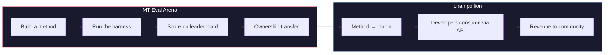

# MT Eval Arena

> **สรุปสำหรับผู้บริหาร** MT Eval Arena คือแพลตฟอร์มเปรียบเทียบประสิทธิภาพแบบเปิดสำหรับวิธีการแปลภาษาด้วยเครื่อง โดยมุ่งเน้นภาษาที่ยังไม่มี MT เชิงพาณิชย์ หรือยังไม่ผ่านการตรวจสอบอย่างอิสระ แพลตฟอร์มนี้ให้บริการการประเมินผลแบบมาตรฐาน ลีดเดอร์บอร์ดสาธารณะ และสะพานเชื่อมสู่การใช้งานจริงผ่าน champollion สำหรับภาษาของชนพื้นเมือง วิธีการที่พิสูจน์แล้วจะโอนความเป็นเจ้าของคืนสู่ชุมชน

สนามพิสูจน์แบบเปิดสำหรับวิธีการแปลภาษาด้วยเครื่อง — โดยเฉพาะอย่างยิ่งสำหรับภาษาที่ยังไม่มี MT เชิงพาณิชย์ หรือยังไม่ผ่านการตรวจสอบอย่างอิสระ

สร้างวิธีการ เปรียบเทียบประสิทธิภาพ พิสูจน์ว่าใช้งานได้ หากชนะ วิธีการนั้นจะถูกนำไปใช้งานจริง

---

## ปัญหาที่เกิดขึ้น

Google Translate รองรับประมาณ 130 ภาษา NLLB-200 ของ Meta ครอบคลุมประมาณ 200 ภาษา และ OMT-1600 (มีนาคม 2026) อ้างว่าครอบคลุม 1,600 ภาษา ทั้งที่โลกมีภาษาพูดมากกว่า 7,000 ภาษา สำหรับประมาณ 1,300 ภาษาที่อยู่ในระดับทรัพยากรต่ำสุดของ OMT-1600 นั้น น้ำหนักโมเดลไม่เปิดเผยต่อสาธารณะ คุณภาพต่ำกว่าเกณฑ์ที่ใช้งานได้จริง และการประเมินผลใช้ข้อความจากโดเมนพระคัมภีร์ร่วมกับเมตริกมาตรฐานของเครื่อง — ไม่มีการตรวจสอบทางสัณฐานวิทยา ไม่มีการทดสอบอิสระ และไม่มีการกำกับดูแลโดยชุมชน สำหรับอีกประมาณ 5,400 ภาษาที่เหลือ ยังไม่มีโมเดลที่ผ่านการฝึกล่วงหน้าใดที่สามารถสร้างผลลัพธ์ได้เลย

ปัจจุบัน Big Tech กำลังลงทุนในการขยายความครอบคลุมสำหรับภาษาทรัพยากรต่ำ (LRL) — แต่การครอบคลุมที่ปราศจากการตรวจสอบคุณภาพอย่างอิสระ การตรวจสอบทางสัณฐานวิทยา หรือการกำกับดูแลโดยชุมชน คือการครอบคลุมที่ขาดความน่าเชื่อถือ ผู้พูดที่ต้องการเครื่องมือแปลภาษามากที่สุด คือชุมชนเดียวกับที่มีโอกาสน้อยที่สุดที่จะได้รับการพัฒนาเครื่องมือเหล่านั้น

**Arena มีขึ้นเพื่อเปลี่ยนแปลงสิ่งนี้** แพลตฟอร์มนี้มอบโครงสร้างพื้นฐานสำหรับการพัฒนา ประเมินผล และนำวิธีการแปลภาษาไปใช้งานจริงสำหรับทุกภาษา — พร้อมการให้คะแนนที่ทำซ้ำได้ การส่งผลงานแบบเปิด และการกำกับดูแลโดยชุมชนเหนือการควบคุมผลลัพธ์

---

## วิธีการทำงาน

1. **คุณสร้างวิธีการแปลภาษา** — ไม่ว่าจะเป็น LLM ที่ผ่านการโค้ช โมเดลที่ผ่านการ fine-tune ไปป์ไลน์แบบ FST-gated หรือวิธีการอื่นใดที่สร้างผลการแปล
2. **ระบบ harness ทำการเปรียบเทียบประสิทธิภาพ** — ด้วยเมตริกมาตรฐาน (chrF++, exact match, FST acceptance) ที่ผูกกับ Git commit เฉพาะด้วย fingerprint
3. **ผลลัพธ์ปรากฏบนลีดเดอร์บอร์ด** — ทุกการส่งผลงานสามารถทำซ้ำและเปรียบเทียบได้
4. **หากชนะ ความเป็นเจ้าของจะโอนย้าย** — สำหรับภาษาของชนพื้นเมือง โค้ดของวิธีการที่ชนะจะโอนไปยังองค์กรกำกับดูแลของชุมชน
5. **วิธีการถูกนำไปใช้งานจริง** — ผ่าน [champollion](https://champollion.dev) ซึ่งเป็น API สำหรับนักพัฒนา รายได้จะไหลกลับสู่ชุมชน

**พิสูจน์ที่นี่ นำไปใช้ที่นั่น**

---

## กลุ่มเป้าหมาย

| คุณคือ... | Arena มอบให้คุณ... |
|---|---|
| **วิศวกร ML / นักวิจัย** | เกณฑ์มาตรฐานที่เป็นมาตรฐาน การให้คะแนนที่ทำซ้ำได้ และลีดเดอร์บอร์ดสำหรับการแข่งขัน |
| **นักภาษาศาสตร์** | กรอบการทำงานสำหรับแปลงกฎไวยากรณ์และพจนานุกรมให้เป็นวิธีการที่ทดสอบได้ |
| **สมาชิกชุมชนภาษา** | การกำกับดูแลวิธีการพัฒนาและนำวิธีการของภาษาคุณไปใช้งาน |
| **ผู้ให้ทุน / ผู้ตรวจสอบทุนวิจัย** | เมตริกที่โปร่งใสและทำซ้ำได้สำหรับประเมินข้อเสนอการวิจัยด้านการแปล |
| **นักศึกษา** | ความท้าทายแบบเปิดที่มีผลกระทบจริง — สร้างวิธีการและส่งคะแนนของคุณ |

---

## เกณฑ์มาตรฐานปัจจุบัน

### EDTeKLA Development Set v1
- **คู่ภาษา:** อังกฤษ → Plains Cree (SRO)
- **จำนวนรายการ:** 548 คู่ที่ผ่านการคัดสรร (486 จากตำราเรียน + 62 มาตรฐานทอง)
- **สัญญาอนุญาต:** CC BY-NC-SA 4.0
- **แหล่งที่มา:** [กลุ่มวิจัย EdTeKLA](https://spaces.facsci.ualberta.ca/edtekla/), University of Alberta

### FLORES+ Devtest
- **คู่ภาษา:** อังกฤษ → 39 ภาษา
- **จำนวนรายการ:** 1,012 ประโยคต่อภาษา
- **สัญญาอนุญาต:** CC BY-SA 4.0
- **แหล่งที่มา:** [OLDI](https://huggingface.co/datasets/openlanguagedata/flores_plus)

---

## กฎข้อเดียว

:::danger ห้ามฝึกโมเดลด้วยข้อมูลการประเมินผล
วิธีการที่ได้รับข้อมูลชุดเกณฑ์มาตรฐาน — ไม่ว่าจะเป็นข้อมูลฝึก ตัวอย่าง few-shot รายการพจนานุกรม หรือเนื้อหา prompt — จะถูก**ตัดสิทธิ์** คุณสามารถ fine-tune ด้วยข้อมูลใดก็ได้ตามต้องการ เพียงแต่ไม่ใช่ชุดข้อมูลทดสอบ
:::

---

## ขั้นตอนถัดไป

- **[ส่งวิธีการ](/docs/getting-started/submit-a-method)** — วิธีการส่งผลการรันเกณฑ์มาตรฐานครั้งแรกของคุณ
- **[ข้อกำหนดเกณฑ์มาตรฐาน](/docs/specifications/benchmark)** — โปรโตคอลการทดลองฉบับสมบูรณ์
- **[กฎของลีดเดอร์บอร์ด](/docs/leaderboard/rules)** — เกณฑ์การส่งผลงานและนโยบายป้องกันการโกง
- **[อธิปไตยของข้อมูล](/docs/sovereignty/data-sovereignty)** — OCAP, CARE และเหตุใดการโอนความเป็นเจ้าของจึงมีความสำคัญ
- **[โมเดลเศรษฐกิจ](/docs/sovereignty/economic-model)** — คะแนน Arena กลายเป็นรายได้ของชุมชนได้อย่างไร

**[→ ดูลีดเดอร์บอร์ด](https://champollion.dev/leaderboard)**