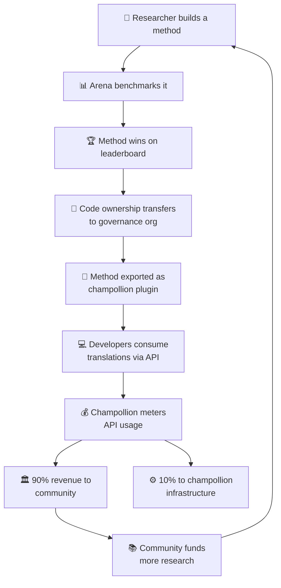

# โมเดลเศรษฐกิจ

> **สรุปสำหรับผู้บริหาร** หน้านี้อธิบายวงจรเศรษฐกิจที่เชื่อมต่อ Arena กับ champollion: งานวิจัยสร้างวิธีการ วิธีการถูกนำไปใช้งานในรูปแบบ plugin, การใช้งาน API สร้างรายได้ และ 90% ของรายได้ไหลกลับสู่ชุมชนภาษา ครอบคลุมกลไก flywheel, การแบ่งรายได้, convenience layer และกรณีความยั่งยืนสำหรับผู้ให้ทุน

Arena และ champollion ก่อตัวเป็นวงจรเศรษฐกิจแบบปิด งานวิจัยบน Arena สร้างวิธีการ วิธีการถูกนำไปใช้งานผ่าน champollion รายได้จาก champollion ไหลกลับสู่ชุมชนที่เป็นเจ้าของภาษาซึ่งวิธีการเหล่านั้นให้บริการ

---

## Flywheel

แต่ละรอบของ flywheel ช่วยเสริมความแข็งแกร่งให้กับระบบนิเวศ:
- **งานวิจัยที่มากขึ้น** สร้างวิธีการที่ดีขึ้น
- **วิธีการที่ดีขึ้น** ดึงดูดนักพัฒนาเพิ่มมากขึ้น
- **นักพัฒนาที่มากขึ้น** สร้างรายได้จาก API มากขึ้น
- **รายได้ที่มากขึ้น** สนับสนุนงานวิจัยที่นำโดยชุมชนมากขึ้น

---

## การไหลของรายได้

เมื่อนักพัฒนาใช้งานวิธีการที่ชุมชนเป็นเจ้าของผ่าน champollion API:

| ขั้นตอน | สิ่งที่เกิดขึ้น |
|---|---|
| นักพัฒนาเรียกใช้ `champollion sync` หรือ REST API | การแปลถูกสร้างโดยวิธีการที่ชุมชนเป็นเจ้าของ |
| Champollion วัดการเรียกใช้ API | การใช้งานถูกติดตามต่อคำขอ ต่อคู่ภาษา |
| รายได้ถูกแบ่ง | **90%** ไปยังองค์กรกำกับดูแลที่เป็นเจ้าของวิธีการ **10%** ครอบคลุมค่าใช้จ่ายโครงสร้างพื้นฐานของ champollion |
| ชุมชนตัดสินใจการจัดสรร | รายได้สนับสนุนโปรแกรมภาษา งานวิจัยเพิ่มเติม ทรัพยากรชุมชน — ตามที่องค์กรกำกับดูแลตัดสินใจ |

### Convenience Layer

Champollion ยังให้บริการการกำหนดค่าที่ปรับแต่งแล้วสำหรับวิธีการทั่วไป หากนักวิจัยพิสูจน์ได้ว่า Gemini 2.5 Pro ที่มีข้อมูล coaching เฉพาะและการตั้งค่า temperature ให้ผลลัพธ์ที่ดีที่สุดสำหรับคู่ภาษาหนึ่ง การกำหนดค่านั้นจะพร้อมใช้งานในรูปแบบ preset สำเร็จรูปผ่าน champollion API นักพัฒนาไม่จำเป็นต้องทำซ้ำงานวิจัย — เพียงแค่เรียกใช้ API

Arena กำหนด baseline Champollion ทำให้เข้าถึงได้ ชุมชนได้รับประโยชน์จากทั้งสองส่วน

---

## สำหรับภาษาทั่วไป

flywheel มีผลกระทบสูงสุดสำหรับภาษาพื้นเมืองและภาษาที่มีทรัพยากรน้อย ซึ่งโมเดลการโอนกรรมสิทธิ์และรายได้ชุมชนมีผลบังคับใช้

สำหรับภาษาทั่วไป (ฝรั่งเศส, ญี่ปุ่น, สเปน ฯลฯ) champollion มอบความสะดวกของ API เช่นเดียวกันโดยไม่มีชั้นการกำกับดูแล — นักพัฒนาจ่ายค่าเข้าถึงแบบวัดปริมาณสำหรับวิธีการแปลที่กำหนดค่าไว้ล่วงหน้า และ champollion รับส่วนแบ่งค่าโครงสร้างพื้นฐาน

---

## สำหรับผู้ให้ทุน

โมเดลเศรษฐกิจนี้ตอบสนองต่อข้อกังวลทั่วไปในการให้ทุนด้านเทคโนโลยีภาษา: **ความยั่งยืนหลังจากทุนสิ้นสุด**

| โมเดลแบบดั้งเดิม | โมเดล Arena |
|---|---|
| ทุนสนับสนุนงานวิจัย | ทุนสนับสนุนงานวิจัย |
| ตีพิมพ์บทความ | นำวิธีการไปใช้งานจริง |
| ทุนสิ้นสุด เครื่องมือถูกทิ้งร้าง | รายได้จาก API รักษาการดำเนินงาน |
| ชุมชนไม่ได้รับอะไร | ชุมชนเป็นเจ้าของสินทรัพย์และได้รับรายได้ |

วิธีการที่ประสบความสำเร็จเพียงหนึ่งวิธีสร้างกระแสรายได้ที่ยั่งยืนด้วยตัวเอง ผู้ให้ทุนสามารถวัดผลกระทบได้ไม่เพียงแค่จากสิ่งตีพิมพ์ แต่ยังรวมถึง:
- การใช้งาน API (จำนวนนักพัฒนาที่ใช้วิธีการนั้น)
- รายได้ที่สร้างขึ้น (จำนวนเงินที่ไหลสู่ชุมชน)
- เมตริกคุณภาพ (คะแนน leaderboard ตามช่วงเวลา)
- ความครอบคลุมภาษา (จำนวนคู่ภาษาที่ให้บริการ)

ดู [ข้อกำหนด Benchmark](/docs/specifications/benchmark) §10 สำหรับโมเดลต้นทุนโดยละเอียด

---

## ดูเพิ่มเติม

- [การโอนกรรมสิทธิ์](/docs/sovereignty/ownership-transfer) — กระบวนการโอนทางกฎหมายและทางเทคนิค
- [อธิปไตยข้อมูล](/docs/sovereignty/data-sovereignty) — หลักการ OCAP, CARE และ Te Mana Raraunga
- [กฎ Leaderboard](/docs/leaderboard/rules) — วิธีการที่วิธีการผ่านเกณฑ์สำหรับการนำไปใช้งาน