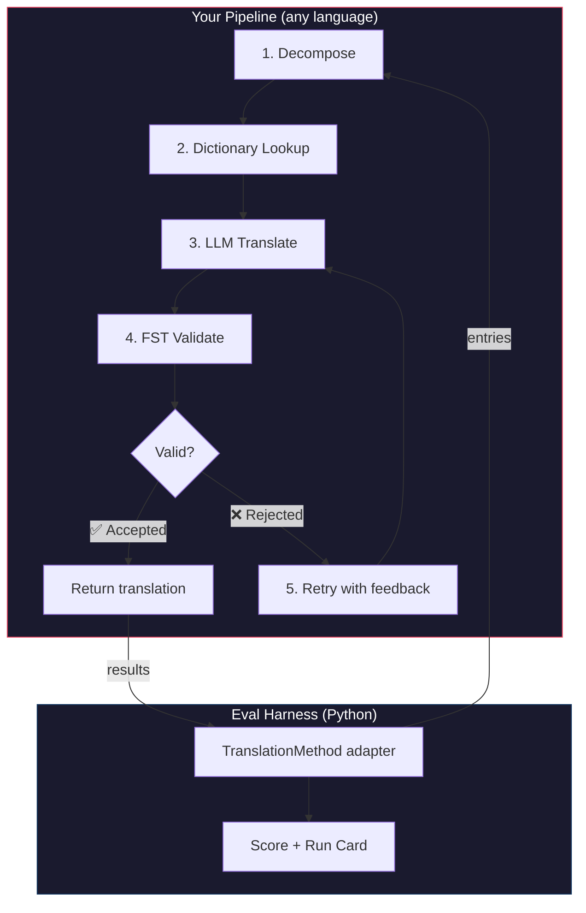
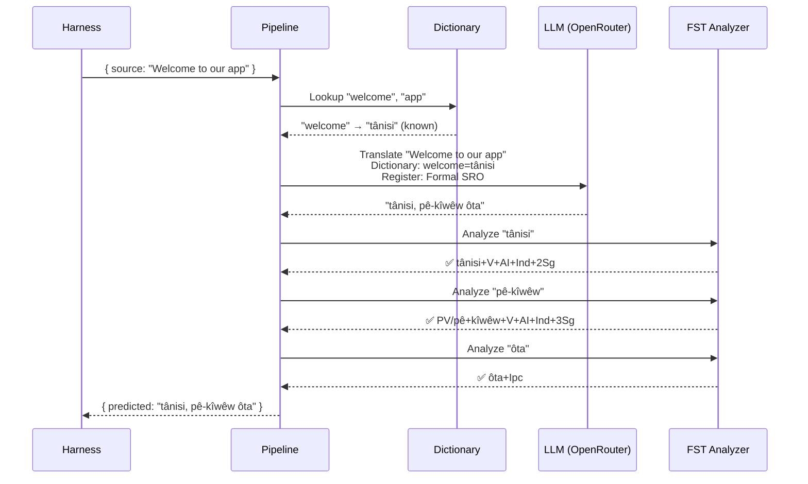
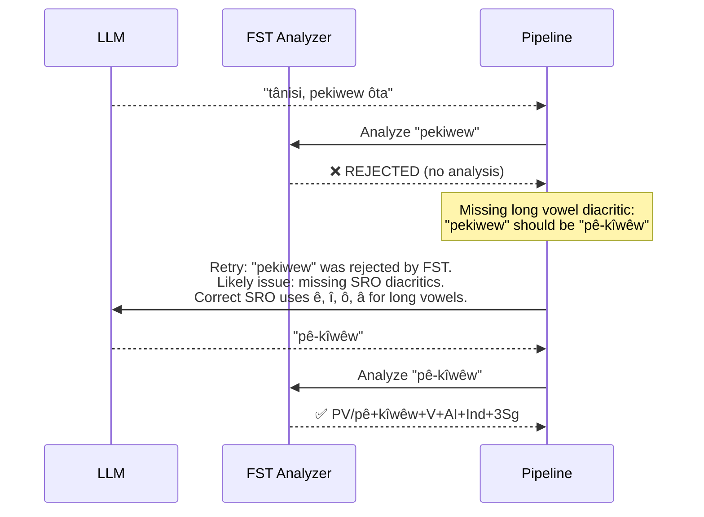

# Cookbook: FST-Gated Translation Pipeline

สร้าง pipeline การแปลแบบหลายขั้นตอนที่แยกวิเคราะห์ข้อความต้นฉบับ แปลผ่าน LLM ตรวจสอบผลลัพธ์ด้วย finite-state transducer (FST) และลองใหม่เมื่อ FST ปฏิเสธรูปคำที่ไม่ถูกต้อง จากนั้นเชื่อมต่อเข้ากับ eval harness เพื่อดูคะแนนที่ได้

**สิ่งที่คุณจะสร้าง:** Pipeline การแปลสำหรับภาษา Plains Cree ที่ตรวจจับการแปลที่ผิดหลักสัณฐานวิทยา *ก่อน* ที่จะนับเป็นคะแนนเสีย

:::info ข้อกำหนดเบื้องต้น
- ไฟล์ไบนารี FST ที่พร้อมใช้งาน (เช่น จาก [ALTLab's Plains Cree analyzer](https://github.com/UAlbertaALTLab/lang-crk))
- Node.js 20+ (สำหรับ pipeline) และ Python 3.10+ (สำหรับ harness)
- OpenRouter API key สำหรับขั้นตอน LLM
:::

---

## สถาปัตยกรรม

Pipeline คือลำดับของขั้นตอนที่เชื่อมต่อกัน แต่ละขั้นตอนมีหน้าที่เฉพาะ คุณสามารถสร้างสิ่งนี้ด้วยภาษาใดก็ได้ — ตัวอย่างนี้ใช้ JavaScript แต่ harness ไม่สนใจว่าข้างในใช้อะไร มันมองเห็นเพียง Python adapter บางๆ ที่ขอบเขตเท่านั้น



### เหตุผลของแต่ละขั้นตอน

| ขั้นตอน | สิ่งที่ทำ | เหตุผลที่สำคัญ |
|-------|-------------|---------------|
| **Decompose** | แยกสตริง UI แบบผสมออกเป็นส่วนที่แปลได้ | ภาษา polysynthetic เข้ารหัสทั้งประโยคไว้ในคำเดียว — LLM ต้องการหน่วยที่เล็กกว่า |
| **Dictionary Lookup** | ตรวจสอบพจนานุกรมสองภาษาสำหรับคำแปลที่รู้จัก | บังคับใช้คำศัพท์ที่ถูกต้องสำหรับคำที่รู้จัก แทนที่จะพึ่งการเดาของ LLM |
| **LLM Translate** | ส่งส่วนข้อความไปยัง LLM พร้อมบริบทด้านรูปแบบและไวยากรณ์ | จัดการวลีใหม่และสร้างผลลัพธ์ที่คล่องแคล่ว |
| **FST Validate** | รันผลลัพธ์ผ่านตัววิเคราะห์สัณฐานวิทยา | ตรวจจับรูปคำที่ไม่ถูกต้อง — หาก FST ปฏิเสธคำใด แสดงว่าคำนั้นไม่ใช่รูปคำที่ถูกต้องในภาษานั้น |
| **Retry** | ส่งคำที่ถูกปฏิเสธซ้ำพร้อมข้อมูลป้อนกลับจาก FST | ให้ข้อมูลเฉพาะเจาะจงแก่ LLM เกี่ยวกับ *สาเหตุ* ที่คำนั้นผิด |

---

## การไหลของข้อมูล

นี่คือสิ่งที่เกิดขึ้นกับรายการเดียวขณะที่ไหลผ่าน pipeline:



### เมื่อ FST ปฏิเสธ



---

## การนำไปใช้งาน

สร้างสิ่งที่คุณต้องการ ตัวอย่างนี้ใช้ JavaScript แต่คุณสามารถใช้ Python, Rust หรืออะไรก็ได้ harness ไม่สนใจ — มันสื่อสารกับเพียง Python adapter บางๆ เท่านั้น (แสดงในส่วนถัดไป)

### Pipeline

แต่ละขั้นตอนคือฟังก์ชัน pipeline เชื่อมต่อฟังก์ชันเหล่านั้นเข้าด้วยกัน

```javascript title="pipeline.js"
import { lookupDictionary } from './dictionary.js';
import { callLLM } from './llm.js';
import { analyzeWithFST } from './fst.js';

const MAX_RETRIES = 3;

/**
 * Translate a batch of keys through the full pipeline.
 *
 * @param {object} keys - Map of key → source string
 * @param {object} options - { sourceLang, targetLang }
 * @returns {{ translations: object, stats: object }}
 */
export async function translateBatch(keys, options) {
  const translations = {};
  const stats = { total: 0, fstAccepted: 0, retries: 0, dictionaryHits: 0 };

  for (const [key, sourceText] of Object.entries(keys)) {
    stats.total++;
    translations[key] = await translateSingle(sourceText, options, stats);
  }

  return { translations, stats };
}

/**
 * Translate a single string through all pipeline stages.
 */
async function translateSingle(sourceText, options, stats) {

  // ── Stage 1: Decompose ──────────────────────────────────
  // Split compound strings into segments the LLM can handle.
  // For UI strings this is often a no-op, but for longer content
  // it prevents the LLM from losing context in long prompts.
  const segments = decompose(sourceText);

  // ── Stage 2: Dictionary Lookup ──────────────────────────
  // Check each segment against the bilingual dictionary.
  // Known terms are forced — the LLM won't override them.
  const knownTerms = {};
  for (const segment of segments) {
    const entry = lookupDictionary(segment.toLowerCase());
    if (entry) {
      knownTerms[segment] = entry;
      stats.dictionaryHits++;
    }
  }

  // ── Stage 3: LLM Translate ──────────────────────────────
  let translation = await callLLM(sourceText, {
    ...options,
    knownTerms,
    register: 'nêhiyawêwin (Plains Cree). Use SRO orthography. '
            + 'Professional register for educational contexts.',
  });

  // ── Stage 4: FST Validate ──────────────────────────────
  // Split the translation into words and check each one.
  let { accepted, rejected } = await validateWords(translation);

  // ── Stage 5: Retry Loop ─────────────────────────────────
  // If any words were rejected, retry with FST feedback.
  let attempt = 0;
  while (rejected.length > 0 && attempt < MAX_RETRIES) {
    attempt++;
    stats.retries++;

    const feedback = rejected
      .map(w => `"${w}" was rejected by the morphological analyzer`)
      .join('; ');

    translation = await callLLM(sourceText, {
      ...options,
      knownTerms,
      register: 'nêhiyawêwin (Plains Cree). Use SRO orthography.',
      feedback: `Previous attempt had invalid words. ${feedback}. `
              + 'Use correct SRO diacritics (ê, î, ô, â for long vowels). '
              + 'Ensure verb forms match expected conjugation patterns.',
    });

    ({ accepted, rejected } = await validateWords(translation));
  }

  if (rejected.length === 0) stats.fstAccepted++;

  return translation;
}

/**
 * Decompose source text into translatable segments.
 *
 * For simple key-value UI strings, this usually returns the
 * original string as a single segment. For longer content,
 * it splits on sentence boundaries.
 */
function decompose(text) {
  // Simple sentence-boundary split. Replace with your own
  // morphological decomposition for more complex needs.
  return text
    .split(/(?<=[.!?])\s+/)
    .filter(s => s.trim().length > 0);
}

/**
 * Validate each word in a translation against the FST.
 *
 * @returns {{ accepted: string[], rejected: string[] }}
 */
async function validateWords(translation) {
  // Split on whitespace and punctuation, keeping only words
  const words = translation
    .split(/[\s,;:.!?'"()\[\]{}]+/)
    .filter(w => w.length > 0);

  const accepted = [];
  const rejected = [];

  for (const word of words) {
    const analyses = await analyzeWithFST(word);
    if (analyses.length > 0) {
      accepted.push(word);
    } else {
      rejected.push(word);
    }
  }

  return { accepted, rejected };
}
```

### FST Wrapper

ห่อหุ้มไฟล์ไบนารี FST ของคุณเป็น async function ตัวอย่างนี้ใช้ตัววิเคราะห์ Plains Cree แบบ HFST ของ ALTLab

```javascript title="fst.js"
import { execFile } from 'node:child_process';
import { promisify } from 'node:util';

const execFileAsync = promisify(execFile);

// Path to your FST analyzer binary
const FST_PATH = process.env.FST_ANALYZER_PATH || './bin/crk-analyzer';

/**
 * Run a word through the FST morphological analyzer.
 *
 * Returns an array of analyses. Empty array = rejected.
 *
 * Example:
 *   analyzeWithFST("tânisi")
 *   → ["tânisi+V+AI+Ind+2Sg", "tânisi+V+AI+Cnj+2Sg"]
 *
 *   analyzeWithFST("pekiwew")
 *   → []  // rejected — missing diacritics
 *
 * @param {string} word - A single word in SRO orthography
 * @returns {string[]} Array of FST analyses (empty = rejected)
 */
export async function analyzeWithFST(word) {
  try {
    // HFST lookup: pipe the word to stdin, read analyses from stdout
    const { stdout } = await execFileAsync(
      FST_PATH,
      ['--quiet'],
      { input: word + '\n', timeout: 5000 }
    );

    // Parse HFST output: each line is "input\tanalysis\tweight"
    // Lines with "+?" indicate unrecognized forms
    return stdout
      .split('\n')
      .filter(line => line.includes('\t') && !line.includes('+?'))
      .map(line => line.split('\t')[1]);

  } catch (err) {
    // If the FST binary isn't available, log and reject
    console.error(`[WARN] FST analysis failed for "${word}": ${err.message}`);
    return [];
  }
}
```

### โมดูล Dictionary และ LLM

```javascript title="dictionary.js"
/**
 * Simple bilingual dictionary backed by a JSON file.
 *
 * In production, you'd load from the coaching data directory
 * or query itwêwina (https://itwewina.altlab.app/) via API.
 */
const DICTIONARY = {
  'hello': 'tânisi',
  'welcome': 'tânisi',
  'thank you': 'kinanâskomitin',
  'home': 'kīwēwin',
  'search': 'nānātawāpahtam',
  'settings': 'isi-nākatohkēwin',
  'help': 'nīsōhkamākēwin',
  'back': 'kīwē',
};

/**
 * @param {string} term - Lowercase English term
 * @returns {string|null} Cree translation or null
 */
export function lookupDictionary(term) {
  return DICTIONARY[term] || null;
}
```

```javascript title="llm.js"
/**
 * Call an LLM via OpenRouter for translation.
 */
const OPENROUTER_API = 'https://openrouter.ai/api/v1/chat/completions';

export async function callLLM(sourceText, options) {
  const { knownTerms = {}, register, feedback } = options;

  // Build the system prompt with register and known terms
  let systemPrompt = `You are translating English to Plains Cree.\n\n`;
  systemPrompt += `Register: ${register}\n\n`;

  if (Object.keys(knownTerms).length > 0) {
    systemPrompt += `Required terminology (use these exact translations):\n`;
    for (const [en, crk] of Object.entries(knownTerms)) {
      systemPrompt += `  "${en}" → "${crk}"\n`;
    }
    systemPrompt += '\n';
  }

  if (feedback) {
    systemPrompt += `IMPORTANT correction from previous attempt:\n${feedback}\n\n`;
  }

  systemPrompt += `Rules:\n`;
  systemPrompt += `- Use Standard Roman Orthography (SRO)\n`;
  systemPrompt += `- Use macron/circumflex for long vowels: ê, î, ô, â\n`;
  systemPrompt += `- Return ONLY the Cree translation, nothing else\n`;

  const response = await fetch(OPENROUTER_API, {
    method: 'POST',
    headers: {
      'Authorization': `Bearer ${process.env.OPENROUTER_API_KEY}`,
      'Content-Type': 'application/json',
    },
    body: JSON.stringify({
      model: 'google/gemini-2.5-pro',
      messages: [
        { role: 'system', content: systemPrompt },
        { role: 'user', content: sourceText },
      ],
      temperature: 0.2,
    }),
  });

  const json = await response.json();
  return json.choices[0].message.content.trim();
}
```

---

## การเชื่อมต่อกับ Harness

Pipeline ของคุณสร้างเสร็จแล้ว ตอนนี้คุณต้องเชื่อมต่อกับ eval harness เพื่อทำการ benchmark บน leaderboard

harness ใช้อินเทอร์เฟซเดียว: `TranslationMethod` ซึ่งเป็น Python protocol ที่มีเมธอดเดียว สร้างอะไรก็ได้ในภาษาใดก็ได้ — จากนั้นให้ wrapper บางๆ นี้และมันจะเชื่อมต่อได้ทันที

```python title="fst_gated_process.py"
"""
TranslationMethod adapter for the FST-gated pipeline.

This thin wrapper connects your pipeline (running as a local
subprocess or HTTP server) to the eval harness. The harness
calls translate() with corpus entries. You call your pipeline.
You return results. That's it.
"""

import time
import subprocess
import json
from mt_eval_harness.config import RunConfig


class FSTGatedProcess:
    """Adapter between the eval harness and your FST-gated pipeline.

    The pipeline runs as a Node.js subprocess. This wrapper:
    1. Receives entries from the harness
    2. Sends them to the pipeline
    3. Returns structured results the harness can score
    """

    def __init__(self, pipeline_url: str = "http://localhost:3001"):
        self.pipeline_url = pipeline_url

    async def translate(
        self,
        entries: list[dict],
        config: RunConfig,
    ) -> list[dict]:
        """Translate a batch of entries through the FST-gated pipeline.

        Args:
            entries: List of corpus entries with 'id' and source text.
            config: Harness run configuration (for context).

        Returns:
            List of result dicts, one per entry.
        """
        import httpx

        results = []

        for entry in entries:
            source_text = entry.get(config.source_field, entry.get("source", ""))
            start = time.monotonic()

            try:
                # Call your pipeline — however it's running
                async with httpx.AsyncClient() as client:
                    response = await client.post(
                        f"{self.pipeline_url}/translate",
                        json={"keys": {str(entry["id"]): source_text}},
                        timeout=30.0,
                    )
                    data = response.json()
                    predicted = data["translations"][str(entry["id"])]

                elapsed = time.monotonic() - start

                results.append({
                    "id": entry["id"],
                    "predicted": predicted,
                    "latency_s": elapsed,
                    "usage": {},  # pipeline doesn't expose token counts
                    "error": None,
                    "tool_calls": [],
                    "tool_call_count": 0,
                    "metadata": data.get("meta", {}),
                })

            except Exception as err:
                results.append({
                    "id": entry["id"],
                    "predicted": "",
                    "latency_s": time.monotonic() - start,
                    "usage": {},
                    "error": str(err),
                    "tool_calls": [],
                    "tool_call_count": 0,
                    "metadata": {},
                })

        return results
```

:::tip ไม่จำเป็นต้องใช้ HTTP
ตัวอย่างข้างต้นเรียก pipeline ผ่าน HTTP เพราะ pipeline อยู่ใน JavaScript หาก pipeline ของคุณอยู่ใน Python คุณสามารถเรียกโดยตรงได้ — ไม่ต้องมี server wrapper `TranslationMethod` เป็นเพียงขอบเขตของฟังก์ชัน สิ่งที่เกิดขึ้นภายในขึ้นอยู่กับคุณ
:::

### การรัน Benchmark

เริ่ม pipeline ของคุณ จากนั้นรัน harness:

```bash
# Terminal 1: Start the pipeline
node server.js

# Terminal 2: Run the harness with your process
export OPENROUTER_API_KEY="sk-or-v1-..."

python -c "
import asyncio
from mt_eval_harness.config import RunConfig
from mt_eval_harness.runner import execute_run
from fst_gated_process import FSTGatedProcess

async def main():
    config = RunConfig(
        corpus_path='data/edtekla-dev-v1.json',
        source_lang='English',
        target_lang='Plains Cree (nêhiyawêwin, SRO)',
        process_name='fst-gated-v1',
    )
    process = FSTGatedProcess('http://localhost:3001')
    run_log = await execute_run(config, process=process)
    print(f'Results: {run_log.output_path}')

asyncio.run(main())
"
```

หรือใช้ CLI พร้อม `baseline_experiment.py` เพื่อเปรียบเทียบกับ baseline ที่มีอยู่:

```bash
python eval/baseline_experiment.py \
  --dataset data/edtekla-dev-v1.json \
  --model google/gemini-2.5-pro \
  --fst-analyzer ./bin/crk-analyzer \
  --condition fst-gated-v1 \
  --submit
```

---

## การทำความเข้าใจผลลัพธ์

harness สร้าง **run card** — ไฟล์ JSON ที่มีคะแนนของคุณ นี่คือสิ่งที่คุณจะเห็น:

```
═══════════════════════════════════════════════════
  FST-Gated Pipeline v1 — EDTeKLA Dev v1
═══════════════════════════════════════════════════

  chrF++              48.7 / 100
  Exact match         12.1%
  FST acceptance      94.4%
  Composite score     0.52  →  Functional ✓

  404 entries (master_corpus.json) · 47 retries · $0.18 total cost
═══════════════════════════════════════════════════
```

**สิ่งที่บอกคุณได้ในทันที:**
- วิธีการของคุณอยู่ในระดับ **Functional** (0.50–0.70) — ผลลัพธ์สามารถจดจำได้โดยผู้พูด ไวยากรณ์หลักมักถูกต้อง แต่ยังมีข้อผิดพลาดทางสัณฐานวิทยาบ่อยครั้ง
- FST ตรวจสอบคำว่าถูกต้อง 94% — retry loop ของคุณทำงานได้
- 12% ของการแปลถูกต้องทุกประการ — ยังมีพื้นที่ให้ปรับปรุงอีกมาก

:::info ระดับคุณภาพ
| ระดับ | Composite | ความหมาย |
|------|-----------|---------------|
| Baseline | 0.00–0.30 | ผลลัพธ์ LLM ดิบ สัณฐานวิทยาส่วนใหญ่เป็นการสร้างขึ้นเอง |
| Emerging | 0.30–0.50 | มีรูปแบบที่ถูกต้องบ้าง แต่ยังไม่น่าเชื่อถือ |
| **Functional** | **0.50–0.70** | **สามารถจดจำได้โดยผู้พูด หมวดหมู่หลักมักถูกต้อง** |
| Deployable | 0.70–0.85 | เหมาะสำหรับการแปลร่างที่มีการตรวจสอบโดยมนุษย์ |
| Fluent | 0.85–1.00 | ใกล้เคียงกับการแปลโดยมนุษย์ที่มีความสามารถ |

ดู [SCORING_SPEC §5](/docs/specifications/scoring#5-quality-tiers) สำหรับคำจำกัดความระดับทั้งหมด
:::

<details>
<summary><strong>เจาะลึก: มีอะไรอยู่ใน run card?</strong></summary>

ไฟล์ JSON ของ run card บันทึกทุกอย่างเกี่ยวกับการรัน evaluation นี้ ส่วนสำคัญ:

**Scores** — ทุก metric ที่ harness คำนวณ:
```json
{
  "scores": {
    "exact_match_rate": 0.121,
    "chrf_plus_plus": 48.7,
    "fst_acceptance_rate": 0.944,
    "composite_score": 0.52,
    "quality_tier": "functional"
  }
}
```

**Provenance** — สิ่งที่สร้างผลลัพธ์เหล่านี้:
```json
{
  "method": {
    "process_name": "fst-gated-v1",
    "model": "google/gemini-2.5-pro",
    "temperature": 0.0
  },
  "corpus": {
    "id": "edtekla-dev-v1",
    "sha256": "a1b2c3..."
  }
}
```

**ผลลัพธ์รายรายการ** — การแปลทุกรายการพร้อมคะแนนแต่ละรายการ เพื่อให้คุณค้นหาจุดที่วิธีการของคุณมีปัญหา:
```json
{
  "id": 42,
  "source": "The student completed the assignment",
  "reference": "ôskiniw kî-kîsîhtâw ôhi atoskêwina",
  "predicted": "ôskiniw kî-kîsîhtâw ôhi atoskêwin",
  "chrf": 89.2,
  "exact_match": false,
  "fst_accepted": true
}
```

composite score คือค่าเฉลี่ยถ่วงน้ำหนักของ metric ที่มีอยู่ โดยมีน้ำหนักที่กำหนดไว้ใน [SCORING_SPEC §4](/docs/specifications/scoring#4-composite-score) เมื่อ metric ใดไม่พร้อมใช้งาน น้ำหนักของมันจะถูกกระจายตามสัดส่วนไปยัง metric ที่เหลือ

</details>

---

## การนำไปใช้งานจริง

วิธีการของคุณมีคะแนนบน leaderboard แล้ว ตอนนี้คุณต้องการนำไปใช้จริง ส่วนนี้เกี่ยวกับการให้บริการ pipeline ของคุณเป็น production endpoint ที่ [champollion](https://champollion.dev) สามารถเรียกได้

:::note ส่วนนี้เป็นทางเลือก
ทุกอย่างข้างต้นเกี่ยวกับการสร้างและทำ benchmark วิธีการของคุณ ส่วนนี้เกี่ยวกับการ deploy — ซึ่งเป็นเรื่องแยกต่างหาก คุณสามารถส่งผลลัพธ์ไปยัง leaderboard ได้โดยไม่ต้อง deploy อะไรเลย
:::

### HTTP Server

ห่อหุ้ม pipeline ของคุณเป็น Express server ที่ implement [API method contract](https://champollion.dev/docs/guides/serving-a-method):

```javascript title="server.js"
import express from 'express';
import { translateBatch } from './pipeline.js';

const app = express();
app.use(express.json());

/**
 * API method contract:
 *
 * Request:  { source_locale, target_locale, method, keys: { "key": "source" } }
 * Response: { translations: { "key": "translated" }, meta: { ... } }
 */
app.post('/translate', async (req, res) => {
  const { source_locale, target_locale, method, keys } = req.body;

  // Validate request
  if (!keys || typeof keys !== 'object') {
    return res.status(400).json({ error: { message: 'Missing keys object' } });
  }

  try {
    const startTime = Date.now();
    const { translations, stats } = await translateBatch(keys, {
      sourceLang: source_locale,
      targetLang: target_locale,
    });

    res.json({
      translations,
      meta: {
        model: 'custom-pipeline/fst-gated-v1',
        method: 'decompose-lookup-translate-validate',
        elapsed_ms: Date.now() - startTime,
        fst_acceptance_rate: stats.fstAccepted / stats.total,
        retries: stats.retries,
      },
    });
  } catch (err) {
    console.error('[ERR] Pipeline failed:', err.message);
    res.status(500).json({ error: { message: err.message } });
  }
});

// Health check for connectivity verification
app.get('/health', (req, res) => res.json({ status: 'ok' }));

app.listen(3001, () => {
  console.log('FST-gated pipeline running on http://localhost:3001');
});
```

### กำหนดค่า champollion

ชี้คู่ภาษาของคุณไปยังบริการที่กำลังทำงาน:

```json title="champollion.config.json"
{
  "version": 3,
  "inputLocale": "en",
  "pairs": {
    "en:crk": {
      "method": "api",
      "endpoint": "http://localhost:3001/translate"
    }
  },
  "languages": {
    "crk": {
      "name": "Plains Cree",
      "register": "SRO syllabics with grammatical precision."
    }
  }
}
```

```bash
# Run it
export OPENROUTER_API_KEY="sk-or-v1-..."
node server.js &
npx champollion sync
```

### การแพ็กเกจเป็น Plugin

เมื่อวิธีการของคุณมีคะแนนแล้ว ให้แพ็กเกจเพื่อให้ผู้อื่นสามารถใช้งานได้:

```json title="crk-fst-gated-v1/method.json"
{
  "name": "crk-fst-gated-v1",
  "type": "api",
  "version": "1.0.0",
  "description": "FST-gated Plains Cree translation with morphological validation",
  "author": "Your Name",

  "config": {
    "endpoint": "https://your-server.example.com/translate"
  },

  "locales": ["crk"],

  "benchmarks": {
    "crk": {
      "date": "2026-06-01T00:00:00Z",
      "corpus_size": 404,
      "exact_match_rate": 0.12,
      "corpus_chrf": 48.7,
      "model": "google/gemini-2.5-pro",
      "harness_version": "2.0"
    }
  },

  "provenance": {
    "resources": [
      { "name": "ALTLab CRK Analyzer", "license": "LGPL-3.0", "type": "fst" },
      { "name": "Wolvengrey Dictionary", "license": "CC-BY-NC-SA-4.0", "type": "dictionary" }
    ],
    "commercialReady": false,
    "flags": ["nc-resource"]
  }
}
```

---

## การขยายรูปแบบนี้

Cookbook นี้แสดงสถาปัตยกรรม pipeline แบบหนึ่ง คุณสามารถปรับใช้กับภาษาหรือวิธีการใดก็ได้:

| รูปแบบที่เปลี่ยน | สิ่งที่เปลี่ยนแปลง |
|-----------|-------------|
| **FST ต่างกัน** | สลับเส้นทางไบนารี คุณสามารถดาวน์โหลด FST ที่คอมไพล์แล้ว (เช่น ไบนารี `.hfstol` หรือ `lttoolbox`) สำหรับกว่า 100 ภาษาจาก [GiellaLT GitHub](https://github.com/giellalt) หรือ [Apertium GitHub](https://github.com/apertium) |
| **ไม่มี FST** | ลบขั้นตอนการรัน FST และใช้ [UniMorph flat paradigm files](https://huggingface.co/datasets/unimorph/universal_morphologies) จาก Hugging Face เพื่อตรวจสอบรูปคำที่ผันแล้วด้วยการค้นหาฐานข้อมูลแบบ static |
| **LLM หลายตัว** | เชื่อมต่อโมเดลหลายตัว: โมเดลเร็วสำหรับร่างแรก โมเดล reasoning สำหรับการแก้ไข |
| **Human-in-the-loop** | เพิ่มขั้นตอน queue ที่เก็บการแปลที่ไม่แน่ใจไว้สำหรับการตรวจสอบโดยผู้เชี่ยวชาญก่อนส่งคืน |
| **โมเดลที่ fine-tune แล้ว** | แทนที่การเรียก OpenRouter ด้วยโมเดลในเครื่อง (Ollama, vLLM เป็นต้น) |
| **ภาษาต่างกัน** | เปลี่ยนพจนานุกรม FST และรูปแบบ สถาปัตยกรรมยังคงเหมือนเดิม |

Pipeline คือรูปแบบ ขั้นตอนต่างๆ สามารถสลับเปลี่ยนได้ สร้างสิ่งที่เหมาะกับภาษาของคุณ พิสูจน์บน [leaderboard](https://champollion.dev/leaderboard) และ deploy

---

## ดูเพิ่มเติม

- **[Eval Harness](/docs/specifications/harness)** — วิธีรัน harness และตีความผลลัพธ์
- **[Method Interface](/docs/specifications/methods)** — ข้อกำหนด protocol `TranslationMethod`
- **[Leaderboard Rules](/docs/leaderboard/rules)** — เกณฑ์การส่งผลลัพธ์และนโยบายป้องกันการโกง
- **[Support a Low-Resource Language](/docs/community/low-resource-languages)** — บริบทที่กว้างขึ้นและหลักการ OCAP
- **[ALTLab](https://altlab.artsrn.ualberta.ca/)** — Alberta Language Technology Lab (Plains Cree FST)
- **[Method Leaderboard](https://champollion.dev/leaderboard)** — ส่งคะแนนของคุณ