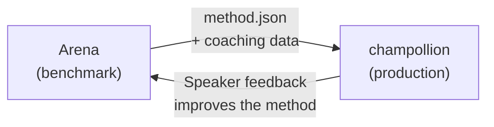

# Triển khai lên Production

Bạn đã chứng minh nó hoạt động hiệu quả trong Arena. Giờ là lúc triển khai nó.

Arena được dành riêng cho hoạt động R&D — xây dựng, đánh giá hiệu năng (benchmarking) và so sánh các phương pháp dịch thuật. **Triển khai lên production** được thực hiện thông qua [champollion](https://champollion.dev), giao diện dòng lệnh (CLI) dịch thuật dành cho nhà phát triển. Chúng kết nối với nhau thông qua một định dạng plugin chung.



---

## Quy trình Triển khai

### 1. Xuất Phương pháp của Bạn dưới dạng Plugin

Tạo một tệp manifest `method.json` để đóng gói các kết quả đánh giá hiệu năng của bạn:

```json
{
  "name": "crk-coached-v3",
  "type": "llm-coached",
  "version": "3.0.0",
  "description": "Coached LLM translation for Plains Cree",
  "locales": ["crk"],
  "config": {
    "model": "google/gemini-2.5-flash",
    "temperature": 0.3
  },
  "benchmarks": {
    "crk": {
      "composite_score": 0.67,
      "fst_acceptance": 0.82,
      "corpus_size": 150
    }
  }
}
```

Đính kèm bất kỳ dữ liệu hướng dẫn nào (quy tắc ngữ pháp, từ điển) cùng với tệp manifest.

### 2. Cài đặt trong Champollion

```bash
champollion plugin install ./my-method-plugin/
```

### 3. Cấu hình Cặp ngôn ngữ

```json title="champollion.config.json"
{
  "pairs": {
    "en-crk": { "method": "plugin", "plugin": "crk-coached-v3" }
  }
}
```

### 4. Dịch Nội dung Thực tế

```bash
npx champollion sync
```

Phương pháp đã qua đánh giá của bạn giờ đây đang tạo ra các bản dịch thực tế trên môi trường production.

---

## Đối với các Ngôn ngữ Bản địa

Các phương pháp phục vụ cộng đồng ngôn ngữ Bản địa yêu cầu phải có **sự đồng thuận của cộng đồng** trước khi triển khai lên production. Các nguyên tắc OCAP (Quyền sở hữu, Quyền kiểm soát, Quyền truy cập, Quyền chiếm hữu - Ownership, Control, Access, Possession) điều phối cách các phương pháp dịch thuật được phát triển, đánh giá và triển khai.

Một phương pháp đạt đến cấp độ Deployable (0.70+) không có nghĩa là sẽ tự động được triển khai — nó chỉ được triển khai **nếu và khi** cơ quan quản lý của cộng đồng ngôn ngữ đó đưa ra sự đồng thuận.

Xem [Chủ quyền Dữ liệu](/docs/sovereignty/data-sovereignty) và [Chuyển giao Quyền sở hữu](/docs/sovereignty/ownership-transfer) để biết thêm chi tiết về khung quản trị đầy đủ.

---

## Xem thêm

- [Cầu nối Eval Harness](https://champollion.dev/docs/guides/bridge) — hướng dẫn chi tiết về quy trình chuyển đổi từ Arena→champollion
- [Thông số kỹ thuật Plugin](https://champollion.dev/docs/reference/plugin-spec) — định dạng tệp manifest method.json
- [Hướng dẫn về champollion Agent](https://champollion.dev/docs/guides/agent-guide) — cách sử dụng champollion để dịch thuật