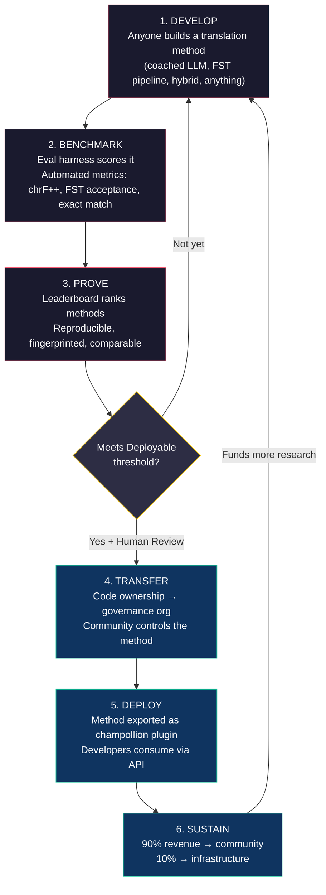
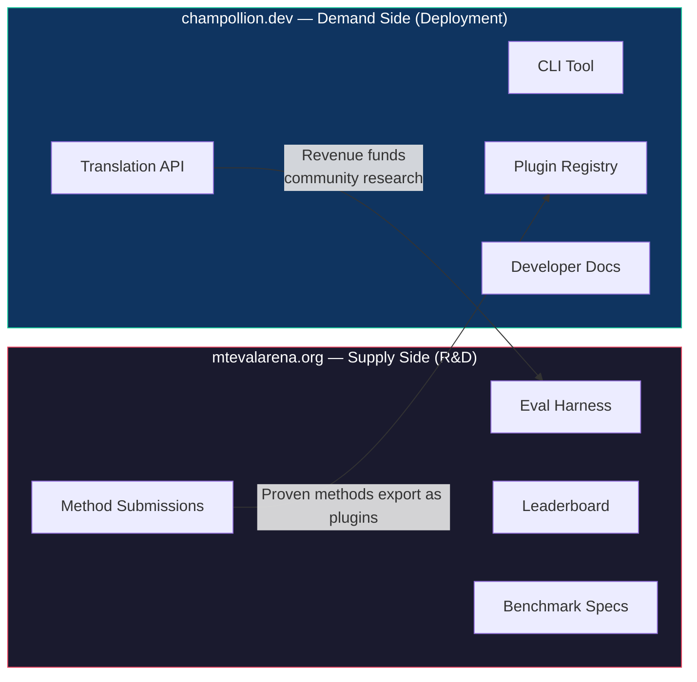
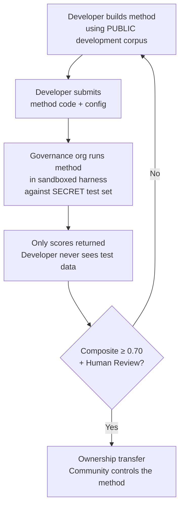

# Cách thức hoạt động: Huy động cộng đồng cạnh tranh cho Dịch máy

> **Tóm tắt dự án.** Dịch máy cho các ngôn ngữ chưa được hỗ trợ đầy đủ trên thế giới — bao gồm khoảng 1.300 ngôn ngữ mà OMT-1600 của Meta tuyên bố hỗ trợ nhưng ở mức chất lượng dưới ngưỡng có thể sử dụng — không phải là vấn đề huấn luyện mô hình — đó là vấn đề về *hạ tầng*. Không một mô hình, phòng thí nghiệm hay công ty đơn lẻ nào có thể giải quyết được điều này. Tài liệu này mô tả một kiến trúc nền tảng giúp biến cộng đồng toàn cầu gồm các kỹ sư ML, nhà ngôn ngữ học và người bản xứ thành một phòng thí nghiệm nghiên cứu phân tán: bất kỳ ai cũng có thể xây dựng một phương pháp dịch thuật, nền tảng sẽ chứng minh tính hiệu quả của nó dựa trên dữ liệu đánh giá có chủ quyền, và các phương pháp đã được chứng minh sẽ được triển khai vào môi trường thực tế (production) với doanh thu được chuyển về cho các cộng đồng sở hữu ngôn ngữ đó. Cơ chế này là sự kết hợp giữa crowdsourcing cạnh tranh và chủ quyền mật mã — một sự kết hợp chưa từng được thử nghiệm trước đây.

---

> [!IMPORTANT]
> **Phạm vi.** Nền tảng này đánh giá **bản dịch văn bản viết chính thức** — tài liệu, tài liệu giáo dục, thông tin liên lạc chính thức, chuỗi giao diện người dùng (UI). Đây không phải là chatbot, trình phiên dịch thời gian thực hay hệ thống hội thoại không giới hạn miền. Bảng xếp hạng xếp hạng các phương pháp dịch thuật dựa trên các ngữ liệu song song được tuyển chọn trong các miền văn bản cụ thể (xem [Benchmark Specification §2.7](/docs/specifications/benchmark#27-domain) để biết phân loại miền). MT là cơ sở hạ tầng cho việc phục hưng ngôn ngữ, chứ không phải là sự thế chỗ cho nó. Trẻ em học ngôn ngữ từ con người, không phải từ máy móc.

### Phạm vi bao phủ miền hiện tại

| Miền | Phạm vi phân tầng | Trạng thái | Ghi chú |
|------|-------------------|------------|---------|
| Chính thức / chính phủ | Phân tầng 1–5 | Hoạt động | Ngữ liệu EdTeKLA |
| Giáo dục / sách giáo khoa | Phân tầng 1–4 | Hoạt động | Ngữ liệu EdTeKLA |
| Tự sự / văn học | Hạn chế | Đang lên kế hoạch | Một số mục trong gold standard |
| Tôn giáo / kinh thánh | Chỉ tham khảo | Không đánh giá | FLORES+ (miền Kinh thánh); không dùng để tính điểm chính thức |
| Hội thoại | Ngoài phạm vi | Theo thiết kế | Hệ thống này đánh giá văn bản viết, không phải giọng nói |
| Kỹ thuật / khoa học | Ngoài phạm vi | Tương lai | Yêu cầu xác thực thuật ngữ chuyên ngành |

## 1. Vấn đề: Dịch máy ≠ Học máy

Dịch máy cho các ngôn ngữ ít tài nguyên (LRL) thường được định hình như một bài toán học máy: thu thập dữ liệu, huấn luyện mô hình, triển khai. Cách định hình này là sai lầm, và hệ quả của nó rất lớn — nó hướng nguồn vốn, tài năng và cơ sở hạ tầng vào một cách tiếp cận mà về mặt cấu trúc không thể hoạt động hiệu quả cho phần lớn các ngôn ngữ trên thế giới.

### 1.1 Tại sao cách định hình theo ML lại thất bại

Quy trình ML tiêu chuẩn cho MT yêu cầu ba yếu tố: ngữ liệu song song lớn, các chuẩn đánh giá (benchmark) đã được xác thực, và một lộ trình triển khai. Đối với khoảng 130 ngôn ngữ được hỗ trợ bởi Google Translate và khoảng 200 ngôn ngữ được bao phủ bởi NLLB-200, cả ba yếu tố này đều tồn tại. Đối với khoảng 1.300 ngôn ngữ bổ sung mà OMT-1600 tuyên bố hỗ trợ, dữ liệu đánh giá có tồn tại nhưng chất lượng hầu hết đều dưới ngưỡng có thể sử dụng, trọng số mô hình không được công bố công khai và không có quy trình triển khai. Đối với hơn 5.400 ngôn ngữ còn lại, không có yếu tố nào tồn tại.

| Yêu cầu | Ngôn ngữ nhiều tài nguyên | Phạm vi OMT-1600 (~1.300 LRL) | ~5.400 Ngôn ngữ còn lại |
|---------|---------------------------|-------------------------------|-------------------------|
| **Ngữ liệu song song** | Hàng triệu cặp câu (Europarl, UN Corpus, OpenSubtitles) | Văn bản song ngữ miền Kinh thánh, dữ liệu thu thập từ web, dịch ngược tổng hợp. Không có dữ liệu do cộng đồng tuyển chọn. | Vài trăm đến vài nghìn cặp câu, nếu có |
| **Chuẩn đánh giá (benchmark)** | WMT, FLORES, NTREX — chuẩn hóa, có thể tái lập | BOUQuET (miền Kinh thánh), met-BOUQuET. Không có xác thực hình thái học. Không có đánh giá độc lập. | Không có chuẩn đánh giá tiêu chuẩn; đánh giá tự phát (ad hoc) |
| **Lộ trình triển khai** | Google Translate, DeepL, Azure — các API thương mại | Trọng số mô hình không được công bố. Không có CLI, không có hệ thống plugin, không có API có thể triển khai bởi cộng đồng. | Không có gì. Không có API, không có sản phẩm, không có thị trường. |

Cách tiếp cận ML hoạt động hiệu quả khi có sẵn dữ liệu để huấn luyện và có thị trường để triển khai. OMT-1600 đã mở rộng điều kiện đầu tiên một cách đáng kể — nhưng việc mở rộng mà không có xác minh chất lượng độc lập, xác thực hình thái học hoặc quản trị cộng đồng là một sự mở rộng thiếu tin cậy. Vấn đề không chỉ là "chúng ta cần một mô hình tốt hơn" — mà là "chúng ta cần một cơ sở hạ tầng chứng minh được mô hình hoạt động hiệu quả, theo các điều khoản do cộng đồng kiểm soát."

### 1.2 Những gì MT cho LRL thực sự cần

Dịch thuật cho các ngôn ngữ chưa được hỗ trợ đầy đủ không chủ yếu là vấn đề huấn luyện. Đó là vấn đề **kỹ nghệ phương pháp (method engineering)** — thách thức trong việc lắp ghép các tài nguyên sẵn có (LLM, công cụ hình thái học, tri thức cộng đồng, quy tắc ngôn ngữ) thành các quy trình dịch thuật hoạt động hiệu quả, sau đó chứng minh tính hiệu quả của chúng bằng quy trình đánh giá nghiêm ngặt.

Sự khác biệt này rất quan trọng:

| Khía cạnh | Cách tiếp cận ML | Cách tiếp cận Kỹ nghệ Phương pháp |
|-----------|------------------|-----------------------------------|
| **Hoạt động cốt lõi** | Huấn luyện mô hình trên dữ liệu | Kết hợp các công cụ, prompt và tri thức ngôn ngữ vào một quy trình |
| **Nút thắt cổ chai** | Khối lượng dữ liệu song song | Sáng tạo kỹ thuật + hạ tầng đánh giá |
| **Ai có thể đóng góp** | Các đội ngũ có cụm GPU và tập dữ liệu lớn | Bất kỳ ai có khóa API, một cuốn từ điển và một ý tưởng |
| **Đánh giá** | BLEU/chrF trên các tập kiểm thử giữ lại | Xác thực hình thái học + đánh giá của con người + các chỉ số tự động |
| **Triển khai** | Vận hành mô hình (serve) | Đóng gói phương pháp dưới dạng một plugin |

Các LLM hiện đại đã chứa đựng tri thức tiềm ẩn về nhiều ngôn ngữ ít tài nguyên — đủ để tạo ra đầu ra *trông có vẻ* hợp lý. Vấn đề là đầu ra này thường không hợp lệ về mặt hình thái học (mô hình tạo ra các dạng từ không tồn tại trong ngôn ngữ đó - hallucination). Thách thức kỹ thuật ở đây là: làm thế nào để trích xuất những gì LLM biết, xác thực nó với thực tế ngôn ngữ và đóng gói kết quả để sử dụng trong môi trường thực tế?

Đây là lý do tại sao chúng tôi đánh giá (benchmark) các **phương pháp**, chứ không phải các mô hình. Một phương pháp là một công thức hoàn chỉnh: lựa chọn mô hình + kỹ nghệ prompt + sử dụng công cụ + tiền/hậu xử lý + dữ liệu hướng dẫn (coaching data) + chiến lược thử lại. Hai đội ngũ sử dụng cùng một mô hình với các phương pháp khác nhau sẽ nhận được điểm số khác nhau. Đó chính là mấu chốt.

### 1.3 Tại sao các ngôn ngữ đa tổng hợp làm đảo lộn mọi thứ

Nhiều ngôn ngữ chưa được hỗ trợ đầy đủ nhất trên thế giới là **ngôn ngữ đa tổng hợp (polysynthetic)** — chúng mã hóa cả câu thành các từ đơn lẻ thông qua các quá trình hình thái học hiệu quả. Hãy xem xét từ Plains Cree sau:

> **ê-kî-nitawi-kîskinwahamâkosiyân**
> *"when I had gone to school"*

Một từ duy nhất. Nó mã hóa thì (quá khứ), hướng (đi đến), gốc từ (học), thể (bị động/phản thân) và ngôi (ngôi thứ nhất số ít). Tiếng Anh cần sáu từ để diễn đạt những gì tiếng Cree thể hiện trong một từ.

Điều này làm hỏng MT tiêu chuẩn ở mọi cấp độ:

- **Phân tách từ (Tokenization)** — BPE và SentencePiece xé nhỏ các từ đa tổng hợp thành các mảnh vô nghĩa, vì chúng được thiết kế cho hình thái học chắp dính (concatenative morphology).
- **Ảo tưởng (Hallucination)** — LLM tạo ra các chuỗi trông có vẻ hợp lý nhưng không phải là từ hợp lệ. Người không biết tiếng không thể phân biệt được. Nếu không có xác thực hình thái học, các hiện tượng ảo tưởng này sẽ không thể bị phát hiện.
- **Đánh giá** — Các chỉ số cấp độ từ (BLEU) phạt các biến thể biến hình tự nhiên vốn là nền tảng cho cách hoạt động của các ngôn ngữ này. Các chỉ số cấp độ ký tự (chrF++) tốt hơn nhưng vẫn chưa đủ nếu không có xác thực cấu trúc.

Giải pháp không phải là một mô hình lớn hơn hay nhiều dữ liệu huấn luyện hơn. Đó là **cơ sở hạ tầng giúp phát hiện ảo tưởng trước khi chúng tiếp cận người dùng** — các bộ phân tích hình thái học (FST) có thể khẳng định chắc chắn rằng "đây không phải là một từ trong ngôn ngữ này."

---

## 2. Tại sao các cách tiếp cận hiện tại không hiệu quả

### 2.1 MT thương mại

Các dịch vụ dịch thuật thương mại trong lịch sử thường tối ưu hóa cho quy mô thị trường. OMT-1600 của Meta (tháng 3 năm 2026) đại diện cho một bước chuyển dịch lớn — 1.600 ngôn ngữ trong một hệ thống. Nhưng đối với khoảng 1.300 ngôn ngữ ở các tầng tài nguyên thấp nhất, chất lượng vẫn dưới ngưỡng có thể sử dụng, trọng số mô hình không có sẵn và không có quy trình triển khai. Vấn đề động lực cấu trúc đã phát triển: Các tập đoàn công nghệ lớn (Big Tech) giờ đây có thể xây dựng mô hình cho các LRL, nhưng nếu không có đánh giá độc lập, xác thực hình thái học hoặc quản trị cộng đồng, thì chỉ riêng độ bao phủ không giải quyết được vấn đề.

### 2.2 Nghiên cứu học thuật

Nghiên cứu MT học thuật tập trung phần lớn vào các cặp ngôn ngữ nhiều tài nguyên vì đó là nơi có sẵn dữ liệu huấn luyện, các nhiệm vụ chung (shared tasks) và các kênh công bố khoa học. Các nhà nghiên cứu làm việc trên các cặp ngôn ngữ ít tài nguyên gặp khó khăn trong việc xuất bản, khó khăn trong việc xin tài trợ tài nguyên tính toán và khó khăn trong việc triển khai — bởi vì cơ sở hạ tầng triển khai cho các LRL không tồn tại.

### 2.3 Các cuộc thi một lần

Bạn có thể tổ chức một cuộc thi trên Kaggle: "English→Plains Cree, chrF++ tốt nhất thắng 10.000 USD." Đây là những gì sẽ xảy ra:

1. Ai đó chiến thắng, nộp một notebook, nhận giải thưởng và ra về.
2. Notebook đó nằm mốc meo trong kho lưu trữ của Kaggle. Không ai triển khai nó. Không ai bảo trì nó.
3. Tập kiểm thử (test set) cuối cùng cũng bị công bố — bị rò rỉ dữ liệu (contamination) vĩnh viễn.
4. Tổ chức quản trị đã tải dữ liệu ngôn ngữ của họ lên cơ sở hạ tầng của Google theo điều khoản dịch vụ của Google, mà không có quyền kiểm soát thực sự đối với vòng đời của dữ liệu.
5. Không có cầu nối triển khai. Một notebook chiến thắng không phải là một API hoạt động được.

Một phần thưởng một lần chỉ thu hút những thợ săn tiền thưởng. Một bảng xếp hạng liên tục với sự quản trị của cộng đồng sẽ tạo ra sự gắn kết bền vững.

### 2.4 Tinh chỉnh (Fine-Tuning)

Tinh chỉnh một mô hình mở trên văn bản song song là cách tiếp cận ML hiển nhiên. Nhưng đối với hầu hết các LRL, ngữ liệu song song cần thiết cho việc tinh chỉnh chính là phần dữ liệu không tồn tại — và việc tạo ra nó đòi hỏi chính những người nói song ngữ và sự tham gia của cộng đồng mà việc tinh chỉnh được kỳ vọng sẽ thay thế. Bạn không thể tự khởi động (bootstrap) để thoát khỏi vấn đề khan hiếm dữ liệu bằng một kỹ thuật đòi hỏi chính dữ liệu đó.

---

## 3. Giải pháp: Crowdsourcing cạnh tranh với Đánh giá có chủ quyền

Nền tảng này đảo ngược cách tiếp cận truyền thống: thay vì một đội ngũ xây dựng một mô hình, **cộng đồng toàn cầu sẽ cạnh tranh để xây dựng phương pháp dịch thuật tốt nhất**, nền tảng sẽ chứng minh xem nó có hoạt động hiệu quả hay không, và các phương pháp đã được chứng minh sẽ được triển khai vào thực tế với quyền sở hữu và kiểm soát thuộc về cộng đồng ngôn ngữ đó.

### 3.1 Chu trình khép kín

Mỗi giai đoạn có một chức năng cụ thể:

| Giai đoạn | Điều gì xảy ra | Ai được lợi |
|-----------|----------------|-------------|
| **Phát triển (Develop)** | Nhà nghiên cứu, sinh viên hoặc người đam mê xây dựng một phương pháp dịch thuật bằng bất kỳ công cụ nào họ muốn — prompt LLM, quy trình FST, từ điển, mô hình tinh chỉnh, hệ thống dựa trên quy tắc hoặc các hệ thống lai | Người đóng góp được học hỏi, thử nghiệm, công bố |
| **Đánh giá (Benchmark)** | Hệ thống đánh giá (eval harness) chấm điểm phương pháp dựa trên một ngữ liệu chuẩn hóa với các chỉ số có thể tái lập. Mỗi lượt chạy tạo ra một [run card](/docs/specifications/benchmark#3-run-card-schema) — một bản ghi đầy đủ về những gì đã được kiểm thử và hiệu suất của nó | Các nhà nghiên cứu có được kết quả có thể tái lập và so sánh được |
| **Chứng minh (Prove)** | Kết quả xuất hiện trên bảng xếp hạng công khai. Các phương pháp được xếp hạng, so sánh và xem xét kỹ lưỡng. Cộng đồng thấy được cái gì hiệu quả và cái gì không | Mọi người đều có được cái nhìn rõ ràng về những tiến bộ công nghệ mới nhất (state of the art) |
| **Chuyển giao (Transfer)** | Đối với các ngôn ngữ bản địa, các phương pháp đạt ngưỡng Có thể triển khai (Deployable) (composite score ≥ 0,70) VÀ vượt qua vòng xác thực của con người sẽ được chuyển giao quyền sở hữu mã nguồn cho tổ chức quản trị của cộng đồng ngôn ngữ đó | Cộng đồng có được một tài sản tạo ra doanh thu |
| **Triển khai (Deploy)** | Phương pháp được xuất bản dưới dạng một plugin [champollion](https://github.com/gamedaysuits/champollion) và được cung cấp qua API. Các nhà phát triển sử dụng bản dịch mà không cần hiểu phương pháp cốt lõi hoạt động như thế nào | Các nhà phát triển có được bản dịch cho các ngôn ngữ mà các API thương mại không hỗ trợ |
| **Duy trì (Sustain)** | Doanh thu API được chia sẻ: 90% cho cộng đồng, 10% cho cơ sở hạ tầng. Doanh thu này tài trợ cho nhiều nghiên cứu ngôn ngữ hơn, phát triển ngữ liệu và các chương trình cộng đồng | Bánh đà tự duy trì sau khi được thiết lập ban đầu |

### 3.2 Tại sao động lực cạnh tranh lại hiệu quả

Cạnh tranh không phải là yếu tố ngẫu nhiên — đó chính là cơ chế vận hành. Đây là lý do tại sao:

**Sự đa dạng của các cách tiếp cận.** Phương pháp tốt nhất cho English→Plains Cree có thể là một LLM được hướng dẫn và kiểm soát bởi FST. Phương pháp tốt nhất cho English→Quechua có thể là một quy trình được tăng cường bằng từ điển. Phương pháp tốt nhất cho English→Inuktitut có thể là một mô hình tinh chỉnh được tự khởi động từ ngữ liệu Nunavut Hansard. Không một đội ngũ hay cách tiếp cận đơn lẻ nào có thể thống trị trên tất cả các ngôn ngữ. Bảng xếp hạng tiết lộ *loại* tiếp cận nào hoạt động hiệu quả cho *loại* ngôn ngữ nào — một kết quả vĩ mô (meta-result) tự thân nó đã là một đóng góp nghiên cứu.

**Sự gắn kết bền vững.** Một bảng xếp hạng không bao giờ có điểm dừng. Luôn có ai đó muốn vượt qua điểm số cao nhất. Mỗi lượt nộp bài đều đóng góp tài nguyên tính toán và nỗ lực trí tuệ cho bài toán. Không giống như một khoản tài trợ một lần, động lực cạnh tranh tạo ra nguồn đầu tư nghiên cứu liên tục từ cộng đồng toàn cầu.

**Rào cản gia nhập thấp.** Bạn chỉ cần một khóa API, một cuốn từ điển và một ý tưởng. Hệ thống đánh giá (eval harness) là mã nguồn mở. Định dạng ngữ liệu là JSON đơn giản. Một sinh viên ngôn ngữ học có thể cạnh tranh với một phòng thí nghiệm giàu tài nguyên — và đôi khi giành chiến thắng, bởi vì kiến thức chuyên môn (hiểu biết về ngôn ngữ) có thể quan trọng hơn tài nguyên tính toán.

**Cầu nối triển khai.** Cùng một phương pháp đạt điểm cao trong hệ thống đánh giá có thể được triển khai vào môi trường thực tế chỉ với một thay đổi cấu hình. "Chứng minh ở đây, triển khai ở đó." Đây là khoảng trống mà Kaggle, các nhiệm vụ chung của WMT và các công bố học thuật không thể khỏa lấp.

### 3.3 Kiến trúc nền tảng

Hệ sinh thái được chia tách vật lý thành hai trang web phục vụ hai nhóm đối tượng:

**[mtevalarena.org](https://mtevalarena.org)** là thao trường R&D. Đối tượng phục vụ là các kỹ sư ML, nhà ngôn ngữ học và nhà nghiên cứu. Mọi thứ ở đây đều xoay quanh việc xây dựng, thử nghiệm và chứng minh các phương pháp dịch thuật.

**[champollion.dev](https://champollion.dev)** là nền tảng triển khai. Đối tượng phục vụ là các nhà phát triển cần tích hợp dịch thuật vào ứng dụng của họ. Họ không cần hiểu các phương pháp hoạt động như thế nào — họ chỉ cần gọi API.

Cầu nối giữa hai bên là **plugin phương pháp (method plugin)**: một phương pháp đã được chứng minh, được đóng gói để triển khai và thuộc sở hữu của cộng đồng.

---

## 4. Đánh giá có chủ quyền: Tại sao cơ sở hạ tầng lại quan trọng

Cơ sở hạ tầng đánh giá không phải là một chi tiết kỹ thuật — nó là cốt lõi của mô hình chủ quyền. Đánh giá tiêu chuẩn (tải tập kiểm thử của bạn lên một nền tảng chia sẻ) không hoạt động hiệu quả đối với các ngôn ngữ bản địa vì nó làm mất quyền kiểm soát đối với dữ liệu ngôn ngữ.

### 4.1 Cơ chế chủ quyền

Nhà phát triển không bao giờ nhìn thấy dữ liệu đánh giá tiêu chuẩn vàng (gold-standard). Họ phát triển dựa trên một ngữ liệu phát triển công khai, sau đó gửi mã nguồn phương pháp của họ cho tổ chức quản trị, tổ chức này sẽ chạy mã nguồn đó trong một môi trường cô lập (sandbox) dựa trên tập kiểm thử bí mật. Chỉ có điểm số được trả về. Đây không chỉ là vấn đề bảo mật — đó là sự triển khai trực tiếp các **nguyên tắc OCAP®** (Quyền sở hữu, Quyền kiểm soát, Quyền truy cập, Quyền chiếm hữu - Ownership, Control, Access, Possession) mà việc quản trị dữ liệu bản địa yêu cầu.

### 4.2 Tại sao hệ thống này không thể chạy trên nền tảng của bên khác

Trên Kaggle, tổ chức quản trị phải tải dữ liệu ngôn ngữ của họ lên cơ sở hạ tầng của Google theo điều khoản dịch vụ của Google. Họ không thể thu hồi quyền truy cập theo mốc thời gian của riêng mình. Họ không thể đính kèm các điều khoản pháp lý tùy chỉnh (như chuyển giao quyền sở hữu) vào các bài nộp. Họ không có sự đảm bảo bằng mật mã rằng dữ liệu sẽ không bị sử dụng cho các mục đích khác. Chủ quyền dữ liệu có nghĩa là cộng đồng kiểm soát điểm cuối đánh giá (evaluation endpoint), nắm giữ các khóa bảo mật và có thể đóng hệ thống bất cứ lúc nào.

---

## 5. Triết lý đánh giá: Microeval và LYSS

Các chỉ số MT tiêu chuẩn (BLEU, chrF++, COMET) được thiết kế để khái quát hóa trên nhiều ngôn ngữ. Tính khái quát đó là điểm mạnh — và cũng là điểm mù của chúng. Đối với các ngôn ngữ đa tổng hợp, một từ không hợp lệ về mặt hình thái học nhưng chia sẻ các n-gram ký tự với bản dịch tham chiếu vẫn có thể đạt điểm cao trên chrF++, nhưng sẽ bị bất kỳ người bản xứ nào nhận diện là vô nghĩa.

**Phát triển Microeval** có nghĩa là xây dựng các chỉ số đánh giá được thiết kế riêng cho các ngôn ngữ cụ thể bằng cách sử dụng các công cụ ngôn ngữ tốt nhất hiện có. Khung đánh giá này được gọi là **LYSS** (Linguistically-informed Yield & Structural Scoring - Chấm điểm cấu trúc & hiệu suất dựa trên thông tin ngôn ngữ):

| Thành phần | Đo lường cái gì | Công cụ | Trạng thái |
|------------|-----------------|---------|------------|
| **LYSS-fst** | Tính hợp lệ về mặt hình thái học | Bộ chuyển đổi trạng thái hữu hạn (FST) | ✅ Đã triển khai (Plains Cree) |
| **LYSS-eq** | Sự tương đương về mặt ngôn ngữ | Các quy tắc biến thể do nhà ngôn ngữ học tuyển chọn | ✅ Đã triển khai (Plains Cree) |
| **LYSS-sem** | Sự bảo toàn ngữ nghĩa | Các mô hình ngữ nghĩa đặc thù của ngôn ngữ | ✅ Đã triển khai (Plains Cree) |

Các chỉ số phổ quát (chrF++, BLEU) đóng vai trò là đường cơ sở (baseline) và là tín hiệu chính cho các ngôn ngữ chưa có công cụ LYSS. Ở bất kỳ nơi nào tồn tại các công cụ đặc thù cho ngôn ngữ, các thành phần LYSS sẽ chiếm trọng số chấm điểm lớn — bởi vì những điều quan trọng nhất đối với mỗi ngôn ngữ là những điều mà chỉ các công cụ đặc thù cho ngôn ngữ đó mới có thể đo lường được.

Để biết đặc tả đầy đủ của LYSS và logic tính composite score, hãy xem [SCORING_SPEC.md §4](/docs/specifications/scoring#4-composite-score).

> [!WARNING]
> **Khả năng so sánh giữa các lượt chạy.** Khi so sánh các lượt chạy có tính khả dụng của chỉ số khác nhau (ví dụ: một lượt chạy có điểm FST, lượt chạy khác thì không), các composite score không thể so sánh trực tiếp với nhau. Điểm composite chuẩn hóa theo các chỉ số có sẵn, nhưng một lượt chạy được đánh giá trên 5 chỉ số sẽ mang lại nhiều thông tin hơn một lượt chạy chỉ được đánh giá trên 2 chỉ số. Bảng xếp hạng sẽ hiển thị phạm vi bao phủ chỉ số cho từng mục.

---

## 6. Hệ thống này phục vụ ai

### Dành cho các kỹ sư ML & nhà nghiên cứu

Một bảng xếp hạng công khai với các chuẩn đánh giá (benchmark) được chuẩn hóa cho các cặp ngôn ngữ mà không có nhiệm vụ chung (shared task) nào hỗ trợ. Tái lập bất kỳ kết quả nào bằng hệ thống đánh giá (eval harness). Công bố phương pháp của bạn. Vượt qua điểm số cao nhất. Mỗi bài nộp đều được gắn dấu vân tay (fingerprint) với một cấu hình và phiên bản tập dữ liệu cụ thể — không có sự mơ hồ về những gì đã được kiểm thử.

### Dành cho các cộng đồng ngôn ngữ

Quyền sở hữu và kiểm soát đối với công nghệ dịch thuật được xây dựng cho ngôn ngữ của bạn. Động lực cạnh tranh đồng nghĩa với việc nhiều đội ngũ đang cùng làm việc trên ngôn ngữ của bạn — bạn được hưởng lợi từ tất cả họ và sở hữu kết quả cuối cùng. Doanh thu từ việc sử dụng API sẽ tài trợ cho các chương trình cộng đồng theo các điều khoản của bạn.

### Dành cho các nhà tài trợ & người đánh giá tài trợ

Các chỉ số minh bạch, có thể tái lập để đánh giá các đề xuất nghiên cứu dịch thuật. Các kết quả có thể đo lường được ngoài các bài báo khoa học: mức độ sử dụng API, doanh thu được tạo ra, các chỉ số chất lượng theo thời gian, độ bao phủ ngôn ngữ. Một phương pháp thành công duy nhất sẽ tạo ra một dòng doanh thu tự duy trì — tác động của khoản tài trợ sẽ được nhân lên thay vì kết thúc khi hết kinh phí.

### Dành cho các nhà phát triển

Dịch thuật cho các ngôn ngữ mà không có API thương mại nào hỗ trợ. Chỉ với một lệnh CLI (`npx champollion sync`), bạn có thể dịch các tệp bản địa hóa (locale files) của mình bằng các phương pháp đã được cộng đồng chứng minh. Sử dụng Google Translate cho tiếng Pháp, một LLM được hướng dẫn cho tiếng Plains Cree và một API cộng đồng cho tiếng Quechua — tất cả trong cùng một dự án, tất cả với cùng một giao diện.

### Dành cho sinh viên

Một thử thách mở với tác động thực tế. Xây dựng một phương pháp dịch thuật cho một ngôn ngữ chưa được hỗ trợ đầy đủ, đánh giá nó và công bố kết quả của bạn. Cơ sở hạ tầng là miễn phí, các tập dữ liệu là mở và bảng xếp hạng không quan tâm bạn đang học tại một trường đại học top 10 hay đang làm việc từ một máy tính công cộng ở thư viện.

---

## 7. Bối cảnh xã hội và kỹ thuật

### 6.1 Việc phục hưng ngôn ngữ đang tăng tốc

Các nỗ lực phục hưng ngôn ngữ đang phát triển trên toàn thế giới. Các trường học song ngữ/nhúng (immersion schools), các tổ chức ngôn ngữ cộng đồng (language nests) và các dự án lưu trữ kỹ thuật số đang mở rộng trên khắp các cộng đồng bản địa ở Canada, Hoa Kỳ, Úc, New Zealand và Bắc Âu. Những nỗ lực này cần công nghệ — cụ thể là công nghệ dịch thuật tôn trọng chủ quyền của cộng đồng đối với dữ liệu ngôn ngữ.

### 6.2 LLM đã thay đổi đường cơ sở

Trước năm 2023, việc xây dựng bất kỳ khả năng MT nào cho một ngôn ngữ đa tổng hợp đều đòi hỏi chuyên môn NLP sâu rộng, huấn luyện mô hình tùy chỉnh và ngân sách tính toán lớn. Các LLM hiện đại đã thay đổi đường cơ sở: một prompt được thiết kế tốt với dữ liệu hướng dẫn và xác thực hình thái học có thể tạo ra các bản dịch có thể sử dụng được cho một số cặp ngôn ngữ — không cần huấn luyện. Điều này làm giảm đáng kể rào cản gia nhập đối với việc phát triển phương pháp. Vấn đề đã chuyển dịch từ "làm thế nào để chúng ta xây dựng một mô hình?" sang "làm thế nào để chúng ta xây dựng một quy trình xác thực và sửa lỗi những gì mô hình tạo ra?"

### 6.3 Văn hóa đánh giá mã nguồn mở

Đánh giá (benchmarking) AI đã trở thành một nét văn hóa riêng. Các bảng xếp hạng thúc đẩy sự đổi mới. Các cuộc thi thu hút tài năng. Chatbot Arena, LMSYS, Hugging Face Open LLM Leaderboard — những nền tảng này chứng minh rằng việc đánh giá mang tính cạnh tranh sẽ thúc đẩy tiến độ nhanh chóng. Chúng tôi tiếp nhận nguồn năng lượng đó và hướng nó vào dịch thuật cho hàng nghìn ngôn ngữ mà MT thương mại không tồn tại hoặc chưa được chứng minh độc lập là hoạt động hiệu quả.

### 6.4 Chủ quyền dữ liệu bản địa là điều không thể thương lượng

Các nguyên tắc OCAP® (Quyền sở hữu, Quyền kiểm soát, Quyền truy cập, Quyền chiếm hữu), các nguyên tắc CARE (Lợi ích tập thể, Quyền kiểm soát, Trách nhiệm, Đạo đức) và các khung quản trị như Te Mana Raraunga (Chủ quyền dữ liệu Māori) không phải là các tùy chọn bổ sung — chúng là các yêu cầu về mặt cấu trúc đối với bất kỳ công nghệ nào chạm đến tài nguyên ngôn ngữ bản địa. Cơ sở hạ tầng đánh giá của chúng tôi triển khai các nguyên tắc này về mặt kiến trúc, chứ không chỉ là các tuyên bố chính sách.

---

## 8. Những mâu thuẫn và hạn chế {#8-tensions-and-limitations}

Dự án này sử dụng một cơ chế phương Tây — đánh giá cạnh tranh (competitive benchmarking) — để phục vụ các hệ thống tri thức thường mang tính cộng đồng, tính kết nối và được dẫn dắt bởi các bậc trưởng lão. Mâu thuẫn đó là có thật và phải được gọi tên rõ ràng, chứ không thể giải quyết bằng những lời khẳng định suông.

**Đánh giá so sánh (Benchmarking) so với tri thức cộng đồng.** Các bảng xếp hạng xếp hạng các cá nhân và tối ưu hóa các điểm số bằng số. Các truyền thống tri thức bản địa nhấn mạnh vào thẩm quyền mang tính kết nối, sự sửa đổi của cộng đồng và tính hợp pháp dựa trên mối quan hệ. Chúng tôi không thể tuyên bố phục vụ các hệ thống tri thức này trong khi xây dựng một nền tảng có cơ chế cốt lõi là tối ưu hóa cạnh tranh cá nhân. Kiến trúc chủ quyền (§4) — nơi các cộng đồng sở hữu các phương pháp, kiểm soát việc đánh giá và quyết định những gì được triển khai — là câu trả lời về mặt cấu trúc của chúng tôi, nhưng nó không làm biến mất mâu thuẫn đó. Một bảng xếp hạng thì vẫn là một bảng xếp hạng.

**Những gì chúng tôi đang làm để giải quyết vấn đề này.** Nền tảng hỗ trợ các bài nộp từ đội ngũ và cộng đồng bên cạnh các bài nộp cá nhân. Bảng xếp hạng định hình kết quả là "tiến bộ công nghệ hiện tại" (current state of the art) thay vì "ai đang chiến thắng". Tổ chức quản trị — chứ không phải điểm số trên bảng xếp hạng — sẽ quyết định những gì được triển khai. Không có điểm số tự động nào mang lại quyền lợi cho nhà phát triển; cộng đồng mới là người quyết định. Và chúng tôi duy trì một vòng phản hồi tư vấn liên tục với các cộng đồng đối tác về việc liệu cách định hình và cấu trúc khuyến khích của nền tảng có phục vụ tốt cho họ hay không. Nếu không, chúng tôi sẽ thay đổi nó.

**MT không phải là sự phục hưng.** Dịch thuật chuyển đổi văn bản giữa các ngôn ngữ. Phục hưng tạo ra những người nói mới. Một hệ thống MT hoàn hảo không giải quyết được vấn đề truyền khẩu, vấn đề uy tín ngôn ngữ hay vấn đề sư phạm. Nó thậm chí có thể tạo ra ảo tưởng rằng "máy tính có thể nói được ngôn ngữ đó", làm giảm đi tính cấp bách của việc truyền dạy giữa con người với nhau. Chúng tôi xây dựng MT như một cơ sở hạ tầng — bản dịch nháp để hiệu đính sau dịch (post-editing), các công cụ hình thái học cho các ứng dụng học ngôn ngữ, đòn bẩy chính trị cho các cộng đồng yêu cầu dịch vụ bằng ngôn ngữ của họ — chứ không phải là sự thế chỗ cho việc truyền dạy giữa các thế hệ. Cộng đồng kiểm soát việc liệu công nghệ có được triển khai hay không, khi nào và như thế nào.

Phần này tồn tại vì những mâu thuẫn này đã được chỉ ra trong một bài phê bình được yêu cầu (tháng 5 năm 2026) và chúng tôi cam kết công khai gọi tên chúng thay vì chôn vùi chúng trong các tài liệu nội bộ.

> [!NOTE]
> **Điểm số trên bảng xếp hạng là các đại diện tự động.** Tất cả các điểm số hiển thị trên bảng xếp hạng là các phép đo tự động được tính toán bởi hệ thống đánh giá (evaluation harness) trong các điều kiện được kiểm soát. Chúng biểu thị hiệu suất tương đối của phương pháp nhưng không cấu thành các đảm bảo về chất lượng. Các phương pháp được cộng đồng xác thực sẽ được đánh dấu riêng biệt. Không có điểm số tự động nào mang lại quyền triển khai cho nhà phát triển — tổ chức quản trị sẽ đưa ra quyết định đó.

---

## 9. Trạng thái hiện tại

### Những gì đang tồn tại hôm nay

- **champollion** — Công cụ CLI sẵn sàng cho môi trường thực tế. 10 phương pháp dịch thuật, cấu hình theo từng cặp, các cổng kiểm soát chất lượng (quality gates), 5 định dạng tệp. [Được xuất bản trên npm](https://www.npmjs.com/package/champollion).
- **MT Eval Harness** — Khung đánh giá đang hoạt động. Đã triển khai các chỉ số chrF++, chấp nhận FST và khớp chính xác (exact match). Sơ đồ run card đã được hoàn thiện. Tính năng tạo dấu vân tay (fingerprinting) và xác minh tính toàn vẹn đang hoạt động tốt.
- **EDTeKLA Dev v1** — Ngữ liệu đánh giá Plains Cree (CC BY-NC-SA 4.0), có nguồn gốc từ nhóm nghiên cứu EdTeKLA của Đại học Alberta. Ngữ liệu sách giáo khoa có 486 mục (436 dev + 50 held-out), cộng với 62 cặp tiêu chuẩn vàng (gold standard) riêng biệt từ itwêwina (tổng cộng 548 mục). Ngữ liệu dev chuẩn tắc là `textbook_dev.json` với 436 mục — phân tách dev sách giáo khoa đầy đủ.
- **FLORES+ Devtest** — 1.012 câu × 39 ngôn ngữ (CC BY-SA 4.0).
- **Trang web Arena** — Trang tài liệu dựa trên Docusaurus với bảng xếp hạng, đặc tả kỹ thuật, hướng dẫn và khung chủ quyền.
- **Benchmark Specification** — [Đặc tả chuẩn tắc](/docs/specifications/benchmark) định nghĩa sơ đồ ngữ liệu, định dạng run card và giao thức đánh giá. Để biết định nghĩa chỉ số, trọng số composite và các tầng chất lượng, hãy xem [SCORING_SPEC.md](/docs/specifications/scoring).

### Bước tiếp theo

| Giai đoạn | Nội dung | Trạng thái |
|-----------|----------|------------|
| Quét đường cơ sở (Baseline sweep) | 12 mô hình × 3 nhiệt độ (temperature) × 2 cấu hình hướng dẫn trên EDTeKLA | 🔲 Đang lên kế hoạch |
| Composite score | Triển khai chỉ số có trọng số trong hệ thống đánh giá | ✅ Đã xong |
| Điểm ngữ nghĩa (Semantic score) | Điểm số theo trọng số phán quyết từ CrkSemanticMetric (tiêu chuẩn đánh giá) | ✅ Đã xong |
| Độ chính xác hình thái học | Chấm điểm theo từng hình vị (morpheme) dựa trên phân tích tiêu chuẩn vàng | 🔲 Đang lên kế hoạch |
| Khớp tương đương (Equivalent match) | Khớp lớp biến thể qua CrkLinterMetric (tiêu chuẩn đánh giá) | ✅ Đã xong |
| Champollion API | API tính phí theo mức sử dụng (metered API) cho các phương pháp thuộc sở hữu của cộng đồng | 🔲 Đang lên kế hoạch |
| Ngôn ngữ thứ hai | Mở rộng sang cặp ngôn ngữ thứ hai (Inuktitut, Quechua hoặc Sámi) | 🔲 Đang lên kế hoạch |

---

## 10. Bắt đầu

**Xây dựng một phương pháp:** Nhân bản (clone) [eval harness](https://github.com/gamedaysuits/arena), chạy một thử nghiệm đường cơ sở (baseline) và xem bạn đứng ở vị trí nào trên bảng xếp hạng.

**Đóng góp một ngữ liệu:** Nếu bạn nói một ngôn ngữ chưa được hỗ trợ đầy đủ, ngay cả 50 cặp dịch thuật được tuyển chọn cũng đủ để mở một nhánh bảng xếp hạng mới. Xem [Dành cho các cộng đồng ngôn ngữ](https://mtevalarena.org/docs/community/for-language-communities).

**Triển khai bản dịch:** Cài đặt [champollion](https://github.com/gamedaysuits/champollion) và dịch ứng dụng của bạn bằng `npx champollion sync`.

**Tài trợ cho nỗ lực này:** Xem [Mô hình kinh tế](https://mtevalarena.org/docs/sovereignty/economic-model) để biết các khung chi phí và dự báo tính bền vững.

---

## Xem thêm

- **[Benchmark Specification](/docs/specifications/benchmark)** — định dạng ngữ liệu, sơ đồ run card, giao thức đánh giá, chủ quyền
- **[Scoring Specification](/docs/specifications/scoring)** — các chỉ số, trọng số composite, các tầng chất lượng, công thức chi phí/tốc độ
- **[MT Eval Arena](https://mtevalarena.org)** — thao trường R&D
- **[champollion](https://github.com/gamedaysuits/champollion)** — nền tảng triển khai
- **[Support a Low-Resource Language](https://mtevalarena.org/docs/community/low-resource-languages)** — đi sâu vào các thách thức và cách tiếp cận MT đa tổng hợp

---

*Tài liệu này là điểm khởi đầu cho bất kỳ ai tiếp cận dự án lần đầu tiên. Để biết đặc tả kỹ thuật đầy đủ, hãy xem [BENCHMARK_SPEC.md](/docs/specifications/benchmark) (giao thức) và [SCORING_SPEC.md](/docs/specifications/scoring) (chỉ số).*