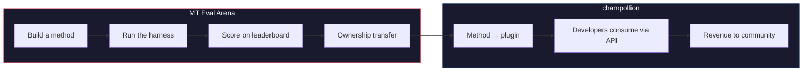

# MT Eval Arena

> **Tóm tắt tổng quan.** MT Eval Arena là một nền tảng đánh giá chuẩn (benchmarking) mở dành cho các phương pháp dịch máy, tập trung vào các ngôn ngữ mà dịch máy thương mại chưa hỗ trợ hoặc chưa được kiểm chứng độc lập. Nền tảng cung cấp quy trình đánh giá chuẩn hóa, bảng xếp hạng công khai và cầu nối triển khai thực tế thông qua champollion. Đối với các ngôn ngữ bản địa, các phương pháp đã được chứng minh hiệu quả sẽ được chuyển giao quyền sở hữu cho cộng đồng.

Một sân chơi thử nghiệm mở dành cho các phương pháp dịch máy — đặc biệt là đối với các ngôn ngữ mà dịch máy thương mại chưa hỗ trợ hoặc chưa được kiểm chứng độc lập.

Xây dựng phương pháp. Đánh giá hiệu năng. Chứng minh tính hiệu quả. Nếu chiến thắng, phương pháp đó sẽ được triển khai.

---

## Thách thức

Google Translate hỗ trợ khoảng 130 ngôn ngữ. NLLB-200 của Meta bao phủ khoảng 200 ngôn ngữ, và OMT-1600 (tháng 3 năm 2026) tuyên bố hỗ trợ 1.600 ngôn ngữ. Có hơn 7.000 ngôn ngữ được sử dụng trên Trái Đất. Đối với khoảng 1.300 ngôn ngữ thuộc các nhóm tài nguyên thấp nhất của OMT-1600, trọng số mô hình (model weights) không được công khai, chất lượng dưới ngưỡng có thể sử dụng, và việc đánh giá chỉ sử dụng văn bản thuộc ngữ cảnh Kinh Thánh với các chỉ số máy tiêu chuẩn — không có xác thực hình thái học (morphological validation), không có kiểm thử độc lập, và không có sự quản trị từ cộng đồng. Đối với khoảng 5.400 ngôn ngữ còn lại, không có mô hình tiền huấn luyện (pretrained model) nào có thể tạo ra bất kỳ kết quả đầu ra nào.

Các tập đoàn công nghệ lớn (Big Tech) hiện đang đầu tư vào việc bao phủ các ngôn ngữ tài nguyên thấp (LRL) — nhưng sự bao phủ mà thiếu đi việc kiểm chứng chất lượng độc lập, xác thực hình thái học hoặc sự quản trị từ cộng đồng chỉ là sự bao phủ thiếu tin cậy. Những người nói cần các công cụ dịch thuật nhất lại chính là những cộng đồng ít có cơ hội được xây dựng các công cụ đó nhất.

**Arena ra đời để thay đổi điều đó.** Nền tảng cung cấp cơ sở hạ tầng để phát triển, đánh giá và triển khai các phương pháp dịch thuật cho bất kỳ ngôn ngữ nào — với quy trình chấm điểm có thể tái lập (reproducible scoring), gửi bài mở (open submission) và sự quản trị của cộng đồng đối với việc ai là người kiểm soát kết quả.

---

## Cách thức hoạt động

1. **Bạn xây dựng một phương pháp dịch thuật** — coached LLM, mô hình tinh chỉnh (fine-tuned model), quy trình kiểm soát bằng FST (FST-gated pipeline), hoặc bất kỳ giải pháp nào khác tạo ra bản dịch.
2. **Hệ thống kiểm thử (harness) sẽ đánh giá hiệu năng** — sử dụng các chỉ số tiêu chuẩn (chrF++, exact match, FST acceptance), được định danh (fingerprinted) theo một commit Git cụ thể.
3. **Kết quả sẽ xuất hiện trên bảng xếp hạng** — mọi bài nộp đều có thể tái lập và so sánh được.
4. **Nếu chiến thắng, quyền sở hữu sẽ được chuyển giao** — đối với các ngôn ngữ bản địa, mã nguồn của phương pháp chiến thắng sẽ được chuyển giao cho tổ chức quản trị cộng đồng.
5. **Phương pháp sẽ được triển khai thực tế** — thông qua [champollion](https://champollion.dev), API dành cho nhà phát triển. Doanh thu sẽ được chuyển ngược lại cho cộng đồng.

**Chứng minh tại đây. Triển khai tại đó.**

---

## Đối tượng hướng tới

| Bạn là... | Arena mang lại cho bạn... |
|---|---|
| **Kỹ sư ML / Nhà nghiên cứu** | Các bài đánh giá chuẩn hóa, quy trình chấm điểm có thể tái lập, bảng xếp hạng để cạnh tranh |
| **Nhà ngôn ngữ học** | Một khung làm việc (framework) để chuyển đổi các quy tắc ngữ pháp và từ điển thành các phương pháp có thể kiểm thử |
| **Thành viên cộng đồng ngôn ngữ** | Quyền quản trị đối với cách các phương pháp dành cho ngôn ngữ của bạn được phát triển và triển khai |
| **Nhà tài trợ / Người thẩm định tài trợ** | Các chỉ số minh bạch, có thể tái lập để đánh giá các đề xuất nghiên cứu dịch thuật |
| **Sinh viên** | Một thử thách mở với tác động thực tế — xây dựng phương pháp, gửi điểm số của bạn |

---

## Các bài đánh giá chuẩn hiện tại

### EDTeKLA Development Set v1
- **Cặp ngôn ngữ:** Tiếng Anh → Plains Cree (SRO)
- **Số lượng mẫu:** 548 cặp được tuyển chọn (486 từ sách giáo khoa + 62 bản dịch chuẩn)
- **Giấy phép:** CC BY-NC-SA 4.0
- **Nguồn:** [Nhóm nghiên cứu EdTeKLA](https://spaces.facsci.ualberta.ca/edtekla/), Đại học Alberta

### FLORES+ Devtest
- **Cặp ngôn ngữ:** Tiếng Anh → 39 ngôn ngữ
- **Số lượng mẫu:** 1.012 câu mỗi ngôn ngữ
- **Giấy phép:** CC BY-SA 4.0
- **Nguồn:** [OLDI](https://huggingface.co/datasets/openlanguagedata/flores_plus)

---

## Quy tắc duy nhất

:::danger Không huấn luyện trên dữ liệu đánh giá
Các phương pháp tiếp xúc với tập dữ liệu đánh giá chuẩn (benchmark) — dưới dạng dữ liệu huấn luyện, ví dụ few-shot, mục từ điển hoặc tài liệu gợi ý (prompt) — sẽ bị **tước quyền thi đấu (disqualified)**. Bạn có thể tinh chỉnh (fine-tune) trên bất kỳ dữ liệu nào bạn muốn. Chỉ trừ tập kiểm thử (test set).
:::

---

## Các bước tiếp theo

- **[Nộp phương pháp](/docs/getting-started/submit-a-method)** — cách gửi lượt chạy đánh giá chuẩn đầu tiên của bạn
- **[Đặc tả đánh giá chuẩn](/docs/specifications/benchmark)** — toàn bộ giao thức thử nghiệm
- **[Quy tắc bảng xếp hạng](/docs/leaderboard/rules)** — tiêu chí nộp bài và chính sách chống gian lận
- **[Chủ quyền dữ liệu](/docs/sovereignty/data-sovereignty)** — OCAP, CARE, và lý do tại sao việc chuyển giao quyền sở hữu lại quan trọng
- **[Mô hình kinh tế](/docs/sovereignty/economic-model)** — cách điểm số trên Arena chuyển hóa thành doanh thu cho cộng đồng

**[→ Xem bảng xếp hạng](https://champollion.dev/leaderboard)**