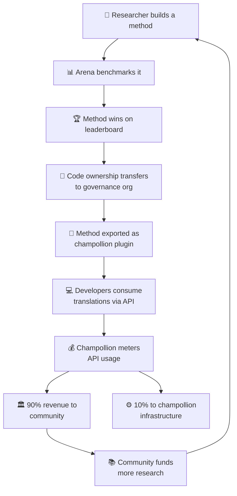

# Mô hình Kinh tế

> **Tóm tắt Tổng quan.** Trang này mô tả vòng lặp kinh tế kết nối Arena và champollion: nghiên cứu tạo ra các phương pháp, các phương pháp được triển khai dưới dạng plugin, việc sử dụng API tạo ra doanh thu, và 90% doanh thu sẽ chảy về cộng đồng ngôn ngữ. Nội dung bao gồm cơ chế bánh đà (flywheel), phân chia doanh thu, lớp tiện ích (convenience layer), và tính bền vững dành cho các nhà tài trợ.

Arena và champollion tạo thành một vòng lặp kinh tế khép kín. Nghiên cứu trên Arena tạo ra các phương pháp. Các phương pháp được triển khai thông qua champollion. Doanh thu từ champollion chảy ngược về các cộng đồng sở hữu ngôn ngữ mà các phương pháp đó phục vụ.

---

## Cơ chế Bánh đà

Mỗi vòng quay của bánh đà đều củng cố hệ sinh thái:
- **Nhiều nghiên cứu hơn** tạo ra các phương pháp tốt hơn
- **Các phương pháp tốt hơn** thu hút nhiều nhà phát triển hơn
- **Nhiều nhà phát triển hơn** tạo ra nhiều doanh thu API hơn
- **Nhiều doanh thu hơn** tài trợ cho nhiều nghiên cứu do cộng đồng dẫn dắt hơn

---

## Cách Doanh thu Luân chuyển

Khi một nhà phát triển sử dụng một phương pháp do cộng đồng sở hữu thông qua API champollion:

| Bước | Điều gì xảy ra |
|---|---|
| Nhà phát triển gọi `champollion sync` hoặc REST API | Bản dịch được tạo ra bởi phương pháp do cộng đồng sở hữu |
| Champollion đo lường lượt gọi API | Mức độ sử dụng được theo dõi trên từng yêu cầu, từng cặp ngôn ngữ |
| Doanh thu được phân chia | **90%** chuyển đến tổ chức quản trị sở hữu phương pháp đó. **10%** dùng để chi trả chi phí hạ tầng của champollion. |
| Cộng đồng quyết định phân bổ | Doanh thu tài trợ cho các chương trình ngôn ngữ, nghiên cứu sâu hơn, tài nguyên cộng đồng — bất kỳ điều gì tổ chức quản trị quyết định |

### Lớp Tiện ích

Champollion cũng cung cấp các cấu hình tối ưu hóa cho các phương pháp phổ biến. Nếu một nhà nghiên cứu chứng minh được rằng Gemini 2.5 Pro với dữ liệu huấn luyện và thiết lập nhiệt độ (temperature) cụ thể mang lại kết quả tốt nhất cho một cặp ngôn ngữ, cấu hình đó sẽ có sẵn dưới dạng một thiết lập trước (preset) được xây dựng sẵn thông qua API champollion. Các nhà phát triển không cần phải lặp lại nghiên cứu đó — họ chỉ cần gọi API.

Arena thiết lập các mốc so sánh (baseline). Champollion giúp chúng dễ dàng tiếp cận hơn. Các cộng đồng đều được hưởng lợi từ cả hai.

---

## Đối với các Ngôn ngữ Phổ thông

Cơ chế bánh đà có tác động lớn nhất đối với các ngôn ngữ bản địa và ngôn ngữ ít tài nguyên, nơi áp dụng mô hình chuyển giao quyền sở hữu và doanh thu cộng đồng.

Đối với các ngôn ngữ phổ thông (tiếng Pháp, tiếng Nhật, tiếng Tây Ban Nha, v.v.), champollion cung cấp sự tiện lợi tương tự của API mà không cần lớp quản trị — các nhà phát triển trả phí cho việc truy cập được đo lường theo mức sử dụng đối với các phương pháp dịch thuật được cấu hình sẵn, và champollion sẽ trích một phần phí hạ tầng.

---

## Dành cho các Nhà tài trợ

Mô hình kinh tế này giải quyết một mối lo ngại phổ biến trong việc tài trợ công nghệ ngôn ngữ: **tính bền vững sau khi khoản tài trợ kết thúc.**

| Mô hình Truyền thống | Mô hình Arena |
|---|---|
| Khoản tài trợ cấp vốn cho nghiên cứu | Khoản tài trợ cấp vốn cho nghiên cứu |
| Bài báo khoa học được công bố | Phương pháp được triển khai thực tế |
| Khoản tài trợ kết thúc, công cụ bị bỏ rơi | Doanh thu từ API duy trì hoạt động |
| Cộng đồng không nhận được gì | Cộng đồng sở hữu tài sản và tạo ra doanh thu |

Một phương pháp thành công duy nhất có thể tạo ra một dòng doanh thu tự duy trì. Các nhà tài trợ có thể đo lường tác động không chỉ qua các ấn phẩm công bố, mà còn qua:
- Mức độ sử dụng API (có bao nhiêu nhà phát triển đang sử dụng phương pháp này)
- Doanh thu được tạo ra (bao nhiêu tiền chảy về cho cộng đồng)
- Các chỉ số chất lượng (điểm số trên bảng xếp hạng theo thời gian)
- Độ phủ ngôn ngữ (có bao nhiêu cặp ngôn ngữ được phục vụ)

Xem [Thông số Kỹ thuật Điểm chuẩn](/docs/specifications/benchmark), §10 để biết mô hình chi phí chi tiết.

---

## Xem thêm

- [Chuyển giao Quyền sở hữu](/docs/sovereignty/ownership-transfer) — quy trình chuyển giao pháp lý và kỹ thuật
- [Chủ quyền Dữ liệu](/docs/sovereignty/data-sovereignty) — các nguyên tắc OCAP, CARE và Te Mana Raraunga
- [Quy tắc Bảng xếp hạng](/docs/leaderboard/rules) — cách các phương pháp đủ điều kiện để triển khai