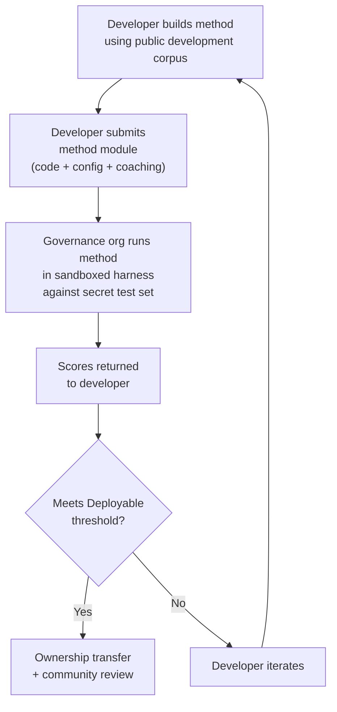

# Đặc tả Benchmark

> **Tóm tắt tổng quan.** Tài liệu này định nghĩa giao thức đánh giá cho hệ sinh thái đánh giá dịch máy (MT) Champollion: định dạng ngữ liệu (§2), cấu trúc run card (§3), giao thức benchmark (§6), các yêu cầu kiểm định của con người (§7), cơ chế chủ quyền (§8), bảng xếp hạng (leaderboard) và mô hình gửi bài (§9), khung chi phí (§10), và khả năng mở rộng sang các ngôn ngữ mới (§11). Để biết định nghĩa các chỉ số, trọng số tính điểm composite score, ngưỡng phân bậc chất lượng, và công thức tính chỉ số chi phí/tốc độ, vui lòng xem `SCORING_SPEC.md` — nguồn thông tin gốc duy nhất (single source of truth) cho toàn bộ logic tính điểm. Tài liệu này tham chiếu đến SCORING_SPEC cho các chi tiết đó thay vì lặp lại chúng.
>
> Cập nhật lần cuối: 2026-06-07

---

## 1. Nguyên tắc

### 1.1 Các chỉ số tự động chỉ là đại diện

Mọi chỉ số được định nghĩa trong tài liệu này đều được tính toán bằng máy. chrF++, tỷ lệ chấp nhận FST, độ chính xác hình thái, độ tương đồng ngữ nghĩa — tất cả đều là các đại diện tự động cho chất lượng dịch thuật. Chúng hữu ích cho việc lặp nhanh (rapid iteration), so sánh có hệ thống, và phát hiện lỗi suy thoái (regression). Chúng **không thể thay thế cho đánh giá của con người**.

Hệ thống phân cấp đánh giá:

```
Automated metrics (run cards, benchmarks)
    ↓ proxy for
Human review (bilingual speakers validate output)
    ↓ proxy for
Actual utility (does this help a language community?)
```

Không có điểm số tự động nào, dù cao đến đâu, có thể thay thế một người bản xứ thành thạo đọc bản dịch đầu ra và xác nhận rằng nó chính xác, tự nhiên và phù hợp về mặt văn hóa. Các bậc chất lượng được định nghĩa trong §5 là các nhãn phỏng đoán (heuristic) dựa trên điểm composite score tự động — hữu ích để theo dõi tiến độ, nhưng không bao giờ là đủ nếu đứng độc lập.

### 1.2 Đánh giá phương pháp, không đánh giá mô hình

Chúng tôi benchmark các **phương pháp** (methods), chứ không phải mô hình (models). Mô hình chỉ là một thành phần. Phương pháp là toàn bộ công thức: lựa chọn mô hình, thiết kế prompt, sử dụng công cụ, tiền/hậu xử lý, dữ liệu hướng dẫn (coaching data), chiến lược thử lại (retry), và mọi thứ khác. Hai đội sử dụng cùng một mô hình với các phương pháp khác nhau sẽ nhận được điểm số khác nhau. Đó chính là mục tiêu.

### 1.3 Khả năng tái lập

Mọi kết quả benchmark phải có khả năng tái lập. Run card (§3) ghi lại cấu hình hoàn chỉnh của một thử nghiệm. Fingerprint (§3.5) xác định thiết lập thử nghiệm. Hash của run card (§3.6) xác minh tính toàn vẹn của kết quả. Bất kỳ ai sử dụng cùng một phương pháp, ngữ liệu (corpus) và cấu hình đều phải đạt được điểm số trong khoảng sai lệch ±2% (có tính đến tính không xác định khi lấy mẫu của LLM ở mức temperature > 0).

### 1.4 Không sử dụng dữ liệu đánh giá tổng hợp

**Dự án này không tạo ra, sử dụng hoặc ủng hộ dữ liệu đánh giá tổng hợp (synthetic evaluation data).** Tất cả ngữ liệu phải có nguồn gốc từ văn bản thực tế do con người viết — các bản dịch đã xuất bản, sách giáo khoa, tài liệu song ngữ, hoặc các bản dịch được thu thập trực tiếp từ những người nói lưu loát.

LLM có thể hỗ trợ:
- Căn chỉnh câu (sentence alignment - tìm các đoạn văn song song trong các văn bản song ngữ hiện có)
- Chuyển đổi định dạng (chuyển đổi tài liệu đã xuất bản sang schema của ngữ liệu)
- Làm phong phú siêu dữ liệu (gợi ý các bậc độ khó, nhãn văn phong/ngữ cảnh)
- Đề xuất các câu nguồn để con người dịch (§11.3 — bước dịch thuật luôn do con người thực hiện)

LLM **không bao giờ** được phép tạo ra các bản dịch tham chiếu (reference translation) hoặc các cặp câu đánh giá.

**Chúng tôi giữ thái độ trung lập đối với dữ liệu huấn luyện.** Nếu nhà phát triển phương pháp sử dụng dữ liệu huấn luyện tổng hợp, dịch ngược (backtranslation), hoặc tăng cường dữ liệu (data augmentation) trong phương pháp của họ, đó là lựa chọn của họ — chúng tôi đánh giá kết quả đầu ra, chứ không đánh giá quá trình huấn luyện. Dự án OMT-1600 của Meta sử dụng khoảng 270 million câu song song tổng hợp được tạo ra thông qua dịch ngược. Chúng tôi không phản đối các phương pháp được huấn luyện theo cách này. Chúng tôi chỉ kiểm thử trên dữ liệu do con người biên soạn.

> **Tại sao không dùng văn bản Kinh Thánh để đánh giá?** OMT-1600 đánh giá 1.560 trên tổng số 1.600 ngôn ngữ dựa trên văn bản thuộc lĩnh vực Kinh Thánh. Các bản dịch Kinh Thánh có văn phong cổ xưa, từ vựng phụng vụ và cấu trúc câu theo khuôn mẫu. Ngữ liệu đánh giá của chúng tôi được lấy từ các văn bản đa dạng về lĩnh vực do cộng đồng biên soạn — y tế, pháp lý, giáo dục, chính phủ, hội thoại và kỹ thuật (xem §2.7). Đây là một lựa chọn thiết kế có chủ ý. Các cộng đồng cần dịch thuật cho các lĩnh vực mà họ thực sự sinh sống và làm việc, chứ không phải một văn phong tôn giáo duy nhất. Một phương pháp đạt điểm cao trên Sáng thế ký 1:1 hầu như không nói lên điều gì về hiệu suất của nó đối với một chương trình nghị sự của hội đồng bộ tộc hoặc một biểu mẫu tiếp nhận của phòng khám.

---

## 2. Schema Ngữ liệu

Ngữ liệu (corpus) là một tập hợp các cặp văn bản song song được biên soạn cùng với siêu dữ liệu có cấu trúc. Đây là chân lý mặt đất (ground truth) để đo lường tất cả các phương pháp.

### 2.1 Dataset Envelope

Cấu trúc cấp cao nhất của một file ngữ liệu:

```json
{
  "dataset": {
    "id": "edtekla-dev-v1",
    "version": "1.0",
    "language_pair": "EN→CRK",
    "source_language": "en",
    "target_language": "crk",
    "created": "2026-05-01",
    "license": "CC-BY-NC-SA-4.0",
    "provenance": ["gold_standard", "textbook"]
  },
  "entries": [ ... ]
}
```

| Trường | Kiểu dữ liệu | Bắt buộc | Mô tả |
|-------|------|----------|-------------|
| `id` | string | ✅ | Mã định danh duy nhất của dataset, được sử dụng trong run card và bảng xếp hạng |
| `version` | string | ✅ | Phiên bản ngữ nghĩa (semantic version). Việc tăng phiên bản sẽ làm mất hiệu lực các so sánh run card trước đó |
| `language_pair` | string | ✅ | Nhãn hiển thị (ví dụ: `EN→CRK`) |
| `source_language` | string | ✅ | Mã ngôn ngữ nguồn BCP 47 |
| `target_language` | string | ✅ | Mã ngôn ngữ đích BCP 47 |
| `created` | string | ✅ | Ngày tạo theo chuẩn ISO 8601 |
| `license` | string | ✅ | Mã định danh giấy phép SPDX |
| `provenance` | string[] | ✅ | Danh sách các thẻ nguồn gốc (provenance tag) được sử dụng trên các mục dữ liệu |

### 2.2 Schema của Mục dữ liệu (Entry Schema)

Mỗi mục dữ liệu (entry) trong ngữ liệu đại diện cho một thử thách dịch thuật:

```json
{
  "id": 42,
  "source": "I see the dog",
  "reference": "niwâpamâw atim",
  "segment": "gold_standard",
  "difficulty": 2,
  "provenance": "gold_standard",
  "register": "conversational",
  "context": "declaration",
  "morphological_analysis": "ni-wâpam-âw atim | 1sg-see.TA-3sg.DIR dog.AN",
  "notes": "Animate noun (atim); direct form because speaker is proximate",
  "variant_class": "simple-ta-direct"
}
```

| Trường | Kiểu dữ liệu | Bắt buộc | Mô tả |
|-------|------|----------|-------------|
| `id` | integer | ✅ | Mã định danh duy nhất trong ngữ liệu |
| `source` | string | ✅ | Văn bản nguồn bằng ngôn ngữ nguồn |
| `reference` | string | ✅ | Bản dịch tham chiếu chuẩn (gold-standard reference translation) bằng ngôn ngữ đích |
| `segment` | string | 📎 | Phân vùng ngữ liệu: `gold_standard`, `held_out`, `development`, hoặc `diagnostic` |
| `difficulty` | integer | 📎 | Đánh giá độ khó từ 1–5 (xem §2.4) |
| `provenance` | string | 📎 | Nguồn gốc của mục dữ liệu này (xem §2.5) |
| `register` | string | 📎 | Văn phong/Mức độ trang trọng (xem §2.6) |
| `context` | string | 📎 | Chức năng giao tiếp (xem §2.6) |
| `domain` | string | 📎 | Lĩnh vực sử dụng (domain) từ phân loại 16 mã (xem §2.7). Phải là một trong các giá trị: `conv`, `ecommerce`, `edu`, `financial`, `gov`, `legal`, `literary`, `marketing`, `medical`, `news`, `religious`, `scientific`, `subtitles`, `support`, `tech`, `ui`. Được xác thực tại thời điểm khởi tạo. |

> **📎 = KHUYẾN NGHỊ.** Bộ khung chạy thử nghiệm (harness) xử lý các trường tùy chọn bị thiếu một cách mượt mà thông qua các giá trị mặc định. Ngữ liệu của bên thứ ba chỉ cần cung cấp `id`, `source`, và `reference` cho mỗi mục dữ liệu.
| `morphological_analysis` | string | ❌ | Phân tích hình thái chuẩn (gold-standard morphological breakdown) |
| `notes` | string | ❌ | Ghi chú của người dịch, các biến thể phương ngữ, cờ đánh dấu sự mơ hồ |
| `variant_class` | string | ❌ | Nhãn lớp nhóm các biến thể dịch thuật được chấp nhận |


### 2.3 Các phân đoạn ngữ liệu (Corpus Segments)

Ngữ liệu được chia thành các phân đoạn với các mức độ truy cập khác nhau:

| Phân đoạn | Mục đích | Quyền truy cập | Kích thước tối thiểu |
|---------|---------|--------|-------------|
| `development` | Phát triển và lặp lại phương pháp. Các nhà phát triển có thể tự do sử dụng. | **Công khai** | 30 mục |
| `diagnostic` | Các bài kiểm thử có mục tiêu cho các hiện tượng ngôn ngữ cụ thể. | **Công khai** | 10 mục |
| `gold_standard` | Đánh giá benchmark chính thức. Điểm số trên bảng xếp hạng được lấy từ đây. | **Bảo mật** — do tổ chức quản trị nắm giữ | 50 mục |
| `held_out` | Dành riêng cho đánh giá trong tương lai. Không bao giờ được sử dụng cho đến khi được kích hoạt. | **Bảo mật** — do tổ chức quản trị nắm giữ | 10 mục |

> **Trạng thái hiện tại:** Chỉ có phân đoạn `development` tồn tại trong các bộ dữ liệu được phân phối. Các phân đoạn `diagnostic`, `gold_standard`, và `held_out` được định nghĩa để sử dụng trong tương lai khi ngữ liệu phát triển.

Các phân đoạn `gold_standard` và `held_out` hoàn toàn được bảo mật. Cả câu nguồn và bản dịch tham chiếu đều được lưu trữ trên cơ sở hạ tầng do tổ chức quản trị kiểm soát. Các nhà phát triển phương pháp không bao giờ nhìn thấy câu hỏi hoặc câu trả lời. Xem §8 để biết về cơ chế chủ quyền.

### 2.4 Các bậc độ khó

| Bậc | Mô tả | Ví dụ |
|------|-------------|----------|
| 1 — Từ vựng cơ bản | Từ đơn, lời chào phổ biến, chữ số | "hello" → "tânisi", "dog" → "atim" |
| 2 — Câu đơn giản | Chủ ngữ-động từ hoặc SVO, thì hiện tại | "I see the dog" → "niwâpamâw atim" |
| 3 — Độ phức tạp trung bình | Thì quá khứ/tương lai, sở hữu cách, tính sinh động (animacy) | "I saw his dog yesterday" |
| 4 — Hình thái phức tạp | Sự phân biệt ngôi thứ ba (obviation), thể bị động, trật tự liên hợp (conjunct order), mệnh đề quan hệ | "the woman whose son went to the store" |
| 5 — Nâng cao | Nhiều mệnh đề, văn phong trang trọng, nghi lễ, thành ngữ | Đoạn văn đầy đủ với giọng điệu phù hợp với văn phong |

Một ngữ liệu được xây dựng tốt nên bao gồm các mục dữ liệu trải dài trên cả năm bậc độ khó, tập trung nhiều hơn vào các bậc từ 2–4, nơi tập trung hầu hết các thử thách dịch thuật trong thế giới thực.

### 2.5 Thẻ nguồn gốc (Provenance Tags)

Mỗi mục dữ liệu phải chỉ ra nguồn gốc của nó:

| Thẻ | Ý nghĩa |
|-----|---------|
| `gold_standard` | Được xác minh bởi những người nói lưu loát |
| `textbook` | Từ các tài liệu giáo dục đã xuất bản |
| `elicited` | Được tạo ra thông qua các buổi thu thập dữ liệu có cấu trúc |
| `corpus` | Được trích xuất từ một ngữ liệu song song |

> **Lưu ý:** Trong thực tế, các giá trị nguồn gốc là các chuỗi tự do. Các thẻ trên là các quy ước, không phải là một enum được xác thực — các bộ dữ liệu có thể sử dụng các chuỗi mô tả nguồn gốc khác.

### 2.6 Văn phong và Ngữ cảnh

**Văn phong (Register)** mô tả mức độ trang trọng và bối cảnh xã hội:

| Văn phong | Mô tả |
|----------|-------------|
| `conversational` | Giao tiếp hàng ngày giữa những người có vị thế ngang hàng |
| `formal` | Ngôn ngữ chính thức hoặc hành chính |
| `technical` | Từ vựng chuyên ngành cụ thể |
| `ceremonial` | Sử dụng ngôn ngữ truyền thống hoặc thiêng liêng |
| `educational` | Tài liệu giảng dạy ngôn ngữ |

**Ngữ cảnh (Context)** mô tả chức năng giao tiếp:

> 🔲 **Đang lên kế hoạch.** Trường `context` được định nghĩa trong schema nhưng chưa được điền dữ liệu trong các bộ dữ liệu hiện tại. Nó được dành riêng cho việc làm phong phú ngữ liệu trong tương lai.

| Ngữ cảnh | Mô tả |
|---------|-------------|
| `greeting` | Chào hỏi xã giao hoặc tạm biệt |
| `declaration` | Tuyên bố sự thật |
| `question` | Câu hỏi |
| `instruction` | Mệnh lệnh hoặc chỉ thị |
| `narrative` | Kể chuyện hoặc mô tả |
| `label` | Nhãn giao diện người dùng, văn bản nút, hoặc tiêu đề |
| `error` | Thông báo lỗi hoặc cảnh báo |

### 2.7 Lĩnh vực (Domain)

**Lĩnh vực (Domain)** mô tả trường hợp sử dụng trong thế giới thực — loại nội dung đang được dịch. Điều này độc lập (orthogonal) với văn phong và ngữ cảnh:

- **Văn phong** trả lời câu hỏi: *Mức độ trang trọng của văn bản này như thế nào?*
- **Ngữ cảnh** trả lời câu hỏi: *Câu này đang thực hiện chức năng gì?*
- **Lĩnh vực** trả lời câu hỏi: *Văn bản này dành cho ngành công nghiệp/trường hợp sử dụng nào?*

Một hợp đồng pháp lý (lĩnh vực: `legal`) có thể mang tính trang trọng (văn phong: `formal`) và chứa một tuyên bố (ngữ cảnh: `declaration`). Một bản ghi chép chatbot pháp lý (lĩnh vực: `legal`) có thể mang tính hội thoại (văn phong: `conversational`) và chứa các câu hỏi (ngữ cảnh: `question`). Cùng một lĩnh vực, nhưng văn phong và ngữ cảnh khác nhau.

| Mã lĩnh vực | Mô tả | Đối tượng sử dụng điển hình |
|-------------|-------------|-------------------|
| `ui` | Chuỗi giao diện phần mềm | Nhà phát triển ứng dụng, đội ngũ bản địa hóa |
| `legal` | Hợp đồng, quy chế, hồ sơ tòa án, tài liệu nhập cư | Văn phòng luật, tòa án, đội ngũ tuân thủ, luật sư sở hữu trí tuệ |
| `medical` | Ghi chú lâm sàng, nhãn thuốc, giao tiếp với bệnh nhân, đề cương thử nghiệm lâm sàng | Bệnh viện, hãng dược phẩm, thử nghiệm lâm sàng, cổng thông tin bệnh nhân |
| `financial` | Ngân hàng, bảo hiểm, hồ sơ quản lý, báo cáo kiểm toán | Ngân hàng, công ty bảo hiểm, cơ quan quản lý, kiểm toán viên |
| `edu` | Sách giáo khoa, chương trình giảng dạy, giáo án, tài liệu học thuật | Trường học, trường đại học, nhà xuất bản sách giáo khoa |
| `ecommerce` | Mô tả sản phẩm, đánh giá, danh sách mặt hàng trên sàn thương mại điện tử | Nhà bán lẻ trực tuyến, người bán trên sàn thương mại điện tử |
| `marketing` | Nội dung quảng cáo, thông điệp thương hiệu, chiến dịch, khẩu hiệu | Công ty quảng cáo, đội ngũ thương hiệu |
| `gov` | Tài liệu chính sách, quy định, thông báo công cộng, luật pháp | Cơ quan chính phủ, đội ngũ tuân thủ |
| `scientific` | Bài báo nghiên cứu, tóm tắt, phương pháp luận, đề xuất tài trợ | Nhà nghiên cứu, tạp chí khoa học, cơ quan tài trợ |
| `religious` | Kinh thánh, văn bản phụng vụ, bình luận thần học | Cộng đồng tôn giáo, nhà xuất bản phụng vụ |
| `support` | Câu hỏi thường gặp, thông báo lỗi, hướng dẫn khắc phục sự cố, kịch bản chatbot | Công ty SaaS, bộ phận hỗ trợ khách hàng |
| `subtitles` | Lời thoại phim, truyền hình, phát trực tuyến và trò chơi | Nền tảng phát trực tuyến, studio, công ty trò chơi |
| `news` | Báo chí, tin tức thông tấn, bài xã luận, thông cáo báo chí | Tổ chức truyền thông, hãng thông tấn |
| `literary` | Tiểu thuyết, thơ ca, tự sự, văn bản văn hóa | Nhà xuất bản, tổ chức bảo tồn văn hóa |
| `conv` | Trò chuyện thân mật, mạng xã hội, tin nhắn | Ứng dụng tiêu dùng, nền tảng mạng xã hội |
| `tech` | Tài liệu API, hướng dẫn sử dụng, đặc tả kỹ thuật, hướng dẫn kỹ thuật | Đội ngũ viết tài liệu, tổ chức kỹ thuật |

> **Benchmark theo từng lĩnh vực cụ thể.** Benchmark chung đánh giá một phương pháp trên tất cả các lĩnh vực. Nhưng Arena cũng hỗ trợ **benchmark được lọc theo lĩnh vực (domain-filtered benchmarks)** — nơi điểm số chỉ được tính trên các mục dữ liệu được gắn thẻ một lĩnh vực cụ thể. Điều này cho phép người dùng trả lời các câu hỏi như: "Phương pháp nào tốt nhất để dịch tài liệu pháp lý sang tiếng Pháp?" so với "Phương pháp nào có điểm tiếng Pháp tổng thể tốt nhất?"
>
> Bảng xếp hạng được lọc theo lĩnh vực là một tính năng sản phẩm cốt lõi. Các phương pháp khác nhau sẽ có hiệu suất khác nhau trên các lĩnh vực khác nhau — một phương pháp được tinh chỉnh (fine-tune) trên thuật ngữ pháp lý có thể vượt trội trong các benchmark pháp lý nhưng lại kém hiệu quả trên văn bản hội thoại. Arena giúp người dùng tìm ra giải pháp hoạt động tốt nhất cho trường hợp sử dụng cụ thể của họ.

> **Tương lai: Arena Chatbot.** Trang web Arena sẽ tích hợp một trợ lý hội thoại giúp người dùng mô tả trường hợp sử dụng MT của họ (lĩnh vực, cặp ngôn ngữ, yêu cầu chất lượng) và đề xuất phương pháp tốt nhất đã được cộng đồng xác thực từ bảng xếp hạng. Ví dụ: "Tôi cần dịch các đề cương thử nghiệm lâm sàng từ tiếng Anh sang tiếng Nhật — phương pháp nào đạt điểm cao nhất trên các benchmark EN→JA thuộc lĩnh vực y tế?" Điều này phụ thuộc vào việc có đủ dữ liệu đánh giá được gắn thẻ lĩnh vực và sự đa dạng của các phương pháp.

---

## 3. Schema của Run Card

Run card là đơn vị đánh giá nguyên tử. Nó là một tài liệu JSON độc lập ghi lại cấu hình hoàn chỉnh và kết quả của một lượt chạy đánh giá duy nhất: một phương pháp, một mô hình, một cấu hình, một bộ dữ liệu.

Mỗi run card ghi lại ba khía cạnh:
- **Chất lượng (Quality)** — các bản dịch tốt đến mức nào?
- **Chi phí (Cost)** — chi phí để tạo ra chúng là bao nhiêu?
- **Tốc độ (Speed)** — mất bao lâu để hoàn thành?

### 3.1 Các trường cấp cao nhất

| Trường | Kiểu dữ liệu | Mô tả |
|-------|------|-------------|
| `run_id` | string | UUID v4 được tạo khi bắt đầu lượt chạy |
| `harness_version` | string | Phiên bản ngữ nghĩa của bộ khung chạy thử nghiệm (ví dụ: `2.0`) |
| `timestamp` | string | Nhãn thời gian UTC theo chuẩn ISO 8601 khi lượt chạy bắt đầu |
| `elapsed_seconds` | number | Thời gian thực tế (wall-clock duration) của toàn bộ lượt chạy |

### 3.2 Cấu hình phương pháp (Method Configuration)

Các trường này định nghĩa thiết lập thử nghiệm — những gì đã được kiểm thử và kiểm thử như thế nào.

| Trường | Kiểu dữ liệu | Bắt buộc | Mô tả |
|-------|------|----------|-------------|
| `model_slug` | string | ✅ | Mã định danh mô hình (ví dụ: `google/gemini-2.5-flash`) |
| `model_id` | string | ❌ | Mã định danh mô hình đã phân giải được trả về bởi API |
| `condition` | string | ✅ | Nhãn thử nghiệm (ví dụ: `baseline`, `coached-v3`, `few-shot`) |
| `temperature` | number | ✅ | Nhiệt độ lấy mẫu (sampling temperature) |
| `system_prompt_sha256` | string | ✅ | Mã băm SHA-256 của toàn bộ system prompt |
| `system_prompt_used` | string | ✅ | Toàn bộ văn bản system prompt |
| `coaching_data_sha256` | string | ❌ | Mã băm SHA-256 của file dữ liệu hướng dẫn (coaching data), nếu được sử dụng |
| `fst_version` | string | ❌ | Phiên bản của bộ phân tích FST, nếu được sử dụng |
| `tools_enabled` | string[] | ❌ | Danh sách các công cụ khả dụng cho phương pháp |
| `batch_size` | number | ❌ | Số lượng mục dữ liệu trên mỗi batch API đồng thời |
| `max_retries` | number | ❌ | Số lần thử lại tối đa khi bị FST từ chối, nếu áp dụng |

:::info Các Run Card được xuất bản bao gồm method_config
Khi một run card được xuất bản lên bảng xếp hạng (thông qua `mt-eval publish`), nó cũng bao gồm một khối `method_config` chứa cấu trúc MethodConfig chuẩn gồm 8 trường (`model`, `temperature`, `batchSize`, `register`, `coachingFile`, `coachingPrompt`, `promptContext`, `qualityTier` — tất cả đều viết theo kiểu camelCase). Điều này cho phép nhập dữ liệu mà không cần tái cấu trúc (zero-reconstruction import): `champollion leaderboard --install` đọc trực tiếp `method_config` và ghi nó dưới dạng một plugin manifest. Các trường đo lường từ xa (telemetry) ở trên (§3.2) ghi lại những gì bộ khung chạy thử nghiệm quan sát được; `method_config` ghi lại những gì nhà phát triển dự định.
:::

### 3.3 Tham chiếu Dataset (Dataset Reference)

| Trường | Kiểu dữ liệu | Mô tả |
|-------|------|-------------|
| `dataset.id` | string | Mã định danh dataset |
| `dataset.version` | string | Phiên bản dataset |
| `dataset.language_pair` | string | Nhãn hiển thị |
| `dataset.sha256` | string | Mã băm SHA-256 của nội dung file dataset |
| `dataset.entry_count` | number | Số lượng mục dữ liệu được đánh giá |

Mã băm SHA-256 của dataset ghim kết quả vào một phiên bản dữ liệu cụ thể. Nếu dataset thay đổi, các run card cũ sẽ không thể so sánh được nữa.

### 3.4 Điểm số (Chất lượng)

Các chỉ số tổng hợp cho toàn bộ lượt chạy. Tất cả các chỉ số chất lượng đều được **tính toán tự động** — xem §1.1.

| Trường | Kiểu dữ liệu | Mô tả |
|-------|------|-------------|
| `scores.total` | number | Tổng số mục dữ liệu được đánh giá |
| `scores.exact_matches` | number | Số mục dữ liệu có kết quả đầu ra khớp chính xác với bản dịch tham chiếu |
| `scores.exact_match_rate` | number | 0.0–1.0 |
| `scores.equivalent_matches` | number | Số mục dữ liệu khớp với một biến thể được chấp nhận |
| `scores.equivalent_match_rate` | number | 0.0–1.0 |
| `scores.fst_accepted` | number | Số mục dữ liệu được chấp nhận bởi bộ phân tích FST |
| `scores.fst_acceptance_rate` | number | 0.0–1.0, `null` nếu không cấu hình FST |
| `scores.morphological_accuracy` | number | 0.0–1.0, `null` nếu không có phân tích chuẩn (gold-standard analysis) |
| `scores.chrf_plus_plus` | number | Điểm chrF++ ở cấp độ ngữ liệu (0–100) |
| `scores.semantic_score` | number | Độ tương đồng ngữ nghĩa dựa trên embedding (0.0–1.0) |
| `scores.ter` | number | Tỷ lệ chỉnh sửa bản dịch (Translation Edit Rate - TER) (0–∞, càng thấp càng tốt) |
| `scores.length_ratio` | number | avg(len(predicted)/len(reference)), lý tưởng = 1.0 |
| `scores.code_switching_rate` | number | 0.0–1.0, tỷ lệ các mục dữ liệu bị rò rỉ ngôn ngữ nguồn (source-language leakage) |
| `scores.hallucination_rate` | number | 0.0–1.0, tỷ lệ các mục dữ liệu có nội dung bị ảo tưởng (hallucinated content) |
| `scores.terminology_adherence` | number | 0.0–1.0, mức độ tuân thủ các thuật ngữ trong bảng thuật ngữ (glossary) (`null` nếu không có bảng thuật ngữ) |
| `scores.tokens_per_second` | number | total_tokens / elapsed_seconds |
| `scores.entries_per_minute` | number | số mục dữ liệu được dịch mỗi phút |
| `scores.composite` | number | Điểm composite score có trọng số (0.0–1.0). Xem SCORING_SPEC §4 |
| `scores.errors` | number | Số mục dữ liệu bị lỗi (lỗi API, hết thời gian chờ, v.v.) |
| `scores.by_difficulty` | object | Điểm số được phân tích chi tiết theo bậc độ khó |
| `scores.by_provenance` | object | Điểm số được phân tích chi tiết theo thẻ nguồn gốc |
| `scores.by_domain` | object | ✅ Đã triển khai — Điểm số được phân tích chi tiết theo lĩnh vực (§2.7). Cho phép xếp hạng bảng xếp hạng được lọc theo lĩnh vực. Được tính toán bởi tester.py và truyền qua publish.py. |

### 3.5 Tổng số (Chi phí)

| Trường | Kiểu dữ liệu | Mô tả |
|-------|------|-------------|
| `totals.prompt_tokens` | number | Tổng số token đầu vào trên tất cả các cuộc gọi API |
| `totals.completion_tokens` | number | Tổng số token đầu ra |
| `totals.reasoning_tokens` | number | Số token được sử dụng cho chuỗi suy nghĩ (chain-of-thought) (bằng 0 đối với hầu hết các mô hình) |
| `totals.cached_tokens` | number | Số token được phục vụ từ bộ nhớ đệm prompt (prompt cache) của nhà cung cấp |
| `totals.total_cost_usd` | number | Tổng chi phí tính bằng USD |
| `totals.cost_per_entry_usd` | number | `total_cost_usd / entry_count` |
| `totals.cost_per_source_char` | number | USD trên mỗi ký tự nguồn — có thể so sánh giữa các ngôn ngữ khác nhau |

### 3.6 Thời gian (Tốc độ)

| Trường | Kiểu dữ liệu | Mô tả |
|-------|------|-------------|
| `elapsed_seconds` | number | Thời gian thực tế (wall-clock duration) của toàn bộ lượt chạy (cấp cao nhất) |
| `scores.avg_latency_seconds` | number | Thời gian phản hồi trung bình (mean) trên mỗi mục dữ liệu |
| `scores.median_latency_seconds` | number | Thời gian phản hồi trung vị (median) trên mỗi mục dữ liệu |
| `scores.p95_latency_seconds` | number | Thời gian phản hồi ở phân vị thứ 95 (95th percentile) trên mỗi mục dữ liệu |

### 3.7 Kết quả trên từng mục dữ liệu (Per-Entry Results)

Mỗi mục trong mảng `results[]` ghi lại một bản dịch. Dữ liệu trên từng mục được lưu trữ trong bảng `run_card_entries` (migration 005) với các phán quyết LYSS phi chuẩn hóa (denormalized) (migration 006).

| Trường | Kiểu dữ liệu | Mô tả |
|-------|------|-------------|
| `entry_id` | string | Khớp với `entries[].id` trong ngữ liệu |
| `source` | string | Văn bản nguồn đã được dịch |
| `expected` | string | Bản dịch tham chiếu chuẩn (gold-standard reference translation) |
| `raw_predicted` | string \| null | Kết quả thô của mô hình trước khi hậu xử lý |
| `predicted` | string | Kết quả thực tế của phương pháp (đã qua hậu xử lý) |
| `segment` | string | Mã định danh phân đoạn (ví dụ: chỉ mục câu) |
| `difficulty` | string \| null | Bậc độ khó từ ngữ liệu |
| `domain` | string | Thẻ lĩnh vực (domain tag) từ ngữ liệu (§2.7) |
| `exact_match` | boolean | Liệu kết quả đầu ra có khớp chính xác với bản dịch tham chiếu hay không |
| `chrf_score` | number \| null | chrF++ ở cấp độ câu (0–100) |
| `bleu_score` | number \| null | BLEU ở cấp độ câu (0–100) |
| `latency_s` | number \| null | Thời gian phản hồi tính bằng giây |
| `cost_usd` | number \| null | Chi phí tính bằng USD cho mục dữ liệu này |
| `tool_call_count` | integer | Số lượng cuộc gọi công cụ (tool call) được sử dụng (bằng 0 nếu không có) |
| `error` | string \| null | Thông báo lỗi nếu mục dữ liệu này bị lỗi |
| `plugin_metrics` | object | Toàn bộ kết quả đầu ra của plugin trên từng mục dữ liệu (JSONB) |
| `fst_valid` | boolean \| null | GiellaLT FST đã chấp nhận dự đoán (LYSS-fst phi chuẩn hóa) |
| `equivalent_match` | boolean \| null | CRK linter đã xác nhận tính tương đương về mặt cấu trúc (LYSS-eq phi chuẩn hóa) |
| `semantic_verdict` | string \| null | Phán quyết LYSS-sem: `VALID`, `MISMATCH`, `UNKNOWN`, `ERROR` |
| `code_switching_detected` | boolean \| null | Phát hiện các token ngôn ngữ nguồn trong kết quả đầu ra |
| `hallucination_detected` | boolean \| null | Phát hiện nội dung bịa đặt (fabricated content) trong kết quả đầu ra |


### 3.8 Fingerprint

Mã định danh khả năng tái lập. Hai lượt chạy có fingerprint giống hệt nhau nghĩa là đã sử dụng cùng một thiết lập thử nghiệm.

Fingerprint là mã băm SHA-256 của chuỗi nối được sắp xếp của:
- `dataset.sha256`
- `model_slug`
- `condition`
- `system_prompt_sha256`
- `temperature`
- `harness_version`
- `batch_size`
- `tools_enabled`

> **Tại sao lại là 8 thành phần?** Kích thước batch (batch size) và việc gọi công cụ (tool-calling) ảnh hưởng đáng kể đến chất lượng đầu ra và phải được đưa vào định danh. Hai lượt chạy có kích thước batch khác nhau hoặc bật các công cụ khác nhau là hai thiết lập thử nghiệm khác nhau, ngay cả khi tất cả các tham số khác đều khớp.

Hai lượt chạy có fingerprint giống hệt nhau sẽ tạo ra các kết quả có thể so sánh được. Sự khác biệt nếu có là do tính không xác định của API (temperature > 0) hoặc các bản cập nhật mô hình từ phía nhà cung cấp.

### 3.9 Hash của Run Card

Mã băm SHA-256 của toàn bộ file JSON của run card (với chính trường `run_card_hash` được đặt thành `""` trong quá trình băm). Đây là nhãn niêm phong phát hiện can thiệp (tamper-detection seal). Nếu bất kỳ trường nào thay đổi, mã băm sẽ bị hỏng.

---

## 4. Các chỉ số tự động

Tất cả các chỉ số trong phần này đều được tính toán bằng máy. Xem §1.1.

### 4.1 Định nghĩa các chỉ số

| Chỉ số | Trạng thái | Đối tượng đo lường | Phạm vi |
|--------|--------|-----------------|-------|
| **chrF++** | ✅ Đã triển khai | Điểm F-score của n-gram ký tự. Hoạt động ở cấp độ ký tự, giúp nó mạnh mẽ hơn các chỉ số ở cấp độ từ (BLEU) đối với các ngôn ngữ giàu hình thái, nơi các từ thường dài và bị biến hình (inflected) cao. Được tính toán bởi sacrebleu. | 0–100 (thang đo gốc). Chia cho 100 khi sử dụng trong điểm composite score. |
| **Tỷ lệ chấp nhận FST (FST acceptance rate)** | ✅ Đã triển khai | Tỷ lệ các từ dự đoán được bộ phân tích hình thái (GiellaLT HFST) chấp nhận là các dạng hợp lệ trong ngôn ngữ đích. Một từ được FST chấp nhận là một từ có thật, hợp lệ về mặt cấu trúc — không phải là ảo tưởng. | 0.0–1.0 |
| **Khớp chính xác (Exact match)** | ✅ Đã triển khai | Tỷ lệ các dự đoán khớp chính xác với bản dịch tham chiếu sau khi chuẩn hóa Unicode. Nghiêm ngặt nhưng không mơ hồ — hữu ích như một phép kiểm tra giới hạn trần (ceiling check). | 0.0–1.0 |
| **Độ chính xác hình thái (Morphological accuracy)** | 🔲 Đang lên kế hoạch | Đối với các mục dữ liệu có phân tích hình thái chuẩn: tỷ lệ các hình vị (morpheme) được tạo ra chính xác. Chi tiết hơn tỷ lệ chấp nhận FST — một từ có thể hợp lệ với FST nhưng có cấu trúc hình vị sai (đúng gốc từ, sai thì). | 0.0–1.0 |
| **Khớp tương đương (Equivalent match)** | ⚡ Một phần | Tỷ lệ khớp với một biến thể được chấp nhận của bản dịch tham chiếu — có tính đến trật tự từ, sự khác biệt về phương ngữ và các quy ước chính tả. Hiện tại được triển khai cho CRK thông qua `CrkLinterMetric` của tiêu chuẩn đánh giá CRK (trong `eval_standards/crk/`); được tải tự động thông qua khai báo `evalMetrics` của thẻ ngôn ngữ CRK. Triển khai chung yêu cầu có `variants[]` cho từng mục dữ liệu trong ngữ liệu. | 0.0–1.0 |
| **Điểm ngữ nghĩa (Semantic score)** | ⚡ Một phần | Mức độ bảo toàn ý nghĩa bất kể hình thức bề mặt. Hiện tại được triển khai cho CRK thông qua `CrkSemanticMetric` của tiêu chuẩn đánh giá CRK (trong `eval_standards/crk/`, đại diện có trọng số phán quyết). Độ tương đồng cosine dựa trên embedding phổ quát đang được lên kế hoạch — xem SCORING_SPEC §2.3. | 0.0–1.0 |

### 4.2 Composite Score

Điểm composite score là trung bình cộng có trọng số của tất cả các chỉ số *khả dụng*:

```
composite = Σ (weight_i × metric_i)   for all available metrics
             ─────────────────────
             Σ weight_i              (renormalized to sum to 1.0)
```

Khi một chỉ số không khả dụng (không cấu hình FST, không định nghĩa các lớp biến thể, không có mô hình embedding), trọng số của nó sẽ được phân bổ lại theo tỷ lệ cho các chỉ số còn lại. Điều này có nghĩa là điểm composite score luôn có thể so sánh được trong phạm vi một ngôn ngữ — nó sử dụng bất kỳ chỉ số nào khả dụng cho ngôn ngữ đó và chuẩn hóa tương ứng.

**Các bảng trọng số, quy tắc chuẩn hóa đầu vào và danh mục chỉ số đầy đủ được định nghĩa trong `SCORING_SPEC.md` §4.** Tài liệu đó là nguồn thông tin gốc duy nhất (SSOT) cho:
- Trọng số Profile A (các ngôn ngữ có hỗ trợ FST — 9 chỉ số, các chỉ số cấu trúc chiếm 40%)
- Trọng số Profile B (các ngôn ngữ không có hỗ trợ FST — 8 chỉ số)
- Quy tắc chuẩn hóa (chrF++ ÷ 100, đảo ngược tỷ lệ trộn mã [code-switching] và tỷ lệ ảo tưởng [hallucination])
- Các chỉ số bị loại trừ khỏi điểm composite score (BLEU, COMET, TER, tỷ lệ độ dài, tính nhất quán) và lý do tại sao

Mã nguồn của bộ khung chạy thử nghiệm phản ánh các bảng này trong `mt_eval_harness/scoring.py`. Khi SCORING_SPEC thay đổi, `scoring.py` sẽ được cập nhật để khớp và `test_scoring_ssot.py` sẽ xác thực sự liên kết này.

> **Tại sao không dùng BLEU?** BLEU hoạt động ở cấp độ từ và phạt các biến thể hình thái. Đối với các ngôn ngữ đa tổng hợp (polysynthetic), một từ duy nhất có thể là cả một mệnh đề — BLEU sẽ coi những khác biệt nhỏ về biến hình là những lỗi sai hoàn toàn. chrF++ xử lý điều này tốt hơn bằng cách hoạt động ở cấp độ ký tự. BLEU bị loại trừ khỏi cả hai bảng trọng số. Xem Phụ lục A của SCORING_SPEC để biết lý do đầy đủ.


### 4.3 Điểm số điều chỉnh theo chi phí (Cost-Adjusted Score)

Đối với các phương pháp sử dụng API trả phí, chúng tôi cũng báo cáo một bảng xếp hạng phụ. Công thức điều chỉnh theo chi phí được định nghĩa trong `SCORING_SPEC.md` §6.3.

---

## 5. Các bậc chất lượng

Các bậc chất lượng là các nhãn phỏng đoán (heuristic) dựa trên điểm composite score tự động. Chúng mô tả ý nghĩa thực tế của các điểm số, dựa trên đánh giá của con người đối với kết quả đầu ra ở từng cấp độ. **Chúng không phải là các phán quyết chất lượng đã được xác thực** — chỉ có đánh giá của con người (§6) mới có thể xác nhận khả năng sử dụng thực tế.

**Các ngưỡng phân bậc và mô tả được định nghĩa trong `SCORING_SPEC.md` §5.** Các bậc bao gồm: Baseline (0.00–0.30), Emerging (0.30–0.50), Functional (0.50–0.70), Deployable (0.70–0.85), và Fluent (0.85–1.00).

> [!IMPORTANT]
> **Các bậc tự động chỉ mang tính tạm thời.** Các nhãn này là đề cử để đánh giá, không phải là tuyên bố về chất lượng. Một phương pháp đạt mức "Deployable" trên các chỉ số tự động là một ứng viên cho việc đánh giá bởi cộng đồng — chứ không phải là một sản phẩm để bàn giao. Chỉ có đánh giá của con người (§7) mới có thể xác nhận khả năng sử dụng thực tế. Ranh giới giữa các bậc có thể khác nhau giữa các ngôn ngữ.

Các bậc này mang tính tạm thời. Chúng sẽ được hiệu chuẩn lại khi dữ liệu kiểm định của con người tích lũy thêm và chúng tôi biết được ngưỡng thực tế "người nói thấy bản dịch này hữu ích" nằm ở đâu đối với từng ngôn ngữ. Ranh giới giữa các bậc có thể khác nhau giữa các ngôn ngữ.

Không phương pháp nào có thể tuyên bố đạt bậc **Deployable** trở lên nếu không có đánh giá từ cộng đồng xác nhận rằng những người nói song ngữ đồng ý rằng kết quả đầu ra là có thể sử dụng được.

---

## 6. Giao thức Benchmark

Một **benchmark** là việc tạo ra các run card một cách có hệ thống trên một không gian tham số đã khai báo đối với một bộ dữ liệu nhất định. Nó không phải là một lượt chạy đơn lẻ — nó là một sự khám phá có cấu trúc về hiệu suất của các cấu hình khác nhau.

### 6.1 Kết quả đầu ra của một Benchmark

Một benchmark tạo ra một **ma trận các run card** — một run card cho mỗi sự kết hợp của các giá trị tham số. Ma trận này cho phép so sánh đa khía cạnh trên các diện:

- **Chất lượng (Quality)** — điểm composite score, phân tích chi tiết từng chỉ số
- **Chi phí (Cost)** — tổng chi phí và chi phí trên mỗi mục dữ liệu cho từng cấu hình
- **Tốc độ (Speed)** — thời gian thực tế và độ trễ trên mỗi mục dữ liệu

Không có một "điểm số benchmark" duy nhất. Benchmark là toàn bộ ma trận. Các bên liên quan khác nhau sẽ quan tâm đến các khía cạnh khác nhau: nhà nghiên cứu tối ưu hóa cho điểm composite score, kỹ sư triển khai tối ưu hóa cho chi phí trên mỗi mục dữ liệu, cộng đồng đánh giá chất lượng.

### 6.2 Không gian tham số

Một benchmark tuyên bố các tham số nào được hoán vị:

| Trục tham số | Các giá trị điển hình | Mục đích |
|------|---------------|---------|
| `model` | 4–12 mô hình (mô hình tiên phong + tầm trung + giá rẻ) | Khả năng của mô hình quan trọng đến mức nào? |
| `temperature` | 0.0, 0.3, 0.7 | Tính ngẫu nhiên khi lấy mẫu (sampling randomness) có lợi hay có hại? |
| `prompt_version` | 2–3 chiến lược prompt | Phương pháp nhạy cảm như thế nào với thiết kế prompt? |
| `coaching_config` | có/không có dữ liệu hướng dẫn | Việc đưa kiến thức ngôn ngữ vào có cải thiện kết quả đầu ra không? |
| `tool_config` | có/không có FST, có/không có từ điển | Các công cụ ngôn ngữ có cải thiện kết quả đầu ra không? |

Toàn bộ không gian hoán vị:
```
runs = |models| × |temperatures| × |prompts| × |coaching| × |tools|
```

Một benchmark ban đầu điển hình: 12 mô hình × 3 mức temperature × 2 prompt × 2 dữ liệu hướng dẫn = 144 lượt chạy.

### 6.3 Đánh giá Baseline so với Đánh giá Phương pháp

Một benchmark phục vụ hai mục đích riêng biệt:

**Thiết lập Baseline** — phác thảo bức tranh toàn cảnh bằng các phương pháp tiếp cận ngây thơ (naive). "Các mô hình hiện tại có thể làm gì cho ngôn ngữ này mà không cần bất kỳ kỹ thuật đặc thù ngôn ngữ nào?" Điều này thiết lập tiêu chuẩn cơ sở. Ma trận baseline cho bạn biết: mô hình nào ít ảo tưởng nhất, mức temperature nào tạo ra kết quả đầu ra nhất quán nhất, liệu dữ liệu hướng dẫn có giúp ích gì không, và nơi tất cả các mô hình đều thất bại đồng loạt (điều này tiết lộ các vấn đề ngôn ngữ hóc búa).

**Đánh giá phương pháp** — kiểm thử một phương pháp kỹ thuật cụ thể. "Liệu pipeline có hướng dẫn được kiểm soát bởi FST (FST-gated coached pipeline) của tôi có đánh bại các baseline không?" Run card của phương pháp được so sánh với ma trận baseline. Một phương pháp trở nên thú vị khi nó vượt trội hơn baseline tốt nhất — khi kỹ thuật hệ thống mang lại giá trị vượt trội so với các cuộc gọi mô hình ngây thơ.

Cả hai hoạt động đều tạo ra các run card có cùng một schema. Sự khác biệt nằm ở mục đích và không gian tham số: các baseline hoán vị trên các mô hình và cấu hình; đánh giá phương pháp kiểm thử một phương pháp cụ thể so với các cấu hình tốt nhất.

### 6.4 Đánh giá trên môi trường Dev so với Đánh giá Chuẩn (Gold-Standard)

Các nhà phát triển phương pháp tự do lặp lại thử nghiệm trên các phân đoạn ngữ liệu `development` và `diagnostic`. Quá trình này mang tính không chính thức — không có giới hạn, không cần gửi bài, không có sự tham gia của tổ chức quản trị. Nhà phát triển đang tìm hiểu xem phương án nào hiệu quả.

Điểm số chính thức trên bảng xếp hạng chỉ đến từ đánh giá `gold_standard`. Quá trình này mang tính chính thức:
1. Nhà phát triển gửi phương pháp hoàn chỉnh, có thể chạy được của họ (mã nguồn + cấu hình + dữ liệu hướng dẫn)
2. Tổ chức quản trị chạy nó trong một bộ khung thử nghiệm cô lập (sandboxed harness) đối với tập kiểm thử bí mật
3. Chỉ có điểm số được trả về

Xem §8 để biết về cơ chế chủ quyền.

---

## 7. Kiểm định của con người (Human Validation)

Các chỉ số tự động chỉ là đại diện. Kiểm định của con người mới là chân lý mặt đất.

### 7.1 Những gì đánh giá của con người phát hiện ra mà các chỉ số bỏ sót

- **Hợp lệ về mặt hình thái nhưng sai về mặt ngữ nghĩa** — FST chấp nhận từ đó, chrF++ cao, nhưng bản dịch lại mang một ý nghĩa khác
- **Không phù hợp về mặt văn hóa** — bản dịch chính xác về mặt kỹ thuật nhưng sử dụng văn phong hoặc cách diễn đạt mà cộng đồng sẽ từ chối
- **Sự hợp lý ảo tưởng (Hallucinated plausibility)** — kết quả đầu ra trông giống như ngôn ngữ đích đối với người không biết tiếng, nhưng lại là vô nghĩa đối với người nói lưu loát
- **Biến thể chấp nhận được nhưng không được đánh dấu** — kết quả đầu ra là chính xác nhưng các chỉ số tự động đánh dấu là sai vì nó sử dụng một biến thể phương ngữ không có trong bản dịch tham chiếu

### 7.2 Cổng kiểm định (Validation Gate)

Không phương pháp nào có thể tiến từ bậc **Functional** lên bậc **Deployable** mà không có sự kiểm định của con người xác nhận rằng những người nói song ngữ đồng ý rằng kết quả đầu ra là có thể sử dụng được. Đây không phải là một thủ tục hình thức — đây chính là mục tiêu cốt lõi. Các chỉ số tự động tồn tại để giảm bớt khối lượng kết quả đầu ra cần con người đánh giá. Chúng không thể thay thế con người.

### 7.3 Giao thức đánh giá của cộng đồng

> 🔲 **Đang lên kế hoạch**: Giao diện đánh giá của cộng đồng chưa được kích hoạt. Phần này mô tả quy trình dự kiến.

1. Một phương pháp đạt đến ngưỡng Deployable trên các chỉ số tự động
2. Một mẫu kết quả đầu ra (được phân tầng theo bậc độ khó) được trình bày cho những người nói song ngữ
3. Người nói đánh giá từng bản dịch theo thang điểm: **từ chối (reject)**, **hiểu ý chính (gist)** (ý nghĩa rõ ràng nhưng cách diễn đạt sai), **chấp nhận được (acceptable)** (chính xác với một số lỗi nhỏ), **xuất sắc (excellent)** (không thể phân biệt được với bản dịch của con người)
4. Tổ chức quản trị xem xét các đánh giá tổng hợp
5. Nếu cộng đồng chấp nhận phương pháp, nó sẽ tiến hành chuyển giao quyền sở hữu và triển khai

---

## 8. Chủ quyền

Các bộ dữ liệu đánh giá chứa đựng kiến thức ngôn ngữ được biên soạn thuộc về cộng đồng ngôn ngữ đó. Phần này định nghĩa khung kỹ thuật và pháp lý để bảo vệ dữ liệu đó.

### 8.1 Vấn đề

Các benchmark truyền thống công bố công khai các tập kiểm thử. Một khi đã công bố, dữ liệu không thể được rút lại. Đối với các cộng đồng ngôn ngữ bản địa và thiểu số, điều này tạo ra một động lực mang tính khai thác — dữ liệu ngôn ngữ bị sử dụng mà không có sự đồng ý liên tục. Theo quan điểm thực tế của Dhein về chủ quyền dữ liệu sinh học (biodata sovereignty), chúng tôi coi dữ liệu ngôn ngữ là một "tài nguyên biến đổi không ngừng với tiềm năng chưa thể biết hết" đòi hỏi một sự quản trị năng động và mang tính quan hệ.

### 8.2 Thực thi trong môi trường cô lập (Sandboxed Execution)

Cơ chế thực thi chính: nhà phát triển bàn giao module phương pháp của họ, tổ chức quản trị chạy nó trên tập kiểm thử hoàn toàn bí mật trên cơ sở hạ tầng của riêng họ, và chỉ có điểm số được trả về. Nhà phát triển không bao giờ nhìn thấy các câu nguồn hoặc các bản dịch tham chiếu.



Quy trình:
1. **Ngữ liệu phát triển là công khai.** Không có hạn chế nào đối với các phân đoạn `development` và `diagnostic`.
2. **Tập kiểm thử chuẩn (gold-standard) hoàn toàn bí mật.** Cả câu nguồn và bản dịch tham chiếu đều nằm trên cơ sở hạ tầng do tổ chức quản trị kiểm soát.
3. **Để có điểm số chính thức, bạn phải bàn giao phương pháp của mình.** Tổ chức quản trị chạy nó trong một môi trường cô lập (sandbox). Chỉ có điểm số được trả về.
4. **Tổ chức quản trị đã có sẵn phương pháp.** Bản gửi bài CHÍNH LÀ mã nguồn của phương pháp. Nếu nó đạt đến ngưỡng Deployable, quá trình chuyển giao quyền sở hữu đã được tiến hành.
5. **Việc gửi bài yêu cầu đồng ý với các điều khoản.** Bao gồm cả điều khoản chuyển giao quyền sở hữu (§8.3).
6. **Tổ chức quản trị kiểm soát hoàn toàn quyền truy cập.** Họ có thể từ chối hoặc thu hồi việc đánh giá bất kỳ lúc nào. Sự đồng ý mang tính năng động.
7. **Mã hóa dữ liệu khi không hoạt động (encryption at rest) là biện pháp phòng thủ chiều sâu.** Cơ chế thực thi chính nằm ở mặt kiến trúc.

### 8.3 Chuyển giao quyền sở hữu

Các phương pháp đạt điểm composite score bằng hoặc cao hơn ngưỡng Deployable (0.70) trong đánh giá chuẩn (gold-standard), **và** vượt qua kiểm định của con người (§7), sẽ phải thực hiện chuyển giao quyền sở hữu.

**Nhà phát triển giữ lại:**
- Sự ghi nhận và đóng góp (tên vẫn được giữ trên bảng xếp hạng)
- Quyền công bố bài báo/tài liệu về phương pháp
- Quyền sử dụng phương pháp cho các cặp ngôn ngữ khác

**Tổ chức quản trị nhận được:**
- Quyền sử dụng, sửa đổi, phân phối và thương mại hóa phương pháp cho ngôn ngữ của họ
- Quyền cấp phép thứ cấp (sublicense)
- Quyền sở hữu vật lý đối với mã nguồn phương pháp (đã được nắm giữ từ lúc gửi bài đánh giá)

### 8.4 Yêu cầu đối với Tổ chức Quản trị

Để đóng vai trò là người giám hộ khóa (key custodian) cho một benchmark ngôn ngữ:

1. **Đại diện cho cộng đồng ngôn ngữ** — có mối quan hệ rõ ràng với những người nói và các cơ quan quản lý văn hóa
2. **Năng lực quản lý khóa** — có khả năng kỹ thuật để quản lý các khóa mật mã
3. **Cam kết về tính khả dụng của việc đánh giá** — benchmark phải luôn ở trạng thái có thể đánh giá được
4. **Công bố các điều khoản tham gia** — tài liệu rõ ràng về những gì các nhà phát triển đồng ý tuân thủ
5. **Hoạt động theo các nguyên tắc chủ quyền đã được công nhận** — OCAP®, CARE, hoặc tương đương

### 8.5 Sự tương thích với OCAP® và CARE

| Nguyên tắc | Triển khai thực tế |
|-----------|---------------|
| **Quyền sở hữu** (OCAP) | Dữ liệu ngôn ngữ thuộc về cộng đồng. Tổ chức quản trị kiểm soát cơ sở hạ tầng đánh giá. |
| **Quyền kiểm soát** (OCAP) | Tổ chức quản trị kiểm soát việc đánh giá thông qua thực thi trong môi trường cô lập. Họ quyết định ai được gửi bài và theo những điều khoản nào. |
| **Quyền truy cập** (OCAP) | Cộng đồng có quyền truy cập không hạn chế vào dữ liệu, kết quả của chính họ và các phương pháp được phát triển dựa trên dữ liệu đó. |
| **Quyền sở hữu vật lý** (OCAP) | Tập kiểm thử không bao giờ rời khỏi cơ sở hạ tầng quản trị. Mã hóa dữ liệu khi không hoạt động đóng vai trò là phương án dự phòng. |
| **Lợi ích tập thể** (CARE) | Việc chuyển giao quyền sở hữu đảm bảo các phương pháp mang lại lợi ích cho cộng đồng. Mô hình doanh thu (biên lợi nhuận hóa đơn thông qua 10%; cộng đồng giữ lại khoảng 90%) giúp duy trì điều này. |
| **Thẩm quyền kiểm soát** (CARE) | Thực thi trong môi trường cô lập là giải pháp triển khai kỹ thuật. |
| **Trách nhiệm** (CARE) | Các nhà phát triển chấp nhận trách nhiệm thông qua các điều khoản tham gia. |
| **Đạo đức** (CARE) | Quyền lợi của cộng đồng được ưu tiên hơn sự tiện lợi của nhà nghiên cứu. |

### 8.6 Các lớp phụ thuộc và Chính sách mạng của Sandbox

Việc thực thi trong môi trường cô lập (§8.2) and chuyển giao quyền sở hữu (§8.3) đều phụ thuộc vào việc biết chính xác một phương pháp cần gì khi chạy (runtime). [Đặc tả Giao diện Phương pháp](/docs/specifications/methods#method-validity-and-dependency-classes) định nghĩa năm **lớp phụ thuộc (dependency classes)** — S (tự chứa - self-contained), O (mở bên ngoài - open external), A1 (suy luận LLM có thể thay thế - substitutable LLM inference), A2 (API bên ngoài không thể thay thế - non-substitutable external API), X (đóng - closed) — và manifest phụ thuộc mà mọi phương pháp phải khai báo. Phân mục này ghi lại cách chính sách mạng của sandbox thực thi chúng.

**Mặc định từ chối lưu lượng đi ra (Default-deny egress).** Đặc tả sandbox yêu cầu các container phương pháp không có quyền truy cập mạng theo mặc định. Đây không phải là một quy tắc tường lửa — đặc tả này loại bỏ mạng khỏi môi trường thực thi, vì vậy một phụ thuộc mạng không được khai báo sẽ thất bại ở lớp kiến trúc, chứ không phải ở lớp chính sách. Các phương pháp thuộc Lớp S và O chạy hoàn toàn từ các artifact được tích hợp sẵn (vendored) vào bản gửi bài (các artifact Lớp O được ghim và sao chép tại thời điểm gửi bài).

**Cổng LLM (LLM gateway) (🔲 đang lên kế hoạch).** Hầu hết các phương pháp đều gọi LLM, vì vậy đặc tả sandbox định nghĩa chính xác một ngoại lệ cho lưu lượng đi ra: một **cổng LLM (LLM gateway)** do cơ sở hạ tầng đánh giá vận hành. Cổng này:

- ủy quyền (proxy) các yêu cầu suy luận đến một **danh sách cho phép rõ ràng gồm các mô hình đã ghim** — các mã định danh mô hình được ghi lại trong manifest và run card của phương pháp;
- **ghi nhật ký mọi yêu cầu và phản hồi** trong nhật ký kiểm toán được niêm phong, nhờ đó lưu lượng truy cập cổng có thể được xem xét để phát hiện các nỗ lực rò rỉ dữ liệu trước khi điểm số được công bố;
- là con đường mạng *duy nhất* — không có lưu lượng đi ra chung, không có DNS, no các endpoint nào khác.

Đây là điều giúp các phương pháp Lớp A1 có thể đánh giá được mà không từ bỏ các đảm bảo về khả năng xác minh của §8.2 — nhưng đó là một sự đánh đổi thực sự, và đặc tả này nêu rõ điều đó: việc dịch một câu nguồn bí mật thông qua một mô hình bên ngoài **sẽ tiết lộ câu nguồn đó cho nhà cung cấp mô hình**. Các bản dịch tham chiếu không bao giờ bị lọt ra ngoài (chúng được giữ bởi bộ khung chạy thử nghiệm, bên ngoài container; xem §8.2), và bản thân phương pháp vẫn không thể rò rỉ bất kỳ thứ gì vượt quá những gì các cuộc gọi suy luận được ghi nhật ký và nằm trong danh sách cho phép chứa đựng. Việc tiết lộ có giới hạn đó có chấp nhận được đối với một ngữ liệu nhất định hay không là quyết định của người quản lý: việc ủy quyền đánh giá Lớp A1 đồng nghĩa với việc ủy quyền một cách có ý thức, trên mỗi lượt chạy, giống như mọi hoạt động sử dụng dữ liệu khác.

**Trạng thái.** Sandbox và cổng kết nối của nó đã được đặc tả nhưng chưa được xây dựng. Cho đến khi cổng kết nối đi vào hoạt động, chỉ các phương pháp Lớp S và O mới có thể tạo ra điểm số chuẩn (gold-standard); các phương pháp Lớp A1 về nguyên tắc vẫn đủ điều kiện nhận giải thưởng (xem [Đặc tả Giải thưởng §1.6](/docs/specifications/prizes)) nhưng chưa thể được đánh giá trên các phân đoạn bí mật. Các phụ thuộc Lớp A2 hoàn toàn không thể đi vào sandbox cho đến khi chủ sở hữu quyền cấp phép — artifact phải được phép *tồn tại* trong sandbox trước khi bất kỳ vấn đề nào về mạng phát sinh.

---

## 9. Bảng xếp hạng & Gửi bài

### 9.1 Yêu cầu gửi bài

Một bản gửi bài hợp lệ lên bảng xếp hạng phải bao gồm:

1. Một run card hoàn chỉnh (§3) với đầy đủ các trường bắt buộc
2. Mã nguồn phương pháp — có thể chạy hoàn chỉnh, kèm theo hướng dẫn cài đặt
3. Tất cả các phụ thuộc — dữ liệu hướng dẫn, từ điển, file nhị phân FST, prompt
4. Báo cáo chi phí
5. Một file README mô tả cách tiếp cận và các hạn chế của phương pháp

### 9.2 Tiêu chí tính hợp lệ

1. **Không huấn luyện trên dữ liệu đánh giá.** Các phương pháp không được phép tiếp xúc với các mục dữ liệu `gold_standard` hoặc `held_out`. (Được thực thi bằng kiến trúc — bạn không thể huấn luyện trên dữ liệu mà bạn chưa từng thấy.)
2. **Khai báo việc sử dụng dữ liệu phát triển.** Việc sử dụng các mục dữ liệu `development` cho few-shot prompting được cho phép nhưng phải được khai báo.
3. **Khấu hao khả năng tái lập.** Tổ chức quản trị phải có khả năng chạy lại và đạt được điểm số trong khoảng sai lệch ±2%.
4. **Khả năng tổng quát hóa.** Các phương pháp phải hoạt động trên các mục dữ liệu chưa từng thấy, chứ không chỉ trên các ví dụ đã ghi nhớ.

### 9.3 Chống gian lận (Anti-Gaming)

1. **Kiểm tra lớp biến thể (Variant-class linting)** — hiệu suất hoàn hảo một cách đáng ngờ trên các mục dữ liệu có các biến thể đã biết sẽ bị gắn cờ cảnh báo
2. **Xoay vòng ngữ liệu (Corpus rotation)** — tổ chức quản trị có thể xoay vòng các mục dữ liệu giữa các phân đoạn mà không cần thông báo trước
3. **Đánh giá của cộng đồng** — cổng kiểm định của con người (§7) sẽ phát hiện các phương pháp lách luật chỉ số (game metrics) nhưng tạo ra kết quả đầu ra kém chất lượng

### 9.4 Các bậc xác minh (Verification Tiers)

Các bậc xác minh mô tả **ai là người đã xác thực kết quả** — độc lập với các bậc chất lượng (§5), vốn mô tả ý nghĩa của điểm số tự động.

| Bậc | Ý nghĩa | Cách đạt được |
|------|---------|--------------|
| **Tự đánh giá (Self-benchmarked)** | Nhà phát triển tự chạy bộ khung thử nghiệm và gửi run card | PR hoặc cờ `--submit` đối với phân đoạn `development` |
| **Xác minh bởi GDS (GDS Verified)** | Đội ngũ duy trì dự án tái lập kết quả một cách độc lập | Gửi phương pháp dưới dạng plugin có thể cài đặt; đội ngũ duy trì chạy lại |
| **Xác thực bởi Cộng đồng (Community Validated)** | Tổ chức quản trị chạy trên phân đoạn `gold_standard` + đánh giá của cộng đồng | Gửi mã nguồn phương pháp cho tổ chức quản trị (§8.2); vượt qua kiểm định của con người (§7) |

Một phương pháp có thể ở bậc xác minh Tự đánh giá (Self-benchmarked) tại bậc chất lượng Functional. Bậc chất lượng và bậc xác minh là các trục độc lập trên bảng xếp hạng.

### 9.5 Mô hình gửi bài phân lớp

Mô hình gửi bài phụ thuộc vào phân đoạn ngữ liệu mà bạn đang đánh giá:

| Phân đoạn | Đường dẫn gửi bài | Xác minh | Yêu cầu mã nguồn phương pháp? |
|---------|----------------|-------------|----------------------|
| `development` | Tự phục vụ: chạy bộ khung thử nghiệm, gửi run card qua PR hoặc API | Tự đánh giá (Self-benchmarked) | Không — bạn giữ lại mã nguồn của mình |
| `development` | Đội ngũ duy trì chạy lại: gửi phương pháp dưới dạng plugin | Xác minh bởi GDS (GDS Verified) | Có — phương pháp phải có khả năng cài đặt |
| `gold_standard` | Gửi phương pháp cho tổ chức quản trị; họ chạy trong môi trường cô lập | Xác thực bởi Cộng đồng (Community Validated) | Có — phương pháp được gửi và lưu giữ |

Đường dẫn tự phục vụ (phân đoạn phát triển) không có hạn chế nào. Đường dẫn chủ quyền (phân đoạn gold-standard) yêu cầu gửi toàn bộ phương pháp vì (a) nhà phát triển không bao giờ nhìn thấy tập kiểm thử, và (b) các phương pháp đạt mức Deployable sẽ phải thực hiện chuyển giao quyền sở hữu (§8.3).

### 9.6 Các lớp phương pháp (Method Classes)

Các phương pháp được phân loại theo kiểu. Enum chuẩn được định nghĩa trong mã nguồn của bộ khung chạy thử nghiệm (`VALID_METHOD_CLASSES` trong `config.py`):

| Lớp | Mô tả |
|-------|-------------|
| `raw-llm` | Gọi trực tiếp LLM mà không có kỹ thuật đặc thù ngôn ngữ nào |
| `coached-llm` | LLM với dữ liệu hướng dẫn (ví dụ, ghi chú ngữ pháp, mục từ điển) |
| `pipeline` | Pipeline nhiều bước (ví dụ: dịch → xác thực FST → thử lại) |
| `custom-plugin` | Plugin `TranslationMethod` tùy chỉnh |
| `api` | API dịch thuật bên ngoài (Google Translate, DeepL, v.v.) |
| `human` | Baseline dịch giả là con người |

### 9.7 Các trường trên Bảng xếp hạng

| Trường | Mô tả |
|-------|-------------|
| Thứ hạng | Vị trí theo điểm composite score |
| Tên phương pháp | Mã định danh do nhà phát triển chọn |
| Điểm composite score | Trung bình cộng có trọng số của các chỉ số khả dụng (§4.2) |
| chrF++ | Điểm n-gram ký tự (0–100) |
| Tỷ lệ chấp nhận FST | Tỷ lệ hợp lệ về mặt hình thái (0.0–1.0) |
| Khớp chính xác | Tỷ lệ khớp nghiêm ngặt (0.0–1.0) |
| Điểm ngữ nghĩa | Mức độ bảo toàn ý nghĩa (0.0–1.0) — 🔲 khi khả dụng |
| Chi phí trên mỗi mục | USD trên mỗi mục dữ liệu ngữ liệu |
| Tốc độ | Độ trễ trung bình trên mỗi mục dữ liệu (giây) |
| Điểm điều chỉnh theo chi phí | Bảng xếp hạng phụ (§4.3) |
| Lớp phương pháp | Từ enum trong §9.6 |
| Mô hình | LLM/engine được sử dụng |
| Bậc chất lượng | Khoảng điểm tổng hợp tự động (§5) |
| Bậc xác minh | Ai là người xác thực (§9.4) |
| Ngày | Thời điểm đánh giá |

> [!NOTE]
> **Tất cả điểm số hiển thị trên bảng xếp hạng đều là các phép đo đại diện tự động.** Chúng biểu thị hiệu suất tương đối của phương pháp trong các điều kiện được kiểm soát nhưng không cấu thành các đảm bảo về chất lượng. Các phương pháp được cộng đồng xác thực được đánh dấu riêng biệt thông qua cột Bậc xác minh. Để biết chi tiết về phương pháp luận, vui lòng xem [SCORING_SPEC.md](/docs/specifications/scoring).

---

## 10. Khung chi phí

### 10.1 Chi phí trên mỗi lượt chạy

```
run_cost = entries × api_calls_per_entry × cost_per_api_call
```

Chi phí điển hình trên mỗi lượt chạy cho một ngữ liệu gồm 150 mục dữ liệu:

| Phương pháp | Mô hình | Chi phí ước tính |
|--------|-------|---------------|
| LLM ngây thơ (Naive LLM) | Gemini 2.5 Flash | $0.15–0.30 |
| LLM có hướng dẫn (Coached LLM) | Gemini 2.5 Flash | $0.30–0.60 |
| Được kiểm soát bởi FST (3 lần thử lại) | Gemini 2.5 Flash | $0.45–1.20 |
| LLM ngây thơ (Naive LLM) | Claude Sonnet 4 | $0.45–0.90 |
| LLM có hướng dẫn (Coached LLM) | GPT-4.1 | $0.60–1.50 |

### 10.2 Chi phí Benchmark (Quét tham số - Sweep)

```
sweep_cost = Σ run_cost(i)   for each parameter combination i
```

Lượt quét tham số điển hình: 12 mô hình × 3 mức temp × 2 prompt × 2 dữ liệu hướng dẫn = 144 lượt chạy với chi phí trung bình khoảng ~$0.50 = **~$72 cho mỗi lượt quét**.

### 10.3 Chi phí thiết lập cho mỗi ngôn ngữ

| Thành phần | Khoảng chi phí | Ghi chú |
|-----------|-----------|-------|
| Thù lao cho người nói bản xứ (ngữ liệu) | $2,500–6,000 | 50–150 mục dữ liệu ở mức $50–65/giờ |
| Thù lao cho người nói bản xứ (đánh giá) | $500–1,500 | Đánh giá kết quả đầu ra của phương pháp |
| Tính toán (quét tham số benchmark) | $100–500 | Nhiều lượt quét tham số trong quá trình phát triển |
| Tính toán (bảng xếp hạng liên tục) | $50–200/năm | Chạy các phương pháp đã gửi |
| Cơ sở hạ tầng (sandbox) | $200–500/năm | Cơ sở hạ tầng đánh giá của tổ chức quản trị |
| **Tổng chi phí thiết lập** | **$3,350–8,500** | |

### 10.4 Quy mô chương trình

| Quy mô | Chi phí hàng năm | Ghi chú |
|-------|------------|-------|
| 1 ngôn ngữ (duy trì) | $1,000–3,000 | Sau khi thiết lập |
| 5 ngôn ngữ (thiết lập + duy trì) | $25,000–65,000 | Năm đầu tiên |
| 10 ngôn ngữ (trạng thái ổn định) | $15,000–40,000 | Mỗi năm sau khi thiết lập |

---

## 11. Mở rộng sang các ngôn ngữ mới

### 11.1 Các yêu cầu tối thiểu

1. Có **hơn 50 mục dữ liệu** trong phân đoạn `gold_standard`
2. Có **hơn 30 mục dữ liệu** trong phân đoạn `development`
3. Có **hơn 10 mục dữ liệu** trong phân đoạn `diagnostic` nhắm vào các hiện tượng ngôn ngữ cụ thể
4. Có **nguồn gốc (provenance)** cho mỗi mục dữ liệu
5. **Phân bổ độ khó** — ít nhất 3 trên 5 bậc
6. **Phân bổ văn phong** — ít nhất 2 văn phong
7. **Sự đồng ý của cộng đồng** — thỏa thuận bằng văn bản từ cộng đồng ngôn ngữ

### 11.2 Tùy chọn nhưng có giá trị cao

- **Bộ phân tích hình thái FST** — kích hoạt chỉ số mạnh mẽ nhất cho các ngôn ngữ đa tổng hợp
- **Từ điển song ngữ** — cho phép các phương pháp dựa trên từ điển, giảm thiểu ảo tưởng
- **Phân tích hình thái chuẩn (gold-standard)** — kích hoạt chỉ số độ chính xác hình thái
- **Các lớp biến thể (Variant classes)** — kích hoạt chỉ số khớp tương đương và kiểm tra chống gian lận
- **Tổ chức quản trị** — cho phép chủ quyền mật mã và chuyển giao quyền sở hữu

### 11.3 Con đường hỗ trợ bởi Agent

> 🔲 **Đang lên kế hoạch**: Việc tạo ngữ liệu được hỗ trợ bởi Agent là một khả năng trong tương lai.

Đối với các ngôn ngữ không có tài nguyên phong phú hiện có:

1. Một agent tạo ra các câu nguồn ứng viên trên các bậc độ khó và văn phong khác nhau
2. Một người nói song ngữ dịch chúng (bước này luôn do con người thực hiện)
3. Agent đề xuất phân tích hình thái (được xác thực bởi FST nếu có sẵn, nếu không thì bởi người nói)
4. Agent định dạng mọi thứ vào schema của ngữ liệu
5. Một nhà ngôn ngữ học hoặc người nói bản xứ xem xét ngữ liệu cuối cùng

Điều này giảm thời gian của người nói từ khoảng ~80 giờ xuống còn khoảng ~30–40 giờ cho mỗi ngôn ngữ.

---

*Đặc tả này là một tài liệu sống. Khi chúng tôi thiết lập benchmark cho nhiều ngôn ngữ hơn, chúng tôi sẽ học hỏi những gì hiệu quả và tinh chỉnh cho phù hợp. Mục tiêu là đủ nghiêm ngặt để đáng tin cậy, đủ linh hoạt để hữu ích, và đủ mở để bất kỳ ai cũng có thể tham gia — theo các điều khoản của cộng đồng.*