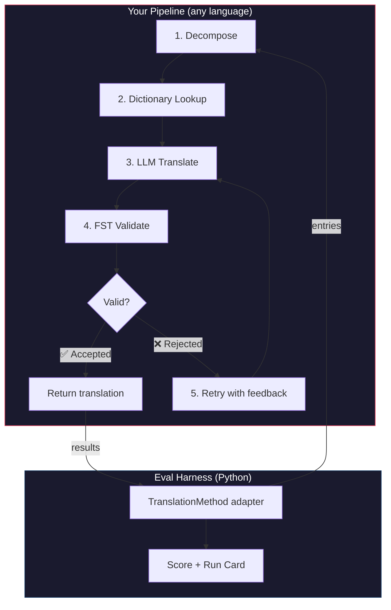
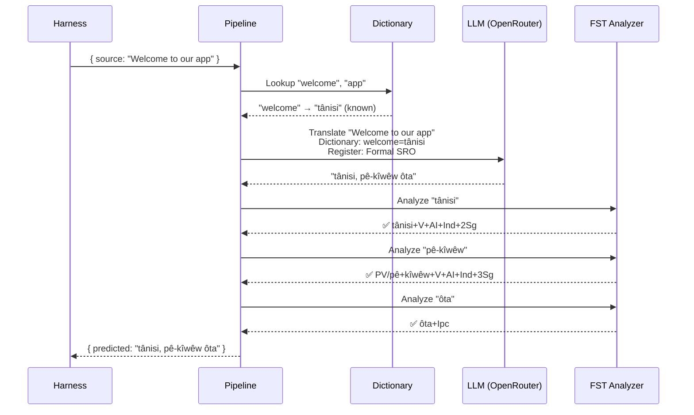
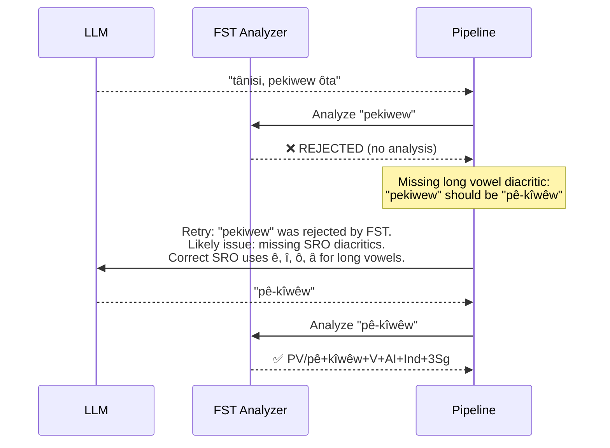

# Cookbook: Quy trình dịch thuật kiểm soát bằng FST (FST-Gated Translation Pipeline)

Xây dựng một quy trình dịch thuật đa giai đoạn giúp phân tách văn bản nguồn, dịch qua LLM, xác thực kết quả đầu ra bằng bộ chuyển đổi trạng thái hữu hạn (FST), và thử lại khi FST từ chối các dạng từ không hợp lệ. Sau đó, tích hợp quy trình này vào harness đánh giá và xem điểm số của nó.

**Những gì bạn sẽ xây dựng:** Một quy trình dịch thuật cho tiếng Plains Cree giúp phát hiện các bản dịch không hợp lệ về mặt hình thái *trước khi* chúng ảnh hưởng tiêu cực đến điểm số của bạn.

:::info Điều kiện tiên quyết
- Một file thực thi FST đang hoạt động (ví dụ: từ [bộ phân tích Plains Cree của ALTLab](https://github.com/UAlbertaALTLab/lang-crk))
- Node.js 20+ (cho quy trình dịch thuật) và Python 3.10+ (cho harness đánh giá)
- Một API key OpenRouter cho bước LLM
:::

---

## Kiến trúc

Quy trình dịch thuật là một chuỗi các giai đoạn. Mỗi giai đoạn đảm nhận một nhiệm vụ cụ thể. Bạn có thể xây dựng quy trình này bằng bất kỳ ngôn ngữ nào — ví dụ này sử dụng JavaScript, nhưng harness đánh giá không quan tâm đến ngôn ngữ bên trong. Nó chỉ nhìn thấy lớp adapter Python mỏng ở ranh giới giao tiếp.



### Tại sao lại cần các giai đoạn này

| Giai đoạn | Chức năng | Vai trò |
|-------|-------------|---------------|
| **Decompose** (Phân tách) | Chia nhỏ các chuỗi giao diện người dùng (UI) phức hợp thành các phân đoạn có thể dịch được | Các ngôn ngữ đa tổng hợp (polysynthetic) mã hóa cả câu trong một từ duy nhất — LLM cần các đơn vị nhỏ hơn |
| **Dictionary Lookup** (Tra từ điển) | Tra cứu từ điển song ngữ để tìm các bản dịch đã biết | Bắt buộc sử dụng thuật ngữ chính xác cho các từ đã biết thay vì phụ thuộc vào việc phỏng đoán của LLM |
| **LLM Translate** (Dịch bằng LLM) | Gửi phân đoạn đến LLM kèm theo ngữ cảnh về văn phong và ngữ pháp | Xử lý các cụm từ mới và tạo ra kết quả đầu ra trôi chảy |
| **FST Validate** (Xác thực bằng FST) | Chạy kết quả đầu ra qua bộ phân tích hình thái học | Phát hiện các dạng từ không hợp lệ — nếu FST từ chối một từ, đó không phải là một dạng từ hợp lệ trong ngôn ngữ đó |
| **Retry** (Thử lại) | Gửi lại các từ bị từ chối kèm theo phản hồi lỗi từ FST | Cung cấp cho LLM thông tin cụ thể về lý do *tại sao* từ đó bị sai |

---

## Luồng dữ liệu

Dưới đây là những gì xảy ra với một mục dữ liệu duy nhất khi nó đi qua quy trình:



### Khi FST từ chối



---

## Triển khai thực tế

Bạn có thể xây dựng bằng bất kỳ ngôn ngữ nào mình muốn. Ví dụ này sử dụng JavaScript, nhưng bạn cũng có thể sử dụng Python, Rust hoặc bất kỳ ngôn ngữ nào khác. Harness đánh giá không quan tâm — nó chỉ giao tiếp với lớp adapter Python mỏng (được trình bày trong phần tiếp theo).

### Quy trình dịch thuật (Pipeline)

Mỗi giai đoạn là một hàm. Quy trình dịch thuật sẽ liên kết chúng lại với nhau.

```javascript title="pipeline.js"
import { lookupDictionary } from './dictionary.js';
import { callLLM } from './llm.js';
import { analyzeWithFST } from './fst.js';

const MAX_RETRIES = 3;

/**
 * Translate a batch of keys through the full pipeline.
 *
 * @param {object} keys - Map of key → source string
 * @param {object} options - { sourceLang, targetLang }
 * @returns {{ translations: object, stats: object }}
 */
export async function translateBatch(keys, options) {
  const translations = {};
  const stats = { total: 0, fstAccepted: 0, retries: 0, dictionaryHits: 0 };

  for (const [key, sourceText] of Object.entries(keys)) {
    stats.total++;
    translations[key] = await translateSingle(sourceText, options, stats);
  }

  return { translations, stats };
}

/**
 * Translate a single string through all pipeline stages.
 */
async function translateSingle(sourceText, options, stats) {

  // ── Stage 1: Decompose ──────────────────────────────────
  // Split compound strings into segments the LLM can handle.
  // For UI strings this is often a no-op, but for longer content
  // it prevents the LLM from losing context in long prompts.
  const segments = decompose(sourceText);

  // ── Stage 2: Dictionary Lookup ──────────────────────────
  // Check each segment against the bilingual dictionary.
  // Known terms are forced — the LLM won't override them.
  const knownTerms = {};
  for (const segment of segments) {
    const entry = lookupDictionary(segment.toLowerCase());
    if (entry) {
      knownTerms[segment] = entry;
      stats.dictionaryHits++;
    }
  }

  // ── Stage 3: LLM Translate ──────────────────────────────
  let translation = await callLLM(sourceText, {
    ...options,
    knownTerms,
    register: 'nêhiyawêwin (Plains Cree). Use SRO orthography. '
            + 'Professional register for educational contexts.',
  });

  // ── Stage 4: FST Validate ──────────────────────────────
  // Split the translation into words and check each one.
  let { accepted, rejected } = await validateWords(translation);

  // ── Stage 5: Retry Loop ─────────────────────────────────
  // If any words were rejected, retry with FST feedback.
  let attempt = 0;
  while (rejected.length > 0 && attempt < MAX_RETRIES) {
    attempt++;
    stats.retries++;

    const feedback = rejected
      .map(w => `"${w}" was rejected by the morphological analyzer`)
      .join('; ');

    translation = await callLLM(sourceText, {
      ...options,
      knownTerms,
      register: 'nêhiyawêwin (Plains Cree). Use SRO orthography.',
      feedback: `Previous attempt had invalid words. ${feedback}. `
              + 'Use correct SRO diacritics (ê, î, ô, â for long vowels). '
              + 'Ensure verb forms match expected conjugation patterns.',
    });

    ({ accepted, rejected } = await validateWords(translation));
  }

  if (rejected.length === 0) stats.fstAccepted++;

  return translation;
}

/**
 * Decompose source text into translatable segments.
 *
 * For simple key-value UI strings, this usually returns the
 * original string as a single segment. For longer content,
 * it splits on sentence boundaries.
 */
function decompose(text) {
  // Simple sentence-boundary split. Replace with your own
  // morphological decomposition for more complex needs.
  return text
    .split(/(?<=[.!?])\s+/)
    .filter(s => s.trim().length > 0);
}

/**
 * Validate each word in a translation against the FST.
 *
 * @returns {{ accepted: string[], rejected: string[] }}
 */
async function validateWords(translation) {
  // Split on whitespace and punctuation, keeping only words
  const words = translation
    .split(/[\s,;:.!?'"()\[\]{}]+/)
    .filter(w => w.length > 0);

  const accepted = [];
  const rejected = [];

  for (const word of words) {
    const analyses = await analyzeWithFST(word);
    if (analyses.length > 0) {
      accepted.push(word);
    } else {
      rejected.push(word);
    }
  }

  return { accepted, rejected };
}
```

### Bộ bọc FST (FST Wrapper)

Bọc file thực thi FST của bạn dưới dạng một hàm bất đồng bộ (async function). Ví dụ này sử dụng bộ phân tích tiếng Plains Cree dựa trên HFST của ALTLab.

```javascript title="fst.js"
import { execFile } from 'node:child_process';
import { promisify } from 'node:util';

const execFileAsync = promisify(execFile);

// Path to your FST analyzer binary
const FST_PATH = process.env.FST_ANALYZER_PATH || './bin/crk-analyzer';

/**
 * Run a word through the FST morphological analyzer.
 *
 * Returns an array of analyses. Empty array = rejected.
 *
 * Example:
 *   analyzeWithFST("tânisi")
 *   → ["tânisi+V+AI+Ind+2Sg", "tânisi+V+AI+Cnj+2Sg"]
 *
 *   analyzeWithFST("pekiwew")
 *   → []  // rejected — missing diacritics
 *
 * @param {string} word - A single word in SRO orthography
 * @returns {string[]} Array of FST analyses (empty = rejected)
 */
export async function analyzeWithFST(word) {
  try {
    // HFST lookup: pipe the word to stdin, read analyses from stdout
    const { stdout } = await execFileAsync(
      FST_PATH,
      ['--quiet'],
      { input: word + '\n', timeout: 5000 }
    );

    // Parse HFST output: each line is "input\tanalysis\tweight"
    // Lines with "+?" indicate unrecognized forms
    return stdout
      .split('\n')
      .filter(line => line.includes('\t') && !line.includes('+?'))
      .map(line => line.split('\t')[1]);

  } catch (err) {
    // If the FST binary isn't available, log and reject
    console.error(`[WARN] FST analysis failed for "${word}": ${err.message}`);
    return [];
  }
}
```

### Các mô-đun Từ điển và LLM

```javascript title="dictionary.js"
/**
 * Simple bilingual dictionary backed by a JSON file.
 *
 * In production, you'd load from the coaching data directory
 * or query itwêwina (https://itwewina.altlab.app/) via API.
 */
const DICTIONARY = {
  'hello': 'tânisi',
  'welcome': 'tânisi',
  'thank you': 'kinanâskomitin',
  'home': 'kīwēwin',
  'search': 'nānātawāpahtam',
  'settings': 'isi-nākatohkēwin',
  'help': 'nīsōhkamākēwin',
  'back': 'kīwē',
};

/**
 * @param {string} term - Lowercase English term
 * @returns {string|null} Cree translation or null
 */
export function lookupDictionary(term) {
  return DICTIONARY[term] || null;
}
```

```javascript title="llm.js"
/**
 * Call an LLM via OpenRouter for translation.
 */
const OPENROUTER_API = 'https://openrouter.ai/api/v1/chat/completions';

export async function callLLM(sourceText, options) {
  const { knownTerms = {}, register, feedback } = options;

  // Build the system prompt with register and known terms
  let systemPrompt = `You are translating English to Plains Cree.\n\n`;
  systemPrompt += `Register: ${register}\n\n`;

  if (Object.keys(knownTerms).length > 0) {
    systemPrompt += `Required terminology (use these exact translations):\n`;
    for (const [en, crk] of Object.entries(knownTerms)) {
      systemPrompt += `  "${en}" → "${crk}"\n`;
    }
    systemPrompt += '\n';
  }

  if (feedback) {
    systemPrompt += `IMPORTANT correction from previous attempt:\n${feedback}\n\n`;
  }

  systemPrompt += `Rules:\n`;
  systemPrompt += `- Use Standard Roman Orthography (SRO)\n`;
  systemPrompt += `- Use macron/circumflex for long vowels: ê, î, ô, â\n`;
  systemPrompt += `- Return ONLY the Cree translation, nothing else\n`;

  const response = await fetch(OPENROUTER_API, {
    method: 'POST',
    headers: {
      'Authorization': `Bearer ${process.env.OPENROUTER_API_KEY}`,
      'Content-Type': 'application/json',
    },
    body: JSON.stringify({
      model: 'google/gemini-2.5-pro',
      messages: [
        { role: 'system', content: systemPrompt },
        { role: 'user', content: sourceText },
      ],
      temperature: 0.2,
    }),
  });

  const json = await response.json();
  return json.choices[0].message.content.trim();
}
```

---

## Tích hợp vào Harness đánh giá

Quy trình dịch thuật của bạn đã được xây dựng xong. Bây giờ bạn cần kết nối nó với harness đánh giá để có thể đo điểm chuẩn (benchmark) trên bảng xếp hạng.

Harness đánh giá giao tiếp qua một giao diện duy nhất: `TranslationMethod`. Đây là một giao thức Python chỉ có một phương thức duy nhất. Hãy xây dựng bất kỳ thứ gì bạn muốn bằng bất kỳ ngôn ngữ nào — sau đó cung cấp cho nó lớp bọc mỏng này để tích hợp.

```python title="fst_gated_process.py"
"""
TranslationMethod adapter for the FST-gated pipeline.

This thin wrapper connects your pipeline (running as a local
subprocess or HTTP server) to the eval harness. The harness
calls translate() with corpus entries. You call your pipeline.
You return results. That's it.
"""

import time
import subprocess
import json
from mt_eval_harness.config import RunConfig


class FSTGatedProcess:
    """Adapter between the eval harness and your FST-gated pipeline.

    The pipeline runs as a Node.js subprocess. This wrapper:
    1. Receives entries from the harness
    2. Sends them to the pipeline
    3. Returns structured results the harness can score
    """

    def __init__(self, pipeline_url: str = "http://localhost:3001"):
        self.pipeline_url = pipeline_url

    async def translate(
        self,
        entries: list[dict],
        config: RunConfig,
    ) -> list[dict]:
        """Translate a batch of entries through the FST-gated pipeline.

        Args:
            entries: List of corpus entries with 'id' and source text.
            config: Harness run configuration (for context).

        Returns:
            List of result dicts, one per entry.
        """
        import httpx

        results = []

        for entry in entries:
            source_text = entry.get(config.source_field, entry.get("source", ""))
            start = time.monotonic()

            try:
                # Call your pipeline — however it's running
                async with httpx.AsyncClient() as client:
                    response = await client.post(
                        f"{self.pipeline_url}/translate",
                        json={"keys": {str(entry["id"]): source_text}},
                        timeout=30.0,
                    )
                    data = response.json()
                    predicted = data["translations"][str(entry["id"])]

                elapsed = time.monotonic() - start

                results.append({
                    "id": entry["id"],
                    "predicted": predicted,
                    "latency_s": elapsed,
                    "usage": {},  # pipeline doesn't expose token counts
                    "error": None,
                    "tool_calls": [],
                    "tool_call_count": 0,
                    "metadata": data.get("meta", {}),
                })

            except Exception as err:
                results.append({
                    "id": entry["id"],
                    "predicted": "",
                    "latency_s": time.monotonic() - start,
                    "usage": {},
                    "error": str(err),
                    "tool_calls": [],
                    "tool_call_count": 0,
                    "metadata": {},
                })

        return results
```

:::tip Bạn không cần sử dụng HTTP
Ví dụ trên gọi quy trình dịch thuật qua HTTP vì quy trình này được viết bằng JavaScript. Nếu quy trình của bạn được viết bằng Python, bạn có thể gọi trực tiếp — không cần máy chủ. Lớp bọc `TranslationMethod` chỉ là một ranh giới hàm. Những gì diễn ra bên trong hoàn toàn do bạn quyết định.
:::

### Chạy đánh giá hiệu năng (Benchmark)

Khởi động quy trình dịch thuật của bạn, sau đó chạy harness đánh giá:

```bash
# Terminal 1: Start the pipeline
node server.js

# Terminal 2: Run the harness with your process
export OPENROUTER_API_KEY="sk-or-v1-..."

python -c "
import asyncio
from mt_eval_harness.config import RunConfig
from mt_eval_harness.runner import execute_run
from fst_gated_process import FSTGatedProcess

async def main():
    config = RunConfig(
        corpus_path='data/edtekla-dev-v1.json',
        source_lang='English',
        target_lang='Plains Cree (nêhiyawêwin, SRO)',
        process_name='fst-gated-v1',
    )
    process = FSTGatedProcess('http://localhost:3001')
    run_log = await execute_run(config, process=process)
    print(f'Results: {run_log.output_path}')

asyncio.run(main())
"
```

Hoặc sử dụng CLI với `baseline_experiment.py` để so sánh với baseline tích hợp sẵn:

```bash
python eval/baseline_experiment.py \
  --dataset data/edtekla-dev-v1.json \
  --model google/gemini-2.5-pro \
  --fst-analyzer ./bin/crk-analyzer \
  --condition fst-gated-v1 \
  --submit
```

---

## Hiểu kết quả của bạn

Harness đánh giá sẽ tạo ra một **run card** — một file JSON chứa điểm số của bạn. Dưới đây là những gì bạn sẽ thấy:

```
═══════════════════════════════════════════════════
  FST-Gated Pipeline v1 — EDTeKLA Dev v1
═══════════════════════════════════════════════════

  chrF++              48.7 / 100
  Exact match         12.1%
  FST acceptance      94.4%
  Composite score     0.52  →  Functional ✓

  404 entries (master_corpus.json) · 47 retries · $0.18 total cost
═══════════════════════════════════════════════════
```

**Thông tin nhanh từ kết quả này:**
- Phương pháp của bạn đạt phân hạng **Functional** (0.50–0.70) — kết quả đầu ra có thể nhận biết được bởi người bản xứ, ngữ pháp chính thường chính xác, nhưng vẫn còn nhiều lỗi hình thái học xuất hiện thường xuyên.
- FST ghi nhận 94% số từ là hợp lệ — vòng lặp thử lại (retry loop) của bạn đang hoạt động hiệu quả.
- 12% bản dịch hoàn toàn chính xác — vẫn còn rất nhiều không gian để cải thiện.

:::info Quality Tiers
| Phân hạng (Tier) | Composite | Ý nghĩa |
|------|-----------|---------------|
| Baseline | 0.00–0.30 | Kết quả LLM thô, hầu hết là lỗi ảo tưởng (hallucination) về hình thái học |
| Emerging | 0.30–0.50 | Có một số cấu trúc chính xác, nhưng chưa đáng tin cậy |
| **Functional** | **0.50–0.70** | **Người bản xứ có thể nhận biết được. Các danh mục chính thường chính xác.** |
| Deployable | 0.70–0.85 | Phù hợp cho bản dịch nháp cần con người hiệu đính |
| Fluent | 0.85–1.00 | Tiệm cận trình độ dịch thuật của người bản xứ thành thạo |

Xem [SCORING_SPEC §5](/docs/specifications/scoring#5-quality-tiers) để biết định nghĩa đầy đủ về các phân hạng.
:::

<details>
<summary><strong>Tìm hiểu sâu hơn: Có gì trong run card?</strong></summary>

File JSON của run card ghi lại mọi thông tin về lượt đánh giá này. Các phần chính bao gồm:

**Scores** — mọi số liệu đo lường (metric) mà harness đã tính toán:
```json
{
  "scores": {
    "exact_match_rate": 0.121,
    "chrf_plus_plus": 48.7,
    "fst_acceptance_rate": 0.944,
    "composite_score": 0.52,
    "quality_tier": "functional"
  }
}
```

**Provenance** — những gì đã tạo ra các kết quả này:
```json
{
  "method": {
    "process_name": "fst-gated-v1",
    "model": "google/gemini-2.5-pro",
    "temperature": 0.0
  },
  "corpus": {
    "id": "edtekla-dev-v1",
    "sha256": "a1b2c3..."
  }
}
```

**Per-entry results** — mọi bản dịch đi kèm với điểm số riêng biệt, giúp bạn tìm ra những chỗ mà phương pháp của mình gặp khó khăn:
```json
{
  "id": 42,
  "source": "The student completed the assignment",
  "reference": "ôskiniw kî-kîsîhtâw ôhi atoskêwina",
  "predicted": "ôskiniw kî-kîsîhtâw ôhi atoskêwin",
  "chrf": 89.2,
  "exact_match": false,
  "fst_accepted": true
}
```

Composite score là trung bình có trọng số của các số liệu đo lường (metric) hiện có, với trọng số được định nghĩa trong [SCORING_SPEC §4](/docs/specifications/scoring#4-composite-score). Khi một metric không khả dụng, trọng số của nó sẽ được phân bổ lại theo tỷ lệ cho các metric còn lại.

</details>

---

## Triển khai lên môi trường Production

Phương pháp của bạn đã có điểm số trên bảng xếp hạng. Bây giờ bạn muốn thực sự đưa nó vào sử dụng. Phần này hướng dẫn cách vận hành quy trình của bạn dưới dạng một endpoint production mà [champollion](https://champollion.dev) có thể gọi.

:::note Phần này là không bắt buộc
Tất cả các phần ở trên đều tập trung vào việc xây dựng và đánh giá hiệu năng phương pháp của bạn. Phần này nói về việc triển khai — một khía cạnh riêng biệt. Bạn hoàn toàn có thể gửi kết quả lên bảng xếp hạng mà không cần triển khai bất kỳ dịch vụ nào.
:::

### Máy chủ HTTP

Bọc quy trình của bạn dưới dạng một máy chủ Express triển khai đúng [giao ước phương thức API (API method contract)](https://champollion.dev/docs/guides/serving-a-method):

```javascript title="server.js"
import express from 'express';
import { translateBatch } from './pipeline.js';

const app = express();
app.use(express.json());

/**
 * API method contract:
 *
 * Request:  { source_locale, target_locale, method, keys: { "key": "source" } }
 * Response: { translations: { "key": "translated" }, meta: { ... } }
 */
app.post('/translate', async (req, res) => {
  const { source_locale, target_locale, method, keys } = req.body;

  // Validate request
  if (!keys || typeof keys !== 'object') {
    return res.status(400).json({ error: { message: 'Missing keys object' } });
  }

  try {
    const startTime = Date.now();
    const { translations, stats } = await translateBatch(keys, {
      sourceLang: source_locale,
      targetLang: target_locale,
    });

    res.json({
      translations,
      meta: {
        model: 'custom-pipeline/fst-gated-v1',
        method: 'decompose-lookup-translate-validate',
        elapsed_ms: Date.now() - startTime,
        fst_acceptance_rate: stats.fstAccepted / stats.total,
        retries: stats.retries,
      },
    });
  } catch (err) {
    console.error('[ERR] Pipeline failed:', err.message);
    res.status(500).json({ error: { message: err.message } });
  }
});

// Health check for connectivity verification
app.get('/health', (req, res) => res.json({ status: 'ok' }));

app.listen(3001, () => {
  console.log('FST-gated pipeline running on http://localhost:3001');
});
```

### Cấu hình champollion

Trỏ cặp ngôn ngữ của bạn tới dịch vụ đang chạy:

```json title="champollion.config.json"
{
  "version": 3,
  "inputLocale": "en",
  "pairs": {
    "en:crk": {
      "method": "api",
      "endpoint": "http://localhost:3001/translate"
    }
  },
  "languages": {
    "crk": {
      "name": "Plains Cree",
      "register": "SRO syllabics with grammatical precision."
    }
  }
}
```

```bash
# Run it
export OPENROUTER_API_KEY="sk-or-v1-..."
node server.js &
npx champollion sync
```

### Đóng gói dưới dạng Plugin

Sau khi phương pháp của bạn đã có điểm số, hãy đóng gói nó để người khác có thể sử dụng:

```json title="crk-fst-gated-v1/method.json"
{
  "name": "crk-fst-gated-v1",
  "type": "api",
  "version": "1.0.0",
  "description": "FST-gated Plains Cree translation with morphological validation",
  "author": "Your Name",

  "config": {
    "endpoint": "https://your-server.example.com/translate"
  },

  "locales": ["crk"],

  "benchmarks": {
    "crk": {
      "date": "2026-06-01T00:00:00Z",
      "corpus_size": 404,
      "exact_match_rate": 0.12,
      "corpus_chrf": 48.7,
      "model": "google/gemini-2.5-pro",
      "harness_version": "2.0"
    }
  },

  "provenance": {
    "resources": [
      { "name": "ALTLab CRK Analyzer", "license": "LGPL-3.0", "type": "fst" },
      { "name": "Wolvengrey Dictionary", "license": "CC-BY-NC-SA-4.0", "type": "dictionary" }
    ],
    "commercialReady": false,
    "flags": ["nc-resource"]
  }
}
```

---

## Mở rộng mô hình này

Hướng dẫn này minh họa một kiến trúc quy trình dịch thuật cụ thể. Bạn có thể tùy biến nó cho bất kỳ ngôn ngữ hoặc phương pháp nào:

| Biến thể | Thay đổi tương ứng |
|-----------|-------------|
| **FST khác** | Thay đổi đường dẫn file thực thi. Bạn có thể tải xuống các FST đã được biên dịch sẵn (như các file thực thi `.hfstol` hoặc `lttoolbox`) cho hơn 100 ngôn ngữ từ [GiellaLT GitHub](https://github.com/giellalt) hoặc [Apertium GitHub](https://github.com/apertium). |
| **Không có sẵn FST** | Loại bỏ giai đoạn thực thi FST và sử dụng [các file mô hình phẳng UniMorph (UniMorph flat paradigm files)](https://huggingface.co/datasets/unimorph/universal_morphologies) từ Hugging Face để thực hiện xác thực tra cứu cơ sở dữ liệu tĩnh cho các dạng biến hình. |
| **Sử dụng nhiều LLM** | Liên kết chuỗi các mô hình: một mô hình nhanh cho bản dịch nháp ban đầu, một mô hình suy luận (reasoning model) để sửa lỗi. |
| **Con người tham gia kiểm soát (Human-in-the-loop)** | Thêm một giai đoạn hàng đợi để giữ lại các bản dịch chưa chắc chắn cho chuyên gia đánh giá trước khi trả về kết quả. |
| **Mô hình đã tinh chỉnh (Fine-tuned model)** | Thay thế lệnh gọi OpenRouter bằng một mô hình chạy cục bộ (Ollama, vLLM, v.v.). |
| **Ngôn ngữ khác** | Thay đổi từ điển, FST và văn phong. Kiến trúc tổng thể vẫn giữ nguyên hoàn toàn. |

Quy trình dịch thuật này là một mô hình thiết kế. Các giai đoạn có thể hoán đổi cho nhau. Hãy xây dựng những gì hiệu quả cho ngôn ngữ của bạn, chứng minh năng lực của nó trên [bảng xếp hạng](https://champollion.dev/leaderboard), và triển khai nó.

---

## Xem thêm

- **[Eval Harness](/docs/specifications/harness)** — cách chạy harness đánh giá và diễn giải kết quả đầu ra
- **[Method Interface](/docs/specifications/methods)** — đặc tả giao thức `TranslationMethod`
- **[Leaderboard Rules](/docs/leaderboard/rules)** — tiêu chí gửi bài và các chính sách chống gian lận
- **[Support a Low-Resource Language](/docs/community/low-resource-languages)** — bối cảnh rộng hơn và các nguyên tắc OCAP
- **[ALTLab](https://altlab.artsrn.ualberta.ca/)** — Phòng thí nghiệm Công nghệ Ngôn ngữ Alberta (Plains Cree FST)
- **[Method Leaderboard](https://champollion.dev/leaderboard)** — gửi điểm số của bạn