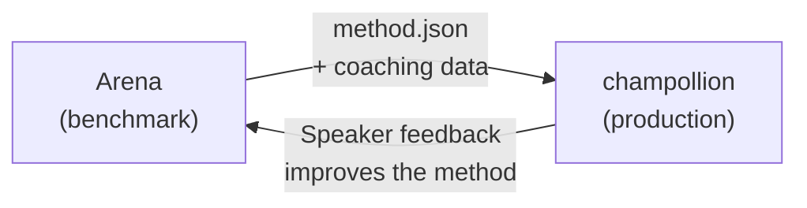

# 部署到生产环境

你已经在 Arena 中证明了它的可行性。现在部署它。

Arena 用于研发——构建、基准测试和比较翻译方法。**生产部署**通过 [champollion](https://champollion.dev)（面向开发者的翻译 CLI）进行。它们通过共享的插件格式连接。



---

## 部署路径

### 1. 将你的方法导出为插件

创建一个 `method.json` 清单来打包你的基准测试结果：

```json
{
  "name": "crk-coached-v3",
  "type": "llm-coached",
  "version": "3.0.0",
  "description": "Coached LLM translation for Plains Cree",
  "locales": ["crk"],
  "config": {
    "model": "google/gemini-2.5-flash",
    "temperature": 0.3
  },
  "benchmarks": {
    "crk": {
      "composite_score": 0.67,
      "fst_acceptance": 0.82,
      "corpus_size": 150
    }
  }
}
```

在清单旁边包含任何指导数据（语法规则、词典）。

### 2. 在 Champollion 中安装

```bash
champollion plugin install ./my-method-plugin/
```

### 3. 配置你的语言对

```json title="champollion.config.json"
{
  "pairs": {
    "en-crk": { "method": "plugin", "plugin": "crk-coached-v3" }
  }
}
```

### 4. 翻译真实内容

```bash
npx champollion sync
```

你的基准测试方法现在在生产环境中生成真实翻译。

---

## 针对土著语言

为土著语言社区服务的方法在生产部署前需要**社区同意**。OCAP 原则（所有权、控制权、访问权、占有权）管理翻译方法的开发、评估和部署方式。

达到可部署等级（0.70+）的方法不会自动部署——它在语言社区治理机构给予同意时**才会部署**。

参见 [数据主权](/docs/sovereignty/data-sovereignty) 和 [所有权转移](/docs/sovereignty/ownership-transfer) 了解完整的治理框架。

---

## 另见

- [Eval Harness 桥接](https://champollion.dev/docs/guides/bridge) — Arena→champollion 管道的详细演练
- [插件规范](https://champollion.dev/docs/reference/plugin-spec) — method.json 清单格式
- [champollion Agent 指南](https://champollion.dev/docs/guides/agent-guide) — 如何使用 champollion 进行翻译