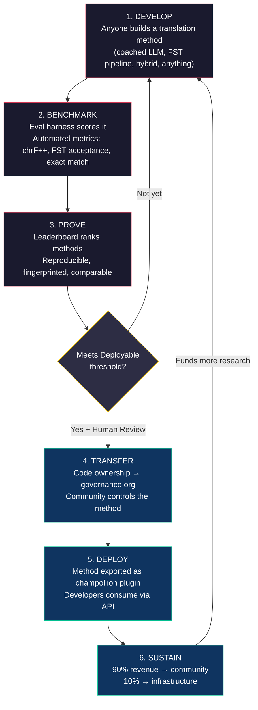
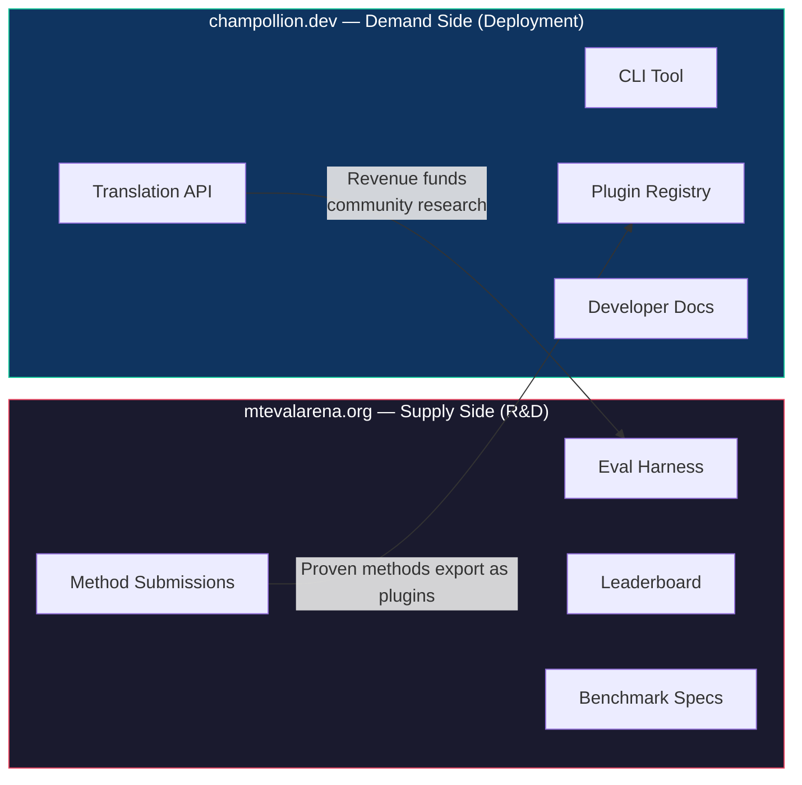
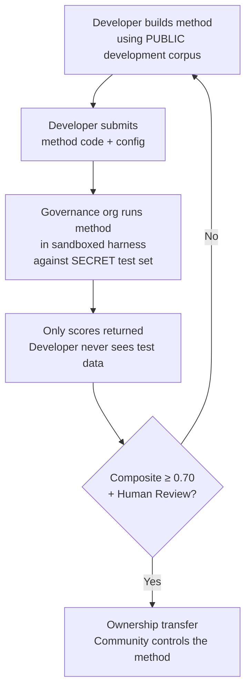

# 工作原理：机器翻译的竞争性众包

> **执行摘要。** 面向全球服务不足的语言的机器翻译——包括Meta的OMT-1600声称覆盖的约1,300种语言，但质量水平低于任何可用阈值——不是一个模型训练问题，而是一个*基础设施*问题。没有单一的模型、实验室或公司能够解决它。本文档描述了一个平台架构，将全球ML工程师、语言学家和语言使用者社区转变为一个分布式研究实验室：任何人都可以构建翻译方法，平台证明它是否针对主权评估数据有效，已证明的方法部署到生产环境，收入流向其语言得到服务的社区。该机制是具有密码学主权的竞争性众包——这种组合以前从未被尝试过。

---

> [!IMPORTANT]
> **范围。** 本平台评估**正式书面文本翻译**——文档、教育材料、官方通信、UI字符串。它不是聊天机器人、实时口译员或不受限制的领域对话系统。排行榜根据特定文本领域的精选平行语料库对翻译方法进行排名（参见[基准规范§2.7](/docs/specifications/benchmark#27-domain)了解领域分类）。MT是语言复兴的基础设施，而不是其替代品。儿童从人而不是机器学习语言。

### 当前领域覆盖

| 领域 | 层级覆盖 | 状态 | 备注 |
|--------|--------------|--------|-------|
| 官方/政府 | 第1-5层 | 活跃 | EdTeKLA语料库 |
| 教育/教科书 | 第1-4层 | 活跃 | EdTeKLA语料库 |
| 叙事/文学 | 有限 | 计划中 | 金标准中有部分条目 |
| 宗教/经文 | 仅参考 | 未评估 | FLORES+（圣经领域）；不用于官方评分 |
| 对话 | 不在范围内 | 按设计 | 本系统评估书面文本，不是语音 |
| 技术/科学 | 不在范围内 | 未来 | 需要特定领域的术语验证 |

## 1. 问题：机器翻译≠机器学习

低资源语言（LRL）的机器翻译通常被框架化为一个机器学习问题：收集数据、训练模型、部署。这个框架是错误的，这个错误是有后果的——它将资金、人才和基础设施导向一种在结构上对世界上大多数语言都无法奏效的方法。

### 1.1 为什么ML框架失败

MT的标准ML管道需要三样东西：大型平行语料库、经过验证的评估基准和部署路径。对于Google Translate服务的约130种语言和NLLB-200覆盖的约200种语言，这三样都存在。对于OMT-1600声称覆盖的约1,300种额外语言，评估数据存在但质量大多低于可用阈值，模型权重不公开，也没有部署管道。对于剩余的约5,400+种语言，这三样都不存在。

| 要求 | 高资源语言 | OMT-1600覆盖（约1,300种LRL） | 剩余约5,400种语言 |
|-------------|------------------------|-------------------------------|---------------------------|
| **平行语料库** | 数百万句子对（Europarl、UN语料库、OpenSubtitles） | 圣经领域双语文本、网络爬取、合成回译。无社区策划数据。 | 数百到数千对（如果有的话） |
| **评估基准** | WMT、FLORES、NTREX——标准化、可重现 | BOUQuET（圣经领域）、met-BOUQuET。无形态学验证。无独立评估。 | 无标准基准；临时评估 |
| **部署路径** | Google Translate、DeepL、Azure——商业API | 模型权重未发布。无CLI、无插件系统、无社区可部署API。 | 无。无API、无产品、无市场。 |

当存在用于训练的数据和用于部署的市场时，ML方法才有效。OMT-1600显著扩展了第一个条件——但没有独立质量验证、形态学验证或社区治理的扩展是没有信任的扩展。问题不仅仅是"我们需要一个更好的模型"——而是"我们需要基础设施来证明模型有效，按照社区控制的条款"。

### 1.2 LRL的MT实际需要什么

低资源语言的翻译主要不是一个训练问题。它是一个**方法工程**问题——将可用资源（LLM、形态学工具、社区知识、语言规则）组装成工作翻译管道，然后用严格的评估证明它们有效的挑战。

这个区别很重要：

| 维度 | ML方法 | 方法工程方法 |
|-----------|------------|---------------------------|
| **核心活动** | 在数据上训练模型 | 将工具、提示和语言知识组合成管道 |
| **瓶颈** | 平行数据量 | 工程创意+评估基础设施 |
| **谁能贡献** | 拥有GPU集群和数据集的团队 | 任何拥有API密钥、字典和想法的人 |
| **评估** | 在保留测试集上的BLEU/chrF | 形态学验证+人工审查+自动化指标 |
| **部署** | 提供模型 | 将方法打包为插件 |

现代LLM已经包含许多低资源语言的潜在知识——足以产生*看起来*合理的输出。问题是这个输出通常在形态学上无效（模型幻觉出在该语言中不存在的词形）。工程挑战是：你如何提取LLM知道的东西，根据语言现实验证它，并将结果打包以供生产使用？

这就是为什么我们对**方法**而不是模型进行基准测试。方法是完整的配方：模型选择+提示工程+工具使用+前/后处理+教练数据+重试策略。两个使用相同模型但不同方法的团队会获得不同的分数。这就是重点。

### 1.3 为什么多综合语言打破一切

世界上许多服务最不足的语言是**多综合的**——它们通过生产性形态学过程将整个句子编码为单个单词。考虑平原克里语单词：

> **ê-kî-nitawi-kîskinwahamâkosiyân**
> *"when I had gone to school"*

一个单词。它编码时态（过去）、方向（去）、词根（学习）、语态（被动/反身）和人称（第一人称单数）。英语需要六个单词来表达克里语用一个单词表达的内容。

这在每个层级都打破了标准MT：

- **分词** ——BPE和SentencePiece将多综合单词撕成无意义的片段，因为它们是为连接形态学设计的。
- **幻觉** ——LLM产生看起来合理但不是该语言有效单词的字符串。非使用者无法区分。没有形态学验证，幻觉是看不见的。
- **评估** ——词级指标（BLEU）惩罚这些语言中基本的屈折变化。字符级指标（chrF++）更好，但没有结构验证仍然不足。

解决方案不是更大的模型或更多训练数据。它是**在幻觉到达用户之前捕捉它们的基础设施**——形态学分析器（FST）可以明确地说"这不是该语言中的单词"。

---

## 2. 为什么现有方法不起作用

### 2.1 商业MT

商业翻译服务历来针对市场量进行了优化。Meta的OMT-1600（2026年3月）代表了一个重大转变——一个系统中的1,600种语言。但对于约1,300种处于最低资源层级的语言，质量低于可用阈值，模型权重不可用，也没有部署管道。结构性激励问题已经演变：大科技公司现在可以为LRL构建模型，但没有独立评估、形态学验证或社区治理，仅覆盖不能解决问题。

### 2.2 学术研究

学术MT研究绝大多数集中在高资源语言对上，因为那是训练数据、共享任务和出版场所所在的地方。从事低资源对的研究人员难以发表、难以获得资金、难以部署——因为LRL的部署基础设施不存在。

### 2.3 一次性竞赛

你可以运行一个Kaggle竞赛："English→Plains Cree，最佳chrF++赢得$10,000。"以下是会发生的事情：

1. 有人赢了，提交了一个笔记本，领取奖金，回家了。
2. 笔记本在Kaggle的档案中腐烂。没人部署它。没人维护它。
3. 测试集最终被发布——永远被污染。
4. 治理组织在Google的基础设施下根据Google的服务条款上传了他们的语言数据，对生命周期没有真正的控制。
5. 无部署桥接。获胜的笔记本不是工作API。

一次性赏金吸引赏金猎人。具有社区治理的持续排行榜创造持续参与。

### 2.4 微调

在平行文本上微调开放模型是显而易见的ML方法。但对于大多数LRL，微调所需的平行语料库正是不存在的数据——创建它需要与微调旨在替代的相同的双语使用者和社区参与。你无法用需要数据的技术从数据稀缺问题中自举。

---

## 3. 解决方案：具有主权评估的竞争性众包

该平台颠倒了传统方法：不是一个团队构建一个模型，而是**全球社区竞争构建最佳翻译方法**，平台证明它是否有效，已证明的方法部署到生产环境，语言社区保留所有权和控制权。

### 3.1 完整循环

每个阶段都有特定的功能：

| 阶段 | 发生的事情 | 谁受益 |
|-------|-------------|--------------|
| **开发** | 研究人员、学生或爱好者使用他们想要的任何工具构建翻译方法——LLM提示、FST管道、字典、微调模型、基于规则的系统或混合系统 | 贡献者学习、实验、发表 |
| **基准** | 评估工具使用可重现的指标对标准化语料库对方法进行评分。每次运行都产生一个[运行卡](/docs/specifications/benchmark#3-run-card-schema)——测试内容和性能的完整记录 | 研究人员获得可重现、可比较的结果 |
| **证明** | 结果出现在公共排行榜上。方法被排名、比较和审查。社区看到什么有效，什么无效 | 每个人都获得对最先进技术状态的可见性 |
| **转移** | 对于土著语言，达到可部署阈值（复合分数≥0.70）且通过人工验证的方法将其代码所有权转移给语言社区的治理组织 | 社区获得创收资产 |
| **部署** | 方法被导出为[champollion](https://github.com/gamedaysuits/champollion)插件并通过API提供。开发人员使用翻译而无需理解底层方法 | 开发人员获得商业API不服务的语言的翻译 |
| **维持** | API收入被分割：90%给社区，10%给基础设施。收入资助更多语言学研究、语料库开发和社区项目 | 飞轮在初始建立后自我维持 |

### 3.2 为什么竞争动态有效

竞争不是附带的——它是机制。以下是原因：

**方法的多样性。** English→Plains Cree的最佳方法可能是FST门控的教练LLM。English→Quechua的最佳方法可能是字典增强管道。English→Inuktitut的最佳方法可能是从努纳武特汉萨德语料库引导的微调模型。没有单一的团队或方法会在所有语言中占主导地位。排行榜揭示了哪*种*方法对哪*种*语言有效——这本身就是一个研究贡献的元结果。

**持续参与。** 排行榜永远不会完成。总有人想击败最高分。每次提交都为问题贡献计算和智力努力。与一次性赠款不同，竞争动态从全球社区产生持续的研究投资。

**低进入门槛。** 你需要一个API密钥、一个字典和一个想法。评估工具是开源的。语料库格式是简单的JSON。语言学学生可以与资源充足的实验室竞争——有时还会赢，因为领域知识（理解语言）可以超过计算资源。

**部署桥接。** 在工具中评分良好的相同方法通过一个配置更改部署到生产环境。"在这里证明它，在那里部署它。"这是Kaggle、WMT共享任务和学术出版物没有弥合的差距。

### 3.3 平台架构

生态系统在物理上分为两个站点，为两个受众服务：

**[mtevalarena.org](https://mtevalarena.org)** 是R&D证明场地。其受众是ML工程师、语言学家和研究人员。这里的一切都是关于构建、测试和证明翻译方法。

**[champollion.dev](https://champollion.dev)** 是部署平台。其受众是需要为其应用翻译的开发人员。他们不需要理解方法如何工作——他们只需调用API。

它们之间的桥接是**方法插件**：一个已证明的方法，打包以供部署，由社区拥有。

---

## 4. 主权评估：为什么基础设施很重要

评估基础设施不是技术细节——它是主权模型的核心。标准评估（将你的测试集上传到共享平台）对土著语言不起作用，因为它放弃了对语言数据的控制。

### 4.1 主权机制

开发人员永远看不到金标准评估数据。他们针对公共开发语料库进行开发，然后将其方法代码提交给治理组织，该组织在沙箱中针对秘密测试集运行它。只有分数返回。这不仅仅是安全性——它是**OCAP®原则**（所有权、控制权、访问权、占有权）的直接实现，土著数据治理需要这些原则。

### 4.2 为什么这不能在别人的平台上运行

在Kaggle上，治理组织在Google的基础设施下根据Google的服务条款上传他们的语言数据。他们无法按照自己的时间表撤销访问权。他们无法将自定义法律条款（如所有权转移）附加到提交。他们没有密码学保证数据不会被用于其他目的。数据主权意味着社区控制评估端点、持有密钥并可以关闭它。

---

## 5. 评估哲学：微观评估和LYSS

标准MT指标（BLEU、chrF++、COMET）旨在跨语言泛化。这种泛化是它们的优势——也是它们的盲点。对于多综合语言，与参考文献共享字符n-gram的形态学无效单词在chrF++上评分良好，但任何使用者都会认为它是胡言乱语。

**微观评估开发**意味着使用最佳可用语言学工具为特定语言构建定制的评估指标。该框架称为**LYSS**（语言学知情的产出与结构评分）：

| 组件 | 测量内容 | 工具 | 状态 |
|-----------|-----------------|------|--------|
| **LYSS-fst** | 形态学有效性 | 有限状态转换器 | ✅ 已实现（Plains Cree） |
| **LYSS-eq** | 语言学等价性 | 语言学家策划的变体规则 | ✅ 已实现（Plains Cree） |
| **LYSS-sem** | 语义保留 | 特定语言的语义模型 | ✅ 已实现（Plains Cree） |

通用指标（chrF++、BLEU）作为基线和对于没有LYSS工具的语言的主要信号。只要存在特定语言的工具，LYSS组件就承载评分权重——因为对每种语言最重要的东西是只有特定语言工具才能测量的东西。

有关完整的LYSS规范和复合评分逻辑，请参见[SCORING_SPEC.md §4](/docs/specifications/scoring#4-composite-score)。

> [!WARNING]
> **跨运行可比性。** 比较具有不同指标可用性的运行时（例如，一个运行有FST分数，另一个没有），复合分数不能直接比较。复合分数规范化为可用指标，但在5个指标上评估的运行比在2个指标上评估的运行携带更多信息。排行榜为每个条目指示指标覆盖范围。

---

## 6. 这为谁服务

### 对于ML工程师和研究人员

一个开放的排行榜，具有任何共享任务都不覆盖的语言对的标准化基准。使用评估工具重现任何结果。发表你的方法。击败最高分。每次提交都被指纹识别到特定的配置和数据集版本——关于测试内容没有歧义。

### 对于语言社区

对为你的语言构建的翻译技术的所有权和控制权。竞争动态意味着多个团队同时为你的语言工作——你从所有团队中受益并拥有结果。API使用的收入按照你的条款资助社区项目。

### 对于资助者和赠款审查人

用于评估翻译研究提案的透明、可重现的指标。可测量的成果超越出版物：API使用、产生的收入、随时间推移的质量指标、语言覆盖范围。单一成功的方法创建自我维持的收入流——赠款的影响复合而不是在资金结束时结束。

### 对于开发人员

商业API不服务的语言的翻译。一个CLI命令（`npx champollion sync`）使用社区证明的方法翻译你的区域设置文件。对法语使用Google Translate，对Plains Cree使用教练LLM，对Quechua使用社区API——都在同一个项目中，都使用相同的界面。

### 对于学生

具有真实世界影响的开放挑战。为低资源语言构建翻译方法、对其进行基准测试并发表你的结果。基础设施是免费的，数据集是开放的，排行榜不关心你是在顶级大学还是从图书馆终端工作。

---

## 7. 社会和技术背景

### 6.1 语言复兴正在加速

语言复兴工作在全球范围内增长。沉浸式学校、社区语言巢和数字档案项目在加拿大、美国、澳大利亚、新西兰和北欧的土著社区中扩展。这些工作需要技术——特别是尊重社区对语言数据主权的翻译技术。

### 6.2 LLM改变了基线

在2023年之前，为多综合语言构建任何MT能力需要重要的NLP专业知识、自定义模型训练和大型计算预算。现代LLM改变了基线：具有教练数据和形态学验证的精心设计的提示可以为某些语言对产生可用的翻译——无需训练。这大大降低了方法开发的进入门槛。问题已从"我们如何构建模型？"转变为"我们如何构建验证和纠正模型产生的东西的管道？"

### 6.3 开源基准测试文化

AI基准测试已成为自己的文化。排行榜推动创新。竞赛吸引人才。聊天机器人竞技场、LMSYS、Hugging Face开放LLM排行榜——这些平台证明竞争评估推动快速进展。我们采用这种能量并将其指向商业MT不存在或尚未被独立证明有效的数千种语言的翻译。

### 6.4 土著数据主权是不可协商的

OCAP®原则（所有权、控制权、访问权、占有权）、CARE原则（集体利益、控制权、责任、伦理）和Te Mana Raraunga（毛利数据主权）等框架不是可选的附加项——它们是任何接触土著语言资源的技术的结构性要求。我们的评估基础设施在建筑上实现这些原则，而不仅仅是作为政策声明。

---

## 8. 紧张和局限 {#8-tensions-and-limitations}

该项目使用西方机制——竞争性基准测试——来服务通常是社区性、关系性和由长者指导的知识系统。这种紧张是真实的，必须被命名而不是通过断言来解决。

**基准测试与社区知识。** 排行榜对个人进行排名并优化数值分数。土著知识传统强调关系权威、社区纠正和基于关系的合法性。我们不能声称为这些知识系统服务，同时构建一个其核心机制是个人竞争优化的平台。主权架构（§4）——社区拥有方法、控制评估并决定什么被部署——是我们的结构性回应，但它不能消除紧张。排行榜仍然是排行榜。

**我们在做什么。** 该平台支持团队和社区提交以及个人提交。排行榜将结果框架化为"当前最先进技术"而不是"谁在赢"。治理组织——而不是排行榜分数——决定什么被部署。没有自动分数赋予开发人员任何权利；社区决定。我们与合作伙伴社区保持持续的顾问反馈循环，了解平台的框架和激励结构是否为他们服务。如果不是，我们改变它。

**MT不是复兴。** 翻译在语言之间转换文本。复兴创造新的使用者。完美的MT系统不能解决传输问题、声望问题或教学问题。它甚至可能造成"计算机可以说这种语言"的幻觉，破坏人类传输的紧迫性。我们将MT构建为基础设施——用于后编辑的草稿翻译、用于语言学习应用的形态学工具、用于社区要求其语言服务的政治杠杆——而不是作为代际传输的替代品。社区控制是否、何时以及如何部署技术。

本节存在是因为这些紧张在邀请批评（2026年5月）中被识别，我们承诺公开命名它们而不是将它们埋在内部文档中。

> [!NOTE]
> **排行榜分数是自动化代理。** 排行榜上显示的所有分数都是由评估工具在受控条件下计算的自动化测量。它们指示相对方法性能，但不构成质量保证。社区验证的方法被单独标记。没有自动分数赋予开发人员部署权利——治理组织做出该决定。

---

## 9. 当前状态

### 今天存在的东西

- **champollion** ——生产就绪的CLI工具。10种翻译方法、每对配置、质量门、5种文件格式。[发布在npm上](https://www.npmjs.com/package/champollion)。
- **MT评估工具** ——工作评估框架。chrF++、FST接受和精确匹配指标已实现。运行卡模式已最终确定。指纹识别和完整性验证工作中。
- **EDTeKLA Dev v1** ——Plains Cree评估语料库（CC BY-NC-SA 4.0），来自阿尔伯塔大学的EdTeKLA研究小组。教科书语料库有486个条目（436个开发+50个保留），加上来自itwêwina的62个单独的金标准对（总共548个）。规范开发语料库是`textbook_dev.json`，有436个条目——完整的教科书开发分割。
- **FLORES+ Devtest** ——1,012个句子×39种语言（CC BY-SA 4.0）。
- **竞技场网站** ——基于Docusaurus的文档网站，包含排行榜、规范、教程和主权框架。
- **基准规范** ——[规范规范](/docs/specifications/benchmark)定义语料库模式、运行卡格式和评估协议。有关指标定义、复合权重和质量层级，请参见[SCORING_SPEC.md](/docs/specifications/scoring)。

### 接下来是什么

| 阶段 | 什么 | 状态 |
|-------|------|--------|
| 基线扫描 | 12个模型×3个温度×2个教练配置在EDTeKLA上 | 🔲 计划中 |
| 复合分数 | 工具中的加权指标实现 | ✅ 完成 |
| 语义分数 | 来自CrkSemanticMetric的判决加权分数（评估标准） | ✅ 完成 |
| 形态学准确性 | 针对金标准分析的每个形态素评分 | 🔲 计划中 |
| 等价匹配 | 通过CrkLinterMetric的变体类匹配（评估标准） | ✅ 完成 |
| Champollion API | 社区拥有的方法的计量API | 🔲 计划中 |
| 第二种语言 | 扩展到第二种语言对（因纽特语、克丘亚语或萨米语） | 🔲 计划中 |

---

## 10. 入门

**构建方法：** 克隆[评估工具](https://github.com/gamedaysuits/arena)，运行基线实验，看看你在排行榜上的位置。

**贡献语料库：** 如果你说一种低资源语言，即使只有50对精选翻译对也足以打开新的排行榜轨道。参见[对于语言社区](https://mtevalarena.org/docs/community/for-language-communities)。

**部署翻译：** 安装[champollion](https://github.com/gamedaysuits/champollion)并使用`npx champollion sync`翻译你的应用。

**资助工作：** 参见[经济模型](https://mtevalarena.org/docs/sovereignty/economic-model)了解成本框架和可持续性预测。

---

## 另见

- **[基准规范](/docs/specifications/benchmark)** ——语料库格式、运行卡模式、评估协议、主权
- **[评分规范](/docs/specifications/scoring)** ——指标、复合权重、质量层级、成本/速度公式
- **[MT评估竞技场](https://mtevalarena.org)** ——R&D证明场地
- **[champollion](https://github.com/gamedaysuits/champollion)** ——部署平台
- **[支持低资源语言](https://mtevalarena.org/docs/community/low-resource-languages)** ——深入探讨多综合MT挑战和方法

---

*本文档是首次接触该项目的任何人的入口点。有关完整的技术规范，请参见[BENCHMARK_SPEC.md](/docs/specifications/benchmark)（协议）和[SCORING_SPEC.md](/docs/specifications/scoring)（指标）。*