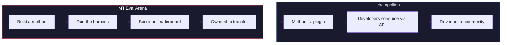

# MT Eval Arena

> **执行摘要。** MT Eval Arena 是一个开放的机器翻译方法基准测试平台，重点关注商业 MT 不存在或尚未经过独立验证的语言。它提供标准化评估、公开排行榜，以及通过 champollion 部署到生产环境的桥接。对于土著语言，经过验证的方法将所有权转移给社区。

一个开放的机器翻译方法验证平台——特别是针对商业 MT 不存在或尚未经过独立验证的语言。

构建一个方法。对其进行基准测试。证明它有效。如果它获胜，就会被部署。

---

## 问题所在

Google Translate 支持约 130 种语言。Meta 的 NLLB-200 覆盖约 200 种，OMT-1600（2026 年 3 月）声称覆盖 1,600 种。地球上有超过 7,000 种语言。对于 OMT-1600 最低资源层级的约 1,300 种语言，模型权重不可用，质量低于可用阈值，评估使用圣经领域文本和标准机器指标——没有形态学验证、没有独立测试、没有社区治理。对于剩余的约 5,400 种语言，没有任何预训练模型能产生任何输出。

Big Tech 现在正在投资低资源语言覆盖——但没有独立质量验证、形态学验证或社区治理的覆盖，就是没有信任的覆盖。最需要翻译工具的使用者恰好是最不可能拥有这些工具的社区。

**Arena 的存在就是为了改变这一点。** 它提供基础设施来开发、评估和部署任何语言的翻译方法——具有可重现的评分、开放提交和社区治理。

---

## 工作原理

1. **你构建一个翻译方法** ——微调 LLM、微调模型、FST 门控管道或任何其他产生翻译的方法。
2. **harness 对其进行基准测试** ——标准化指标（chrF++、精确匹配、FST 接受度），指纹识别到特定的 Git 提交。
3. **结果出现在排行榜上** ——每次提交都是可重现和可比较的。
4. **如果它获胜，所有权转移** ——对于土著语言，获胜方法的代码转移给社区治理组织。
5. **方法部署到生产环境** ——通过 [champollion](https://champollion.dev)，面向开发者的 API。收入流向社区。

**在这里证明它。在那里部署它。**

---

## 适用人群

| 你是... | Arena 为你提供... |
|---|---|
| **机器学习工程师 / 研究员** | 标准化基准、可重现评分、竞争排行榜 |
| **语言学家** | 一个框架，将语法规则和词典转化为可测试的方法 |
| **语言社区成员** | 对你的语言方法如何开发和部署的治理权 |
| **资助者 / 拨款审查员** | 透明、可重现的指标来评估翻译研究提案 |
| **学生** | 一个具有真实影响的开放挑战——构建方法、提交分数 |

---

## 当前基准

### EDTeKLA Development Set v1
- **语言对：** English → Plains Cree (SRO)
- **条目：** 548 个精选对（486 个教科书 + 62 个黄金标准）
- **许可证：** CC BY-NC-SA 4.0
- **来源：** [EdTeKLA 研究小组](https://spaces.facsci.ualberta.ca/edtekla/)，阿尔伯塔大学

### FLORES+ Devtest
- **语言对：** English → 39 种语言
- **条目：** 每种语言 1,012 个句子
- **许可证：** CC BY-SA 4.0
- **来源：** [OLDI](https://huggingface.co/datasets/openlanguagedata/flores_plus)

---

## 唯一规则

:::danger 不要在评估数据上进行训练
暴露于基准数据集的方法——作为训练数据、少样本示例、词典条目或提示材料——将被**取消资格**。可以在任何数据上进行微调。只是不要在测试集上。
:::

---

## 后续步骤

- **[提交方法](/docs/getting-started/submit-a-method)** ——如何提交你的第一次基准测试运行
- **[基准规范](/docs/specifications/benchmark)** ——完整的实验协议
- **[排行榜规则](/docs/leaderboard/rules)** ——提交标准和反作弊政策
- **[数据主权](/docs/sovereignty/data-sovereignty)** ——OCAP、CARE 以及所有权转移为什么重要
- **[经济模型](/docs/sovereignty/economic-model)** ——Arena 分数如何成为社区收入

**[→ 查看排行榜](https://champollion.dev/leaderboard)**