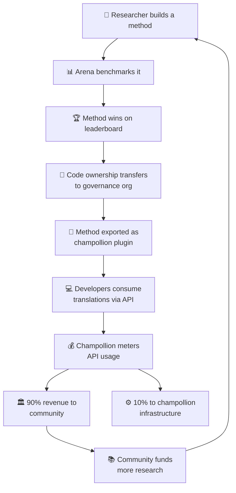

# 经济模型

> **执行摘要。** 本页描述连接 Arena 和 champollion 的经济循环：研究产生方法，方法通过插件部署，API 使用产生收入，90% 的收入流向语言社区。涵盖飞轮机制、收入分配、便利层和资助者的可持续性案例。

Arena 和 champollion 形成一个闭合的经济循环。在 Arena 上的研究产生方法。方法通过 champollion 部署。champollion 的收入流回这些方法所服务的语言社区。

---

## 飞轮机制

飞轮的每一次转动都会强化生态系统：
- **更多研究** 产生更好的方法
- **更好的方法** 吸引更多开发者
- **更多开发者** 产生更多 API 收入
- **更多收入** 资助更多社区主导的研究

---

## 收入如何流动

当开发者通过 champollion API 使用社区所有的方法时：

| 步骤 | 发生的事情 |
|---|---|
| 开发者调用 `champollion sync` 或 REST API | 翻译由社区所有的方法生成 |
| Champollion 计量 API 调用 | 按请求、按语言对跟踪使用情况 |
| 收入分配 | **90%** 流向拥有该方法的治理组织。**10%** 用于覆盖 champollion 基础设施成本。 |
| 社区决定分配 | 收入资助语言项目、进一步研究、社区资源——治理组织决定的任何事项 |

### 便利层

Champollion 还为常见方法提供优化配置。如果研究人员证明 Gemini 2.5 Pro 配合特定的指导数据和温度设置为某个语言对产生最佳结果，该配置可作为预构建预设通过 champollion API 获得。开发者无需复制研究——他们只需调用 API。

Arena 建立基准。Champollion 使其可访问。社区从两者中受益。

---

## 对于标准语言

飞轮机制对土著语言和低资源语言最具影响力，其中所有权转移和社区收入模式适用。

对于标准语言（法语、日语、西班牙语等），champollion 提供相同的 API 便利，但没有治理层——开发者为计量访问预配置的翻译方法付费，champollion 获得基础设施分成。

---

## 对于资助者

经济模型解决了语言技术资助中的一个常见问题：**资助结束后的可持续性**。

| 传统模式 | Arena 模式 |
|---|---|
| 资助资助研究 | 资助资助研究 |
| 论文发表 | 方法部署到生产环境 |
| 资助结束，工具被放弃 | API 收入维持运营 |
| 社区一无所获 | 社区拥有资产并获得收入 |

一个成功的方法创造自我维持的收入流。资助者可以衡量影响，不仅在出版物中，还在：
- API 使用情况（有多少开发者在使用该方法）
- 产生的收入（有多少钱流向社区）
- 质量指标（排行榜分数随时间的变化）
- 语言覆盖（服务多少语言对）

详见 [基准规范](/docs/specifications/benchmark)，第 10 节的详细成本模型。

---

## 另见

- [所有权转移](/docs/sovereignty/ownership-transfer) — 法律和技术转移流程
- [数据主权](/docs/sovereignty/data-sovereignty) — OCAP、CARE 和 Te Mana Raraunga 原则
- [排行榜规则](/docs/leaderboard/rules) — 方法如何符合部署条件