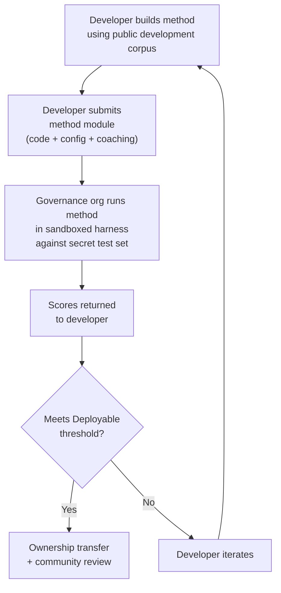

# 基准规范

> **执行摘要。** 本文档定义了 Champollion MT 评估生态系统的评估协议：语料库格式（§2）、运行卡架构（§3）、基准协议（§6）、人工验证要求（§7）、主权机制（§8）、排行榜和提交模型（§9）、成本框架（§10）以及对新语言的扩展（§11）。有关指标定义、复合评分权重、质量等级阈值和成本/速度指标公式，请参阅 `SCORING_SPEC.md` — 所有评分逻辑的唯一真实来源。本文档引用 SCORING_SPEC 以获取这些详细信息，而不是重复它们。
>
> 最后更新：2026-06-07

---

## 1. 原则

### 1.1 自动化指标是代理

本文档中定义的每个指标都是机器计算的。chrF++、FST 接受度、形态学准确性、语义相似性 — 它们都是翻译质量的自动化代理。它们对于快速迭代、系统比较和检测回归很有用。它们**不是人工判断的替代品**。

评估层级：

```
Automated metrics (run cards, benchmarks)
    ↓ proxy for
Human review (bilingual speakers validate output)
    ↓ proxy for
Actual utility (does this help a language community?)
```

无论自动化评分有多高，都无法替代流利使用者阅读输出并确认其正确、自然且文化上恰当。§5 中定义的质量等级是自动化复合评分上的启发式标签 — 对于跟踪进度很有用，但单独永远不够。

### 1.2 方法，而非模型

我们对**方法**进行基准测试，而不是模型。模型是一个组件。方法是完整的配方：模型选择、提示设计、工具使用、前/后处理、教练数据、重试策略，一切。两个使用相同模型但方法不同的团队会获得不同的评分。这就是重点。

### 1.3 可重现性

每个基准结果都必须可重现。运行卡（§3）捕获实验的完整配置。指纹（§3.5）标识实验设置。运行卡哈希（§3.6）验证结果的完整性。任何使用相同方法、语料库和配置的人应该获得 ±2% 范围内的评分（考虑到温度 > 0 时的 LLM 采样非确定性）。

### 1.4 无合成评估数据

**本项目不生成、使用或认可合成评估数据。** 所有语料库必须来自真实的人工创作文本 — 已发布的翻译、教科书、双语文档或来自流利使用者的引出翻译。

LLM 可以协助：
- 句子对齐（在现有双语文本中查找平行段落）
- 格式转换（将已发布的材料转换为语料库架构）
- 元数据丰富（建议难度等级、寄存器标签）
- 提议源句子供人工翻译（§11.3 — 翻译步骤始终是人工的）

LLM **绝不**应生成参考翻译或评估对。

**我们在训练数据上保持开发中立。** 如果方法开发者在其方法中使用合成训练数据、回译或数据增强，那是他们的选择 — 我们评估输出，而不是训练过程。Meta 的 OMT-1600 使用大约 2.7 亿个通过回译生成的合成平行句子。我们对以这种方式训练的方法没有异议。我们仅在人工策划的数据上进行测试。

> **为什么不使用圣经文本进行评估？** OMT-1600 在 1,560 个 1,600 种语言中的 1,560 种上评估圣经领域文本。圣经翻译具有古老的寄存器、礼仪词汇和公式化的句子结构。我们的评估语料库来自社区策划的、领域多样化的文本 — 健康、法律、教育、政府、会话和技术领域（见 §2.7）。这是一个刻意的设计选择。社区需要在他们实际生活和工作的领域中进行翻译，而不是单一的宗教寄存器。在创世记 1:1 上评分良好的方法几乎无法告诉你它在乐队委员会议程或诊所登记表上的性能。

---

## 2. 语料库架构

语料库是一组精选的平行文本对，具有结构化元数据。它是所有方法都根据其进行测量的基本事实。

### 2.1 数据集信封

语料库文件的顶级结构：

```json
{
  "dataset": {
    "id": "edtekla-dev-v1",
    "version": "1.0",
    "language_pair": "EN→CRK",
    "source_language": "en",
    "target_language": "crk",
    "created": "2026-05-01",
    "license": "CC-BY-NC-SA-4.0",
    "provenance": ["gold_standard", "textbook"]
  },
  "entries": [ ... ]
}
```

| 字段 | 类型 | 必需 | 描述 |
|-------|------|----------|-------------|
| `id` | string | ✅ | 唯一的数据集标识符，用于运行卡和排行榜 |
| `version` | string | ✅ | 语义版本。递增会使先前的运行卡比较失效 |
| `language_pair` | string | ✅ | 显示标签（例如 `EN→CRK`） |
| `source_language` | string | ✅ | BCP 47 源语言代码 |
| `target_language` | string | ✅ | BCP 47 目标语言代码 |
| `created` | string | ✅ | ISO 8601 创建日期 |
| `license` | string | ✅ | SPDX 许可证标识符 |
| `provenance` | string[] | ✅ | 在条目中使用的来源标签列表 |

### 2.2 条目架构

语料库中的每个条目代表一个翻译挑战：

```json
{
  "id": 42,
  "source": "I see the dog",
  "reference": "niwâpamâw atim",
  "segment": "gold_standard",
  "difficulty": 2,
  "provenance": "gold_standard",
  "register": "conversational",
  "context": "declaration",
  "morphological_analysis": "ni-wâpam-âw atim | 1sg-see.TA-3sg.DIR dog.AN",
  "notes": "Animate noun (atim); direct form because speaker is proximate",
  "variant_class": "simple-ta-direct"
}
```

| 字段 | 类型 | 必需 | 描述 |
|-------|------|----------|-------------|
| `id` | integer | ✅ | 语料库内的唯一标识符 |
| `source` | string | ✅ | 源语言中的源文本 |
| `reference` | string | ✅ | 目标语言中的黄金标准参考翻译 |
| `segment` | string | 📎 | 语料库分区：`gold_standard`、`held_out`、`development` 或 `diagnostic` |
| `difficulty` | integer | 📎 | 难度评级 1–5（见 §2.4） |
| `provenance` | string | 📎 | 此条目的来源（见 §2.5） |
| `register` | string | 📎 | 寄存器/正式程度（见 §2.6） |
| `context` | string | 📎 | 交际功能（见 §2.6） |
| `domain` | string | 📎 | 来自 16 代码分类法的用例领域（见 §2.7）。必须是以下之一：`conv`、`ecommerce`、`edu`、`financial`、`gov`、`legal`、`literary`、`marketing`、`medical`、`news`、`religious`、`scientific`、`subtitles`、`support`、`tech`、`ui`。在构造时验证。 |

> **📎 = 推荐。** 工具通过默认值优雅地处理缺失的可选字段。第三方语料库每个条目只需提供 `id`、`source` 和 `reference`。
| `morphological_analysis` | string | ❌ | 黄金标准形态学分解 |
| `notes` | string | ❌ | 翻译者注释、方言变体、歧义标志 |
| `variant_class` | string | ❌ | 分组可接受翻译变体的类标签 |


### 2.3 语料库分段

语料库分为具有不同访问级别的分段：

| 分段 | 目的 | 访问权限 | 最小大小 |
|---------|---------|--------|-------------|
| `development` | 方法开发和迭代。开发者可自由使用这些。 | **公开** | 30 个条目 |
| `diagnostic` | 针对特定语言现象的目标测试。 | **公开** | 10 个条目 |
| `gold_standard` | 官方基准评估。排行榜评分来自这里。 | **秘密** — 由治理组织持有 | 50 个条目 |
| `held_out` | 为未来评估保留。激活前永不使用。 | **秘密** — 由治理组织持有 | 10 个条目 |

> **当前状态：** 已发布的数据集中仅存在 `development` 分段。`diagnostic`、`gold_standard` 和 `held_out` 分段定义供未来使用，随着语料库增长。

`gold_standard` 和 `held_out` 分段完全保密。源句子和参考翻译都保存在治理控制的基础设施上。方法开发者永远看不到问题或答案。有关主权机制，请参阅 §8。

### 2.4 难度等级

| 等级 | 描述 | 示例 |
|------|-------------|----------|
| 1 — 基础词汇 | 单词、常见问候、数字 | "hello" → "tânisi"、"dog" → "atim" |
| 2 — 简单句子 | 主语-动词或 SVO、现在时 | "I see the dog" → "niwâpamâw atim" |
| 3 — 中等复杂性 | 过去/未来时、所有格、生命性 | "I saw his dog yesterday" |
| 4 — 复杂形态学 | 显著性、被动语态、连接词顺序、相对从句 | "the woman whose son went to the store" |
| 5 — 高级 | 多从句、正式寄存器、仪式、习语 | 具有寄存器适当语调的完整段落 |

构造良好的语料库应包括所有五个难度等级的条目，权重向大多数实际翻译挑战所在的 2–4 等级倾斜。

### 2.5 来源标签

每个条目必须指示其来源：

| 标签 | 含义 |
|-----|---------|
| `gold_standard` | 由流利使用者验证 |
| `textbook` | 来自已发布的教育材料 |
| `elicited` | 通过结构化引出会话产生 |
| `corpus` | 从平行语料库中提取 |

> **注意：** 实际上，来源值是自由格式的字符串。上面的标签是约定，而不是经过验证的枚举 — 数据集可能使用其他描述性来源字符串。

### 2.6 寄存器和上下文

**寄存器**描述正式程度和社会背景：

| 寄存器 | 描述 |
|----------|-------------|
| `conversational` | 平等者之间的日常言语 |
| `formal` | 官方或机构语言 |
| `technical` | 领域特定词汇 |
| `ceremonial` | 传统或神圣的语言使用 |
| `educational` | 语言教学材料 |

**上下文**描述交际功能：

> 🔲 **计划中。** `context` 字段在架构中定义但在当前数据集中尚未填充。它保留供未来语料库丰富。

| 上下文 | 描述 |
|---------|-------------|
| `greeting` | 社交问候或告别 |
| `declaration` | 事实陈述 |
| `question` | 疑问句 |
| `instruction` | 命令或指令 |
| `narrative` | 讲故事或描述 |
| `label` | UI 标签、按钮文本或标题 |
| `error` | 错误消息或警告 |

### 2.7 领域 {#27-domain}

**领域**描述真实世界的用例 — 正在翻译的内容类型。这与寄存器和上下文正交：

- **寄存器**回答：*这有多正式？*
- **上下文**回答：*这个句子在做什么？*
- **领域**回答：*这是针对哪个行业/用例的？*

法律合同（领域：`legal`）可能是正式的（寄存器：`formal`）并包含声明（上下文：`declaration`）。法律聊天机器人记录（领域：`legal`）可能是会话式的（寄存器：`conversational`）并包含问题（上下文：`question`）。相同的领域，不同的寄存器和上下文。

| 领域代码 | 描述 | 典型消费者 |
|-------------|-------------|-------------------|
| `ui` | 软件界面字符串 | 应用开发者、本地化团队 |
| `legal` | 合同、法规、法庭文件、移民文件 | 律师事务所、法院、合规团队、知识产权律师 |
| `medical` | 临床笔记、药物标签、患者沟通、试验协议 | 医院、制药、临床试验、患者门户 |
| `financial` | 银行、保险、监管申报、审计报告 | 银行、保险公司、监管机构、审计师 |
| `edu` | 教科书、课程、课程计划、学术材料 | 学校、大学、教科书出版商 |
| `ecommerce` | 产品描述、评论、市场列表 | 在线零售商、市场卖家 |
| `marketing` | 广告文案、品牌信息、活动、口号 | 广告代理、品牌团队 |
| `gov` | 政策文件、法规、公开通知、立法 | 政府机构、合规团队 |
| `scientific` | 研究论文、摘要、方法、拨款提案 | 研究人员、期刊、拨款机构 |
| `religious` | 经文、礼仪文本、神学评论 | 信仰社区、礼仪出版商 |
| `support` | 常见问题、错误消息、故障排除指南、聊天机器人脚本 | SaaS 公司、帮助台 |
| `subtitles` | 电影、电视、流媒体和游戏对话 | 流媒体平台、工作室、游戏公司 |
| `news` | 新闻、电讯报道、社论、新闻稿 | 媒体组织、电讯社 |
| `literary` | 小说、诗歌、叙事、文化文本 | 出版商、文化保护组织 |
| `conv` | 非正式对话、社交媒体、消息 | 消费者应用、社交平台 |
| `tech` | API 文档、手册、工程规范、技术指南 | 文档团队、工程组织 |

> **领域特定基准。** 一般基准评估所有领域的方法。但竞技场也支持**领域过滤基准** — 其中评分仅在标记有特定领域的条目上计算。这让用户可以回答："哪种方法最适合将法律文件翻译成法语？"vs."哪种方法具有最佳的整体法语评分？"
>
> 领域过滤排行榜排名是一个关键产品功能。不同的方法在不同领域的表现会有所不同 — 在法律术语上微调的方法可能会在法律基准上表现出色，但在会话文本上表现不佳。竞技场帮助用户找到最适合其特定用例的解决方案。

> **未来：竞技场聊天机器人。** 竞技场网站将包括一个会话助手，帮助用户描述其 MT 用例（领域、语言对、质量要求）并从排行榜推荐最佳社区验证方法。例如："我需要将英文临床试验协议翻译成日文 — 哪种方法在医学领域 EN→JA 基准上评分最高？"这取决于有足够的领域标记评估数据和方法多样性。

---

## 3. 运行卡架构 {#3-run-card-schema}

运行卡是评估的原子单位。它是一个自包含的 JSON 文档，记录单个评估运行的完整配置和结果：一个方法、一个模型、一个配置、一个数据集。

每个运行卡捕获三个维度：
- **质量** — 翻译有多好？
- **成本** — 生成它们花费了多少？
- **速度** — 花费了多长时间？

### 3.1 顶级字段

| 字段 | 类型 | 描述 |
|-------|------|-------------|
| `run_id` | string | 在运行开始时生成的 UUID v4 |
| `harness_version` | string | 工具的语义版本（例如 `2.0`） |
| `timestamp` | string | 运行开始时的 ISO 8601 UTC 时间戳 |
| `elapsed_seconds` | number | 整个运行的挂钟持续时间 |

### 3.2 方法配置

这些字段定义实验设置 — 测试的内容和方式。

| 字段 | 类型 | 必需 | 描述 |
|-------|------|----------|-------------|
| `model_slug` | string | ✅ | 模型标识符（例如 `google/gemini-2.5-flash`） |
| `model_id` | string | ❌ | API 返回的已解析模型标识符 |
| `condition` | string | ✅ | 实验标签（例如 `baseline`、`coached-v3`、`few-shot`） |
| `temperature` | number | ✅ | 采样温度 |
| `system_prompt_sha256` | string | ✅ | 完整系统提示的 SHA-256 哈希 |
| `system_prompt_used` | string | ✅ | 完整系统提示文本 |
| `coaching_data_sha256` | string | ❌ | 教练数据文件的 SHA-256 哈希（如果使用） |
| `fst_version` | string | ❌ | FST 分析器的版本（如果使用） |
| `tools_enabled` | string[] | ❌ | 方法可用的工具列表 |
| `batch_size` | number | ❌ | 每个并发 API 批次的条目 |
| `max_retries` | number | ❌ | FST 拒绝的最大重试次数（如果适用） |

:::info 已发布的运行卡包括 method_config
当运行卡发布到排行榜时（通过 `mt-eval publish`），它还包括一个 `method_config` 块，包含规范的 8 字段 MethodConfig（`model`、`temperature`、`batchSize`、`register`、`coachingFile`、`coachingPrompt`、`promptContext`、`qualityTier` — 全部 camelCase）。这启用零重建导入：`champollion leaderboard --install` 直接读取 `method_config` 并将其写为插件清单。上面的遥测字段（§3.2）记录工具观察到的内容；`method_config` 记录开发者的意图。
:::

### 3.3 数据集参考

| 字段 | 类型 | 描述 |
|-------|------|-------------|
| `dataset.id` | string | 数据集标识符 |
| `dataset.version` | string | 数据集版本 |
| `dataset.language_pair` | string | 显示标签 |
| `dataset.sha256` | string | 数据集文件内容的 SHA-256 哈希 |
| `dataset.entry_count` | number | 评估的条目数 |

数据集 SHA-256 将结果固定到特定版本的数据。如果数据集更改，旧运行卡不可比较。

### 3.4 评分（质量）

整个运行的聚合指标。所有质量指标都是**自动化的** — 见 §1.1。

| 字段 | 类型 | 描述 |
|-------|------|-------------|
| `scores.total` | number | 评估的总条目数 |
| `scores.exact_matches` | number | 输出完全匹配参考的条目 |
| `scores.exact_match_rate` | number | 0.0–1.0 |
| `scores.equivalent_matches` | number | 匹配参考可接受变体的条目 |
| `scores.equivalent_match_rate` | number | 0.0–1.0 |
| `scores.fst_accepted` | number | FST 分析器接受的条目 |
| `scores.fst_acceptance_rate` | number | 0.0–1.0，如果未配置 FST 则为 `null` |
| `scores.morphological_accuracy` | number | 0.0–1.0，如果没有黄金标准分析则为 `null` |
| `scores.chrf_plus_plus` | number | 语料库级 chrF++ 评分（0–100） |
| `scores.semantic_score` | number | 基于嵌入的语义相似性（0.0–1.0） |
| `scores.ter` | number | 翻译编辑率（0–∞，越低越好） |
| `scores.length_ratio` | number | avg(len(predicted)/len(reference))，理想值 = 1.0 |
| `scores.code_switching_rate` | number | 0.0–1.0，具有源语言泄漏的条目分数 |
| `scores.hallucination_rate` | number | 0.0–1.0，输出中检测到的幻觉内容分数 |
| `scores.terminology_adherence` | number | 0.0–1.0，对词汇表术语的遵守（如果没有词汇表则为 `null`） |
| `scores.tokens_per_second` | number | total_tokens / elapsed_seconds |
| `scores.entries_per_minute` | number | 每分钟翻译的条目 |
| `scores.composite` | number | 加权复合评分（0.0–1.0）。见 SCORING_SPEC §4 |
| `scores.errors` | number | 失败的条目（API 错误、超时等） |
| `scores.by_difficulty` | object | 按难度等级分解的评分 |
| `scores.by_provenance` | object | 按来源标签分解的评分 |
| `scores.by_domain` | object | ✅ 已实现 — 按领域分解的评分（§2.7）。启用领域过滤排行榜排名。由 tester.py 计算并通过 publish.py 传递。 |

### 3.5 总计（成本）

| 字段 | 类型 | 描述 |
|-------|------|-------------|
| `totals.prompt_tokens` | number | 所有 API 调用中的总输入令牌 |
| `totals.completion_tokens` | number | 总输出令牌 |
| `totals.reasoning_tokens` | number | 用于思维链的令牌（大多数模型为 0） |
| `totals.cached_tokens` | number | 从提供商提示缓存提供的令牌 |
| `totals.total_cost_usd` | number | 总成本（美元） |
| `totals.cost_per_entry_usd` | number | `total_cost_usd / entry_count` |
| `totals.cost_per_source_char` | number | 美元/源字符 — 可跨语言比较 |

### 3.6 计时（速度）

| 字段 | 类型 | 描述 |
|-------|------|-------------|
| `elapsed_seconds` | number | 完整运行的挂钟持续时间（顶级） |
| `scores.avg_latency_seconds` | number | 每个条目的平均响应时间 |
| `scores.median_latency_seconds` | number | 每个条目的中位响应时间 |
| `scores.p95_latency_seconds` | number | 每个条目的第 95 百分位响应时间 |

### 3.7 按条目结果

`results[]` 数组中的每个条目记录一个翻译。按条目数据保存在 `run_card_entries` 表中（迁移 005），具有非规范化的 LYSS 判决（迁移 006）。

| 字段 | 类型 | 描述 |
|-------|------|-------------|
| `entry_id` | string | 匹配语料库中的 `entries[].id` |
| `source` | string | 被翻译的源文本 |
| `expected` | string | 黄金标准参考翻译 |
| `raw_predicted` | string \| null | 后处理前的原始模型输出 |
| `predicted` | string | 方法的实际输出（后处理） |
| `segment` | string | 分段标识符（例如句子索引） |
| `difficulty` | string \| null | 来自语料库的难度等级 |
| `domain` | string | 来自语料库的领域标签（§2.7） |
| `exact_match` | boolean | 输出是否完全匹配参考 |
| `chrf_score` | number \| null | 句子级 chrF++（0–100） |
| `bleu_score` | number \| null | 句子级 BLEU（0–100） |
| `latency_s` | number \| null | 响应时间（秒） |
| `cost_usd` | number \| null | 此条目的成本（美元） |
| `tool_call_count` | integer | 使用的工具调用次数（如果没有则为 0） |
| `error` | string \| null | 如果此条目失败，则为错误消息 |
| `plugin_metrics` | object | 完整的按条目插件输出（JSONB） |
| `fst_valid` | boolean \| null | GiellaLT FST 接受了预测（非规范化 LYSS-fst） |
| `equivalent_match` | boolean \| null | CRK linter 确认了结构等价性（非规范化 LYSS-eq） |
| `semantic_verdict` | string \| null | LYSS-sem 判决：`VALID`、`MISMATCH`、`UNKNOWN`、`ERROR` |
| `code_switching_detected` | boolean \| null | 在输出中检测到源语言令牌 |
| `hallucination_detected` | boolean \| null | 在输出中检测到虚构内容 |


### 3.8 指纹

可重现性标识符。两个具有相同指纹的运行使用了相同的实验设置。

指纹是以下内容的排序连接的 SHA-256 哈希：
- `dataset.sha256`
- `model_slug`
- `condition`
- `system_prompt_sha256`
- `temperature`
- `harness_version`
- `batch_size`
- `tools_enabled`

> **为什么是 8 个组件？** 批次大小和工具调用会显著影响输出质量，必须包含在身份中。两个具有不同批次大小或不同启用工具的运行是不同的实验设置，即使所有其他参数匹配。

两个具有相同指纹的运行应该产生可比较的结果。差异是由于 API 非确定性（温度 > 0）或提供商端模型更新。

### 3.9 运行卡哈希

整个运行卡 JSON 的 SHA-256 哈希（在哈希期间将 `run_card_hash` 字段本身设置为 `""`）。这是防篡改密封。如果任何字段更改，哈希会中断。

---

## 4. 自动化指标

本节中的所有指标都是机器计算的。见 §1.1。

### 4.1 指标定义

| 指标 | 状态 | 测量内容 | 范围 |
|--------|--------|-----------------|-------|
| **chrF++** | ✅ 已实现 | 字符 n-gram F 分数。在字符级别运行，对于词长且高度屈折的形态学丰富语言比词级指标（BLEU）更稳健。由 sacrebleu 计算。 | 0–100（原生规模）。在复合中使用时除以 100。 |
| **FST 接受率** | ✅ 已实现 | 形态学分析器（GiellaLT HFST）接受的预测词的分数，作为目标语言中的有效形式。FST 接受的词是真实的、结构上有效的词 — 不是幻觉。 | 0.0–1.0 |
| **精确匹配** | ✅ 已实现 | 在 Unicode 规范化后完全匹配参考的预测分数。严格但明确 — 用作天花板检查。 | 0.0–1.0 |
| **形态学准确性** | 🔲 计划中 | 对于具有黄金标准形态学分析的条目：正确生成的语素分数。比 FST 接受率更细粒度 — 一个词可以是 FST 有效的但具有错误的语素结构（正确的词根，错误的时态）。 | 0.0–1.0 |
| **等价匹配** | ⚡ 部分 | 匹配参考的可接受变体的分数 — 考虑词序、方言差异和正字法约定。目前通过 CRK 评估标准的 `CrkLinterMetric`（在 `eval_standards/crk/` 中）为 CRK 实现；通过 CRK 语言卡的 `evalMetrics` 声明自动加载。通用实现需要语料库中的按条目 `variants[]`。 | 0.0–1.0 |
| **语义评分** | ⚡ 部分 | 意义保留，不管表面形式。目前通过 CRK 评估标准的 `CrkSemanticMetric`（在 `eval_standards/crk/` 中，判决加权代理）为 CRK 实现。计划通用基于嵌入的余弦相似性 — 见 SCORING_SPEC §2.3。 | 0.0–1.0 |

### 4.2 复合评分

复合评分是所有*可用*指标的加权平均：

```
composite = Σ (weight_i × metric_i)   for all available metrics
             ─────────────────────
             Σ weight_i              (renormalized to sum to 1.0)
```

当指标不可用时（未配置 FST、未定义变体类、无嵌入模型），其权重按比例重新分配到剩余指标中。这意味着复合在语言内始终可比较 — 它使用该语言可用的任何指标并相应地规范化。

**权重表、输入规范化规则和完整指标清单在 `SCORING_SPEC.md` §4 中定义。** 该文档是以下内容的 SSOT：
- 配置文件 A 权重（具有 FST 覆盖的语言 — 9 个指标，结构指标占 40%）
- 配置文件 B 权重（没有 FST 覆盖的语言 — 8 个指标）
- 规范化规则（chrF++ ÷ 100、代码切换和幻觉率反演）
- 从复合中排除的指标（BLEU、COMET、TER、长度比、一致性）及其原因

工具代码在 `mt_eval_harness/scoring.py` 中镜像这些表。当 SCORING_SPEC 更改时，`scoring.py` 被更新以匹配，`test_scoring_ssot.py` 验证对齐。

> **为什么不是 BLEU？** BLEU 在词级别运行并惩罚形态学变化。对于多综合语言，单个词可以是整个从句 — BLEU 会将轻微的屈折差异视为完全失误。chrF++ 通过在字符级别运行来更好地处理这个问题。BLEU 从两个权重表中排除。有关完整理由，见 SCORING_SPEC 附录 A。


### 4.3 成本调整评分

对于使用付费 API 的方法，我们还报告二级排名。成本调整公式在 `SCORING_SPEC.md` §6.3 中定义。

---

## 5. 质量等级 {#5-quality-tiers}

质量等级是自动化复合评分上的启发式标签。它们根据在每个级别对输出的人工审查，描述评分在实践中往往意味着什么。**它们不是经过验证的质量判断** — 只有人工审查（§6）才能确认实际可用性。

**等级阈值和描述在 `SCORING_SPEC.md` §5 中定义。** 等级为：基线（0.00–0.30）、新兴（0.30–0.50）、功能性（0.50–0.70）、可部署（0.70–0.85）和流利（0.85–1.00）。

> [!IMPORTANT]
> **自动化等级是暂定的。** 这些标签是供审查的提名，而不是质量声明。在自动化指标上达到"可部署"的方法是社区评估的候选 — 不是要发布的产品。只有人工审查（§7）才能确认实际可用性。等级边界可能因语言而异。

这些等级是暂定的。随着人工验证数据的积累，我们将学习每种语言的实际"使用者发现这有用"阈值所在的位置，它们将被重新校准。等级边界可能因语言而异。

没有社区审查确认双语使用者同意输出可用，任何方法都不能声称**可部署**或更高。

---

## 6. 基准协议

**基准**是在给定数据集上跨声明参数空间的系统运行卡生成。它不是单个运行 — 它是对不同配置如何执行的结构化探索。

### 6.1 基准生成的内容

基准生成**运行卡矩阵** — 每个参数值组合一个。矩阵支持跨以下方面的多方面比较：

- **质量** — 复合评分、单个指标分解
- **成本** — 每个配置的总成本和按条目成本
- **速度** — 挂钟时间和按条目延迟

没有单个"基准评分"。基准是完整矩阵。不同的利益相关者将关心不同的方面：研究人员优化复合评分，部署工程师优化按条目成本，社区审查质量。

### 6.2 参数空间

基准声明哪些参数被排列：

| 轴 | 典型值 | 目的 |
|------|---------------|---------|
| `model` | 4–12 个模型（前沿 + 中端 + 预算） | 模型能力有多重要？ |
| `temperature` | 0.0、0.3、0.7 | 采样随机性有帮助还是有害？ |
| `prompt_version` | 2–3 个提示策略 | 方法对提示设计的敏感性如何？ |
| `coaching_config` | 有/无教练数据 | 注入语言知识是否改进输出？ |
| `tool_config` | 有/无 FST、有/无字典 | 语言工具是否改进输出？ |

完整排列空间：
```
runs = |models| × |temperatures| × |prompts| × |coaching| × |tools|
```

典型的初始基准：12 个模型 × 3 个温度 × 2 个提示 × 2 个教练 = 144 个运行。

### 6.3 基线 vs. 方法评估

基准有两个不同的目的：

**基线** — 用朴素方法绘制景观。"现有模型在没有任何语言特定工程的情况下可以为这种语言做什么？"这建立了标准。基线矩阵告诉你：哪些模型幻觉最少，哪些温度产生最一致的输出，教练数据是否有帮助，所有模型在哪里统一失败（这揭示了困难的语言问题）。

**方法评估** — 测试特定的工程方法。"我的 FST 门控教练管道是否击败基线？"方法的运行卡与基线矩阵进行比较。当方法超越最佳基线时 — 当工程在朴素模型调用上增加价值时 — 方法很有趣。

两项活动都生成具有相同架构的运行卡。区别在于意图和参数空间：基线跨模型和配置排列；方法评估针对最佳配置测试一个方法。

### 6.4 开发 vs. 黄金标准评估

方法开发者针对 `development` 和 `diagnostic` 语料库分段自由迭代。这是非正式的 — 没有限制、没有提交、没有治理参与。开发者在学习什么有效。

官方排行榜评分仅来自 `gold_standard` 评估。这是正式的：
1. 开发者提交其完整、可运行的方法（代码 + 配置 + 教练数据）
2. 治理组织在沙箱工具中针对秘密测试集运行它
3. 仅返回评分

有关完整主权机制，见 §8。

---

## 7. 人工验证 {#7-human-validation}

自动化指标是代理。人工验证是基本事实。

### 7.1 人工审查捕获的指标遗漏的内容

- **形态学有效但语义错误** — FST 接受该词，chrF++ 很高，但翻译意味着不同的东西
- **文化上不恰当** — 翻译在技术上是正确的，但使用社区会拒绝的寄存器或框架
- **幻觉的可信度** — 输出对非使用者看起来像目标语言，但对流利使用者来说是胡言乱语
- **可接受但未标记的变体** — 输出是正确的，但自动化指标将其标记为错误，因为它使用了参考中没有的方言变体

### 7.2 验证门

没有社区审查确认双语使用者同意输出可用，任何方法都不能从**功能性**等级进步到**可部署**等级。这不是形式 — 这是重点。自动化指标存在以减少需要人工审查的输出量。它们无法替代它。

### 7.3 社区审查协议

> 🔲 **计划中**：社区审查界面尚未上线。本节描述了预期的流程。

1. 方法在自动化指标上达到可部署阈值
2. 输出样本（按难度等级分层）呈现给双语使用者
3. 使用者在以下规模上评级每个翻译：**拒绝**、**要点**（意思清楚但措辞错误）、**可接受**（正确但有轻微问题）、**优秀**（与人工翻译无法区分）
4. 治理组织审查汇总评级
5. 如果社区接受该方法，它将进行所有权转移和部署

---

## 8. 主权

评估数据集包含属于语言社区的精选语言知识。本节定义保护该数据的技术和法律框架。

### 8.1 问题

传统基准公开发布测试集。一旦发布，数据就无法取消发布。对于土著和少数民族语言社区，这造成了提取性动态 — 语言数据在没有持续同意的情况下被使用。遵循 Dhein 对生物数据主权的实用观点，我们将语言数据视为"具有未知潜力的易变资源"，需要动态、关系性治理。

### 8.2 沙箱执行

主要执行机制：开发者交出其方法模块，治理组织在其自己的基础设施上针对完全秘密的测试集运行它，仅返回评分。开发者永远看不到源句子或参考翻译。



流程：
1. **开发语料库是公开的。** 对 `development` 和 `diagnostic` 分段没有限制。
2. **黄金标准测试集完全保密。** 源句子和参考翻译都存在于治理控制的基础设施上。
3. **要获得官方评分，你交出你的方法。** 治理组织在沙箱中运行它。仅返回评分。
4. **治理组织已经拥有该方法。** 提交就是方法代码。如果它达到可部署阈值，所有权转移已经在进行中。
5. **提交需要同意条款。** 包括所有权转移条款（§8.3）。
6. **治理组织完全控制访问。** 他们可以随时拒绝或撤销评估。动态同意。
7. **静态加密是深度防御。** 主要执行是架构性的。

### 8.3 所有权转移

在黄金标准评估中达到或超过可部署阈值（0.70）的复合评分**且**通过人工验证（§7）的方法受所有权转移约束。

**开发者保留：**
- 归属和信用（名称保留在排行榜上）
- 发布关于该方法的权利
- 在其他语言对中使用该方法的权利

**治理组织获得：**
- 为其语言使用、修改、分发和货币化该方法的权利
- 再许可权
- 方法代码的物理占有（已从评估提交中持有）

### 8.4 治理组织要求

要作为语言基准的关键保管人：

1. **代表语言社区** — 与使用者和文化权威的可证明关系
2. **密钥管理能力** — 管理密码密钥的技术能力
3. **承诺评估可用性** — 基准必须保持可评估
4. **发布参与条款** — 开发者同意的明确文档
5. **在公认的主权原则下运营** — OCAP®、CARE 或等效

### 8.5 OCAP® 和 CARE 对齐

| 原则 | 实现 |
|-----------|---------------|
| **所有权** (OCAP) | 语言数据属于社区。治理组织控制评估基础设施。 |
| **控制** (OCAP) | 治理组织通过沙箱执行控制评估。他们决定谁提交以及在什么条款下。 |
| **访问** (OCAP) | 社区对其自己的数据、结果和针对其开发的方法有无限制的访问。 |
| **占有** (OCAP) | 测试集永远不会离开治理基础设施。静态加密作为备份。 |
| **集体利益** (CARE) | 所有权转移确保方法使社区受益。收入模式（10% 吞吐量账单边际；社区保留 ~90%）维持这一点。 |
| **控制权限** (CARE) | 沙箱执行是技术实现。 |
| **责任** (CARE) | 开发者通过参与条款接受责任。 |
| **伦理** (CARE) | 社区权利优于研究人员便利。 |

### 8.6 依赖类和沙箱网络策略

沙箱执行（§8.2）和所有权转移（§8.3）都取决于准确了解方法在运行时需要什么。[方法接口规范](/docs/specifications/methods#method-validity-and-dependency-classes)定义了五个**依赖类** — S（自包含）、O（开放外部）、A1（可替换 LLM 推理）、A2（不可替换外部 API）、X（封闭）— 以及每个方法必须声明的依赖清单。本小节记录沙箱网络策略如何执行它们。

**默认拒绝出口。** 沙箱规范要求方法容器默认没有网络访问。这不是防火墙规则 — 规范从执行环境中删除网络，因此未声明的网络依赖在架构层失败，而不是策略层。S 类和 O 类方法完全从提交中供应的工件运行（O 类工件在提交时被固定和镜像）。

**LLM 网关（🔲 计划中）。** 大多数方法调用 LLM，所以沙箱规范定义了恰好一个出口异常：由评估基础设施运营的 **LLM 网关**。网关：

- 代理推理请求到**固定允许列表的模型** — 在方法清单和运行卡中记录的模型标识符；
- **记录每个请求和响应**在密封审计日志中，以便在评分发布前可以审查网关流量以查找数据泄露尝试；
- 是*唯一*的网络路径 — 没有一般出口、没有 DNS、没有其他端点。

这是使 A1 类方法可评估而不放弃 §8.2 的可验证性保证的原因 — 但这是一个真实的权衡，规范明确命名它：通过外部模型翻译秘密源句子**向模型提供商披露该源句子**。参考翻译永远不会离开（它们由工具持有，在容器外；见 §8.2），方法本身仍然无法泄露超过记录的、允许列表的推理调用包含的任何内容。对于给定的语料库，有界披露是否可接受是管理员决定：授权 A1 类评估意味着有意识地授权它，按运行，就像数据的任何其他使用一样。

**状态。** 沙箱及其网关已指定但尚未构建。在网关运行之前，只有 S 类和 O 类方法可以产生黄金标准评分；A1 类方法原则上仍然是奖项合格的（见[奖项规范 §1.6](/docs/specifications/prizes)）但尚无法针对秘密分段进行评估。A2 类依赖在权利持有者授予许可之前根本无法进入沙箱 — 工件必须被允许*存在*在沙箱中，然后才会出现任何网络问题。

---

## 9. 排行榜和提交

### 9.1 提交要求

有效的排行榜提交必须包括：

1. 完整的运行卡（§3），包含所有必需字段
2. 方法代码 — 完全可运行，带有安装说明
3. 所有依赖 — 教练数据、字典、FST 二进制文件、提示
4. 成本报告
5. 描述方法方法和限制的 README

### 9.2 合法性标准

1. **未在评估数据上训练。** 方法不得接触过 `gold_standard` 或 `held_out` 条目。（架构上强制 — 你无法训练你从未见过的数据。）
2. **声明开发数据使用。** 在少数样本提示中使用 `development` 条目是允许的，但必须声明。
3. **可重现性。** 治理组织必须能够重新运行并在 ±2% 范围内实现评分。
4. **泛化。** 方法必须在看不见的条目上工作，而不仅仅是记忆的示例。

### 9.3 反作弊

1. **变体类 linting** — 对具有已知变体的条目的可疑完美性能被标记
2. **语料库轮换** — 治理组织可以在不通知的情况下在分段之间轮换条目
3. **社区审查** — 人工验证门（§7）捕获游戏指标但产生不良输出的方法

### 9.4 验证等级

验证等级描述**谁验证了结果** — 与质量等级（§5）正交，后者描述自动化评分的含义。

| 等级 | 含义 | 如何实现 |
|------|---------|--------------|
| **自基准** | 开发者运行工具并提交运行卡 | PR 或 `--submit` 标志针对 `development` 分段 |
| **GDS 验证** | 维护者独立重现结果 | 将方法作为可安装插件提交；维护者重新运行 |
| **社区验证** | 治理组织针对 `gold_standard` + 社区审查运行 | 将方法代码提交给治理组织（§8.2）；通过人工验证（§7） |

方法可以在功能性质量等级处自基准。质量等级和验证等级是排行榜上的独立轴。

### 9.5 分层提交模型

提交机制取决于你评估的语料库分段：

| 分段 | 提交路径 | 验证 | 需要方法代码？ |
|---------|----------------|-------------|----------------------|
| `development` | 自助：运行工具，通过 PR 或 API 提交运行卡 | 自基准 | 否 — 你保留你的代码 |
| `development` | 维护者重新运行：将方法作为插件提交 | GDS 验证 | 是 — 方法必须可安装 |
| `gold_standard` | 将方法提交给治理组织；他们在沙箱中运行 | 社区验证 | 是 — 方法被提交并持有 |

自助路径（开发分段）没有限制。主权路径（黄金标准分段）需要完整的方法提交，因为 (a) 开发者永远看不到测试集，(b) 达到可部署的方法受所有权转移约束（§8.3）。

### 9.6 方法类

方法按类型分类。规范枚举在工具代码库中定义（`VALID_METHOD_CLASSES` 在 `config.py` 中）：

| 类 | 描述 |
|-------|-------------|
| `raw-llm` | 直接 LLM 调用，没有语言特定工程 |
| `coached-llm` | 带教练数据的 LLM（示例、语法注释、字典条目） |
| `pipeline` | 多步管道（例如翻译 → FST 验证 → 重试） |
| `custom-plugin` | 自定义 `TranslationMethod` 插件 |
| `api` | 外部翻译 API（Google Translate、DeepL 等） |
| `human` | 人工翻译者基线 |

### 9.7 排行榜字段

| 字段 | 描述 |
|-------|-------------|
| 排名 | 按复合评分的位置 |
| 方法名称 | 开发者选择的标识符 |
| 复合评分 | 可用指标的加权平均（§4.2） |
| chrF++ | 字符 n-gram 评分（0–100） |
| FST 接受 | 形态学有效性率（0.0–1.0） |
| 精确匹配 | 严格匹配率（0.0–1.0） |
| 语义评分 | 意义保留（0.0–1.0） — 🔲 当可用时 |
| 按条目成本 | 美元/语料库条目 |
| 速度 | 平均按条目延迟（秒） |
| 成本调整评分 | 二级排名（§4.3） |
| 方法类 | 来自 §9.6 枚举 |
| 模型 | 使用的 LLM/引擎 |
| 质量等级 | 自动化复合范围（§5） |
| 验证等级 | 谁验证（§9.4） |
| 日期 | 何时评估 |

> [!NOTE]
> **排行榜上显示的所有评分都是自动化代理测量。** 它们指示受控条件下的相对方法性能，但不构成质量保证。社区验证的方法通过验证等级列单独标记。有关方法详情，见 [SCORING_SPEC.md](/docs/specifications/scoring)。

---

## 10. 成本框架 {#10-cost-framework}

### 10.1 按运行成本

```
run_cost = entries × api_calls_per_entry × cost_per_api_call
```

150 条目语料库的典型按运行成本：

| 方法 | 模型 | 估计成本 |
|--------|-------|---------------|
| 朴素 LLM | Gemini 2.5 Flash | $0.15–0.30 |
| 教练 LLM | Gemini 2.5 Flash | $0.30–0.60 |
| FST 门控（3 次重试） | Gemini 2.5 Flash | $0.45–1.20 |
| 朴素 LLM | Claude Sonnet 4 | $0.45–0.90 |
| 教练 LLM | GPT-4.1 | $0.60–1.50 |

### 10.2 基准（扫描）成本

```
sweep_cost = Σ run_cost(i)   for each parameter combination i
```

典型扫描：12 个模型 × 3 个温度 × 2 个提示 × 2 个教练 = 144 个运行，平均 ~$0.50 = **~$72 按扫描**。

### 10.3 按语言建立

| 组件 | 成本范围 | 注释 |
|-----------|-----------|-------|
| 使用者补偿（语料库） | $2,500–6,000 | 50–150 条目，每小时 $50–65 |
| 使用者补偿（审查） | $500–1,500 | 审查方法输出 |
| 计算（基准扫描） | $100–500 | 开发期间的多个扫描 |
| 计算（持续排行榜） | $50–200/年 | 运行提交的方法 |
| 基础设施（沙箱） | $200–500/年 | 治理组织的评估基础设施 |
| **总建立** | **$3,350–8,500** | |

### 10.4 程序规模

| 规模 | 年成本 | 注释 |
|-------|------------|-------|
| 1 种语言（维护） | $1,000–3,000 | 建立后 |
| 5 种语言（建立 + 维护） | $25,000–65,000 | 第一年 |
| 10 种语言（稳定状态） | $15,000–40,000 | 建立后每年 |

---

## 11. 扩展到新语言 {#11-extending-to-new-languages}

### 11.1 最低要求

1. **50+ 条目**在 `gold_standard` 分段中
2. **30+ 条目**在 `development` 分段中
3. **10+ 条目**在 `diagnostic` 分段中，针对特定语言现象
4. **来源**对每个条目
5. **难度分布** — 至少 3 个 5 个等级
6. **寄存器分布** — 至少 2 个寄存器
7. **社区同意** — 来自语言社区的文件化协议

### 11.2 可选但有价值

- **FST 形态学分析器** — 为多综合语言启用最强大的指标
- **双语字典** — 启用基于字典的方法，减少幻觉
- **黄金标准形态学分析** — 启用形态学准确性指标
- **变体类** — 启用等价匹配指标和反作弊 linting
- **治理组织** — 启用密码主权和所有权转移

### 11.3 代理辅助路径

> 🔲 **计划中**：代理辅助语料库创建是未来能力。

对于没有广泛现有资源的语言：

1. 代理跨难度等级和寄存器生成候选源句子
2. 双语使用者翻译它们（此步骤始终是人工的）
3. 代理提议形态学分析（由 FST 验证（如果可用），否则由使用者验证）
4. 代理将所有内容格式化为语料库架构
5. 语言学家或使用者审查最终语料库

这将使用者时间从 ~80 小时减少到 ~30–40 小时每种语言。

---

*本规范是一份活文档。随着我们为更多语言建立基准，我们将学习什么有效并相应地改进。目标是足够严格以具有可信度，足够灵活以有用，足够开放以便任何人都可以参与 — 在社区的条款下。*