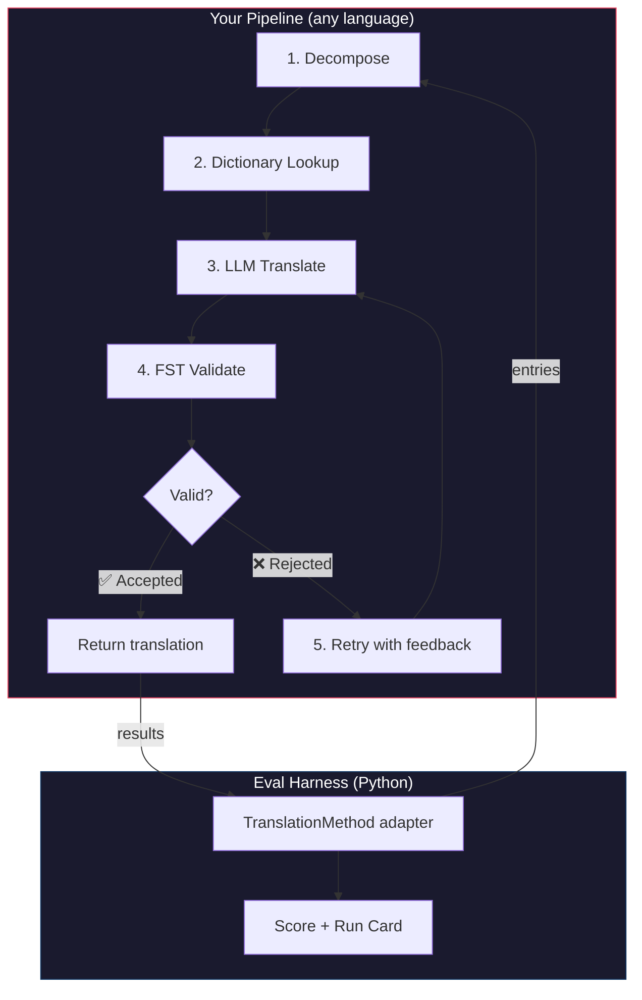
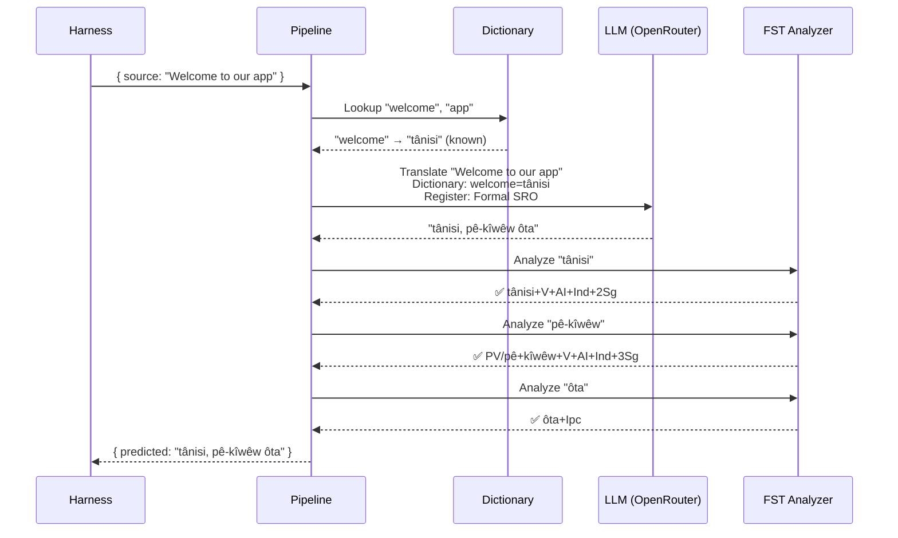
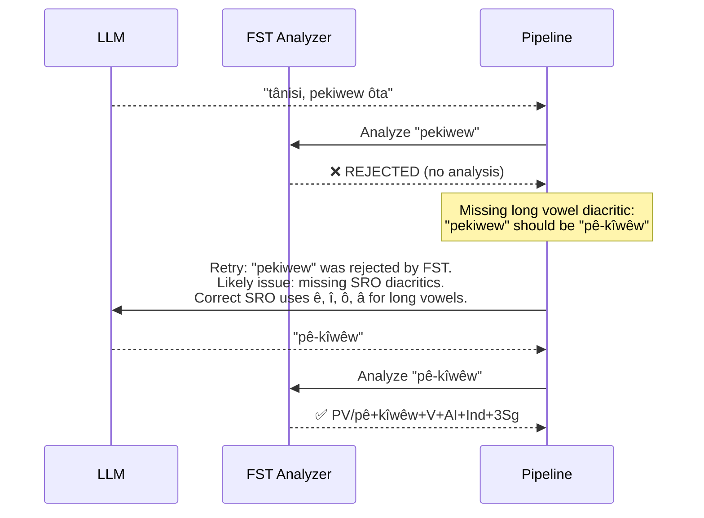

# 食谱：FST 门控翻译管道

构建一个多阶段翻译管道，它分解源文本、通过 LLM 翻译、用有限状态转换器 (FST) 验证输出，并在 FST 拒绝无效词形时重试。然后将其插入评估框架，看看它的得分如何。

**你将构建什么：** 一个平原克里语翻译管道，在无效翻译计入你的得分之前捕获它们的形态学错误。

:::info 前置条件
- 一个运行中的 FST 二进制文件（例如来自 [ALTLab 的平原克里语分析器](https://github.com/UAlbertaALTLab/lang-crk)）
- Node.js 20+（用于管道）和 Python 3.10+（用于框架）
- 一个 OpenRouter API 密钥用于 LLM 步骤
:::

---

## 架构

管道是一系列阶段的链。每个阶段有特定的任务。你可以用任何语言构建这个——这个例子使用 JavaScript，但框架不关心内部是什么。它只看到边界处的薄 Python 适配器。



### 为什么选择这些阶段

| 阶段 | 功能 | 为什么重要 |
|-------|-------------|---------------|
| **分解** | 将复合 UI 字符串分解为可翻译的片段 | 多综合语言在单个词中编码整个句子——LLM 需要更小的单位 |
| **词典查询** | 检查双语词典中的已知翻译 | 强制使用已知术语的正确翻译，而不是依赖 LLM 的猜测 |
| **LLM 翻译** | 将片段发送到带有寄存器和语法上下文的 LLM | 处理新颖短语并生成流畅的输出 |
| **FST 验证** | 通过形态学分析器运行输出 | 捕获无效词形——如果 FST 拒绝一个词，它就不是该语言中的有效词形 |
| **重试** | 使用 FST 的错误反馈重新发送被拒绝的词 | 给 LLM 提供关于词为什么错误的具体信息 |

---

## 数据流

以下是单个条目通过管道流动时发生的情况：



### 当 FST 拒绝时



---

## 实现

构建你想要的任何东西。这个例子使用 JavaScript，但你可以使用 Python、Rust 或其他任何东西。框架不关心——它只与薄 Python 适配器通信（在下一部分中显示）。

### 管道

每个阶段是一个函数。管道将它们链接在一起。

```javascript title="pipeline.js"
import { lookupDictionary } from './dictionary.js';
import { callLLM } from './llm.js';
import { analyzeWithFST } from './fst.js';

const MAX_RETRIES = 3;

/**
 * Translate a batch of keys through the full pipeline.
 *
 * @param {object} keys - Map of key → source string
 * @param {object} options - { sourceLang, targetLang }
 * @returns {{ translations: object, stats: object }}
 */
export async function translateBatch(keys, options) {
  const translations = {};
  const stats = { total: 0, fstAccepted: 0, retries: 0, dictionaryHits: 0 };

  for (const [key, sourceText] of Object.entries(keys)) {
    stats.total++;
    translations[key] = await translateSingle(sourceText, options, stats);
  }

  return { translations, stats };
}

/**
 * Translate a single string through all pipeline stages.
 */
async function translateSingle(sourceText, options, stats) {

  // ── Stage 1: Decompose ──────────────────────────────────
  // Split compound strings into segments the LLM can handle.
  // For UI strings this is often a no-op, but for longer content
  // it prevents the LLM from losing context in long prompts.
  const segments = decompose(sourceText);

  // ── Stage 2: Dictionary Lookup ──────────────────────────
  // Check each segment against the bilingual dictionary.
  // Known terms are forced — the LLM won't override them.
  const knownTerms = {};
  for (const segment of segments) {
    const entry = lookupDictionary(segment.toLowerCase());
    if (entry) {
      knownTerms[segment] = entry;
      stats.dictionaryHits++;
    }
  }

  // ── Stage 3: LLM Translate ──────────────────────────────
  let translation = await callLLM(sourceText, {
    ...options,
    knownTerms,
    register: 'nêhiyawêwin (Plains Cree). Use SRO orthography. '
            + 'Professional register for educational contexts.',
  });

  // ── Stage 4: FST Validate ──────────────────────────────
  // Split the translation into words and check each one.
  let { accepted, rejected } = await validateWords(translation);

  // ── Stage 5: Retry Loop ─────────────────────────────────
  // If any words were rejected, retry with FST feedback.
  let attempt = 0;
  while (rejected.length > 0 && attempt < MAX_RETRIES) {
    attempt++;
    stats.retries++;

    const feedback = rejected
      .map(w => `"${w}" was rejected by the morphological analyzer`)
      .join('; ');

    translation = await callLLM(sourceText, {
      ...options,
      knownTerms,
      register: 'nêhiyawêwin (Plains Cree). Use SRO orthography.',
      feedback: `Previous attempt had invalid words. ${feedback}. `
              + 'Use correct SRO diacritics (ê, î, ô, â for long vowels). '
              + 'Ensure verb forms match expected conjugation patterns.',
    });

    ({ accepted, rejected } = await validateWords(translation));
  }

  if (rejected.length === 0) stats.fstAccepted++;

  return translation;
}

/**
 * Decompose source text into translatable segments.
 *
 * For simple key-value UI strings, this usually returns the
 * original string as a single segment. For longer content,
 * it splits on sentence boundaries.
 */
function decompose(text) {
  // Simple sentence-boundary split. Replace with your own
  // morphological decomposition for more complex needs.
  return text
    .split(/(?<=[.!?])\s+/)
    .filter(s => s.trim().length > 0);
}

/**
 * Validate each word in a translation against the FST.
 *
 * @returns {{ accepted: string[], rejected: string[] }}
 */
async function validateWords(translation) {
  // Split on whitespace and punctuation, keeping only words
  const words = translation
    .split(/[\s,;:.!?'"()\[\]{}]+/)
    .filter(w => w.length > 0);

  const accepted = [];
  const rejected = [];

  for (const word of words) {
    const analyses = await analyzeWithFST(word);
    if (analyses.length > 0) {
      accepted.push(word);
    } else {
      rejected.push(word);
    }
  }

  return { accepted, rejected };
}
```

### FST 包装器

将你的 FST 二进制文件包装为异步函数。这个例子使用 ALTLab 的基于 HFST 的平原克里语分析器。

```javascript title="fst.js"
import { execFile } from 'node:child_process';
import { promisify } from 'node:util';

const execFileAsync = promisify(execFile);

// Path to your FST analyzer binary
const FST_PATH = process.env.FST_ANALYZER_PATH || './bin/crk-analyzer';

/**
 * Run a word through the FST morphological analyzer.
 *
 * Returns an array of analyses. Empty array = rejected.
 *
 * Example:
 *   analyzeWithFST("tânisi")
 *   → ["tânisi+V+AI+Ind+2Sg", "tânisi+V+AI+Cnj+2Sg"]
 *
 *   analyzeWithFST("pekiwew")
 *   → []  // rejected — missing diacritics
 *
 * @param {string} word - A single word in SRO orthography
 * @returns {string[]} Array of FST analyses (empty = rejected)
 */
export async function analyzeWithFST(word) {
  try {
    // HFST lookup: pipe the word to stdin, read analyses from stdout
    const { stdout } = await execFileAsync(
      FST_PATH,
      ['--quiet'],
      { input: word + '\n', timeout: 5000 }
    );

    // Parse HFST output: each line is "input\tanalysis\tweight"
    // Lines with "+?" indicate unrecognized forms
    return stdout
      .split('\n')
      .filter(line => line.includes('\t') && !line.includes('+?'))
      .map(line => line.split('\t')[1]);

  } catch (err) {
    // If the FST binary isn't available, log and reject
    console.error(`[WARN] FST analysis failed for "${word}": ${err.message}`);
    return [];
  }
}
```

### 词典和 LLM 模块

```javascript title="dictionary.js"
/**
 * Simple bilingual dictionary backed by a JSON file.
 *
 * In production, you'd load from the coaching data directory
 * or query itwêwina (https://itwewina.altlab.app/) via API.
 */
const DICTIONARY = {
  'hello': 'tânisi',
  'welcome': 'tânisi',
  'thank you': 'kinanâskomitin',
  'home': 'kīwēwin',
  'search': 'nānātawāpahtam',
  'settings': 'isi-nākatohkēwin',
  'help': 'nīsōhkamākēwin',
  'back': 'kīwē',
};

/**
 * @param {string} term - Lowercase English term
 * @returns {string|null} Cree translation or null
 */
export function lookupDictionary(term) {
  return DICTIONARY[term] || null;
}
```

```javascript title="llm.js"
/**
 * Call an LLM via OpenRouter for translation.
 */
const OPENROUTER_API = 'https://openrouter.ai/api/v1/chat/completions';

export async function callLLM(sourceText, options) {
  const { knownTerms = {}, register, feedback } = options;

  // Build the system prompt with register and known terms
  let systemPrompt = `You are translating English to Plains Cree.\n\n`;
  systemPrompt += `Register: ${register}\n\n`;

  if (Object.keys(knownTerms).length > 0) {
    systemPrompt += `Required terminology (use these exact translations):\n`;
    for (const [en, crk] of Object.entries(knownTerms)) {
      systemPrompt += `  "${en}" → "${crk}"\n`;
    }
    systemPrompt += '\n';
  }

  if (feedback) {
    systemPrompt += `IMPORTANT correction from previous attempt:\n${feedback}\n\n`;
  }

  systemPrompt += `Rules:\n`;
  systemPrompt += `- Use Standard Roman Orthography (SRO)\n`;
  systemPrompt += `- Use macron/circumflex for long vowels: ê, î, ô, â\n`;
  systemPrompt += `- Return ONLY the Cree translation, nothing else\n`;

  const response = await fetch(OPENROUTER_API, {
    method: 'POST',
    headers: {
      'Authorization': `Bearer ${process.env.OPENROUTER_API_KEY}`,
      'Content-Type': 'application/json',
    },
    body: JSON.stringify({
      model: 'google/gemini-2.5-pro',
      messages: [
        { role: 'system', content: systemPrompt },
        { role: 'user', content: sourceText },
      ],
      temperature: 0.2,
    }),
  });

  const json = await response.json();
  return json.choices[0].message.content.trim();
}
```

---

## 插入框架

你的管道已构建。现在你需要将其连接到评估框架，以便你可以在排行榜上对其进行基准测试。

框架使用一个接口：`TranslationMethod`。这是一个具有单一方法的 Python 协议。用任何语言构建任何你想要的东西——然后给它这个薄包装器，它就会插入。

```python title="fst_gated_process.py"
"""
TranslationMethod adapter for the FST-gated pipeline.

This thin wrapper connects your pipeline (running as a local
subprocess or HTTP server) to the eval harness. The harness
calls translate() with corpus entries. You call your pipeline.
You return results. That's it.
"""

import time
import subprocess
import json
from mt_eval_harness.config import RunConfig


class FSTGatedProcess:
    """Adapter between the eval harness and your FST-gated pipeline.

    The pipeline runs as a Node.js subprocess. This wrapper:
    1. Receives entries from the harness
    2. Sends them to the pipeline
    3. Returns structured results the harness can score
    """

    def __init__(self, pipeline_url: str = "http://localhost:3001"):
        self.pipeline_url = pipeline_url

    async def translate(
        self,
        entries: list[dict],
        config: RunConfig,
    ) -> list[dict]:
        """Translate a batch of entries through the FST-gated pipeline.

        Args:
            entries: List of corpus entries with 'id' and source text.
            config: Harness run configuration (for context).

        Returns:
            List of result dicts, one per entry.
        """
        import httpx

        results = []

        for entry in entries:
            source_text = entry.get(config.source_field, entry.get("source", ""))
            start = time.monotonic()

            try:
                # Call your pipeline — however it's running
                async with httpx.AsyncClient() as client:
                    response = await client.post(
                        f"{self.pipeline_url}/translate",
                        json={"keys": {str(entry["id"]): source_text}},
                        timeout=30.0,
                    )
                    data = response.json()
                    predicted = data["translations"][str(entry["id"])]

                elapsed = time.monotonic() - start

                results.append({
                    "id": entry["id"],
                    "predicted": predicted,
                    "latency_s": elapsed,
                    "usage": {},  # pipeline doesn't expose token counts
                    "error": None,
                    "tool_calls": [],
                    "tool_call_count": 0,
                    "metadata": data.get("meta", {}),
                })

            except Exception as err:
                results.append({
                    "id": entry["id"],
                    "predicted": "",
                    "latency_s": time.monotonic() - start,
                    "usage": {},
                    "error": str(err),
                    "tool_calls": [],
                    "tool_call_count": 0,
                    "metadata": {},
                })

        return results
```

:::tip 你不需要 HTTP
上面的例子通过 HTTP 调用管道，因为管道是用 JavaScript 编写的。如果你的管道是用 Python 编写的，你可以直接调用它——不需要服务器。`TranslationMethod` 包装器只是一个函数边界。内部发生的事情由你决定。
:::

### 运行基准测试

启动你的管道，然后运行框架：

```bash
# Terminal 1: Start the pipeline
node server.js

# Terminal 2: Run the harness with your process
export OPENROUTER_API_KEY="sk-or-v1-..."

python -c "
import asyncio
from mt_eval_harness.config import RunConfig
from mt_eval_harness.runner import execute_run
from fst_gated_process import FSTGatedProcess

async def main():
    config = RunConfig(
        corpus_path='data/edtekla-dev-v1.json',
        source_lang='English',
        target_lang='Plains Cree (nêhiyawêwin, SRO)',
        process_name='fst-gated-v1',
    )
    process = FSTGatedProcess('http://localhost:3001')
    run_log = await execute_run(config, process=process)
    print(f'Results: {run_log.output_path}')

asyncio.run(main())
"
```

或使用 CLI 与 `baseline_experiment.py` 来与内置基线进行比较：

```bash
python eval/baseline_experiment.py \
  --dataset data/edtekla-dev-v1.json \
  --model google/gemini-2.5-pro \
  --fst-analyzer ./bin/crk-analyzer \
  --condition fst-gated-v1 \
  --submit
```

---

## 理解你的结果

框架生成一个**运行卡**——一个包含你的得分的 JSON 文件。以下是你会看到的内容：

```
═══════════════════════════════════════════════════
  FST-Gated Pipeline v1 — EDTeKLA Dev v1
═══════════════════════════════════════════════════

  chrF++              48.7 / 100
  Exact match         12.1%
  FST acceptance      94.4%
  Composite score     0.52  →  Functional ✓

  404 entries (master_corpus.json) · 47 retries · $0.18 total cost
═══════════════════════════════════════════════════
```

**这一目了然地告诉你：**
- 你的方法是**功能性**层级（0.50–0.70）——输出对使用者来说是可识别的，主要语法通常正确，仍然存在频繁的形态学错误。
- FST 将 94% 的词捕获为有效——你的重试循环正在工作。
- 12% 的翻译完全正确——有很大的改进空间。

:::info 质量层级
| 层级 | 复合分数 | 含义 |
|------|-----------|---------------|
| 基线 | 0.00–0.30 | 原始 LLM 输出，大多数形态学幻觉 |
| 新兴 | 0.30–0.50 | 一些正确的模式，不可靠 |
| **功能性** | **0.50–0.70** | **对使用者可识别。主要类别通常正确。** |
| 可部署 | 0.70–0.85 | 适合进行人工审查的草稿翻译 |
| 流畅 | 0.85–1.00 | 接近有能力的人工翻译 |

参见 [SCORING_SPEC §5](/docs/specifications/scoring#5-quality-tiers) 了解完整的层级定义。
:::

<details>
<summary><strong>深入：运行卡中有什么？</strong></summary>

运行卡 JSON 捕获了这次评估运行的所有内容。关键部分：

**得分** — 框架计算的每个指标：
```json
{
  "scores": {
    "exact_match_rate": 0.121,
    "chrf_plus_plus": 48.7,
    "fst_acceptance_rate": 0.944,
    "composite_score": 0.52,
    "quality_tier": "functional"
  }
}
```

**来源** — 什么产生了这些结果：
```json
{
  "method": {
    "process_name": "fst-gated-v1",
    "model": "google/gemini-2.5-pro",
    "temperature": 0.0
  },
  "corpus": {
    "id": "edtekla-dev-v1",
    "sha256": "a1b2c3..."
  }
}
```

**每条条目的结果** — 每个翻译及其单独的得分，所以你可以找到你的方法在哪里遇到困难：
```json
{
  "id": 42,
  "source": "The student completed the assignment",
  "reference": "ôskiniw kî-kîsîhtâw ôhi atoskêwina",
  "predicted": "ôskiniw kî-kîsîhtâw ôhi atoskêwin",
  "chrf": 89.2,
  "exact_match": false,
  "fst_accepted": true
}
```

复合分数是可用指标的加权平均值，权重在 [SCORING_SPEC §4](/docs/specifications/scoring#4-composite-score) 中定义。当指标不可用时，其权重按比例重新分配到其余部分。

</details>

---

## 部署到生产环境

你的方法在排行榜上有得分。现在你想实际使用它。本部分涉及将你的管道作为生产端点提供，[champollion](https://champollion.dev) 可以调用它。

:::note 本部分是可选的
上面的所有内容都是关于构建和基准测试你的方法。本部分是关于部署——一个独立的问题。你可以在不部署任何东西的情况下提交到排行榜。
:::

### HTTP 服务器

将你的管道包装为实现 [API 方法契约](https://champollion.dev/docs/guides/serving-a-method) 的 Express 服务器：

```javascript title="server.js"
import express from 'express';
import { translateBatch } from './pipeline.js';

const app = express();
app.use(express.json());

/**
 * API method contract:
 *
 * Request:  { source_locale, target_locale, method, keys: { "key": "source" } }
 * Response: { translations: { "key": "translated" }, meta: { ... } }
 */
app.post('/translate', async (req, res) => {
  const { source_locale, target_locale, method, keys } = req.body;

  // Validate request
  if (!keys || typeof keys !== 'object') {
    return res.status(400).json({ error: { message: 'Missing keys object' } });
  }

  try {
    const startTime = Date.now();
    const { translations, stats } = await translateBatch(keys, {
      sourceLang: source_locale,
      targetLang: target_locale,
    });

    res.json({
      translations,
      meta: {
        model: 'custom-pipeline/fst-gated-v1',
        method: 'decompose-lookup-translate-validate',
        elapsed_ms: Date.now() - startTime,
        fst_acceptance_rate: stats.fstAccepted / stats.total,
        retries: stats.retries,
      },
    });
  } catch (err) {
    console.error('[ERR] Pipeline failed:', err.message);
    res.status(500).json({ error: { message: err.message } });
  }
});

// Health check for connectivity verification
app.get('/health', (req, res) => res.json({ status: 'ok' }));

app.listen(3001, () => {
  console.log('FST-gated pipeline running on http://localhost:3001');
});
```

### 配置 champollion

将你的语言对指向运行中的服务：

```json title="champollion.config.json"
{
  "version": 3,
  "inputLocale": "en",
  "pairs": {
    "en:crk": {
      "method": "api",
      "endpoint": "http://localhost:3001/translate"
    }
  },
  "languages": {
    "crk": {
      "name": "Plains Cree",
      "register": "SRO syllabics with grammatical precision."
    }
  }
}
```

```bash
# Run it
export OPENROUTER_API_KEY="sk-or-v1-..."
node server.js &
npx champollion sync
```

### 打包为插件

一旦你的方法有了得分，将其打包以便其他人可以使用它：

```json title="crk-fst-gated-v1/method.json"
{
  "name": "crk-fst-gated-v1",
  "type": "api",
  "version": "1.0.0",
  "description": "FST-gated Plains Cree translation with morphological validation",
  "author": "Your Name",

  "config": {
    "endpoint": "https://your-server.example.com/translate"
  },

  "locales": ["crk"],

  "benchmarks": {
    "crk": {
      "date": "2026-06-01T00:00:00Z",
      "corpus_size": 404,
      "exact_match_rate": 0.12,
      "corpus_chrf": 48.7,
      "model": "google/gemini-2.5-pro",
      "harness_version": "2.0"
    }
  },

  "provenance": {
    "resources": [
      { "name": "ALTLab CRK Analyzer", "license": "LGPL-3.0", "type": "fst" },
      { "name": "Wolvengrey Dictionary", "license": "CC-BY-NC-SA-4.0", "type": "dictionary" }
    ],
    "commercialReady": false,
    "flags": ["nc-resource"]
  }
}
```

---

## 扩展此模式

此食谱演示了一种管道架构。你可以将其适配到任何语言或方法：

| 变体 | 什么改变 |
|-----------|-------------|
| **不同的 FST** | 交换二进制路径。你可以从 [GiellaLT GitHub](https://github.com/giellalt) 或 [Apertium GitHub](https://github.com/apertium) 下载超过 100 种语言的预编译 FST（如 `.hfstol` 或 `lttoolbox` 二进制文件）。 |
| **没有可用的 FST** | 移除 FST 执行阶段，使用来自 Hugging Face 的 [UniMorph 平面范式文件](https://huggingface.co/datasets/unimorph/universal_morphologies) 执行屈折形式的静态数据库查询验证。 |
| **多个 LLM** | 链接模型：一个快速模型用于初始草稿，一个推理模型用于更正。 |
| **人工在环** | 添加一个队列阶段，在返回之前将不确定的翻译保留供专家审查。 |
| **微调模型** | 用本地模型（Ollama、vLLM 等）替换 OpenRouter 调用。 |
| **不同的语言** | 更改词典、FST 和寄存器。架构保持相同。 |

管道是一种模式。阶段是可互换的。为你的语言构建有效的东西，在[排行榜](https://champollion.dev/leaderboard)上证明它，并部署它。

---

## 另见

- **[评估框架](/docs/specifications/harness)** — 如何运行框架和解释输出
- **[方法接口](/docs/specifications/methods)** — `TranslationMethod` 协议规范
- **[排行榜规则](/docs/leaderboard/rules)** — 提交标准和反作弊政策
- **[支持低资源语言](/docs/community/low-resource-languages)** — 更广泛的背景和 OCAP 原则
- **[ALTLab](https://altlab.artsrn.ualberta.ca/)** — 阿尔伯塔语言技术实验室（平原克里语 FST）
- **[方法排行榜](https://champollion.dev/leaderboard)** — 提交你的得分